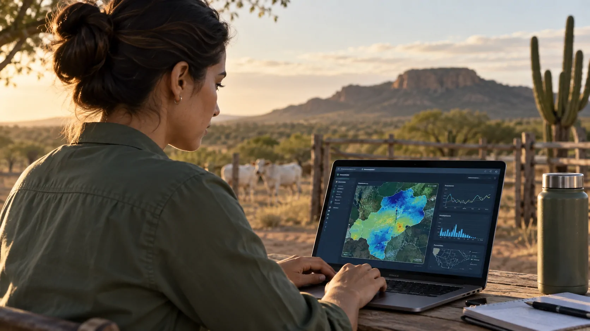
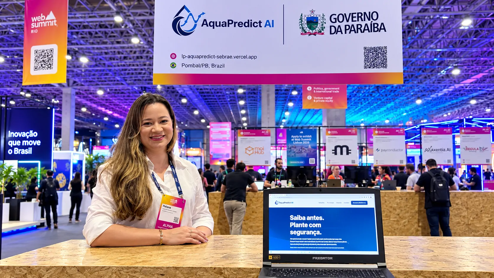
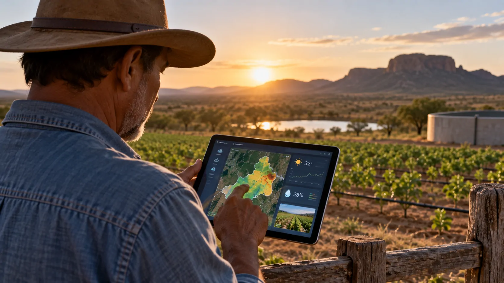

*Uma startup criada no Sertão paraibano está aproximando inteligência artificial, conhecimento sobre recursos hídricos e atividade rural. A AquaPredict AI transforma dados de clima e território em informações que podem ajudar produtores a tomarem decisões, enquanto sua criadora busca transformar uma pesquisa acadêmica em uma tecnologia aplicável ao mercado.*

## Uma pesquisa de mestrado deu origem à AquaPredict AI

### De Pombal para a tecnologia

A **AquaPredict AI** nasceu em **Pombal**, no Sertão da Paraíba, a partir do trabalho da engenheira ambiental **Halana Severo**. A proposta combina **inteligência artificial**, dados climáticos e informações territoriais para apoiar decisões relacionadas às atividades rurais.

Antes de se tornar uma startup, o projeto estava ligado à trajetória acadêmica da empreendedora. Halana possui formação em **Engenharia Civil e Ambiental**, com especialidade em recursos hídricos, e transformou sua pesquisa em uma proposta de tecnologia aplicada ao campo.

### Da pesquisa ao mercado

A origem acadêmica ajuda a explicar o recorte da solução. Em vez de aplicar IA de forma genérica, a AquaPredict parte de um problema relacionado à água, ao território e às condições ambientais que interferem no planejamento rural.

A tecnologia ainda está em **fase de MVP**, ou produto mínimo viável. Portanto, o projeto permanece em desenvolvimento e validação, sem base para ser tratado como uma plataforma consolidada para todo o mercado agrícola.

## Como a IA transforma clima e território em informação para o campo

*Dados de clima, território e recursos hídricos formam a base da proposta da AquaPredict AI.*

### O papel da inteligência artificial

A **AquaPredict AI** trabalha com diferentes informações ambientais para gerar uma leitura que possa apoiar o planejamento de atividades rurais. A proposta é aproximar dados de **clima, território e recursos hídricos**, em vez de analisar essas informações de maneira isolada.

Nesse modelo, a inteligência artificial não substitui o produtor nem toma automaticamente uma decisão. Seu papel é processar informações e organizá-las para facilitar a análise de cenários antes de uma escolha.

### Por que os dados hídricos importam

No **Sertão da Paraíba**, a relação entre produção rural, clima e disponibilidade de água torna esse tipo de informação especialmente relevante. Cada propriedade, porém, possui condições próprias, o que exige cuidado na interpretação dos dados.

O desafio está justamente em transformar grandes volumes de informação em algo compreensível e útil. O valor da ferramenta dependerá da qualidade dos dados, dos modelos utilizados e da capacidade de traduzir essas informações para situações concretas.

Essa aplicação também faz parte de um movimento mais amplo de uso de tecnologia para interpretar informações ambientais. O **Notícia Tech** já mostrou uma aplicação brasileira em que **[IA e dados de satélite são usados para analisar secas](https://noticiatech.com.br/inteligencia-artificial/ia-brasileira-satelites-prever-secas-rapidas/)**, mostrando como diferentes fontes de dados podem ganhar novas aplicações com inteligência artificial.

## O conhecimento acadêmico encontra o desenvolvimento de produto

### Uma ponte entre universidade e mercado

A transformação da pesquisa em startup coloca **conhecimento acadêmico e empreendedorismo** no mesmo projeto. A experiência de Halana em recursos hídricos fornece o contexto técnico, enquanto a inteligência artificial entra como parte da estrutura para trabalhar com dados.

Esse caminho também mostra como soluções de tecnologia podem surgir fora dos grandes centros tradicionais de inovação. O ponto de partida foi uma pesquisa desenvolvida no interior da Paraíba e relacionada a uma necessidade concreta do território.

### O desafio de transformar conhecimento em solução

Uma pesquisa acadêmica e um produto de tecnologia possuem exigências diferentes. No mercado, além da consistência técnica, é necessário demonstrar que a solução resolve um problema relevante e que os usuários conseguem incorporá-la ao próprio processo de trabalho.

No caso da **AquaPredict**, essa etapa ainda está em construção. O projeto precisa avançar na validação em situações reais e demonstrar de maneira objetiva quais informações geradas pela ferramenta são mais úteis para os produtores.

## O reconhecimento no Sebrae e no Web Summit levou a solução para novos públicos

*O reconhecimento em programas de inovação levou a AquaPredict AI de Pombal para ambientes nacionais de tecnologia.*

### A presença em iniciativas nacionais

A trajetória da startup ganhou visibilidade com o apoio do **Sebrae/PB**. A **AquaPredict AI** ficou entre as mil melhores do **Prêmio Sebrae Startups** e apresentou sua solução no **Web Summit Rio 2026**.

Esses reconhecimentos não significam, por si só, que a tecnologia já alcançou escala comercial. Eles mostram que uma solução desenvolvida no interior da Paraíba conseguiu chegar a ambientes nacionais de empreendedorismo, inovação e tecnologia.

### O papel do ecossistema regional

O apoio do **Sebrae/PB** também conecta a empreendedora a iniciativas de desenvolvimento de negócios inovadores. Para uma startup em estágio inicial, esse tipo de ambiente pode aproximar empreendedores, instituições, potenciais parceiros e diferentes públicos.

A história reúne três elementos relevantes para o ecossistema tecnológico brasileiro: **pesquisa acadêmica, empreendedorismo regional e inteligência artificial**. A combinação amplia o debate sobre onde soluções de base tecnológica podem surgir e quais problemas locais podem orientar sua criação.

## O próximo desafio é provar valor para quem está no campo

### Reconhecimento não é validação comercial

A visibilidade conquistada pela **AquaPredict AI** representa uma etapa da trajetória, mas existe diferença entre reconhecimento e comprovação de resultados comerciais. O próximo desafio é demonstrar que a tecnologia entrega informações úteis em situações reais de uso.

Isso envolve testar a solução diante de diferentes propriedades, condições climáticas e necessidades dos produtores. Também será necessário identificar quais dados efetivamente ajudam na tomada de decisão e quais precisam ser aprimorados.

### O que ainda precisa ser validado

Como a solução está em **fase de MVP**, não há base suficiente para afirmar que ela já aumentou produtividade, reduziu custos ou gerou economia de água em escala.

Essa cautela é importante porque soluções de IA aplicadas ao agronegócio dependem de uma cadeia de fatores. Os dados precisam ter qualidade, os modelos precisam produzir informações coerentes e o usuário precisa conseguir transformar essas informações em ações.

O próprio avanço da inteligência artificial nas empresas brasileiras mostra que a tecnologia está deixando de ser apenas experimental e entrando em processos mais estruturados. O **[crescimento do uso de IA por empresas brasileiras em níveis mais avançados](https://noticiatech.com.br/inteligencia-artificial/empresas-brasileiras-usam-ia-nivel-avancado/)** ajuda a contextualizar esse movimento, embora a AquaPredict esteja em uma etapa diferente de desenvolvimento.

## De Pombal para o mercado: o que vem pela frente

*O desafio da AquaPredict é transformar sua base tecnológica em uma ferramenta capaz de entregar valor prático ao produtor rural.*

### Da inovação regional à aplicação prática

A história da **AquaPredict AI** mostra uma forma de desenvolvimento tecnológico que começa no território. Em vez de partir exclusivamente de grandes empresas ou laboratórios, a solução surgiu da experiência acadêmica de uma profissional do próprio **Sertão da Paraíba**.

A combinação entre **IA, recursos hídricos e dados territoriais** cria um recorte específico para a tecnologia. O diferencial da proposta está menos em simplesmente utilizar inteligência artificial e mais em aplicar essa capacidade a informações relacionadas ao ambiente rural.

### A próxima etapa da AquaPredict

O próximo passo será transformar a capacidade técnica em resultados verificáveis. Para os produtores, isso significa entender se as informações geradas realmente ajudam a planejar atividades e lidar com variáveis ambientais.

Para a startup, significa validar produto, mercado e modelo de operação. A participação no **Prêmio Sebrae Startups** e no **Web Summit Rio 2026** ampliou a exposição do projeto, mas a etapa seguinte depende da utilização prática da tecnologia.

A trajetória iniciada em **Pombal** coloca a AquaPredict diante de um desafio comum às startups de base tecnológica: transformar conhecimento especializado em uma solução que consiga demonstrar valor para quem realmente enfrenta o problema.

Mais do que uma história sobre uma startup que utiliza IA, o projeto representa uma experiência ainda em construção. A proposta é transformar conhecimento sobre água e território em informação para decisões rurais — e será a validação junto aos problemas reais do campo que mostrará até onde essa tecnologia poderá avançar.

---