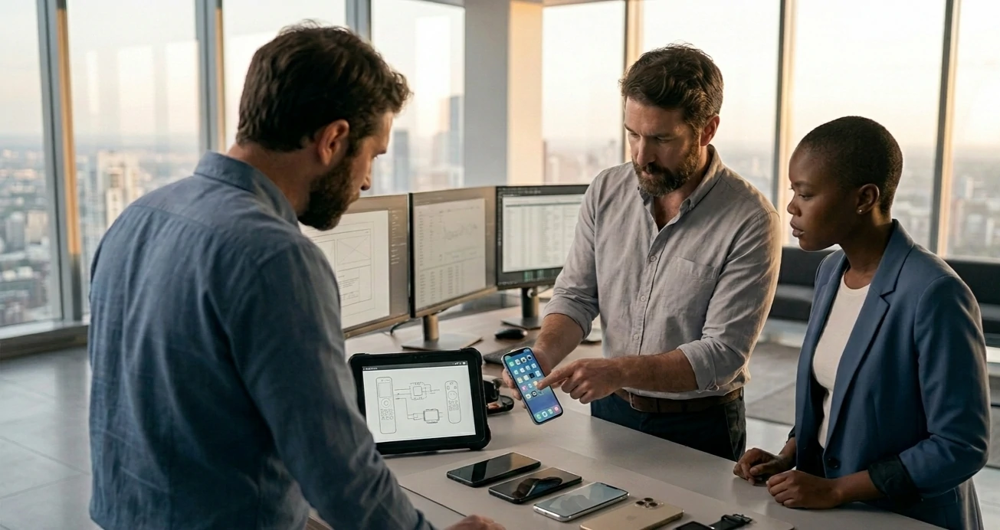

*Durante os últimos três anos, a corrida da inteligência artificial foi dominada por modelos cada vez mais poderosos e investimentos bilionários em infraestrutura. Agora, uma nova disputa começa a ganhar forma: o controle da interface que conectará pessoas e empresas aos sistemas de IA. Os movimentos recentes da OpenAI indicam que a próxima batalha não será apenas por modelos, mas pelos dispositivos que servirão como porta de entrada para essa tecnologia.*

## A OpenAI quer controlar a experiência completa da inteligência artificial

A **OpenAI** está avançando além do desenvolvimento de modelos e busca participar diretamente da camada de interação entre usuários e inteligência artificial.

*O mercado começa a migrar da competição por modelos para a competição por interfaces e dispositivos.*

Historicamente, empresas de software dependeram de plataformas controladas por terceiros para distribuir seus produtos. No caso da IA, isso significa depender de smartphones, navegadores e sistemas operacionais criados por empresas como **Apple**, **Google** e **Microsoft**.

### Por que isso importa?

Quem controla a interface controla a distribuição.

Foi exatamente essa lógica que transformou sistemas operacionais em gigantescas plataformas de negócios durante a era dos computadores pessoais e dos smartphones.

### O sinal enviado pela OpenAI

As recentes movimentações da empresa mostram que a organização liderada por **Sam Altman** não pretende permanecer apenas como fornecedora de modelos.

O objetivo parece ser construir uma experiência própria, reduzindo dependências externas e criando um canal direto entre usuários e agentes de IA.

## A corrida da IA está migrando dos modelos para as interfaces

A primeira fase da inteligência artificial generativa foi marcada pela competição entre modelos.

*O foco do mercado passa dos modelos para a forma como usuários acessam a inteligência artificial.*

Empresas disputavam métricas como desempenho, velocidade de resposta e capacidade de raciocínio.

### A segunda fase foi a infraestrutura

A explosão da demanda por IA impulsionou investimentos massivos em data centers, chips e capacidade computacional.

Empresas como **Nvidia**, **Microsoft**, **Amazon** e **Google** passaram a competir pela infraestrutura necessária para sustentar modelos cada vez mais avançados.

### A terceira fase será a interface

Agora surge uma nova pergunta estratégica:

Como as pessoas irão utilizar IA diariamente?

A resposta pode redefinir o mercado de tecnologia pelos próximos anos.

Assim como o smartphone substituiu diversas tecnologias anteriores, os dispositivos nativamente projetados para inteligência artificial podem criar uma nova categoria de produtos digitais.

## O que Apple, Google, Meta e OpenAI estão disputando

A disputa atual não envolve apenas hardware.

Ela envolve atenção, dados, relacionamento com usuários e controle da experiência digital.

*Grandes empresas de tecnologia buscam controlar o principal ponto de acesso à inteligência artificial.*

### O papel da Apple

A **Apple** possui uma das maiores vantagens competitivas do setor: bilhões de dispositivos ativos distribuídos globalmente.

Sua estratégia busca incorporar IA diretamente ao ecossistema existente, utilizando iPhone, iPad e Mac como pontos centrais de acesso.

### O papel do Google

O **Google** tenta transformar a busca tradicional em uma experiência conversacional baseada em IA.

Esse movimento já pode ser observado na expansão de recursos como AI Overviews e experiências de pesquisa assistida.

O tema se conecta diretamente ao movimento analisado em [A guerra das interfaces começou: por que Apple, OpenAI, Google e Microsoft querem substituir os aplicativos por agentes de IA](https://noticiatech.com.br/ia/a-guerra-das-interfaces-comecou-por-que-apple-openai-google-e-microsoft-querem-substituir-os-aplicativos-por-agentes-de-ia/).

### O papel da OpenAI

A **OpenAI** busca algo diferente.

Em vez de depender exclusivamente de plataformas existentes, a empresa parece interessada em participar da construção da próxima geração de interfaces digitais.

Essa estratégia amplia sua capacidade de capturar valor e fortalecer seu posicionamento competitivo.

## O que muda para empresas e para o futuro da computação

A transformação em curso não afeta apenas consumidores.

Empresas também podem ser impactadas pela evolução dos dispositivos baseados em IA.

### Agentes estarão mais presentes

A tendência é que agentes inteligentes deixem de funcionar apenas como softwares isolados.

Eles poderão se tornar camadas permanentes de interação, acompanhando profissionais durante tarefas operacionais, decisões estratégicas e fluxos corporativos.

Esse movimento dialoga com tendências analisadas em [AI First: por que essa estratégia está redefinindo a competitividade das empresas](https://noticiatech.com.br/ia/o-que-e-ai-first-e-por-que-essa-estrategia-esta-redefinindo-a-competitividade-das-empresas/).

### O dispositivo pode deixar de ser o centro

Durante décadas, o computador e o smartphone foram o principal meio de interação digital.

A inteligência artificial cria a possibilidade de um modelo diferente.

Em vez de abrir aplicativos para executar tarefas específicas, usuários poderão simplesmente conversar com agentes capazes de executar múltiplas ações de forma autônoma.

Essa mudança representa muito mais do que uma evolução tecnológica.

Ela sugere uma possível redefinição da própria computação.

A movimentação da **OpenAI** é relevante justamente porque indica que as grandes empresas de tecnologia já estão se posicionando para essa nova fase. A disputa pelos melhores modelos continua importante, mas o próximo vencedor poderá ser aquele que controlar a interface que conecta bilhões de pessoas à inteligência artificial todos os dias.

---