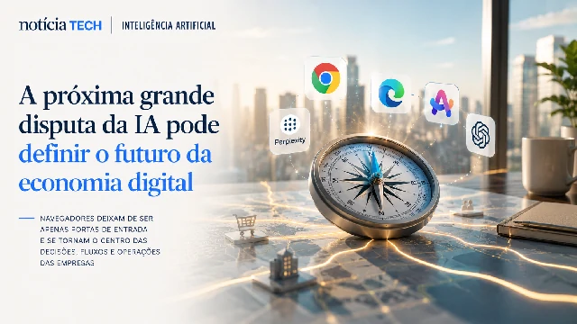

*Durante décadas, os navegadores funcionaram apenas como portas de entrada para a internet. Mas isso começa a mudar rapidamente. A integração de inteligência artificial diretamente em browsers como Chrome, Edge, Arc, Perplexity e novas plataformas agentic está criando uma disputa estratégica que pode redefinir a forma como empresas descobrem, utilizam e compram softwares corporativos em 2026. O navegador deixa de ser apenas uma interface de acesso e começa a se transformar em um operador inteligente da rotina digital empresarial.*

## O navegador começa a virar o novo sistema operacional da IA corporativa

A disputa atual da inteligência artificial já não acontece apenas entre:
- modelos de linguagem;
- assistentes virtuais;
- plataformas de automação.

Ela começa a migrar para uma camada ainda mais estratégica:
o navegador.

Isso acontece porque os browsers ocupam uma posição privilegiada dentro do fluxo operacional das empresas.

É no navegador que profissionais:
- pesquisam fornecedores;
- utilizam CRMs;
- acessam ERPs;
- operam ferramentas SaaS;
- realizam reuniões;
- executam tarefas comerciais;
- produzem documentos;
- consomem informação.

Ao integrar IA diretamente nesse ambiente, empresas como **Google**, **Microsoft**, **OpenAI** e novas startups começam a disputar algo muito maior do que busca online:
o controle da camada operacional da produtividade corporativa.

### A IA deixa de responder perguntas e começa a executar tarefas

O avanço dos agentes inteligentes acelera essa transformação.

Os navegadores passam a:
- resumir conteúdos;
- automatizar preenchimentos;
- interpretar contexto;
- operar múltiplas abas;
- sugerir softwares;
- executar fluxos;
- navegar autonomamente.

Na prática, o browser começa a se aproximar da lógica de um:
- sistema operacional contextual;
- copiloto corporativo;
- operador de tarefas digitais.

Isso cria uma mudança estrutural no mercado de software.

Em vez de usuários acessarem dezenas de plataformas separadamente, parte da experiência começa a ser intermediada pela própria IA do navegador.

Esse movimento se conecta diretamente ao crescimento da IA agentic e da automação empresarial já analisados anteriormente no Notícia Tech:

- [IA agêntica pode redesenhar a automação empresarial nos próximos anos](https://noticiatech.com.br/automacao/ia-ag%C3%AAntica-pode-redesenhar-a-automa%C3%A7%C3%A3o-empresarial-nos-pr%C3%B3ximos-anos/)
- [Empresas começam a substituir softwares tradicionais por agentes de IA](https://noticiatech.com.br/automacao/empresas-come%C3%A7am-a-substituir-softwares-tradicionais-por-agentes-de-ia/)

### O browser pode virar o principal distribuidor de softwares corporativos

Historicamente, empresas descobriam softwares através de:
- Google;
- marketplaces;
- mídia especializada;
- indicações comerciais;
- outbound;
- comparadores SaaS.

Mas os navegadores inteligentes podem alterar completamente essa dinâmica.

Se a IA passa a:
- recomendar ferramentas;
- interpretar necessidades;
- integrar plataformas;
- executar tarefas diretamente;

ela também passa a influenciar:
- contratação de softwares;
- descoberta de produtos;
- adoção corporativa;
- permanência de fornecedores.

Nesse cenário, o navegador ganha um papel parecido com:
- app stores;
- sistemas operacionais móveis;
- plataformas de distribuição.

## Empresas de IA começam a disputar a camada de comportamento digital das empresas

A corrida dos navegadores com IA não é apenas tecnológica.

Ela é uma disputa por comportamento.

Quem controlar o ambiente onde usuários:
- pesquisam;
- trabalham;
- tomam decisões;
- consomem informação;
- executam tarefas;

passa a controlar também uma enorme camada estratégica da economia digital.

### O browser passa a entender intenção, contexto e rotina operacional

Os novos navegadores com IA começam a operar de maneira contextual.

Isso significa que eles conseguem interpretar:
- comportamento de navegação;
- intenção do usuário;
- histórico operacional;
- fluxo de trabalho;
- padrões de produtividade.

Essa inteligência contextual cria uma vantagem enorme para empresas que conseguirem dominar esse ambiente.

A tendência é que navegadores passem a:
- sugerir softwares automaticamente;
- priorizar determinados fluxos;
- integrar ferramentas sem necessidade manual;
- reduzir fricção operacional;
- automatizar microtarefas repetitivas.

### A guerra deixa de ser apenas por busca e vira disputa por permanência operacional

Durante anos, empresas disputaram atenção através da busca online.

Agora, a disputa começa a migrar para:
- retenção operacional;
- permanência dentro do ecossistema;
- dependência contextual;
- integração contínua.

Isso ajuda a explicar por que gigantes da tecnologia aceleram investimentos em:
- IA integrada ao navegador;
- agentes autônomos;
- sistemas multimodais;
- interfaces conversacionais.

O objetivo não é apenas responder perguntas.

É permanecer presente durante toda a operação digital do usuário.

Essa transformação também se conecta à nova lógica de GEO e descoberta algorítmica baseada em IA:

- [GEO está substituindo o SEO: como a busca por IA pode mudar o tráfego da internet](https://noticiatech.com.br/marketing/geo-est%C3%A1-substituindo-o-seo-como-a-busca-por-ia-pode-mudar-o-tr%C3%A1fego-da-internet/)
- [Google integra IA diretamente no buscador e muda a forma como empresas aparecem online](https://noticiatech.com.br/inteligencia-artificial/google-integra-ia-diretamente-no-buscador-e-muda-a-forma-como-empresas-aparecem-online/)

## A próxima grande disputa da IA pode definir quem controla a interface principal da economia digital

A corrida da inteligência artificial está entrando em uma nova fase.

A primeira etapa foi marcada pela disputa entre modelos.

Agora, o mercado começa a perceber que o verdadeiro poder pode estar na interface que conecta usuários, softwares e operações corporativas.

E o navegador ocupa exatamente essa posição.

### O browser pode virar o centro da experiência corporativa orientada por IA

Se os navegadores evoluírem para agentes operacionais completos, eles poderão:
- executar processos;
- integrar plataformas;
- tomar decisões simples;
- recomendar ações;
- automatizar jornadas;
- controlar fluxos corporativos.

Nesse cenário, empresas deixam de navegar manualmente entre dezenas de sistemas e passam a operar através de uma camada inteligente unificada.

Isso pode alterar profundamente:
- SaaS;
- marketing digital;
- vendas B2B;
- produtividade;
- suporte;
- operações empresariais.

### Empresas que entenderem cedo essa mudança podem ganhar vantagem competitiva

Assim como aconteceu com:
- mobile;
- cloud;
- SEO;
- redes sociais;

a nova camada de IA nos navegadores pode criar vencedores antecipados.

Empresas que conseguirem:
- integrar seus produtos;
- adaptar experiência;
- estruturar contexto semântico;
- otimizar interoperabilidade;
- preparar fluxos para agentes;

podem ganhar enorme vantagem nos próximos anos.

Ao mesmo tempo, plataformas que permanecerem dependentes apenas da lógica tradicional de software talvez enfrentem dificuldades em um mercado cada vez mais mediado por inteligência artificial contextual.

O navegador pode continuar parecendo apenas uma ferramenta simples de acesso à internet.

Mas silenciosamente, ele começa a se transformar em uma das infraestruturas mais estratégicas da nova economia orientada por IA.