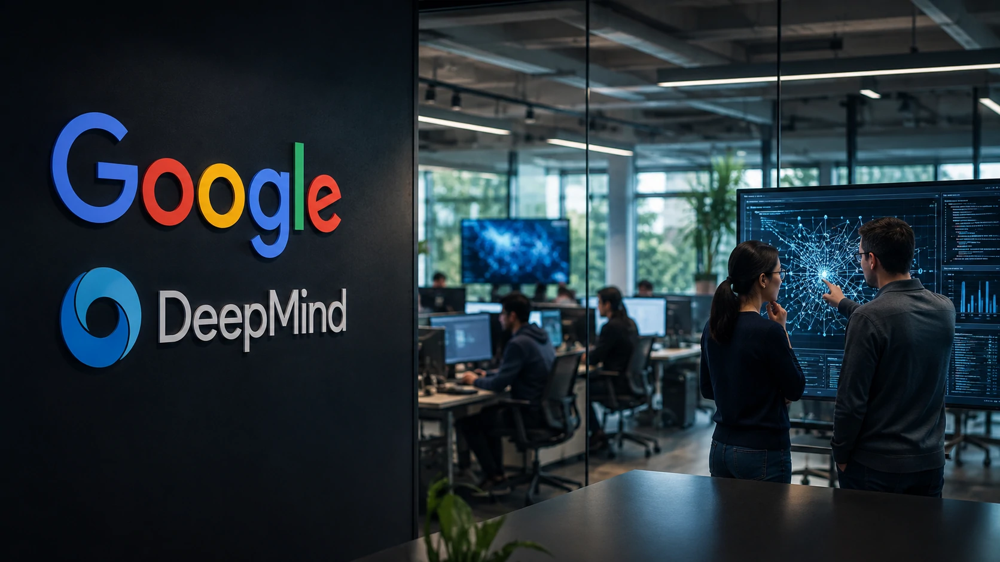
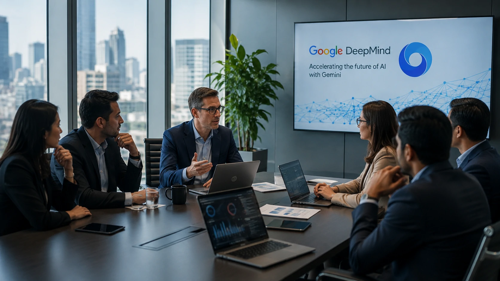
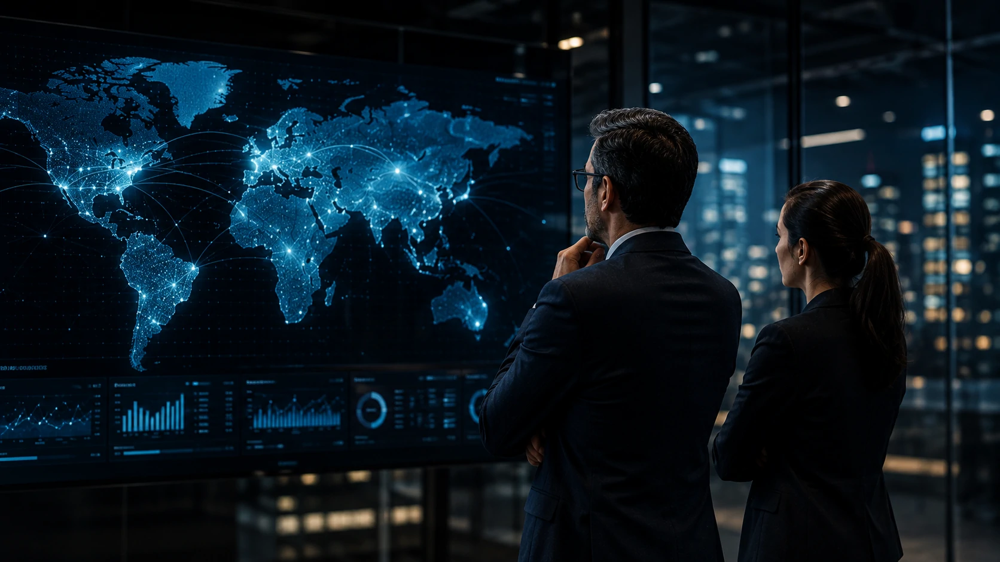

*O mercado de inteligência artificial vive uma nova fase de competição. Depois de meses marcados pelos avanços da **OpenAI**, da **Anthropic** e da **Meta**, agora é o **Google** quem volta ao centro das atenções com uma mudança de liderança que pode alterar o ritmo de evolução do **Gemini** e influenciar toda a indústria.*

A reorganização da **Google DeepMind** vai além de uma troca de executivos. Ela representa uma decisão estratégica para aproximar pesquisa científica, desenvolvimento de produtos e execução comercial em um momento em que a corrida pela inteligência artificial se tornou um dos principais campos de disputa entre as gigantes da tecnologia.

Para empresas, desenvolvedores e investidores, o anúncio merece atenção porque pode antecipar mudanças importantes no ecossistema do **Gemini**, na estratégia do **Google Cloud** e na velocidade com que novos recursos de IA chegarão ao mercado.

## A mudança na DeepMind representa uma nova estratégia para o Gemini

*Nova organização da DeepMind busca acelerar o desenvolvimento da próxima geração do Gemini.*

A mudança de comando na **Google DeepMind** indica que a empresa pretende acelerar a integração entre pesquisa e produtos comerciais de inteligência artificial.

Nos últimos anos, o laboratório liderou avanços importantes em modelos multimodais, aprendizado profundo e sistemas capazes de competir diretamente com o **ChatGPT** e o **Claude**. Agora, o objetivo parece ser reduzir a distância entre descobertas científicas e aplicações utilizadas por empresas e consumidores.

### Por que essa reorganização acontece agora?

A resposta está na velocidade do mercado.

A competição entre **Google**, **OpenAI**, **Anthropic**, **Meta** e empresas chinesas deixou de ser apenas tecnológica e passou a envolver tempo de lançamento, infraestrutura, custos e adoção empresarial.

Quem conseguir transformar pesquisa em produto mais rapidamente tende a conquistar maior participação de mercado.

### O Gemini continua sendo prioridade absoluta

Apesar das mudanças internas, todos os sinais apontam que o **Gemini** permanece como peça central da estratégia do **Google**.

Isso significa que futuras atualizações podem chegar com maior frequência e integração entre os serviços da companhia, especialmente dentro do ecossistema do **Workspace**, **Cloud** e das soluções corporativas.

Esse movimento reforça tendências já observadas anteriormente pelo **Notícia Tech**, como a crescente competição entre plataformas de IA e a busca por diferenciação tecnológica.

Para entender outro movimento estratégico recente do Google, vale conferir:

**[Casa Branca reúne OpenAI, Google, Anthropic e Meta para definir novos testes de segurança para IA](https://noticiatech.com.br/inteligencia-artificial/casa-branca-openai-google-anthropic-meta-testes-seguranca-ia/)**

## O que essa decisão pode significar para empresas

*Executivos acompanham a reorganização da DeepMind e seus possíveis impactos no mercado corporativo.*

Empresas podem ser as principais beneficiadas caso a nova estrutura consiga acelerar o desenvolvimento do **Gemini**.

Na prática, isso significa acesso mais rápido a novos recursos de IA, melhorias em produtividade, automação de processos e integração com plataformas corporativas.

O mercado já demonstra que a disputa deixou de ser apenas sobre quem possui o modelo mais inteligente.

Hoje, fatores como velocidade de inovação, custos operacionais, infraestrutura e capacidade de atender grandes organizações são igualmente decisivos.

### A disputa agora envolve ecossistemas completos

Cada grande empresa tenta construir um ecossistema próprio.

A **OpenAI** amplia sua presença em produtividade.

A **Anthropic** fortalece soluções corporativas.

A **Meta** aposta em modelos abertos.

Enquanto isso, o **Google** busca transformar o **Gemini** em uma plataforma integrada aos seus serviços já consolidados.

### O mercado entra em uma nova fase

Essa reorganização também envia um sinal importante aos concorrentes.

Ela demonstra que o Google não pretende apenas acompanhar a evolução da IA, mas acelerar seu próprio ritmo de inovação para disputar liderança em diferentes segmentos.

Esse cenário complementa outra análise publicada pelo **Notícia Tech** sobre como diferentes estratégias estão moldando o futuro da inteligência artificial empresarial:

**[Microsoft lança plataforma de segurança com agentes de IA e inaugura uma nova era da defesa cibernética empresarial](https://noticiatech.com.br/inteligencia-artificial/microsoft-plataforma-seguranca-agentes-ia-empresas/)**

## Como a nova liderança pode influenciar a corrida pela inteligência artificial

*As decisões tomadas hoje pela DeepMind podem influenciar a próxima fase da competição global entre as gigantes da inteligência artificial.*

A mudança na **Google DeepMind** não representa apenas uma troca de liderança. Ela sinaliza que o **Google** pretende adaptar sua estrutura para responder a um mercado que evolui em ritmo cada vez mais acelerado.

Nos últimos dezoito meses, empresas como **OpenAI**, **Anthropic**, **Meta**, **Microsoft** e diversos laboratórios chineses reduziram significativamente o intervalo entre o anúncio de novos modelos e sua disponibilização ao mercado. Isso elevou a pressão para que todos os concorrentes consigam transformar pesquisa em produtos com muito mais rapidez.

Nesse contexto, reorganizar a liderança da DeepMind pode significar menos barreiras entre as equipes responsáveis pela pesquisa fundamental e aquelas encarregadas de transformar essas descobertas em soluções comerciais.

### A corrida pela IA deixou de ser apenas tecnológica

Hoje, vencer a disputa não depende exclusivamente de criar o modelo mais inteligente.

As empresas competem simultaneamente em diferentes frentes:

- velocidade de desenvolvimento;
- infraestrutura computacional;
- custos operacionais;
- integração com produtos existentes;
- confiança empresarial;
- monetização dos serviços de IA.

Quem conseguir equilibrar todos esses fatores terá vantagem na disputa por clientes corporativos.

### O Google aposta na integração de todo o seu ecossistema

Um dos maiores diferenciais do **Google** continua sendo seu ecossistema.

Além do **Gemini**, a empresa possui serviços amplamente utilizados por organizações, como **Google Workspace**, **Google Cloud**, **Android**, **Chrome** e o próprio mecanismo de busca.

Uma integração mais eficiente entre essas plataformas pode tornar o Gemini ainda mais competitivo para empresas que desejam incorporar inteligência artificial ao fluxo diário de trabalho.

Esse movimento também fortalece a estratégia observada recentemente pelo **Notícia Tech**, em que grandes empresas estão investindo cada vez mais em plataformas completas, e não apenas em modelos isolados de IA.

Outro exemplo dessa transformação pode ser visto na análise sobre a arquitetura moderna de agentes inteligentes:

**[Arquitetura de IA Empresarial: como MCP, RAG, APIs, Agentes, Workflows e Copilotos funcionam juntos](https://noticiatech.com.br/inteligencia-artificial/arquitetura-ia-empresarial-mcp-rag-apis-agentes-workflows-copilotos/)**

## O que esperar do Gemini nos próximos meses

O anúncio não significa que novas versões do **Gemini** serão lançadas imediatamente.

No entanto, mudanças dessa magnitude costumam anteceder novos ciclos de investimento, reorganização de equipes e definição de prioridades estratégicas.

Para empresas que acompanham o mercado de inteligência artificial, isso representa um sinal importante de que o Google continua tratando a IA como um dos pilares centrais de sua estratégia global.

### O impacto vai além do Google

Quando uma empresa do porte do Google altera a estrutura do seu principal laboratório de IA, todo o setor tende a reagir.

Concorrentes aceleram cronogramas.

Parceiros revisam estratégias.

Investidores acompanham os próximos anúncios.

Clientes corporativos reavaliam quais plataformas podem oferecer maior estabilidade e evolução tecnológica nos próximos anos.

Esse efeito em cadeia explica por que decisões aparentemente internas costumam receber tanta atenção do mercado.

### Uma disputa que continuará moldando os negócios

Independentemente de quem liderar cada fase da corrida, uma tendência já parece consolidada: a inteligência artificial continuará sendo o principal campo de competição entre as maiores empresas de tecnologia do mundo.

Enquanto **OpenAI**, **Anthropic**, **Meta**, **Microsoft** e empresas chinesas ampliam seus investimentos, o **Google** demonstra que também está disposto a reorganizar sua estrutura para acelerar inovação.

Para empresas que utilizam IA em operações, atendimento, produtividade e automação, acompanhar esses movimentos deixou de ser apenas uma curiosidade tecnológica.

Passou a ser uma forma de antecipar tendências, identificar oportunidades competitivas e compreender como as decisões das grandes empresas podem influenciar diretamente as ferramentas que serão utilizadas nos próximos anos.

---