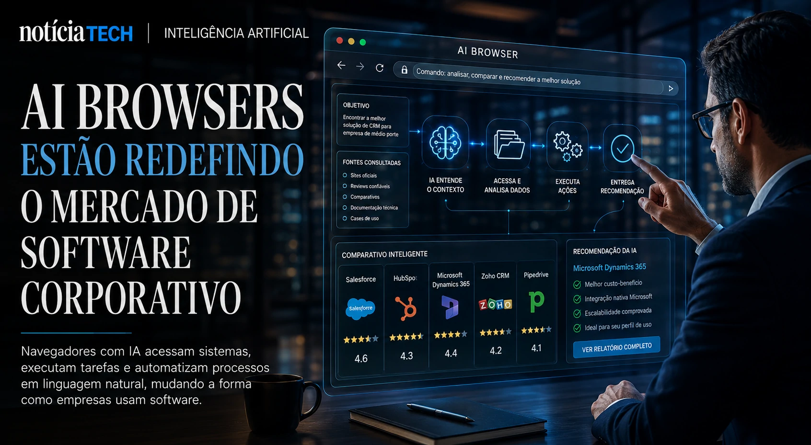
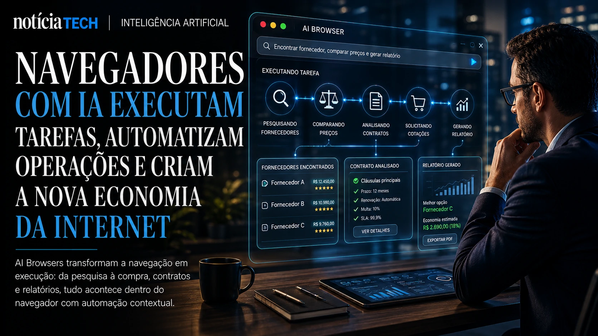

*Os navegadores com inteligência artificial deixaram de ser apenas uma tendência experimental do Vale do Silício e começam a se transformar em uma nova camada operacional dentro das empresas. O movimento liderado por gigantes como **Google**, **OpenAI**, **Microsoft**, **Perplexity** e startups de IA pode mudar não apenas a forma como pessoas navegam na internet, mas também como empresas pesquisam, compram software, automatizam tarefas e executam operações digitais no dia a dia.*

## AI Browsers estão se tornando a nova interface operacional da internet

AI Browsers são navegadores inteligentes capazes de entender contexto, executar tarefas, resumir informações, automatizar processos e interagir com plataformas digitais usando linguagem natural.

O que antes era apenas uma ferramenta para acessar páginas começa agora a evoluir para um verdadeiro “copiloto operacional” corporativo.

A mudança acontece porque a internet tradicional foi construída para humanos navegarem manualmente. Já os novos navegadores com IA foram desenhados para interpretar intenção, contexto e objetivos.

Em vez de:
- abrir dezenas de abas;
- pesquisar manualmente;
- copiar informações;
- alternar entre plataformas;
- preencher formulários repetitivos;

os novos AI Browsers começam a executar essas tarefas de forma autônoma.

Empresas como **OpenAI**, **Google** e **Microsoft** perceberam que o navegador pode se tornar o principal ponto de interação entre usuários e inteligência artificial.

Na prática, isso cria uma nova disputa estratégica:
- quem controlar a interface de navegação;
- controlará fluxo de informação;
- dados comportamentais;
- produtividade corporativa;
- descoberta de softwares;
- distribuição digital;
- comércio online;
- operações automatizadas.

Esse movimento amplia um cenário já discutido anteriormente pelo NOTÍCIA TECH em:
[Google, OpenAI e Perplexity aceleram corrida pelos navegadores com IA e ameaçam a economia tradicional da web](https://noticiatech.com.br/inteligencia-artificial/google-openai-e-perplexity-aceleram-corrida-pelos-navegadores-com-ia-e-amea%C3%A7am-a-economia-tradicional-da-web/)

### O que muda na prática para empresas?

Empresas começam a ganhar uma camada operacional baseada em IA diretamente no navegador.

Isso pode permitir:
- geração automática de relatórios;
- comparação de fornecedores;
- análise de concorrentes;
- preenchimento inteligente de CRMs;
- automação de compras;
- leitura de dashboards;
- monitoramento de mercado;
- suporte corporativo contextual.

Em vez de navegar, o usuário passa a “delegar”.

Essa é uma mudança estrutural na relação entre humanos e software.

## A disputa pelos AI Browsers pode redefinir o mercado de software corporativo

Os AI Browsers começam a reduzir a importância de interfaces tradicionais de software.

Historicamente, empresas precisavam:
- aprender sistemas complexos;
- navegar por menus;
- acessar múltiplas plataformas;
- operar softwares manualmente.

Agora, modelos de IA podem atuar como uma camada intermediária entre usuário e aplicações corporativas.

Isso significa que:
- o navegador entende o objetivo;
- acessa sistemas;
- executa comandos;
- organiza respostas;
- automatiza fluxos.

Na prática, o software passa a ser consumido via linguagem natural.

Essa mudança ameaça modelos tradicionais de SaaS porque reduz dependência da interface original do sistema.

Empresas começam a perceber que:
- IA pode acessar plataformas diferentes;
- consolidar informações;
- operar múltiplos sistemas ao mesmo tempo;
- reduzir atrito operacional.

O movimento se conecta diretamente ao avanço dos chamados sistemas autônomos corporativos, já analisados pelo NOTÍCIA TECH em:
[A era dos agentes de IA já começou: como Microsoft, OpenAI e Google estão transformando empresas em sistemas autônomos](https://noticiatech.com.br/inteligencia-artificial/a-era-dos-agentes-de-ia-j%C3%A1-come%C3%A7ou-como-microsoft-openai-e-google-est%C3%A3o-transformando-empresas-em-sistemas-aut%C3%B4nomos/)

### Por que isso preocupa gigantes de software?

O risco para plataformas tradicionais é perder a relação direta com o usuário.

Se o navegador com IA:
- executa tarefas;
- lê dados;
- organiza processos;
- responde perguntas;
- automatiza operações;

o valor da interface tradicional diminui.

Isso pode transformar:
- ERPs;
- CRMs;
- plataformas de analytics;
- sistemas de atendimento;
- ferramentas de produtividade.

A disputa deixa de ser apenas “quem tem o melhor software”.

Ela passa a ser:
“quem controla a camada de inteligência operacional”.

## Navegadores inteligentes começam a criar uma nova economia baseada em automação contextual

AI Browsers não querem apenas responder perguntas. Eles querem executar ações.

Essa diferença muda completamente o papel da internet corporativa.

Hoje, empresas já utilizam IA para:
- resumir reuniões;
- escrever documentos;
- gerar apresentações;
- automatizar marketing;
- responder clientes;
- criar análises operacionais.

Mas os AI Browsers ampliam isso para execução contextual.

Exemplo:
- a IA identifica um fornecedor;
- compara preços;
- acessa contratos;
- consulta histórico;
- sugere negociação;
- executa tarefas operacionais.

Tudo dentro do navegador.

Esse modelo começa a transformar navegadores em:
- hubs operacionais;
- ambientes de produtividade;
- interfaces autônomas;
- sistemas inteligentes de execução.

### O que pode acontecer nos próximos anos?

O mercado pode entrar em uma nova fase onde:
- websites deixam de ser navegados manualmente;
- IA passa a consumir interfaces diretamente;
- empresas otimizam conteúdo para agentes inteligentes;
- softwares passam a competir por integração com IA;
- navegadores viram plataformas operacionais.

Isso fortalece uma nova lógica digital:
não basta mais ser encontrado por humanos.

Empresas agora começam a precisar ser compreendidas por inteligências artificiais.

Esse cenário conversa diretamente com a ascensão do conceito de B2A, já explorado pelo NOTÍCIA TECH em:
[B2A: a nova fronteira dos negócios onde empresas precisam ser entendidas por inteligências artificiais](https://noticiatech.com.br/inteligencia-artificial/b2a-a-nova-fronteira-dos-neg%C3%B3cios-onde-empresas-precisam-ser-entendidas-por-intelig%C3%AAncias-artificiais/)

### AI Browsers podem acelerar a transformação da web corporativa

A corrida pelos navegadores inteligentes começa a revelar uma mudança silenciosa:
a internet está deixando de ser apenas uma interface visual e passa a se tornar um ambiente operacional interpretado por IA.

Para empresas, isso pode representar:
- ganhos massivos de produtividade;
- redução de atrito operacional;
- automação contextual;
- aceleração de processos;
- nova dependência estratégica de IA.

Ao mesmo tempo, cria novos desafios:
- governança;
- privacidade;
- segurança;
- dependência tecnológica;
- controle de dados corporativos.

A disputa iniciada por **Google**, **OpenAI**, **Microsoft**, **Perplexity** e outras gigantes pode acabar redefinindo não apenas o navegador, mas a própria estrutura operacional da internet corporativa nos próximos anos.

---