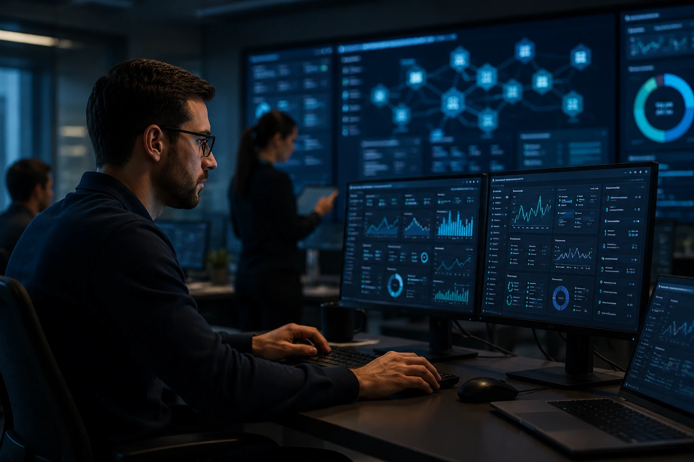
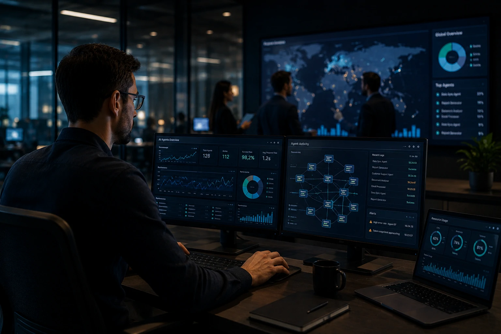
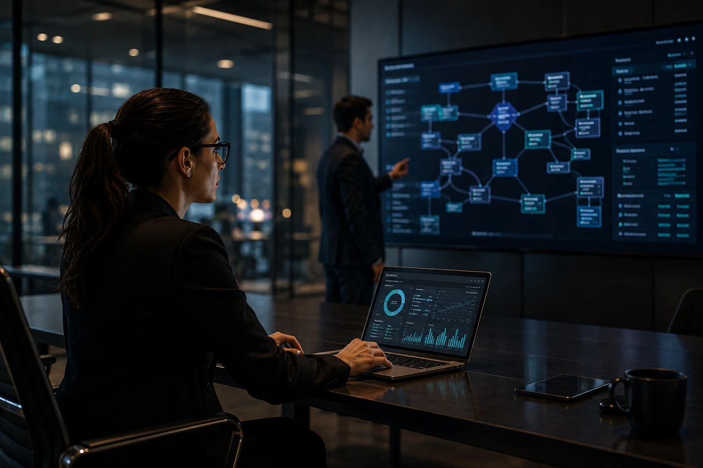

*A inteligência artificial está deixando de ser apenas uma ferramenta experimental e se tornando uma infraestrutura operacional. À medida que empresas implantam dezenas ou até centenas de agentes digitais para executar tarefas estratégicas, surge uma nova necessidade: governar, monitorar e otimizar esse ecossistema. É nesse contexto que nasce o conceito de AI Operations, uma disciplina que pode se tornar tão importante quanto segurança da informação e computação em nuvem na próxima década.*

## AI Operations é a estrutura que permite administrar agentes de IA em escala corporativa

*O crescimento dos agentes de IA exige novas camadas de monitoramento e governança empresarial.*

**AI Operations** é o conjunto de processos, tecnologias e práticas utilizadas para administrar sistemas de **Inteligência Artificial** em ambientes corporativos.

Enquanto muitas empresas ainda estão concentradas na adoção inicial da IA, organizações mais avançadas já enfrentam um novo desafio: controlar múltiplos modelos, agentes autônomos, fluxos automatizados e integrações espalhadas por diferentes departamentos.

O problema não está mais em implementar IA. O desafio passa a ser gerenciar a operação.

### Por que esse tema surgiu agora?

Nos últimos dois anos, o mercado evoluiu rapidamente da fase de chatbots para a era dos agentes autônomos.

Ferramentas capazes de executar tarefas, acessar sistemas corporativos, consultar bancos de dados e tomar decisões operacionais começaram a se multiplicar.

Esse movimento foi acelerado por tecnologias como **MCP (Model Context Protocol)**, discutido anteriormente pelo Notícia Tech no artigo sobre [MCP e a infraestrutura que conecta agentes de IA a sistemas corporativos](https://noticiatech.com.br/inteligencia-artificial/mcp-infraestrutura-conecta-agentes-ia-sistemas-corporativos/).

### O novo desafio das organizações

Quando uma empresa possui apenas uma ferramenta de IA, o controle é simples.

Quando passa a operar dezenas de agentes diferentes, surgem questões críticas:

- Quem supervisiona os resultados?
- Como medir qualidade?
- Como evitar erros?
- Como controlar custos?
- Como garantir conformidade regulatória?

Essas perguntas estão criando espaço para uma nova disciplina corporativa.

## Empresas estão descobrindo que agentes precisam de governança

*Governar agentes digitais está se tornando tão importante quanto administrar infraestrutura de TI.*

A governança de IA é o principal motivo para o crescimento do conceito de **AI Operations**.

Muitas organizações perceberam que agentes podem gerar valor extraordinário, mas também criar riscos operacionais significativos quando não existem mecanismos adequados de supervisão.

Erros de contexto, decisões incorretas, informações desatualizadas e falhas de integração podem gerar impactos financeiros relevantes.

### O que precisa ser monitorado?

Uma estrutura de AI Operations normalmente acompanha indicadores como:

- precisão das respostas;
- taxa de erro;
- custos de processamento;
- uso de tokens;
- produtividade gerada;
- segurança dos dados;
- aderência regulatória;
- desempenho dos agentes.

Esses indicadores ajudam empresas a transformar IA em um ativo corporativo controlável.

### O papel da conformidade e da segurança

A chegada de legislações relacionadas à inteligência artificial aumenta a necessidade de supervisão.

Empresas precisam documentar decisões, rastrear ações dos agentes e demonstrar transparência sobre como sistemas automatizados operam.

Essa preocupação se conecta diretamente ao avanço dos agentes corporativos discutidos pelo Notícia Tech em [A era dos agentes de IA já começou](https://noticiatech.com.br/inteligencia-artificial/a-era-dos-agentes-de-ia-j%C3%A1-come%C3%A7ou-como-microsoft-openai-e-google-est%C3%A3o-transformando-empresas-em-sistemas-aut%C3%B4nomos/).

Sem governança adequada, o ganho de produtividade pode ser acompanhado por aumento de risco operacional.

## AI Operations pode se tornar o próximo grande mercado corporativo

*Equipes especializadas começam a surgir para administrar ecossistemas complexos de IA.*

AI Operations está evoluindo para algo maior do que uma prática operacional.

Diversos especialistas enxergam o surgimento de uma nova categoria de software empresarial focada exclusivamente na administração de agentes e modelos de IA.

O movimento lembra o que ocorreu com o crescimento do mercado de cloud computing na década passada.

### O surgimento de novas funções profissionais

Novos cargos começam a aparecer em organizações mais avançadas.

Entre eles:

- AI Operations Manager;
- AI Governance Lead;
- Agent Operations Analyst;
- AI Risk Officer;
- AI Compliance Specialist.

Essas funções possuem o objetivo de garantir que os sistemas de IA gerem valor consistente ao longo do tempo.

### Oportunidade para fornecedores de tecnologia

Empresas de software também estão enxergando uma oportunidade bilionária.

Ferramentas de observabilidade, auditoria, monitoramento e controle de agentes devem formar um novo segmento dentro do mercado de tecnologia corporativa.

Assim como surgiram plataformas para administrar nuvens, bancos de dados e aplicações, o mercado pode testemunhar a criação de plataformas especializadas em administrar agentes inteligentes.

## O futuro da IA corporativa depende menos dos modelos e mais da operação

A próxima fase da transformação digital será definida pela capacidade das empresas de operar inteligência artificial de forma previsível, segura e escalável.

Os modelos continuarão evoluindo.

Os agentes ficarão mais autônomos.

As integrações se tornarão mais profundas.

No entanto, a vantagem competitiva não estará apenas na tecnologia utilizada, mas na capacidade de administrar essa tecnologia de maneira eficiente.

### O que muda para líderes empresariais?

Executivos precisam começar a enxergar IA como infraestrutura operacional.

Isso significa criar processos, indicadores e estruturas de responsabilidade.

Empresas que desenvolverem maturidade operacional terão maior capacidade de capturar valor econômico dos investimentos em IA.

### Por que esse movimento é relevante agora?

O mercado está entrando em uma fase de industrialização da inteligência artificial.

A discussão já não gira apenas em torno de quais modelos utilizar.

A pergunta estratégica passa a ser como administrar centenas de sistemas inteligentes trabalhando simultaneamente dentro da organização.

Nesse cenário, **AI Operations** pode se tornar uma das áreas mais importantes da próxima geração de empresas digitais, funcionando como a camada invisível que garante que agentes de IA produzam resultados consistentes, seguros e alinhados aos objetivos do negócio.

---