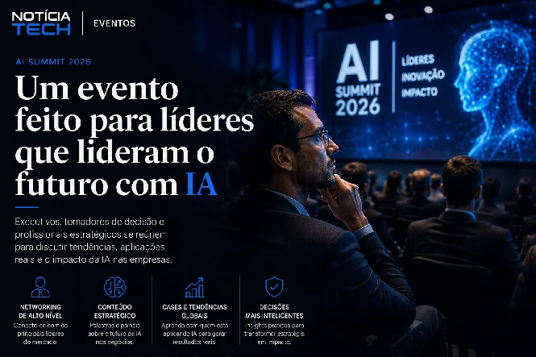
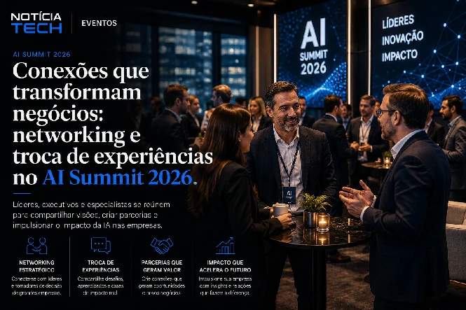

*O avanço da inteligência artificial entrou definitivamente em uma nova fase no Brasil. O AI Summit 2026, promovido pela EXAME em São Paulo, mostra como grandes empresas, startups e executivos passaram a tratar a IA não apenas como inovação tecnológica, mas como infraestrutura estratégica para produtividade, automação, software corporativo e transformação digital empresarial.*

## O que é o AI Summit 2026 da EXAME

*Evento reúne líderes do setor para discutir produtividade, IA generativa, automação e transformação digital empresarial.*

O **AI Summit 2026**, organizado pela **EXAME**, surge como um dos eventos mais relevantes do calendário brasileiro de tecnologia e negócios.

A proposta do encontro é reunir especialistas, executivos e empresas para discutir como a **inteligência artificial** está mudando:

- empresas;
- profissões;
- marketing;
- produtividade;
- software corporativo;
- automação;
- criação de produtos digitais;
- e tomada de decisão empresarial.

O evento acontece em São Paulo e reúne nomes ligados ao ecossistema de IA, incluindo representantes do **Google**, especialistas em inovação e executivos associados à nova geração de plataformas de automação e desenvolvimento por IA.

Mais do que um evento sobre tecnologia, o AI Summit simboliza uma mudança importante no mercado.

A inteligência artificial deixou de ser apenas pauta de inovação experimental e passou a ocupar espaço central nas estratégias corporativas.

## A inteligência artificial entrou oficialmente na agenda das empresas brasileiras

Durante muito tempo, a IA foi tratada como uma tecnologia distante, cara ou restrita às grandes empresas.

Esse cenário mudou rapidamente.

Nos últimos dois anos, ferramentas baseadas em:

- **IA generativa**;
- automação inteligente;
- copilotos corporativos;
- análise de dados;
- geração de conteúdo;
- agentes autônomos;
- e produtividade empresarial

passaram a ganhar espaço real dentro das operações.

Hoje, empresas brasileiras utilizam IA para:

- automatizar atendimento;
- criar campanhas;
- gerar relatórios;
- acelerar desenvolvimento;
- organizar dados;
- melhorar produtividade;
- reduzir custos;
- e ampliar eficiência operacional.

Esse movimento ajuda a explicar por que eventos como o AI Summit cresceram tão rápido.

O mercado deixou de perguntar apenas:

“o que é inteligência artificial?”

Agora a pergunta passou a ser:

“como aplicar IA de forma competitiva dentro da empresa?”

## O Brasil virou território estratégico para a corrida global da IA

*Big techs aceleram investimentos em IA corporativa e infraestrutura para disputar o mercado empresarial brasileiro.*

A presença do **Google** no evento é um dos sinais mais claros de que o Brasil passou a ser visto como um mercado estratégico para a expansão da inteligência artificial.

A disputa global pela liderança da IA se tornou uma das maiores corridas tecnológicas da história recente.

Hoje, empresas como:

- **Google**;
- **OpenAI**;
- **Microsoft**;
- **Meta**;
- **Amazon**;
- **Anthropic**;
- e **NVIDIA**

investem bilhões de dólares em:

- infraestrutura;
- modelos de linguagem;
- computação em nuvem;
- agentes autônomos;
- chips;
- plataformas corporativas;
- e ecossistemas de produtividade.

### O foco da disputa mudou

Nos primeiros anos da IA generativa, a corrida estava concentrada em quem possuía o modelo mais avançado.

Agora, o mercado mudou.

A nova disputa acontece em torno de:

- adoção empresarial;
- integração operacional;
- produtividade;
- infraestrutura;
- fidelização corporativa;
- e domínio do software empresarial.

Isso explica por que grandes empresas passaram a disputar contratos corporativos agressivamente.

O objetivo agora não é apenas oferecer IA.

É se tornar a infraestrutura operacional das empresas.

## O Google tenta fortalecer sua posição no software corporativo

O avanço do **Gemini** e da estratégia de IA do Google mostra que a empresa tenta recuperar terreno após o crescimento acelerado do **ChatGPT**.

Nos últimos meses, o Google ampliou investimentos em:

- Google Cloud;
- Gemini;
- agentes de IA;
- produtividade corporativa;
- IA multimodal;
- e automação empresarial.

Esse movimento também aparece em outras iniciativas recentes do mercado.

Veja também:

- [Google amplia aposta na Anthropic, criadora da IA Claude, e acirra disputa pelo software corporativo](https://noticiatech.com.br/inteligencia-artificial/google-amplia-aposta-na-anthropic-criadora-da-ia-claude-e-acirra-disputa-pelo-software-corporativo/)

### A guerra da IA deixou de ser apenas tecnológica

O mercado está migrando de:

“qual IA é mais inteligente?”

para:

“qual ecossistema empresarial será dominante?”

Isso envolve:

- infraestrutura de nuvem;
- produtividade;
- integração;
- automação;
- APIs;
- SaaS;
- e agentes autônomos.

Quem dominar essa camada pode controlar parte importante da próxima geração do software corporativo.

## Lovable representa uma das maiores tendências da nova economia de IA

*Ferramentas de desenvolvimento por IA aceleram criação de software e reduzem barreiras técnicas para empresas e creators.*

Outro destaque estratégico do AI Summit é a presença da **Lovable**.

A startup ganhou atenção internacional ao permitir criação de aplicações utilizando prompts e automação baseada em IA.

Na prática, plataformas desse tipo permitem que usuários criem:

- interfaces;
- aplicativos;
- MVPs;
- automações;
- fluxos operacionais;
- dashboards;
- e sistemas digitais

com muito menos dependência técnica.

### O desenvolvimento por prompts começou a mudar o mercado

Nos últimos anos, o mercado viu crescimento acelerado de ferramentas:

- no-code;
- low-code;
- SaaS automatizado;
- automação empresarial;
- e copilotos de desenvolvimento.

Agora, uma nova camada começou a surgir.

Sistemas capazes de transformar linguagem natural em software funcional.

Isso muda completamente a lógica do desenvolvimento tradicional.

### O impacto pode ser enorme para creators e pequenas empresas

Esse tipo de tecnologia pode beneficiar principalmente:

- creators;
- agências;
- startups;
- pequenos negócios;
- freelancers;
- profissionais de marketing;
- e empresas sem grandes equipes técnicas.

Ferramentas baseadas em IA estão reduzindo:

- barreiras técnicas;
- tempo de desenvolvimento;
- custo operacional;
- dependência de grandes equipes;
- e complexidade de lançamento.

Isso pode acelerar drasticamente a criação de produtos digitais no Brasil.

## A próxima grande tendência do mercado são os agentes de IA

Um dos assuntos mais importantes do setor atualmente é o crescimento dos chamados **agentes de IA**.

Diferente de chatbots tradicionais, esses sistemas conseguem:

- interpretar contexto;
- executar tarefas;
- acessar ferramentas;
- tomar decisões;
- automatizar processos;
- integrar plataformas;
- e operar fluxos complexos.

Essa nova geração de IA começa a impactar:

- suporte;
- marketing;
- vendas;
- desenvolvimento;
- atendimento;
- análise de dados;
- CRM;
- e produtividade empresarial.

### A IA agêntica pode transformar o software empresarial

Durante anos, softwares funcionaram como sistemas passivos.

O usuário precisava:

- operar;
- clicar;
- configurar;
- analisar;
- e executar tarefas manualmente.

Agora isso começa a mudar.

Com agentes de IA, os sistemas passam a:

- agir;
- interpretar;
- recomendar;
- automatizar;
- e executar etapas operacionais.

Essa mudança pode redefinir completamente:

- ERPs;
- CRMs;
- plataformas de marketing;
- sistemas financeiros;
- suporte corporativo;
- e gestão empresarial.

## O paradoxo da inteligência artificial no Brasil

Apesar do crescimento acelerado da IA, grande parte das empresas brasileiras ainda está em estágio inicial de adoção.

Esse é um dos temas mais importantes do mercado atual.

### Muitas empresas ainda não possuem estratégia clara de IA

Existe uma diferença enorme entre:

- usar IA pontualmente;
- e integrar IA na operação.

Grande parte do mercado ainda enfrenta problemas como:

- falta de profissionais;
- dificuldade de implementação;
- ausência de governança;
- baixa maturidade digital;
- receio sobre segurança;
- e desconhecimento técnico.

Ao mesmo tempo, empresas que conseguem integrar automação e inteligência artificial começam a ganhar vantagem competitiva rapidamente.

## O mercado brasileiro pode acelerar fortemente nos próximos anos

Existem alguns fatores que podem acelerar a adoção de IA no Brasil:

### Redução de custos operacionais

Empresas estão buscando eficiência em um ambiente cada vez mais competitivo.

A IA reduz:

- tarefas repetitivas;
- retrabalho;
- tempo operacional;
- e dependência manual.

### Crescimento da produtividade

Ferramentas de IA conseguem acelerar:

- criação de conteúdo;
- atendimento;
- análise de dados;
- automação de marketing;
- suporte;
- e organização operacional.

### Democratização da tecnologia

A IA está ficando mais acessível.

Hoje, pequenas empresas conseguem implementar automações que antes eram restritas a grandes corporações.

## IA já está mudando marketing, vendas e produtividade

A transformação provocada pela inteligência artificial não acontece apenas na área técnica.

Ela já impacta diretamente:

- marketing digital;
- vendas;
- geração de leads;
- anúncios;
- CRM;
- SEO;
- automação;
- e produção de conteúdo.

### O comportamento de busca mudou

Usuários passaram a pesquisar informações diretamente em:

- ChatGPT;
- Gemini;
- Perplexity;
- Claude;
- e mecanismos generativos.

Isso muda completamente a lógica do conteúdo digital.

Empresas agora precisam ser:

- compreendidas;
- interpretadas;
- contextualizadas;
- e recomendadas pelas IAs.

## Eventos de IA estão se transformando em hubs estratégicos de negócios

O crescimento do AI Summit mostra outra mudança importante.

Eventos de tecnologia deixaram de ser apenas ambientes de networking.

Agora funcionam como centros de:

- posicionamento de marca;
- aquisição de clientes;
- construção de autoridade;
- expansão de ecossistemas;
- e relacionamento corporativo.

Hoje, empresas disputam atenção dentro do mercado de IA.

A lógica é simples:

quem dominar percepção de mercado primeiro pode conquistar vantagem competitiva.

## O que o AI Summit revela sobre o futuro da inteligência artificial no Brasil

O AI Summit 2026 mostra que o mercado brasileiro entrou oficialmente em uma nova fase da inteligência artificial.

A conversa deixou de girar apenas em torno de curiosidade tecnológica.

Agora o foco está em:

- produtividade;
- automação;
- integração empresarial;
- agentes autônomos;
- software inteligente;
- monetização;
- eficiência operacional;
- e transformação digital.

Ao mesmo tempo, o avanço de plataformas como a **Lovable** mostra que a criação de software pode se tornar muito mais acessível nos próximos anos.

Isso pode acelerar:

- startups;
- creators;
- automação empresarial;
- micro SaaS;
- marketing digital;
- e novos modelos de negócio.

A tendência é que a inteligência artificial deixe de ser diferencial e passe a funcionar como infraestrutura básica para empresas de praticamente todos os setores.

E eventos como o AI Summit mostram que essa transformação já começou.