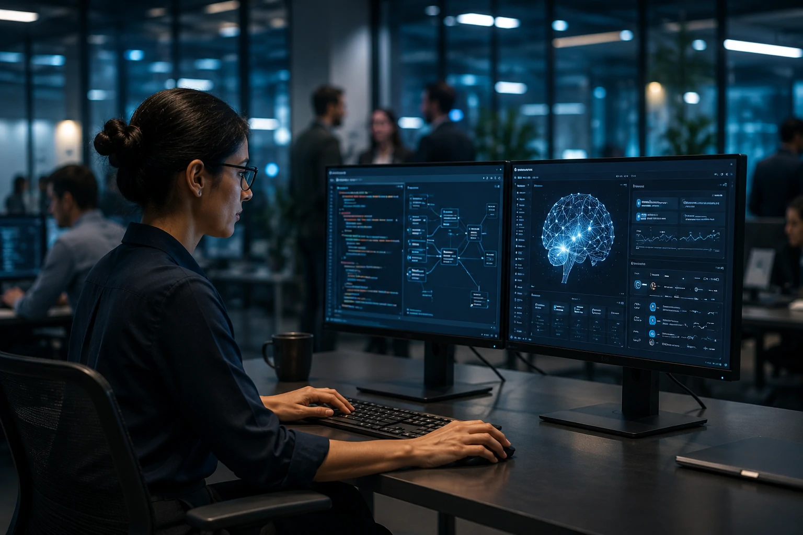
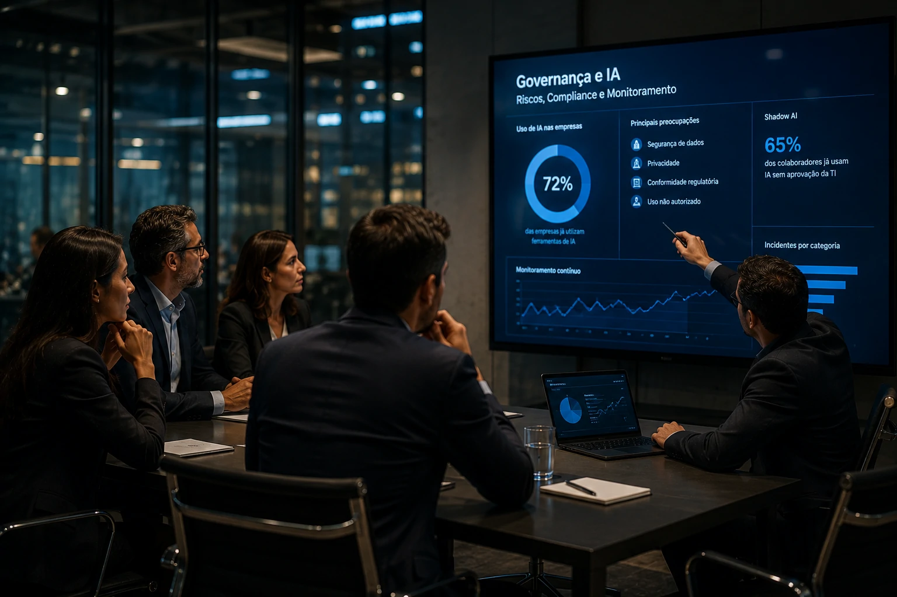

*Durante anos, a inteligência artificial foi apresentada como uma promessa de transformação. No AI Summit Exame 2026, porém, a mensagem foi diferente: a fase de experimentação está chegando ao fim. A prioridade agora é escalar projetos, integrar agentes inteligentes aos processos corporativos e transformar IA em vantagem competitiva real.*

# AI Summit Exame 2026: o que o evento revela sobre a próxima fase da adoção corporativa de inteligência artificial no Brasil

## A inteligência artificial deixou de ser um projeto piloto

Empresas de diferentes setores estão tratando a **Inteligência Artificial** como uma camada estratégica da operação, e não mais como uma iniciativa isolada de inovação.

*Executivos discutem como a inteligência artificial está migrando dos laboratórios para o centro das operações empresariais.*

O principal sinal observado no **AI Summit Exame 2026** foi a mudança de discurso dos líderes empresariais. A conversa deixou de girar em torno do potencial da tecnologia e passou a focar implementação, governança e retorno sobre investimento.

### O fim da fase experimental

Nos últimos dois anos, muitas organizações criaram laboratórios de IA para testar ferramentas e modelos generativos.

Agora, a preocupação é diferente.

Os gestores querem saber como integrar IA aos processos críticos da empresa, gerar produtividade e criar vantagem competitiva sustentável.

### O foco mudou para resultados

A pergunta deixou de ser "devemos usar IA?" e passou a ser "como escalar IA com segurança e eficiência?".

Essa mudança aproxima o mercado brasileiro do movimento já observado em grandes empresas globais.

Para aprofundar esse cenário, vale entender também o conceito de [AI First](https://noticiatech.com.br/negocios/o-que-e-ai-first-estrategia-empresas/), que vem influenciando a estratégia corporativa de diversas organizações.

## Agentes de IA surgem como a próxima fronteira corporativa

Os agentes inteligentes foram um dos temas mais recorrentes do evento.

*Os agentes autônomos aparecem como a próxima etapa da evolução da automação empresarial.*

A expectativa do mercado é que os agentes sejam capazes de executar tarefas completas, tomar decisões dentro de limites definidos e interagir com múltiplos sistemas corporativos.

### O que diferencia agentes de chatbots

Chatbots respondem perguntas.

Agentes executam processos.

Essa diferença é fundamental para compreender o próximo estágio da transformação digital.

Enquanto assistentes conversacionais atuam de forma reativa, os agentes podem operar de maneira proativa.

### MCP ganha relevância estratégica

Outro tema associado aos agentes foi o avanço do **MCP (Model Context Protocol)**.

O protocolo vem sendo apontado como uma das estruturas mais promissoras para conectar modelos de IA a sistemas corporativos.

Empresas que desejam aprofundar o tema podem consultar os conteúdos sobre [Como funciona o MCP](https://noticiatech.com.br/inteligencia-artificial/como-funciona-mcp-guia-completo-agentes-ia/) e [Como implementar MCP nas empresas](https://noticiatech.com.br/inteligencia-artificial/como-implementar-mcp-empresas-arquitetura-integracao-agentes-ia/).

## Governança e controle passam a ser prioridade

A adoção acelerada da IA também trouxe novas preocupações para executivos e conselhos administrativos.

*Governança, segurança e conformidade tornam-se temas centrais à medida que a adoção da IA cresce nas empresas.*

O crescimento dos projetos de IA aumenta riscos relacionados à segurança, privacidade, conformidade regulatória e uso inadequado da tecnologia.

### Shadow AI preocupa empresas

Muitas organizações descobriram que funcionários já utilizam ferramentas de IA sem aprovação formal da área de tecnologia.

Esse fenômeno é conhecido como **Shadow AI**.

Além dos riscos operacionais, ele cria desafios de governança e proteção de dados.

### Surge a necessidade de AI Operations

Outro conceito em crescimento é o de **AI Operations**.

A proposta é criar processos, métricas e estruturas capazes de monitorar modelos, agentes e fluxos automatizados em larga escala.

Esse movimento foi detalhado recentemente pelo Notícia Tech no artigo sobre [AI Operations e governança de agentes de IA](https://noticiatech.com.br/inteligencia-artificial/ai-operations-governanca-agentes-ia-empresas/).

## O que o AI Summit Exame revela sobre o futuro dos negócios

O principal aprendizado do evento é que a corrida da IA está entrando em uma nova fase.

Não vence quem apenas experimenta.

Vence quem consegue transformar tecnologia em capacidade operacional.

### A competição será organizacional

As vantagens competitivas não estarão apenas nos modelos utilizados.

Elas estarão na capacidade de integrar tecnologia, dados, processos e pessoas.

Empresas com estruturas mais maduras tendem a capturar mais valor da IA.

### O Brasil entra em uma nova etapa da transformação digital

O AI Summit Exame 2026 mostrou que o debate nacional está se aproximando das discussões mais avançadas do mercado global.

Temas como agentes autônomos, infraestrutura de IA, governança, protocolos de integração e produtividade empresarial já fazem parte da agenda dos líderes corporativos.

A partir de agora, a inteligência artificial deixa de ser uma tendência observada à distância e passa a ocupar uma posição central nas estratégias de crescimento, eficiência e competitividade das empresas brasileiras. Para organizações que desejam permanecer relevantes na próxima década, a questão não é mais se a IA será adotada, mas qual será a velocidade dessa adoção e quem conseguirá executá-la melhor.

---