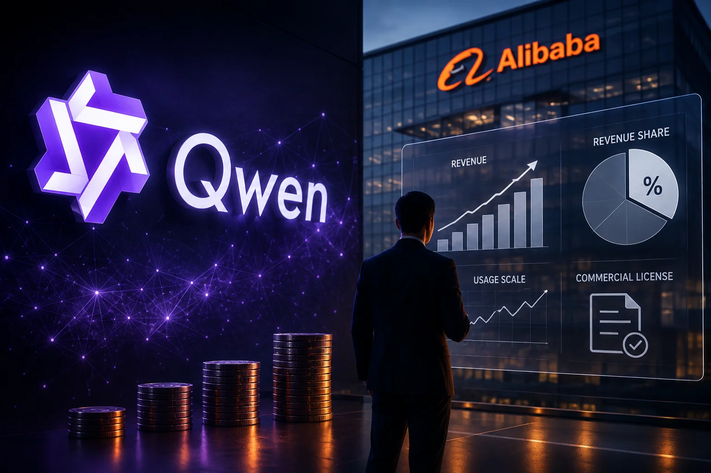
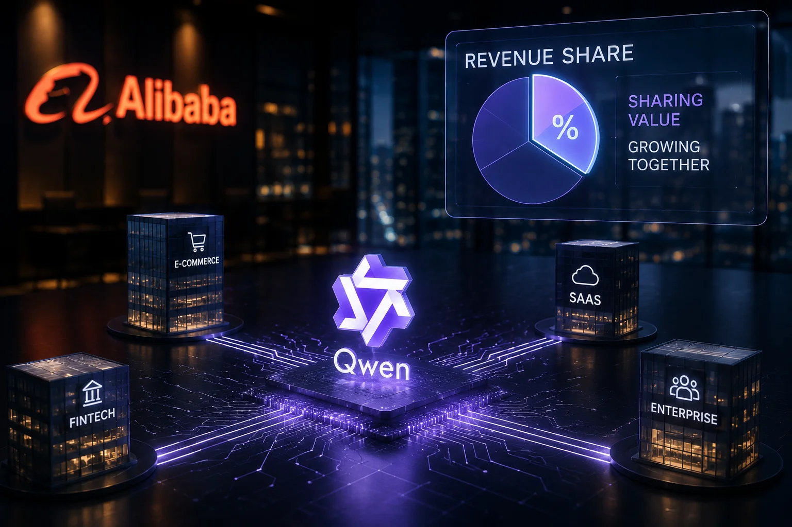

*Durante anos, a principal promessa dos modelos de IA com pesos abertos foi simples: permitir que empresas e desenvolvedores utilizassem a tecnologia com mais liberdade e menor dependência das grandes plataformas. A nova estratégia da **Alibaba** coloca essa lógica diante de uma pergunta que pode mudar o mercado: até onde uma IA pode ser aberta quando seu fornecedor também quer participar do dinheiro gerado por ela?*

## A Alibaba quer transformar o sucesso comercial do Qwen em receita

A **Alibaba** prepara uma mudança na forma de monetizar sua próxima geração de modelos **Qwen**. Segundo informações divulgadas pela Reuters, a empresa pretende exigir que grandes usuários comerciais do próximo **Qwen3.8-Max** compartilhem uma parcela da receita obtida com serviços construídos usando o modelo.

A porcentagem ainda não foi definida. O que está em discussão é uma nova estrutura de licenciamento que pode acompanhar a disponibilização dos pesos do modelo, prevista para ocorrer em breve.

Isso é importante porque o **Qwen** ocupa uma posição diferente de uma simples API comercial. Modelos com pesos abertos permitem que organizações tenham maior controle sobre a tecnologia e, dependendo da licença e da implementação, possam executar os modelos em sua própria infraestrutura.

### O que está mudando na estratégia da Alibaba

O ponto central não é simplesmente começar a cobrar pelo Qwen. A mudança está na tentativa de capturar parte do valor econômico criado por empresas que utilizam o modelo para construir produtos e serviços.

Na prática, uma empresa poderia utilizar o Qwen como uma das bases tecnológicas de uma aplicação comercial. Se esse produto gerar receita em grande escala, a nova licença poderá estabelecer uma relação financeira entre a empresa que criou o serviço e a **Alibaba**.

Essa lógica se aproxima de um modelo de participação econômica. O fornecedor da tecnologia deixa de depender exclusivamente de infraestrutura, APIs ou assinaturas para ganhar dinheiro e passa a tentar participar do resultado comercial produzido por sua tecnologia.

### Por que a mudança chama atenção

A estratégia ocorre em um momento no qual o mercado de IA está tentando resolver um problema fundamental: **como transformar modelos cada vez mais caros de desenvolver em negócios sustentáveis**.

Treinar um modelo de linguagem de grande porte exige enormes volumes de dados, infraestrutura computacional e capacidade de engenharia. Depois do treinamento, ainda existe o custo de disponibilizar o modelo para milhões de usuários e empresas.

A Alibaba já trabalha em diferentes camadas desse ecossistema, incluindo modelos, computação em nuvem e serviços de IA. Seu relatório anual mais recente afirma que a receita externa do Cloud Intelligence Group cresceu 40% no último trimestre fiscal de 2026, enquanto produtos relacionados à IA representaram 30% dessa receita. 

A nova estratégia do Qwen pode ser entendida dentro desse movimento maior: **a Alibaba quer transformar a adoção de seus modelos em valor econômico recorrente, mesmo quando o modelo é distribuído fora de sua própria nuvem.**

## O Qwen pode continuar aberto e, ao mesmo tempo, gerar cobrança

A aparente contradição desaparece quando se separa a ideia de **modelo aberto** da ideia de **uso comercial sem restrições**. Um modelo pode disponibilizar seus pesos para execução e, ainda assim, estabelecer determinadas condições para usos comerciais específicos.

*O avanço dos modelos com pesos abertos está criando uma nova disputa: quem desenvolve a tecnologia e quem captura o valor econômico gerado por ela.*

### O que significa um modelo com pesos abertos

Os pesos são os parâmetros numéricos que o modelo aprendeu durante seu processo de treinamento. Eles determinam, em grande parte, como o sistema transforma uma entrada em uma resposta.

Quando esses pesos são disponibilizados, empresas podem ter mais liberdade para executar o modelo em seus próprios servidores ou adaptá-lo às suas necessidades, em vez de depender exclusivamente de uma interface controlada pelo fornecedor.

É por isso que modelos como o **Qwen** ganharam espaço entre desenvolvedores e organizações que procuram alternativas aos sistemas proprietários oferecidos por empresas como **OpenAI**, **Anthropic** e **Google**.

A abertura também reduz uma barreira estratégica: a empresa pode ter mais controle sobre onde a IA é executada, como os dados são processados e como a tecnologia é incorporada aos seus sistemas.

### A abertura não elimina o problema da monetização

Para o fornecedor do modelo, entretanto, existe um desafio.

Se uma empresa baixar os pesos, executar o modelo em sua própria infraestrutura e construir um produto altamente lucrativo, o desenvolvedor original pode não receber nada diretamente dessa atividade.

Esse é justamente o espaço que a nova estratégia da **Alibaba** tenta ocupar.

A empresa pode permitir uma distribuição ampla do modelo para acelerar sua adoção, mas estabelecer uma relação comercial com os usuários que transformarem essa tecnologia em negócios de grande escala.

Essa estratégia cria um equilíbrio delicado. Quanto mais aberta for a tecnologia, maior pode ser sua distribuição. Quanto mais rígidas forem as condições comerciais, maior pode ser a capacidade de capturar receita, mas também maior pode ser o incentivo para empresas escolherem alternativas.

### O precedente que ajuda a explicar a decisão

A estratégia não surgiu isoladamente.

A startup chinesa **Moonshot AI**, responsável pelo modelo **Kimi K3**, adotou uma abordagem semelhante. Segundo a Reuters, os termos do Kimi K3 estabelecem que empresas que comercializem o modelo como serviço e ultrapassem determinado nível de receita precisam negociar um acordo comercial com a Moonshot.

O caso é relevante porque mostra que empresas chinesas de IA estão experimentando uma lógica diferente da tradicional disputa entre modelos gratuitos e APIs pagas.

A questão passa a ser: **como distribuir uma tecnologia de forma suficientemente ampla para conquistar mercado e, ao mesmo tempo, preservar uma forma de capturar o valor econômico criado por essa distribuição?**

Esse pode ser um dos debates mais importantes da próxima fase da inteligência artificial.

## A disputa deixa de ser apenas por desempenho e passa a envolver o dinheiro

A nova estratégia da **Alibaba** pode ter consequências maiores do que o próprio Qwen porque introduz uma variável que empresas normalmente analisam depois de desempenho, preço e capacidade técnica: **o modelo de licenciamento**.

Uma organização que escolhe uma IA para sustentar um produto pode passar anos construindo processos, integrações e dados em torno daquela tecnologia. Se a estrutura comercial mudar depois que o produto atingir escala, a decisão inicial pode se transformar em um problema estratégico.

### Empresas terão de olhar além do custo por token

Hoje, uma comparação entre modelos frequentemente considera fatores como qualidade das respostas, velocidade, capacidade de raciocínio, custo de inferência e disponibilidade de ferramentas.

A **inferência** é simplesmente a etapa em que o modelo utiliza o que aprendeu durante o treinamento para gerar uma resposta a uma nova solicitação. Em aplicações corporativas de grande escala, o custo dessa operação pode representar uma parcela relevante da despesa de IA.

Com novas licenças baseadas em receita, entretanto, a conta pode ficar mais complexa.

Uma empresa poderá precisar comparar:

- custo de infraestrutura;
- custo de inferência;
- capacidade do modelo;
- condições da licença;
- possibilidade de executar a IA internamente;
- percentual de receita eventualmente compartilhado;
- risco de dependência tecnológica.

Isso muda a natureza da decisão. A escolha de um modelo de IA deixa de ser apenas uma questão de engenharia e passa a envolver **finanças, jurídico, produto e estratégia empresarial**.

### O efeito pode atingir concorrentes da Alibaba

A mudança também aumenta a pressão sobre outras empresas que trabalham com modelos abertos.

Se a **Alibaba** conseguir combinar ampla distribuição do Qwen com uma estrutura de participação na receita, outras empresas poderão tentar reproduzir o mecanismo.

Isso criaria um novo cenário competitivo.

De um lado estão modelos proprietários, nos quais empresas como **OpenAI**, **Anthropic** e **Google** controlam o acesso e monetizam diretamente o uso de seus sistemas.

Do outro, aparecem modelos com pesos abertos que podem ser executados em diferentes infraestruturas, mas que começam a experimentar formas próprias de monetização comercial.

O resultado pode ser uma disputa menos óbvia do que a comparação entre qual modelo responde melhor.

**A próxima batalha pode ser sobre quem controla a camada econômica criada depois que a IA chega às empresas.**

## O impacto maior pode aparecer nas decisões de longo prazo das empresas

A principal consequência para empresas não está necessariamente no valor que a Alibaba poderá cobrar, mas na mudança de lógica que a licença representa. Quando uma companhia escolhe um modelo de IA para sustentar um produto, ela também está escolhendo as regras econômicas que poderão acompanhar aquela tecnologia.

*O custo de uma IA empresarial passa a envolver não apenas infraestrutura e processamento, mas também as condições comerciais associadas ao modelo.*

### A escolha de uma IA pode virar uma decisão financeira

Imagine uma empresa que desenvolve um atendimento automatizado, uma plataforma de análise de documentos ou um software baseado em agentes de IA. Se o produto crescer e passar a gerar milhões em receita, uma licença baseada em faturamento pode alterar significativamente o custo total da tecnologia.

Isso cria uma diferença importante em relação a uma cobrança tradicional por uso.

Em um modelo convencional, a empresa sabe quanto paga por determinado volume de processamento. Em uma licença vinculada à receita, o custo pode crescer junto com o sucesso comercial do produto. Para empresas em expansão, essa diferença pode ser relevante na hora de projetar margens e avaliar a sustentabilidade do negócio.

Por isso, organizações que adotarem modelos abertos em produtos comerciais precisarão analisar cuidadosamente as licenças antes de construir dependências de longo prazo.

### O risco de dependência também entra na conta

Outro ponto importante é o chamado lock-in tecnológico, situação em que uma empresa fica dependente de determinada tecnologia e encontra dificuldades ou custos elevados para migrar para outra.

Modelos com pesos abertos podem reduzir parte desse risco porque permitem maior controle sobre a infraestrutura e a execução. Porém, uma licença comercial pode criar uma nova camada de dependência.

A empresa pode ter liberdade técnica para executar o Qwen em seus próprios servidores, mas continuar sujeita às condições estabelecidas pelo fornecedor para determinados usos comerciais.

Isso significa que abertura técnica e liberdade econômica não são necessariamente a mesma coisa.

## A estratégia da Alibaba pode acelerar uma nova disputa por modelos de IA abertos

A mudança também pode alterar a competição entre fornecedores de modelos. O mercado deixa de discutir somente quem oferece o modelo mais inteligente ou barato e passa a comparar também quem apresenta a estrutura de licenciamento mais vantajosa.

Esse movimento é especialmente relevante para empresas que procuram alternativas aos modelos proprietários. O interesse por modelos com pesos abertos cresce justamente porque eles podem oferecer maior controle, personalização e independência de fornecedores.

### O Qwen entra em uma disputa maior

O Qwen já representa uma das principais apostas da Alibaba para competir no mercado global de inteligência artificial. A empresa apresentou o Qwen3.8-Max como seu maior modelo até então, com 2,4 trilhões de parâmetros, enquanto sua arquitetura utiliza uma quantidade menor de parâmetros por solicitação para reduzir custos computacionais.

Essa combinação ajuda a explicar por que a Alibaba aposta simultaneamente em capacidade técnica, abertura e infraestrutura.

O objetivo não é apenas desenvolver um modelo competitivo. É construir um ecossistema no qual empresas possam adotar o Qwen em diferentes níveis e, posteriormente, encontrar motivos para permanecer dentro da plataforma tecnológica da Alibaba.

O movimento também reforça a importância da China na corrida global por modelos de IA de alto desempenho e baixo custo.

### Empresas terão mais opções, mas também mais contratos para analisar

Para os usuários corporativos, a competição pode ser positiva.

Quanto mais fornecedores disputarem empresas, maior tende a ser a pressão por preços competitivos, desempenho melhor e condições comerciais mais flexíveis.

Mas a comparação ficará mais complexa.

Uma empresa poderá precisar escolher entre um modelo proprietário com cobrança previsível por uso, um modelo aberto sem participação sobre a receita ou uma alternativa como o Qwen, que combina abertura técnica com possíveis obrigações comerciais para grandes usuários.

Essa mudança favorece empresas que tratam inteligência artificial como infraestrutura estratégica, e não simplesmente como uma ferramenta adicionada a um produto.

O debate recente sobre a independência tecnológica da indústria também aparece em movimentos como o avanço de chips próprios por empresas de IA. O [movimento da Anthropic para desenvolver chips próprios para o Claude](https://noticiatech.com.br/inteligencia-artificial/anthropic-chips-proprios-claude-disputa-openai-nvidia/) mostra como fornecedores estão tentando controlar mais partes da cadeia de valor da inteligência artificial.

## A próxima fase da IA pode ser uma disputa por quem captura o valor criado pelos modelos

A mudança planejada pela Alibaba aponta para uma tendência maior: o mercado de inteligência artificial está saindo da fase em que a principal pergunta era quem tinha o melhor modelo e entrando em uma etapa na qual a disputa envolve também quem consegue transformar capacidade computacional em receita sustentável.

*O próximo campo de competição da inteligência artificial pode envolver menos a propriedade do modelo e mais a captura do valor criado por aplicações comerciais.*

### O modelo aberto pode ganhar uma nova definição

Durante a expansão da IA generativa, a diferença entre modelos proprietários e modelos abertos parecia relativamente simples.

Modelos proprietários eram controlados pelo fornecedor, enquanto modelos com pesos abertos ofereciam maior liberdade de execução e adaptação.

A estratégia da Alibaba mostra que essa divisão pode ficar mais sofisticada.

Um modelo pode ser tecnicamente aberto e, ao mesmo tempo, possuir regras específicas para determinados níveis de exploração comercial. Isso significa que empresas precisarão olhar para a licença com a mesma atenção dedicada à capacidade técnica do modelo.

A questão deixa de ser apenas "posso usar esta IA?" e passa a ser "em quais condições posso transformar esta IA em um negócio?"

### O que pode acontecer nos próximos meses

Se a Alibaba conseguir preservar a adoção do Qwen mesmo com uma estrutura de participação sobre receitas, outras empresas poderão testar mecanismos semelhantes.

Isso poderia criar uma espécie de modelo freemium para inteligência artificial: acesso inicial amplo para conquistar desenvolvedores, seguido de monetização quando a tecnologia alcançar determinado nível de utilização comercial.

A estratégia da startup chinesa Moonshot AI com o Kimi K3 ajuda a mostrar que essa possibilidade já está sendo explorada no mercado chinês.

Para as empresas, a consequência mais importante será a necessidade de avaliar IA como uma decisão de infraestrutura, propriedade intelectual e finanças ao mesmo tempo.

Isso também pode aumentar o interesse por estratégias multimodelo, nas quais uma organização utiliza diferentes modelos conforme o tipo de tarefa. Um sistema pode usar um modelo proprietário para determinadas operações e outro aberto para processos nos quais controle e custo sejam mais importantes.

Essa abordagem reduz a dependência de um único fornecedor e pode se tornar mais comum à medida que as diferenças entre licenças aumentarem.

A mudança da Alibaba, portanto, vai além de uma nova forma de cobrança para o Qwen. Ela coloca em discussão uma questão que deverá acompanhar toda a próxima fase da inteligência artificial: **se empresas constroem negócios sobre modelos de IA, quem deve ficar com a maior parte do valor econômico gerado por esses negócios?**

A resposta poderá definir não apenas o futuro do Qwen, mas também a forma como modelos abertos serão comercializados em todo o mercado de IA.

---