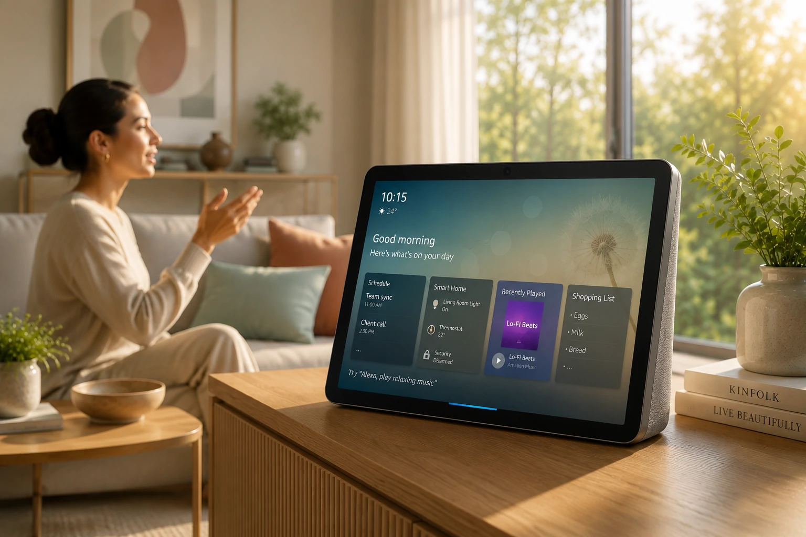
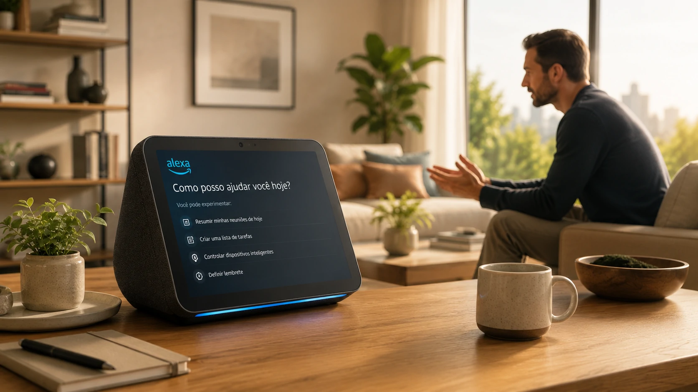

*Os assistentes inteligentes vivem uma nova fase de competição. Depois do avanço de **ChatGPT**, **Gemini** e **Claude**, a **Amazon** acelera a evolução da **Alexa** para transformar sua assistente virtual em uma plataforma baseada em IA generativa. O movimento pode redefinir a disputa pelo controle da interface entre pessoas, empresas e serviços digitais.*

## A Amazon quer transformar a Alexa em um verdadeiro agente de IA

*Nova geração da Alexa aposta em IA generativa para ampliar produtividade e automação.*

A resposta é direta: **a Amazon pretende deixar a Alexa muito mais inteligente do que um simples assistente de voz**.

A empresa trabalha em uma nova arquitetura baseada em **IA generativa**, permitindo que a assistente compreenda contexto, mantenha conversas mais naturais e execute tarefas complexas sem depender de comandos extremamente específicos.

Até então, a Alexa era conhecida principalmente por controlar dispositivos inteligentes, tocar músicas, responder perguntas simples e realizar pequenas automações domésticas. Agora, a estratégia muda completamente.

### Uma disputa além da casa inteligente

A evolução da **Alexa** mostra que a corrida pela IA não acontece apenas entre chatbots.

O objetivo é transformar o assistente em uma plataforma capaz de organizar compromissos, pesquisar informações, realizar compras, controlar serviços conectados e auxiliar usuários em atividades profissionais e pessoais.

Essa estratégia aproxima a Amazon do modelo adotado por concorrentes como **OpenAI**, **Google** e **Anthropic**, que vêm investindo fortemente em agentes inteligentes.

Para empresas interessadas em automação, vale conhecer também o conceito de **AI Orchestration**, tema abordado pelo Notícia Tech:

https://noticiatech.com.br/automacao/o-que-e-ai-orchestration-substitui-disputa-modelos-ia-empresas/

## A nova disputa deixou de ser entre chatbots e passou para os assistentes inteligentes

A resposta é simples: **o mercado agora disputa quem controlará a principal interface entre usuários e a inteligência artificial.**

Não basta oferecer respostas rápidas.

As empresas buscam criar plataformas capazes de executar ações completas, conectar aplicativos, entender preferências do usuário e atuar como verdadeiros agentes digitais.

Essa mudança representa uma nova fase da inteligência artificial, na qual o valor deixa de estar apenas no modelo de linguagem e passa para a capacidade de integrar diferentes serviços em uma única experiência.

### O impacto para consumidores e empresas

Para os consumidores, isso significa interações mais naturais e assistentes capazes de resolver problemas completos.

Já para empresas, a tendência amplia oportunidades de automação, atendimento inteligente e integração entre sistemas corporativos, reduzindo etapas operacionais e aumentando a produtividade.

Esse movimento reforça uma tendência já observada pelo mercado: a IA está deixando de ser apenas uma ferramenta de perguntas e respostas para se tornar uma camada operacional presente em praticamente todos os serviços digitais.

## A estratégia da Amazon vai além da Alexa e mira o futuro da IA

*Amazon amplia seus investimentos em IA para manter competitividade no mercado de assistentes inteligentes.*

A resposta é objetiva: **a nova Alexa faz parte de uma estratégia maior da Amazon para disputar a liderança da inteligência artificial generativa.**

A empresa investe bilhões de dólares em infraestrutura, desenvolvimento de modelos próprios e integração com serviços em nuvem para reduzir a distância em relação a **OpenAI**, **Google** e **Anthropic**.

### IA passa a ser o centro do ecossistema da Amazon

A evolução da Alexa também fortalece outros produtos da companhia.

Ao integrar a assistente com serviços digitais, dispositivos inteligentes, comércio eletrônico e computação em nuvem, a Amazon cria um ecossistema capaz de oferecer experiências cada vez mais personalizadas.

Esse movimento acompanha a tendência do mercado, na qual a inteligência artificial deixa de ser um recurso isolado para se tornar parte da infraestrutura das empresas.

Outro tema relacionado já publicado pelo Notícia Tech mostra como agentes inteligentes estão mudando os negócios:

https://noticiatech.com.br/inteligencia-artificial/agentic-ai-foundation-openai-anthropic-block-padrao-agentes-ia/

## O mercado entra em uma nova fase da corrida pela inteligência artificial

*Concorrência entre Amazon, OpenAI, Google e Anthropic acelera a evolução dos assistentes inteligentes.*

A resposta é clara: **a disputa entre os grandes players deixou de ser apenas pela qualidade do modelo de linguagem e passou a envolver todo o ecossistema de serviços.**

Empresas que conseguirem oferecer experiências completas, capazes de compreender contexto, executar tarefas e integrar diferentes plataformas, terão vantagem competitiva nos próximos anos.

### O que esperar nos próximos meses

A tendência é que a concorrência entre **Amazon**, **OpenAI**, **Google** e **Anthropic** acelere o lançamento de novos recursos para consumidores e empresas.

Além da melhoria na qualidade das respostas, os assistentes inteligentes deverão assumir funções mais complexas, como gerenciamento de agendas, automação de fluxos de trabalho, atendimento ao cliente e integração com sistemas corporativos.

Para gestores e profissionais de tecnologia, acompanhar essa evolução será fundamental para identificar oportunidades de inovação, produtividade e redução de custos.

À medida que a IA se torna a principal interface entre pessoas e serviços digitais, a competição deixa de ser apenas tecnológica e passa a definir quais empresas liderarão a próxima geração da transformação digital. Nesse cenário, a aposta da **Amazon** na nova **Alexa** mostra que a corrida pelos assistentes inteligentes está apenas começando.

---