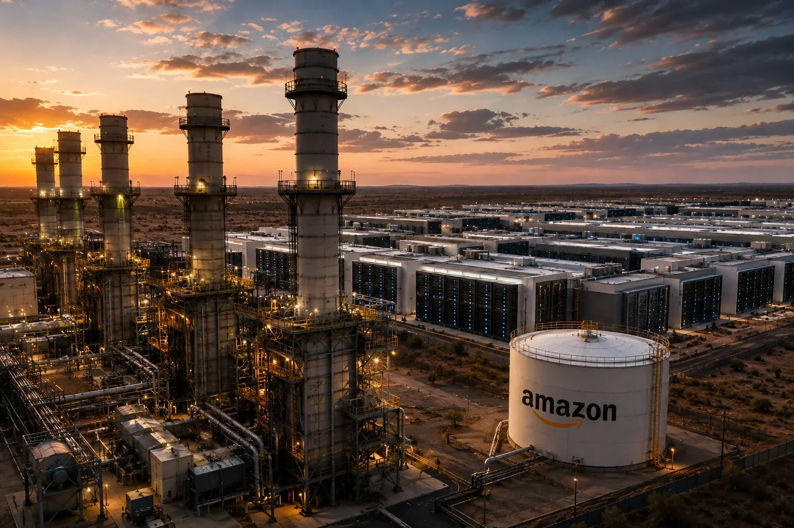
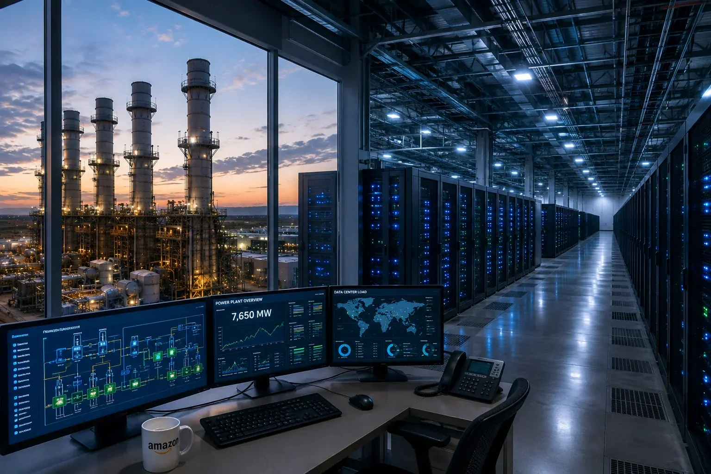
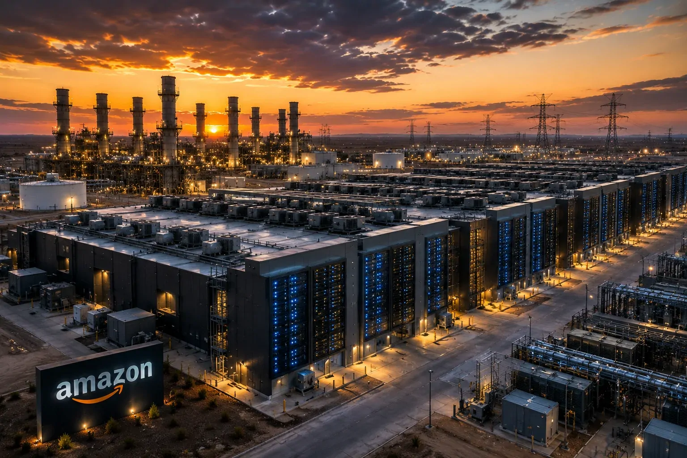

*O avanço da inteligência artificial está criando uma disputa que vai muito além de modelos, chips e aplicativos. Para colocar cada vez mais capacidade computacional em operação, as grandes empresas de tecnologia precisam resolver uma questão mais básica: de onde virá a energia para manter esses sistemas funcionando?*

## A Amazon está construindo uma nova infraestrutura energética para sustentar a expansão da IA

A **Amazon** está associada à construção de uma enorme estrutura de geração de energia em **Pecos County, no Texas**, projetada para fornecer eletricidade a um novo campus de data centers voltado a cargas de inteligência artificial. A capacidade prevista chega a **7,65 gigawatts**, em uma escala que ajuda a dimensionar o tamanho da nova corrida por computação.

O projeto envolve **35 turbinas movidas a gás natural** e foi concebido inicialmente como uma estrutura independente da rede elétrica convencional. A lógica é simples: se a capacidade da rede não cresce na mesma velocidade que a demanda dos data centers, controlar diretamente a geração pode acelerar a implantação de novos clusters de computação.

O movimento revela uma mudança importante na economia da IA. A infraestrutura necessária para executar modelos cada vez maiores não termina no servidor. Ela começa no terreno, passa pela eletricidade e refrigeração e chega aos chips que executam os cálculos.

### Por que a energia virou parte da infraestrutura de IA?

Modelos de inteligência artificial exigem grandes volumes de processamento. Durante o treinamento, sistemas de IA analisam enormes quantidades de dados para ajustar seus parâmetros. Na inferência, quando o modelo responde a uma solicitação, milhares ou milhões de operações podem ser executadas continuamente.

Esses cálculos acontecem principalmente em aceleradores especializados, como **GPUs**, que são processadores capazes de executar muitas operações matemáticas em paralelo. Quanto maior a quantidade de usuários e aplicações, maior tende a ser a necessidade de capacidade computacional.

O problema é que cada novo conjunto de servidores precisa de eletricidade e também de refrigeração. Em data centers de alta densidade, o calor produzido pelos equipamentos se torna uma questão de engenharia tão importante quanto a própria capacidade de processamento.

### O tamanho do projeto mostra a escala da nova corrida

Uma capacidade de **7,65 GW** não representa simplesmente mais um data center. Ela indica uma infraestrutura projetada para uma escala de computação muito elevada.

O número também ajuda a entender por que empresas como **Amazon**, **Microsoft**, **Google** e **Meta** estão tratando infraestrutura como uma questão estratégica. A competição por IA depende de conseguir colocar mais capacidade computacional em funcionamento, e isso exige energia, terrenos, redes, sistemas de refrigeração e capital.

Esse movimento acontece em um momento em que a expansão dos data centers já pressiona sistemas elétricos em diferentes regiões. Estudos recentes apontam que o crescimento da computação voltada à IA está transformando a demanda elétrica dos data centers em uma questão relevante para o planejamento energético.

## O problema escondido por trás dos data centers de IA é a eletricidade

O principal efeito do projeto da **Amazon** não está apenas na quantidade de servidores que poderá alimentar. Ele mostra que a energia está se tornando um dos principais gargalos físicos da expansão da inteligência artificial.

 
*A infraestrutura energética começa a acompanhar a escala dos novos data centers de IA.*

### Por que uma empresa de tecnologia precisa de uma usina própria?

Data centers tradicionais podem depender da infraestrutura elétrica existente. O cenário muda quando uma instalação precisa de uma quantidade extraordinária de energia em um período relativamente curto.

Construir ou ampliar linhas de transmissão, subestações e conexões à rede pode levar tempo. Enquanto isso, empresas de tecnologia estão tentando colocar novos sistemas de IA em operação rapidamente para atender à demanda por computação.

A geração própria aparece, nesse contexto, como uma forma de reduzir parte dessa dependência. No caso da **Amazon**, a estrutura energética associada ao campus permite que a empresa tenha uma fonte de eletricidade diretamente ligada ao projeto de computação.

Esse modelo é conhecido no setor como geração **behind-the-meter**, ou geração atrás do medidor. Na prática, significa produzir eletricidade próxima ao local que a consome, em vez de depender exclusivamente da energia recebida pela rede pública.

### O gás natural ganhou espaço porque entrega escala rapidamente

O uso de gás natural não acontece por acaso. Usinas desse tipo podem ser implantadas em uma escala elevada e fornecer geração contínua, uma característica importante para data centers que precisam operar 24 horas por dia.

Isso cria uma vantagem operacional para projetos que precisam de energia rapidamente, mas também produz uma consequência ambiental relevante.

O projeto da **GW Ranch** recebeu autorização para emissões de até **33 milhões de toneladas de gases de efeito estufa por ano**, segundo os dados de licenciamento divulgados em reportagens sobre a instalação. A quantidade autorizada chamou atenção porque coloca o empreendimento em uma escala de emissões potencialmente superior à de grandes usinas convencionais.

É importante separar capacidade autorizada de emissão efetivamente realizada. O limite de uma licença representa o máximo permitido dentro das condições estabelecidas, não necessariamente o volume que será emitido todos os anos.

Mesmo assim, o número revela a dimensão do conflito que está surgindo entre expansão da computação e descarbonização.

### A corrida pela IA começa a criar uma corrida pela energia

A questão estratégica é maior do que a **Amazon**.

Se empresas de tecnologia continuarem aumentando a capacidade dos modelos e dos serviços de IA, cada novo ciclo de expansão exigirá mais servidores, mais aceleradores, mais armazenamento e mais refrigeração.

Isso cria uma cadeia de dependências:

**mais IA → mais computação → mais data centers → mais eletricidade → mais infraestrutura energética.**

O resultado é que energia passa a fazer parte da estratégia competitiva das empresas de tecnologia.

Essa transformação se conecta diretamente ao que já foi analisado pelo **Notícia Tech** sobre a pressão energética provocada pela expansão dos data centers de IA. A diferença agora é que o problema aparece materializado em um projeto específico, com uma empresa global tentando garantir uma fonte de energia em escala própria.

## A decisão da Amazon expõe uma nova disputa entre velocidade e sustentabilidade

A estratégia da **Amazon** também revela uma tensão que deverá acompanhar o setor nos próximos anos: quanto mais rápido a IA cresce, maior é a pressão para construir infraestrutura antes que soluções energéticas de menor emissão estejam disponíveis em escala suficiente.

O desafio não é apenas ambiental. Ele também é econômico.

Empresas que controlarem energia, terrenos e capacidade de computação poderão ampliar seus serviços de IA mais rapidamente. Já companhias que dependerem de regiões com restrições de rede elétrica poderão enfrentar atrasos para colocar novos data centers em operação.

### Energia pode virar uma vantagem competitiva para empresas de IA

Durante a primeira fase da corrida da IA, o principal diferencial estava nos **modelos**. Depois, os **chips** passaram a ocupar o centro da disputa, especialmente com a corrida por GPUs e aceleradores especializados.

Agora, a infraestrutura física começa a ganhar o mesmo peso.

A própria expansão de empresas como **Anthropic** mostra como investimentos bilionários em infraestrutura se tornaram parte da estratégia competitiva do mercado. O Notícia Tech já analisou como a expansão da infraestrutura de IA está se tornando uma peça central na disputa entre os grandes laboratórios.

O caso da **Amazon** adiciona outra camada: não basta possuir acesso à computação. É preciso garantir a energia necessária para alimentar essa computação em escala.

### O impacto pode chegar aos custos dos serviços de IA

A energia representa apenas uma parte do custo de um data center, mas seu peso pode crescer conforme os sistemas ficam maiores e mais intensivos em computação.

Isso pode afetar diretamente provedores de nuvem e empresas que oferecem modelos de IA por assinatura ou por uso.

Para o cliente corporativo, a consequência pode aparecer de várias maneiras: preços de processamento, disponibilidade de capacidade, localização dos servidores e velocidade para liberar novos recursos de IA.

Por isso, a expansão energética da **Amazon** não é apenas uma história sobre uma usina no Texas. É um sinal de que a economia da IA está começando a depender cada vez mais de ativos físicos que normalmente ficavam fora da discussão sobre software.

## A próxima fase da IA pode ser decidida longe dos laboratórios

A expansão dos data centers está mudando o mapa da indústria de tecnologia. Locais com energia abundante, terrenos disponíveis, conectividade e regras favoráveis podem se tornar mais importantes para a IA do que regiões tradicionalmente associadas ao desenvolvimento de software.

O Texas é um exemplo particularmente relevante dessa transformação.

A região já concentra diversos projetos de grande escala voltados à computação e possui condições favoráveis para expansão energética. Nesse ambiente, a infraestrutura deixa de ser apenas suporte para a tecnologia e passa a determinar onde a tecnologia pode crescer.

Para empresas que dependem de **IA generativa**, isso significa que a próxima vantagem competitiva pode estar menos visível do que parece. Enquanto o mercado acompanha novos modelos e agentes de IA, os maiores investimentos podem estar acontecendo em terrenos, usinas, redes elétricas, sistemas de refrigeração e data centers.

E a decisão da **Amazon** mostra exatamente essa mudança: a corrida pela inteligência artificial está começando a transformar **energia em capacidade computacional**.

A escala do projeto também ajuda a explicar por que a discussão sobre energia não pode mais ser tratada como um problema secundário da indústria de tecnologia.

A expansão dos modelos de inteligência artificial está aproximando duas indústrias que historicamente operavam em ritmos diferentes: computação e energia.

Enquanto empresas de tecnologia conseguem lançar novos modelos e serviços em meses, grandes projetos de geração, transmissão e distribuição de eletricidade normalmente exigem planejamento, licenciamento e construção em prazos muito maiores.

Essa diferença cria um problema estratégico.

Se a capacidade computacional crescer mais rápido do que a infraestrutura elétrica, a disponibilidade de energia pode limitar a expansão da própria inteligência artificial.

## A Amazon está testando um modelo que pode mudar a relação entre data centers e redes elétricas

A Amazon está adotando no Texas um modelo em que o data center pode contar inicialmente com geração própria, reduzindo sua dependência direta da rede elétrica convencional.

 

*A geração própria pode reduzir a dependência imediata da rede elétrica para novos data centers de IA.*

### O que significa operar um data center fora da rede?

Um data center fora da rede, ou *off-grid*, é uma instalação que possui uma fonte própria de geração de energia em vez de depender integralmente da rede elétrica pública.

No caso do projeto da Amazon, a geração será feita por uma infraestrutura própria de grande escala.

Isso não significa que a instalação esteja isolada de toda a infraestrutura energética existente para sempre. O conceito central é que a empresa consegue criar capacidade de geração diretamente associada ao campus de computação, evitando que toda a expansão dependa de uma conexão convencional à rede.

Essa estratégia ganhou importância porque os operadores de data centers estão encontrando dificuldades para obter rapidamente grandes blocos de energia em determinadas regiões.

### Por que isso pode acelerar a construção de data centers?

A conexão de uma instalação que demanda centenas de megawatts ou até gigawatts não é equivalente à ligação de uma empresa convencional.

São necessárias subestações, linhas de transmissão, estudos técnicos e capacidade disponível no sistema elétrico.

Quando essa infraestrutura não existe, um projeto de data center pode ficar pronto fisicamente antes de conseguir energia suficiente para operar.

A geração própria altera essa equação.

Em vez de esperar que toda a rede seja ampliada primeiro, o operador pode construir uma estrutura energética dedicada ao campus.

Esse modelo ajuda a explicar por que a energia está se tornando uma variável competitiva na indústria de IA.

### O movimento não é exclusivo da Amazon

A estratégia também aparece em outros projetos de infraestrutura tecnológica.

Operadores de data centers estão avaliando combinações de geração a gás, energia solar, armazenamento em baterias e outras fontes para reduzir o tempo necessário para colocar grandes instalações em operação.

O próprio projeto GW Ranch foi planejado com uma arquitetura energética que inclui, além da geração a gás autorizada, possibilidades de armazenamento e energia solar.

Isso indica que o futuro dos data centers provavelmente não será definido por uma única fonte de energia.

A tendência é a criação de sistemas híbridos capazes de combinar diferentes fontes para atender a uma carga computacional que precisa operar continuamente.

## O projeto cria um conflito difícil entre crescimento da IA e metas ambientais

O principal problema estratégico da iniciativa da Amazon é que a mesma infraestrutura criada para acelerar a inteligência artificial também pode aumentar significativamente a pegada ambiental da computação.

A autorização concedida ao projeto permite emissões de até **33 milhões de toneladas de gases de efeito estufa por ano**.

Esse número representa um limite regulatório de emissão e não significa que a instalação necessariamente atingirá esse volume todos os anos. Ainda assim, a dimensão da autorização colocou o projeto no centro do debate sobre o custo ambiental da expansão da IA. :contentReference[oaicite:1]{index=1}

### Por que o número de 33 milhões de toneladas chama tanta atenção?

Para entender a dimensão do problema, é preciso separar duas questões.

A primeira é a capacidade de geração de energia.

A segunda é a quantidade de emissões associada à fonte utilizada para produzir essa energia.

Uma usina movida a gás natural transforma combustível em eletricidade por meio de turbinas. O processo produz emissões de dióxido de carbono, além de outros poluentes atmosféricos.

No caso do GW Ranch, a escala planejada é tão elevada que a autorização de emissões chamou atenção nacional.

O projeto, portanto, transforma uma questão normalmente invisível para o usuário de IA em uma variável concreta: cada nova camada de capacidade computacional precisa de uma infraestrutura energética correspondente.

### A Amazon diz que continua perseguindo suas metas ambientais

A existência de uma usina a gás não significa automaticamente que a Amazon tenha abandonado seus compromissos ambientais.

A empresa mantém sua meta de atingir emissões líquidas zero em suas operações até 2040 e afirma estar avaliando alternativas como energia solar, armazenamento em baterias e outras medidas para reduzir o impacto do projeto. 

O ponto de tensão está justamente na velocidade.

A demanda por capacidade de IA cresce agora, enquanto a transição para uma infraestrutura energética de menor emissão precisa acontecer em escala compatível.

Esse intervalo pode levar grandes empresas a recorrer temporariamente a fontes que oferecem disponibilidade e escala mais rapidamente.

### A questão ambiental pode se tornar uma questão financeira

A pressão ambiental não deve ser analisada apenas como um problema de reputação.

Ela pode afetar licenciamento, relacionamento com comunidades, acesso à energia, custo de capital e decisões de localização de novos data centers.

Se determinados mercados começarem a impor restrições mais severas às emissões ou ao consumo de água, empresas de tecnologia terão de incorporar essas variáveis ao planejamento de infraestrutura.

Nesse cenário, eficiência energética deixa de ser apenas uma iniciativa de sustentabilidade.

Ela passa a ser uma estratégia de redução de custos e de expansão operacional.

## Empresas que dependem de IA também sentirão os efeitos dessa corrida por energia

A expansão da infraestrutura energética pode parecer distante de uma empresa que simplesmente utiliza ChatGPT, Copilot, Claude ou outro serviço de IA na rotina.

Mas a relação é direta.

Toda aplicação de inteligência artificial executada na nuvem depende de servidores físicos.

Esses servidores precisam de energia, refrigeração, armazenamento e conectividade.

Quanto maior a utilização desses serviços, maior tende a ser a quantidade de infraestrutura necessária para atender à demanda.

### O que isso muda para empresas?

Para empresas que utilizam IA em atendimento, análise de dados, automação ou desenvolvimento de software, o primeiro efeito provavelmente não será uma mudança imediata na operação.

O impacto tende a aparecer na economia dos serviços de computação.

Provedores de nuvem precisam equilibrar investimentos gigantescos em infraestrutura com a necessidade de oferecer capacidade computacional a preços competitivos.

Se energia, terrenos, refrigeração e conexão à rede ficarem mais caros, parte dessa pressão pode chegar aos preços dos serviços de computação.

Ao mesmo tempo, investimentos maiores podem aumentar a oferta de capacidade e reduzir gargalos em determinadas regiões.

É uma equação complexa:

**mais infraestrutura pode aumentar a oferta de IA, mas construir essa infraestrutura também pode elevar o custo para colocá-la em funcionamento.**

### Profissionais de tecnologia também precisam acompanhar essa mudança

A discussão interessa especialmente a profissionais que trabalham com arquitetura de sistemas, cloud computing, dados e inteligência artificial.

Isso porque a próxima geração de aplicações de IA dependerá cada vez mais de decisões de infraestrutura.

Uma empresa que pretende executar modelos localmente, por exemplo, precisa avaliar não apenas o custo dos aceleradores, mas também consumo energético, refrigeração e capacidade física.

Da mesma forma, empresas que utilizam serviços de nuvem precisam considerar disponibilidade regional, latência, custos de processamento e capacidade dos provedores.

A infraestrutura deixa de ser uma camada invisível.

Ela começa a influenciar diretamente a estratégia tecnológica.

### Usuários finais também podem perceber essa transformação

Para o usuário comum, a mudança pode aparecer de forma indireta.

Serviços de IA podem ganhar novas limitações de capacidade, mudar preços, criar diferentes níveis de assinatura ou direcionar cargas computacionais para regiões onde existe mais energia disponível.

A expansão da infraestrutura também pode permitir que modelos mais sofisticados sejam oferecidos em maior escala.

Ou seja, a mesma corrida energética pode produzir dois efeitos aparentemente opostos:

**mais pressão sobre custos e mais capacidade para serviços de IA.**

O resultado dependerá de como empresas, governos e operadores de energia conseguirem expandir a infraestrutura.

## A corrida por energia pode redefinir onde os próximos data centers de IA serão construídos

A localização de um data center já depende de fatores como conectividade, disponibilidade de terrenos, impostos e proximidade dos usuários.

Com a expansão da IA, a disponibilidade de energia ganha peso ainda maior.

Regiões capazes de fornecer grandes volumes de eletricidade com rapidez podem atrair bilhões de dólares em investimentos.

O Texas se tornou um dos exemplos mais importantes dessa transformação, com dezenas de projetos de data centers e enormes planos de expansão energética. Um levantamento da MUFG aponta o GW Ranch como um dos principais campi planejados no estado, com capacidade de 7,65 GW e projeto dimensionado para mais de 1 milhão de GPUs. 

### A localização da computação pode se tornar uma decisão energética

Durante anos, empresas de tecnologia escolheram regiões de data center principalmente por fatores como conectividade e proximidade de mercados.

Agora, a pergunta começa a mudar:

**onde existe energia suficiente para executar a próxima geração de IA?**

Essa pergunta pode favorecer regiões que possuem grande disponibilidade de geração, terrenos amplos e processos relativamente rápidos para implantação de infraestrutura.

Também pode estimular governos locais a oferecer incentivos para atrair projetos.

O efeito econômico potencial é significativo.

Um grande campus de IA pode movimentar construção civil, geração de energia, equipamentos elétricos, telecomunicações, segurança, refrigeração e serviços especializados.

Por isso, a expansão dos data centers está deixando de ser apenas uma questão do setor de tecnologia.

Ela está se tornando uma questão industrial.

### O risco é criar uma nova concentração de infraestrutura

Existe, porém, um efeito colateral.

Se poucos estados ou regiões conseguirem oferecer energia suficiente para grandes clusters de IA, a infraestrutura poderá se concentrar ainda mais em determinados mercados.

Isso aumenta a importância de políticas públicas relacionadas a transmissão de energia, licenciamento ambiental, água e uso do solo.

Também cria riscos para empresas que dependem excessivamente de uma única região.

A diversificação geográfica dos data centers pode se tornar uma estratégia tão importante quanto a redundância de servidores.

## A próxima vantagem competitiva da IA pode estar na capacidade de produzir energia

A corrida pela inteligência artificial começou com modelos.

Depois passou pelos chips.

Agora está chegando à infraestrutura física que mantém esses sistemas funcionando.

O projeto da Amazon mostra essa mudança de forma particularmente clara porque coloca uma enorme infraestrutura de geração de energia praticamente no mesmo nível estratégico do data center que ela alimentará.

 

*A próxima fase da corrida pela IA exige combinar computação, energia e infraestrutura física em escala industrial.*

### O que pode acontecer nos próximos meses?

A tendência mais importante será a multiplicação de projetos que tentam resolver o gargalo energético de maneiras diferentes.

Algumas empresas devem continuar recorrendo ao gás natural pela velocidade e pela capacidade de geração.

Outras devem acelerar contratos de energia renovável, armazenamento em baterias e projetos nucleares.

Também devem crescer os sistemas híbridos, combinando diferentes fontes para garantir disponibilidade contínua.

O objetivo será sempre o mesmo: colocar capacidade computacional em operação sem esperar anos pela expansão completa da rede elétrica.

### A energia pode se tornar um dos ativos estratégicos da economia da IA

Se essa tendência continuar, a competição entre empresas de tecnologia poderá envolver uma lista muito maior de ativos.

Modelos proprietários continuarão sendo importantes.

GPUs continuarão sendo essenciais.

Dados continuarão sendo estratégicos.

Mas energia, terrenos e capacidade de data center poderão determinar quem consegue transformar esses ativos em serviços disponíveis para milhões de usuários.

É por isso que o projeto da Amazon merece atenção.

O que parece, à primeira vista, apenas uma enorme usina no Texas é, na realidade, um retrato da próxima fase da indústria de inteligência artificial.

A tecnologia digital está encontrando um limite físico.

E, à medida que a IA cresce, a capacidade de produzir e administrar energia pode se tornar tão estratégica quanto a capacidade de desenvolver o próximo grande modelo.

Esse movimento também reforça uma tendência já observada na expansão da infraestrutura de IA: empresas não estão mais competindo apenas pelo melhor software, mas pela capacidade de controlar toda a cadeia necessária para colocar a inteligência artificial em escala.

Para o mercado corporativo, a mensagem é direta: a expansão da IA continuará criando novas oportunidades, mas também dependerá cada vez mais de infraestrutura física, energia e capital.

O próximo capítulo da corrida pela inteligência artificial pode não ser decidido apenas em laboratórios de pesquisa.

Pode ser decidido em usinas, redes elétricas e data centers.

---