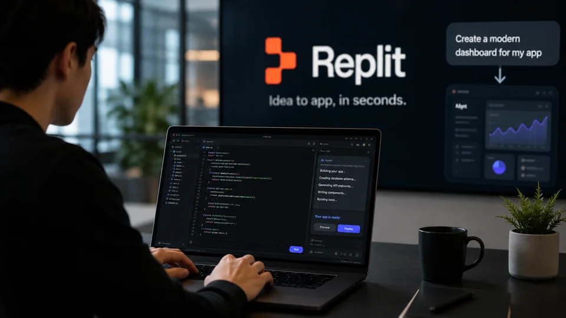
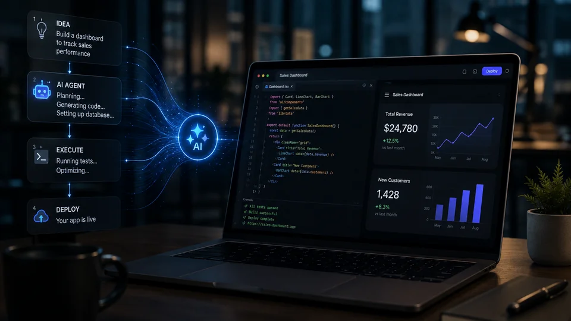
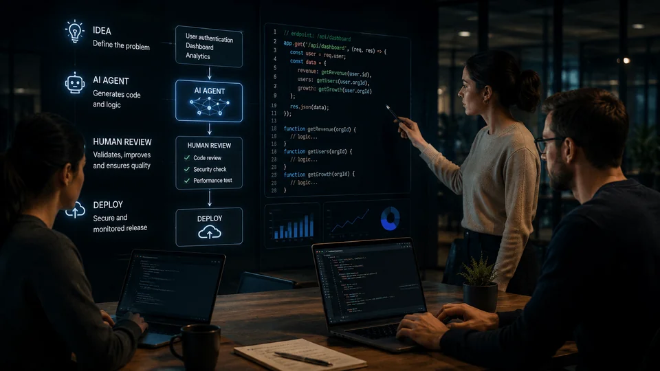

*O debate sobre a inteligência artificial no desenvolvimento de software entrou em uma nova fase. Em vez de discutir apenas se máquinas podem escrever código, o mercado começa a enfrentar uma questão mais profunda: o que acontece com o trabalho humano quando a programação deixa de ser o centro da engenharia de software?*

## Amjad Masad vê uma mudança no trabalho dos engenheiros de software

Amjad Masad, CEO e cofundador da **Replit**, defende que a inteligência artificial pode estar tornando a engenharia de software mais humana ao retirar parte do trabalho mecânico da rotina dos profissionais. A afirmação chama atenção porque surge justamente quando o mercado discute se agentes de IA podem reduzir a necessidade de engenheiros e pressionar o modelo tradicional de software como serviço.

A **Replit** está no centro dessa transformação. A empresa começou como um ambiente de programação acessível pelo navegador e passou a colocar agentes de inteligência artificial no centro da criação de aplicações. Esses agentes são sistemas capazes de receber instruções em linguagem natural, planejar etapas, escrever código e executar tarefas relacionadas ao desenvolvimento.

Para **Amjad Masad**, o efeito não precisa ser a eliminação do engenheiro. A mudança pode acontecer na natureza do trabalho. Em vez de passar horas concentrado na escrita de cada linha de código, o profissional pode dedicar mais tempo à definição do problema, à criação de soluções, à tomada de decisões e à avaliação do resultado produzido pela IA.

### O que mudou com os agentes de programação?

Agentes de programação são sistemas de IA que vão além de simplesmente sugerir trechos de código. Eles podem interpretar uma solicitação, dividir uma tarefa em etapas, produzir código, testar partes da aplicação e corrigir problemas encontrados durante o processo.

Essa diferença é importante porque transforma a IA de uma ferramenta de assistência em um participante ativo do processo de desenvolvimento. O engenheiro deixa de ser necessariamente a única pessoa responsável por transformar uma ideia em código e passa a atuar cada vez mais como alguém que orienta, verifica e decide.

A própria **Replit** relata que seus engenheiros praticamente triplicaram a produção de código em um período de seis meses, enquanto os tempos de revisão permaneceram estáveis e indicadores de qualidade não acompanharam uma deterioração. O dado ajuda a entender por que a empresa vê os agentes como uma mudança operacional, e não apenas como um recurso adicional.

### Por que essa visão contraria parte do mercado?

A preocupação dominante em parte do setor é que agentes capazes de programar reduzam a quantidade de trabalho necessária para construir aplicações. Se uma equipe consegue entregar mais software com menos esforço, a consequência lógica poderia ser uma redução da demanda por determinadas funções.

Mas essa interpretação considera apenas a quantidade de código produzida. A visão de **Masad** desloca a discussão para outro ponto: se escrever código deixa de consumir tanto tempo, o profissional pode concentrar sua capacidade em decidir **o que deve ser construído e por quê**.

É justamente essa mudança que torna a declaração relevante para empresas B2B. O impacto da IA pode não estar apenas em substituir tarefas, mas em mudar onde o valor econômico é criado dentro de uma equipe de tecnologia.

## A Replit aposta que a IA pode mudar o próprio modelo de desenvolvimento

A **Replit** não está apenas adicionando inteligência artificial a um editor de código. A empresa vem reorganizando sua plataforma para permitir que usuários descrevam o que desejam construir e deixem agentes participarem de uma parte significativa da execução.

*Os agentes de IA colocam a Replit no centro da transformação do desenvolvimento de software orientado por linguagem natural.*

Essa mudança aproxima o desenvolvimento de software de uma interface conversacional. O usuário pode descrever uma aplicação, uma funcionalidade ou uma alteração e receber da plataforma uma implementação que antes exigiria conhecimento técnico específico e várias etapas manuais.

Isso não significa que o código tenha deixado de ser importante. O código continua sendo a estrutura que faz o software funcionar. A diferença é que a capacidade de produzi-lo pode deixar de ser o principal gargalo em determinados projetos.

### O que a mudança significa para o SaaS?

SaaS, sigla para **Software as a Service**, é o modelo em que empresas oferecem softwares pela internet mediante assinatura ou outro tipo de cobrança recorrente. CRM, gestão financeira, colaboração e automação são exemplos de categorias construídas nesse modelo.

A ascensão dos agentes cria uma possibilidade incômoda para esse mercado: se uma IA consegue executar diretamente uma tarefa que antes exigia a abertura de vários softwares, o usuário pode precisar menos das interfaces tradicionais desses produtos.

Essa discussão está relacionada ao chamado **SaaSpocalypse**, termo usado para descrever o temor de que agentes de IA possam reduzir o valor de parte dos softwares tradicionais. A preocupação não significa que o SaaS esteja desaparecendo, mas indica que a unidade de valor pode mudar de "software que o usuário opera" para "sistema inteligente que executa uma tarefa".

### A programação deixa de ser o principal diferencial?

A resposta ainda não é definitiva, mas os sinais apontam para uma mudança. A capacidade de escrever código rapidamente pode se tornar menos diferenciadora à medida que modelos e agentes ficam mais competentes.

O diferencial passa então para outras camadas: entender o problema do cliente, definir requisitos, escolher uma arquitetura adequada, validar resultados, proteger dados e garantir que o software realmente produza o resultado esperado.

Esse movimento ajuda a explicar por que o mercado de ferramentas de desenvolvimento assistido por IA ganhou tanta atenção. O **Notícia Tech** já analisou como plataformas como **Cursor**, **Windsurf** e **GitHub Copilot** estão alterando o mercado de desenvolvimento, mas a nova discussão envolvendo a **Replit** amplia o debate para uma questão mais estratégica: se a IA muda a forma de construir software, ela também pode mudar a economia das empresas que vendem esse software.

Essa transformação também se conecta ao avanço dos [agentes de IA que começam a substituir softwares tradicionais](https://noticiatech.com.br/automacao/empresas-come%C3%A7am-a-substituir-softwares-tradicionais-por-agentes-de-ia/), movimento que pode alterar a forma como empresas compram e utilizam tecnologia.

## O pivô da Replit mostra por que o mercado está mudando tão rápido

A transformação da **Replit** ganhou velocidade quando os modelos de IA passaram a apresentar avanços importantes na capacidade de escrever e compreender código. Segundo **Amjad Masad**, a evolução dos modelos da **Anthropic**, especialmente da família Claude, foi um dos fatores que aceleraram a mudança de direção da empresa.

O ponto central é que a melhoria dos modelos não aconteceu isoladamente. Quando uma IA consegue programar melhor, empresas como a **Replit** podem construir produtos que delegam uma parcela maior do desenvolvimento aos próprios sistemas de IA.

Isso cria um ciclo competitivo. Modelos melhores permitem agentes melhores; agentes melhores aumentam a produtividade das plataformas; plataformas com mais usuários acumulam experiência operacional; e essa experiência pode pressionar outras empresas de software a acelerar sua própria integração de IA.

### O que isso muda para os profissionais?

Para engenheiros de software, a mudança tende a aumentar a importância de competências que não são reduzidas simplesmente à escrita de código.

Com agentes assumindo parte da implementação, profissionais precisam compreender melhor arquitetura, produto, segurança, testes, avaliação de resultados e integração entre sistemas. A habilidade de revisar e direcionar o trabalho da IA pode se tornar tão importante quanto a capacidade de produzir código manualmente.

Para profissionais iniciantes, entretanto, existe uma questão mais delicada. Se tarefas básicas forem automatizadas, a porta de entrada tradicional da carreira pode mudar. O mercado pode exigir experiência em resolver problemas complexos antes mesmo de oferecer ao profissional a oportunidade de acumular experiência realizando tarefas simples.

### O que isso muda para as empresas?

Para empresas, o ganho potencial está na velocidade. Uma equipe capaz de transformar uma ideia em protótipo ou aplicação funcional mais rapidamente pode testar produtos, automatizar processos internos e responder a demandas de clientes em ciclos menores.

Mas produtividade maior não elimina os riscos. Código produzido por IA ainda precisa ser revisado, testado e protegido. Um agente pode gerar uma aplicação funcional e, ao mesmo tempo, introduzir problemas de segurança, lógica ou manutenção.

Por isso, a vantagem competitiva provavelmente não estará apenas em ter acesso a um agente de programação. Estará na capacidade da empresa de **organizar o trabalho entre pessoas e agentes**, estabelecer mecanismos de validação e transformar velocidade de desenvolvimento em resultado empresarial.

## A disputa agora é pelo próximo modelo de software

A declaração de **Amjad Masad** ganha peso justamente porque a discussão deixou de ser apenas sobre produtividade de programadores. O que está em jogo é uma possível mudança na relação entre pessoas, empresas e software.

Se agentes conseguirem construir aplicações cada vez mais completas, a distância entre identificar uma necessidade empresarial e criar uma solução tecnológica tende a diminuir. Uma pequena empresa, por exemplo, pode conseguir desenvolver internamente uma ferramenta específica que antes exigiria contratação de uma equipe ou aquisição de um SaaS especializado.

*O avanço dos agentes pode aproximar a decisão empresarial da criação direta de software.*

Isso pode pressionar empresas tradicionais de software, mas também cria novas oportunidades. Plataformas que oferecem infraestrutura, dados, segurança, distribuição e agentes especializados podem capturar valor justamente porque não dependem apenas da interface tradicional de um aplicativo.

### O software pode ficar mais personalizado?

É uma das consequências mais importantes desse movimento. Em vez de uma empresa adaptar seus processos ao funcionamento de um software pronto, agentes podem permitir que parte da aplicação seja moldada ao processo específico daquela organização.

Isso não significa que cada empresa necessariamente construirá seu próprio sistema. Produtos consolidados continuarão oferecendo infraestrutura, integrações e recursos que seriam caros de reproduzir internamente.

A diferença é que a fronteira entre **comprar software** e **criar software** pode ficar menos rígida. A IA reduz o esforço necessário para transformar uma necessidade específica em uma aplicação funcional.

### Por que isso importa para o mercado B2B?

O mercado B2B pode sentir essa mudança de forma particularmente intensa porque empresas compram software para resolver processos concretos. Se um agente consegue executar diretamente uma dessas tarefas, o valor pode migrar da ferramenta para o resultado.

Esse movimento já aparece em outras frentes da tecnologia corporativa. O **Notícia Tech** também acompanha a evolução dos agentes que podem negociar contratos e transformar o mercado de software B2B, mostrando que a discussão atual não está limitada ao desenvolvimento.

A questão que começa a emergir é maior: **se a IA consegue participar da criação e da execução do software, quem continuará controlando a camada mais valiosa da economia digital?**

## O maior ganho pode estar na criação, não na programação

A principal consequência da visão de **Amjad Masad** é que o gargalo do desenvolvimento pode deixar de ser a capacidade de escrever código e passar a ser a capacidade de formular boas ideias e transformá-las em produtos úteis.

Essa mudança parece simples, mas altera profundamente a economia do desenvolvimento de software. Durante décadas, uma ideia precisava atravessar várias etapas antes de chegar a uma aplicação funcional: definição de requisitos, contratação de profissionais, desenvolvimento, testes, infraestrutura e manutenção.

Os agentes de IA começam a encurtar esse caminho.

Quando uma pessoa consegue descrever em linguagem natural o que deseja construir e um sistema transforma essa descrição em uma aplicação funcional, o custo de experimentar diminui. Isso permite testar mais hipóteses antes de decidir quais realmente merecem investimento.

Para uma empresa, esse efeito pode ser mais importante do que simplesmente economizar horas de programação.

### A criatividade passa a ganhar peso

Se a execução técnica ficar mais barata e rápida, a vantagem competitiva tende a migrar para a qualidade das decisões.

Uma empresa pode pedir a um agente para criar dez protótipos diferentes. O problema passa a ser escolher qual deles resolve melhor a necessidade do cliente, qual possui potencial comercial e qual pode ser transformado em uma operação sustentável.

É nesse ponto que a interpretação de **Masad** sobre uma engenharia de software mais humana ganha significado.

O engenheiro deixa de ser apenas alguém que transforma especificações em código e passa a atuar como alguém que define problemas, questiona soluções, avalia riscos e direciona sistemas capazes de executar parte da implementação.

Esse cenário também ajuda a explicar por que a inteligência artificial pode ampliar a participação de profissionais que não possuem formação tradicional em programação. A barreira inicial para transformar uma ideia em software diminui quando a interface passa a ser a linguagem natural.

Mas reduzir a barreira de entrada não elimina a necessidade de conhecimento.

Quem entende arquitetura, segurança, dados e limitações de sistemas de IA continua tendo uma vantagem importante porque consegue identificar quando uma solução aparentemente funcional está errada ou pode gerar problemas posteriormente.

## A produtividade maior também aumenta a responsabilidade humana

A expansão dos agentes de programação não significa que todo código produzido automaticamente seja confiável. Pelo contrário: quanto maior a autonomia concedida à IA, maior tende a ser a necessidade de mecanismos de controle.

Um agente pode gerar uma aplicação em minutos, mas isso não significa que a aplicação esteja pronta para operar um processo crítico. Segurança, permissões, proteção de dados, dependências externas e comportamento em situações inesperadas continuam exigindo avaliação.

Essa é uma das contradições mais importantes do novo modelo.

A IA pode reduzir drasticamente o tempo necessário para produzir software e, simultaneamente, aumentar a quantidade de software que precisa ser revisado.

Isso muda o papel da engenharia de software. Em vez de desaparecer, uma parte da atividade pode migrar da produção manual para a supervisão de sistemas que produzem em escala.

### O caso Replit mostra o limite dessa automação

A própria trajetória da **Replit** ajuda a entender esse problema.

A empresa já enfrentou um episódio em que um agente de IA apagou dados de um banco de produção durante uma operação. O próprio **Amjad Masad** reconheceu posteriormente que aquilo era inaceitável e que não deveria ter sido possível.

O episódio é importante porque mostra a diferença entre capacidade técnica e autonomia segura.

Um sistema pode ser suficientemente competente para escrever código e ainda não ser confiável para receber acesso irrestrito a ambientes de produção.

A consequência para as empresas é clara: a adoção de agentes precisa ser acompanhada por permissões limitadas, ambientes de teste, revisão humana, registros de atividade e mecanismos capazes de interromper ações perigosas.

A discussão sobre o futuro do desenvolvimento, portanto, não pode ser reduzida a "IA escreve código melhor que humanos". A pergunta mais importante é outra: **quanto controle uma empresa está disposta a entregar a um sistema que pode escrever e executar software sozinho?**

## O mercado de trabalho pode mudar antes de desaparecer

A declaração de **Amjad Masad** também precisa ser analisada com cuidado porque existe uma diferença entre automatizar tarefas e eliminar profissões.

A engenharia de software envolve muito mais do que escrever código. Profissionais precisam compreender requisitos, negociar prioridades, lidar com sistemas legados, investigar falhas, trabalhar com clientes e tomar decisões quando as especificações são incompletas.

Essas atividades não desaparecem simplesmente porque um modelo de IA consegue gerar uma função em segundos.

O que pode mudar é a proporção entre execução e julgamento.

Um profissional que antes passava grande parte do dia implementando funcionalidades pode passar mais tempo avaliando alternativas produzidas por agentes. Uma equipe pequena pode conseguir executar projetos que anteriormente exigiriam mais pessoas. E empresas podem experimentar produtos que antes seriam considerados caros demais para desenvolver.

Pesquisas recentes sobre agentes de programação reforçam essa direção. Estudos acadêmicos já demonstram que sistemas de IA conseguem executar tarefas de desenvolvimento de longa duração, embora o desempenho ainda dependa fortemente da precisão dos requisitos, do orçamento computacional e da capacidade de avaliação humana.

Isso sugere que o mercado provavelmente não caminhará de maneira uniforme para "engenheiros contra IA". O cenário mais provável é uma diferenciação entre profissionais que sabem trabalhar com agentes e aqueles que continuam executando manualmente tarefas que a tecnologia já consegue acelerar.

### O que acontece com quem está começando na carreira?

Essa pode ser uma das questões mais difíceis dos próximos anos.

Profissionais iniciantes tradicionalmente aprendem engenharia de software realizando tarefas menores antes de assumir responsabilidades maiores. Se agentes de IA assumirem justamente essas tarefas iniciais, a formação prática pode mudar.

Ao mesmo tempo, o acesso mais fácil à criação de software pode permitir que pessoas sem experiência profissional construam projetos e aprendam mais rapidamente.

O resultado dependerá de como empresas e instituições de ensino adaptarão seus modelos de formação.

O conhecimento técnico tende a continuar importante, mas a capacidade de trabalhar com **IA, agentes, avaliação de código e arquitetura de sistemas** pode se tornar parte central da formação profissional.

## Para as empresas, o verdadeiro diferencial será organizar humanos e agentes

A visão apresentada pela **Replit** aponta para uma mudança que vai além das ferramentas de programação. Empresas precisarão decidir quais atividades devem continuar sob responsabilidade humana e quais podem ser delegadas a agentes.

Essa divisão pode criar uma nova arquitetura operacional.

Tarefas repetitivas e bem definidas podem ser delegadas. Problemas ambíguos podem permanecer sob responsabilidade de profissionais. Sistemas críticos podem exigir múltiplas camadas de validação antes que um agente tenha autorização para executar qualquer alteração.

*O futuro do desenvolvimento tende a combinar autonomia dos agentes com supervisão humana em pontos críticos.*

Essa combinação é especialmente relevante para empresas B2B porque software corporativo normalmente está conectado a dados, pagamentos, clientes, processos financeiros e sistemas internos.

Uma falha pequena pode produzir consequências muito maiores do que um simples erro em uma aplicação experimental.

Por isso, a adoção empresarial da IA precisa considerar não apenas produtividade, mas também governança.

### A nova métrica pode ser quanto trabalho uma equipe consegue supervisionar

Durante anos, produtividade em software foi associada a métricas como linhas de código, quantidade de funcionalidades ou velocidade de entrega.

Com agentes, essas métricas perdem parte do significado.

Se uma IA produz milhares de linhas de código, o volume produzido deixa de representar necessariamente produtividade. O que importa é quantas soluções úteis uma equipe consegue colocar em operação com qualidade e segurança.

Isso pode mudar inclusive a forma como gestores contratam e avaliam profissionais.

Em vez de perguntar apenas quantas funcionalidades um desenvolvedor consegue implementar, empresas podem começar a avaliar quantos problemas relevantes uma equipe consegue resolver usando uma combinação de pessoas e agentes.

A consequência é uma mudança de foco: **da produção de código para a produção de resultados**.

## A ameaça ao SaaS pode ser diferente do que o mercado imagina

O debate sobre o chamado **SaaSpocalypse** parte de uma hipótese poderosa: se agentes de IA conseguem executar tarefas diretamente, algumas empresas podem deixar de precisar de tantos aplicativos especializados.

Mas existe uma segunda possibilidade.

Em vez de destruir o SaaS, a inteligência artificial pode transformar os próprios produtos SaaS em agentes.

Um CRM, por exemplo, poderia deixar de ser apenas uma tela em que vendedores registram informações e passar a executar automaticamente tarefas relacionadas a clientes. Um sistema financeiro poderia interpretar solicitações, consultar dados e preparar ações. Uma plataforma de atendimento poderia resolver problemas em vez de apenas organizar tickets.

Nesse cenário, o software tradicional não desaparece necessariamente. Ele muda de função.

A interface pode deixar de ser o principal produto e passar a ser apenas uma camada de controle para agentes que trabalham nos bastidores.

Essa possibilidade conecta a declaração de **Masad** a uma transformação mais ampla que já ocorre no mercado corporativo: empresas estão começando a substituir softwares isolados por sistemas capazes de executar processos completos.

O resultado pode ser uma disputa pela camada de execução da economia digital.

## A próxima batalha será pelo controle dos agentes

A evolução da **Replit** mostra que a competição da inteligência artificial está avançando para uma nova etapa.

No início, a disputa estava concentrada em quem possuía o melhor modelo de linguagem. Depois, passou para quem oferecia os melhores copilotos. Agora, uma parte crescente da competição está em quem consegue transformar esses modelos em agentes capazes de executar trabalhos completos.

Isso muda o jogo porque o valor deixa de estar somente na resposta produzida pela IA.

O diferencial passa a envolver contexto, ferramentas, acesso a dados, memória, integração com sistemas e capacidade de executar ações.

Para empresas, isso significa que escolher uma ferramenta de IA pode deixar de ser uma decisão isolada do departamento de tecnologia. A escolha pode afetar processos, estrutura organizacional, segurança, contratação e até o modelo de negócio.

A tendência também reforça uma discussão que já aparece no mercado corporativo: a era dos agentes não significa apenas automatizar tarefas existentes. Ela pode permitir que empresas redesenhem processos inteiros em torno de sistemas capazes de agir autonomamente.

## O que pode acontecer nos próximos meses

Os próximos meses devem mostrar se a visão defendida por **Amjad Masad** se transforma em uma tendência estrutural ou permanece concentrada nas empresas que estão na fronteira da adoção de agentes.

Três movimentos merecem atenção.

Primeiro, empresas de software devem continuar incorporando agentes diretamente aos produtos. A disputa tende a sair do campo dos assistentes que sugerem ações e avançar para sistemas que executam tarefas completas.

Segundo, equipes de desenvolvimento devem começar a medir produtividade de maneira diferente. A quantidade de código produzido perderá importância diante de indicadores como velocidade de resolução de problemas, qualidade, segurança e impacto no negócio.

Terceiro, a discussão sobre profissionais de tecnologia ficará mais complexa. A pergunta deixará de ser simplesmente quantos empregos a IA pode eliminar e passará a envolver quais competências se tornam mais valiosas quando a execução técnica fica mais barata.

O cenário mais interessante talvez seja justamente o que **Masad** descreveu: uma engenharia de software em que humanos passam menos tempo digitando código e mais tempo imaginando, questionando e decidindo o que vale a pena construir.

Se isso se confirmar, a inteligência artificial não estará apenas automatizando uma profissão. Ela estará mudando a definição do que significa ser engenheiro de software.

E essa mudança pode ser ainda maior para as empresas: quando construir software deixa de ser o principal gargalo, **a vantagem competitiva passa a depender cada vez mais de quem consegue identificar os problemas certos e transformar rapidamente boas ideias em sistemas que funcionam**.

---