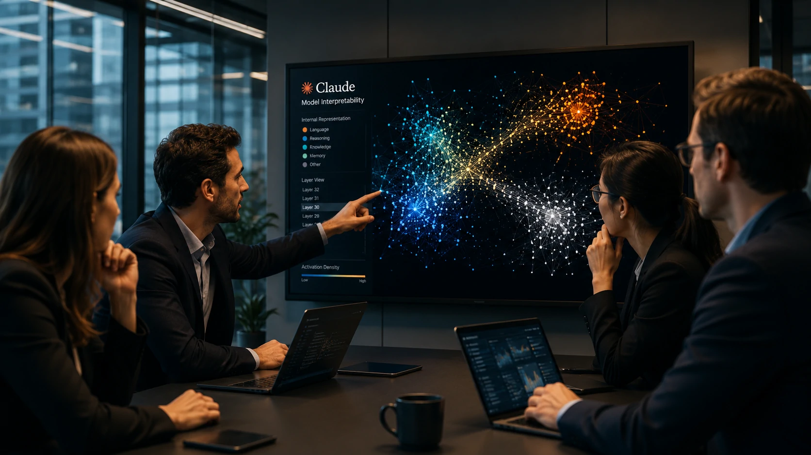
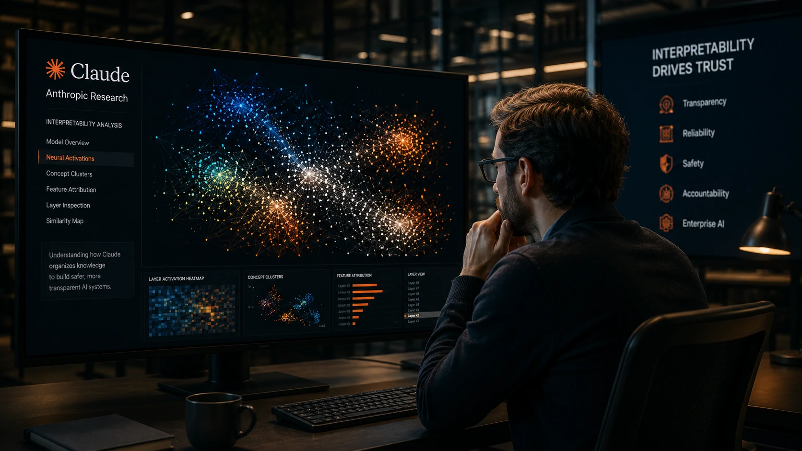

*Durante anos, empresas adotaram modelos de inteligência artificial extremamente poderosos sem compreender completamente como eles chegavam às próprias respostas. Agora, uma nova pesquisa da **Anthropic** pode representar um dos avanços mais importantes na tentativa de transformar essa realidade.*

*Mais do que alimentar debates sobre uma suposta consciência artificial, o estudo sinaliza uma mudança estratégica: tornar grandes modelos como o **Claude** significativamente mais transparentes. Para empresas, governos e setores regulados, essa pode ser uma das evoluções mais relevantes da IA generativa em 2026.*

## A pesquisa da Anthropic representa um avanço na interpretabilidade da inteligência artificial

*Estudo busca revelar como o Claude organiza conhecimento internamente para tornar decisões mais compreensíveis.*

Durante décadas, um dos maiores desafios da **Inteligência Artificial** foi a chamada "caixa-preta": modelos extremamente eficientes, mas cujo processo interno permanecia praticamente invisível para pesquisadores e usuários.

A nova pesquisa da **Anthropic** procura reduzir justamente essa limitação ao analisar como o **Claude** estrutura conceitos, relações e padrões dentro de sua arquitetura. Em vez de apenas observar entradas e saídas, os pesquisadores passaram a investigar os mecanismos internos responsáveis pelo comportamento do modelo.

### O foco não é consciência, mas transparência

Grande parte das manchetes destacou possíveis semelhanças entre os padrões identificados e teorias utilizadas no estudo da consciência humana. No entanto, essa não é a principal conclusão da pesquisa.

O verdadeiro avanço está na possibilidade de compreender melhor como o modelo representa informações internamente, permitindo analisar por que determinadas respostas são produzidas e reduzindo a dependência de processos totalmente opacos.

### O mercado passa a olhar além da precisão

Nos últimos anos, a corrida entre **OpenAI**, **Google**, **Meta**, **Microsoft** e **Anthropic** concentrou-se principalmente em desempenho, velocidade e qualidade das respostas.

Agora, um novo fator competitivo começa a ganhar importância: explicar como essas respostas são construídas. Essa mudança pode influenciar diretamente a adoção corporativa da IA nos próximos anos.

Para entender outra frente da estratégia da empresa, veja também como o **Claude** vem ampliando sua atuação em pesquisa científica:

https://noticiatech.com.br/ferramentas/claude-science-anthropic-ia-pesquisa-cientifica/

---

## Entender como a IA toma decisões pode mudar a adoção empresarial

*Maior transparência pode acelerar a confiança das empresas na adoção de inteligência artificial.*

Para organizações, compreender como uma IA produz respostas pode ser tão importante quanto a qualidade dessas respostas.

Empresas que utilizam **IA Generativa** em atendimento, análise financeira, saúde, jurídico ou automação precisam justificar decisões, identificar possíveis falhas e atender exigências regulatórias cada vez mais rigorosas.

### Transparência reduz riscos corporativos

Quanto maior a capacidade de interpretar o comportamento do modelo, maiores tendem a ser os benefícios para auditorias, conformidade regulatória e governança de dados.

Essa evolução também pode reduzir receios relacionados às chamadas "alucinações", permitindo identificar padrões de comportamento antes que eles causem impactos operacionais.

### Um novo diferencial competitivo entre as grandes desenvolvedoras

Até recentemente, a competição girava principalmente em torno de modelos maiores e respostas mais rápidas.

Com pesquisas como esta, a **Anthropic** busca construir outro diferencial: confiança.

Se esse caminho ganhar força, a disputa entre **Claude**, **ChatGPT** e **Gemini** poderá deixar de ser apenas uma corrida por desempenho e passar a incluir transparência, interpretabilidade e segurança como fatores decisivos para clientes corporativos.

Esse movimento complementa outra transformação recente do mercado, marcada pela evolução da memória permanente dos modelos de IA:

https://noticiatech.com.br/inteligencia-artificial/memoria-chatgpt-gemini-claude-disputa-ia-empresas/

## A interpretabilidade pode redefinir o futuro da inteligência artificial corporativa

*Modelos mais interpretáveis podem acelerar a próxima geração de aplicações corporativas baseadas em IA.*

O avanço apresentado pela **Anthropic** não resolve todos os desafios da **Inteligência Artificial**, mas estabelece um novo objetivo para toda a indústria: desenvolver modelos que sejam poderosos e, ao mesmo tempo, compreensíveis.

Para empresas, isso representa uma mudança importante. Quanto maior a capacidade de explicar decisões tomadas por um sistema de IA, maior tende a ser sua utilização em processos críticos, setores regulados e operações estratégicas.

### Reguladores e empresas caminham na mesma direção

Nos últimos meses, governos e órgãos reguladores intensificaram discussões sobre transparência, responsabilidade e governança da IA.

Nesse contexto, pesquisas de interpretabilidade deixam de ser apenas um tema acadêmico e passam a influenciar diretamente o desenvolvimento de produtos comerciais.

A tendência também reforça uma mudança observada em todo o mercado: a corrida pela liderança da IA corporativa não depende apenas de lançar modelos maiores, mas de construir plataformas confiáveis para uso empresarial.

Essa evolução acompanha outro movimento importante da **Anthropic**, que recentemente ampliou a presença do **Claude** em ambientes corporativos por meio da infraestrutura da **Microsoft Azure**:

https://noticiatech.com.br/inteligencia-artificial/anthropic-claude-microsoft-azure-gpus-nvidia-gb300/

### Transparência pode se tornar vantagem competitiva

Até pouco tempo, desempenho era praticamente o único indicador utilizado para comparar modelos de IA.

Nos próximos anos, critérios como auditabilidade, segurança, rastreabilidade e interpretabilidade tendem a ganhar peso semelhante na escolha das plataformas utilizadas pelas empresas.

Isso pode beneficiar organizações que precisam cumprir requisitos de conformidade, proteger dados sensíveis e justificar decisões tomadas com auxílio da inteligência artificial.

---

## O maior impacto da pesquisa está na confiança e não na ideia de consciência artificial

A principal contribuição do estudo não é sugerir que o **Claude** desenvolveu consciência, mas demonstrar que pesquisadores começam a compreender, de maneira muito mais detalhada, como grandes modelos organizam conhecimento internamente.

Essa diferença é fundamental.

Enquanto manchetes focadas em "consciência artificial" despertam curiosidade momentânea, compreender o funcionamento interno dos modelos pode produzir efeitos duradouros para todo o mercado de IA.

### O mercado entra em uma nova fase

A primeira etapa da corrida da IA foi construir modelos capazes de conversar.

A segunda consistiu em criar agentes capazes de executar tarefas complexas.

Agora, a terceira etapa começa a ganhar forma: tornar esses sistemas suficientemente transparentes para que empresas, governos e usuários possam confiar neles em atividades cada vez mais críticas.

Se essa tendência continuar, a próxima vantagem competitiva das grandes desenvolvedoras poderá não estar apenas em criar modelos mais inteligentes, mas em produzir modelos que consigam explicar, com maior clareza, como chegaram às próprias conclusões.

Nesse cenário, a pesquisa da **Anthropic** representa menos uma discussão filosófica sobre consciência e mais um sinal concreto de maturidade da inteligência artificial corporativa. É justamente esse tipo de avanço que pode acelerar a adoção da IA em larga escala, fortalecer a confiança das empresas e definir os próximos líderes do setor.

---