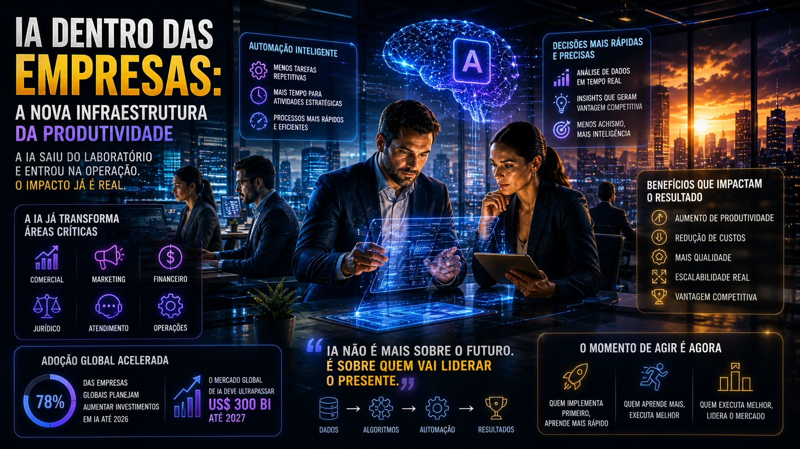

A disputa pela liderança da inteligência artificial entrou em uma nova fase — e agora o campo de batalha não é mais apenas tecnológico.

É corporativo.

A Anthropic, uma das empresas mais agressivas do setor de IA generativa, acelera sua expansão global em um momento em que empresas de todos os portes começam a incorporar inteligência artificial em operações críticas.

O movimento é um sinal claro:

a próxima guerra da IA será vencida dentro das empresas.

E isso muda completamente o jogo para negócios brasileiros.

## A nova fase da corrida da IA

Nos últimos anos, a corrida da IA parecia concentrada em quem tinha o modelo mais poderoso.

Hoje isso mudou.

O mercado começa a entender que performance pura não é suficiente.

O que importa agora é:

integração operacional  
redução de custos  
automação real  
segurança empresarial  
escalabilidade

A Anthropic vem posicionando seu modelo Claude como uma alternativa fortemente orientada ao ambiente corporativo.

Isso inclui:

grandes contextos de análise  
processamento documental  
automação de fluxos internos  
suporte empresarial avançado

O foco não é apenas competir com GPT.

É disputar orçamento corporativo.

## A IA saiu do departamento de inovação

Muitas empresas ainda tratam IA como experimento.

Mas o mercado já mudou.

A inteligência artificial está migrando do laboratório para áreas como:

comercial  
marketing  
financeiro  
jurídico  
atendimento  
operações

Na prática, isso significa uma mudança estrutural.

IA deixou de ser inovação.

Virou infraestrutura.

E isso pressiona empresas brasileiras.

Porque a concorrência pode ganhar eficiência operacional antes.

## Por que a Anthropic está focando empresas

Existe um motivo estratégico.

O mercado enterprise é onde está o dinheiro recorrente.

Enquanto usuários individuais geram escala, empresas geram previsibilidade financeira.

No ambiente B2B, IA pode ser aplicada em:

análise contratual  
resumo de reuniões  
resposta automática a clientes  
análise de dados  
gestão de conhecimento  
criação de processos internos

Isso gera ROI direto.

E ROI vende.

Por isso o foco das gigantes mudou.

## O impacto no Brasil

O Brasil está acelerando sua adoção de IA.

Segundo a IDC, os investimentos em inteligência artificial no país devem alcançar US$ 3,4 bilhões em 2026.

Esse crescimento mostra uma mudança importante:

empresas brasileiras deixaram de perguntar “se” vão usar IA.

Agora perguntam “como”.

E isso cria um novo cenário competitivo.

Quem implementar primeiro pode ganhar:

mais produtividade  
menos custo  
mais velocidade  
mais previsibilidade

## Claude, GPT e Gemini: a disputa real

O mercado costuma comparar modelos pela capacidade técnica.

Mas a disputa real está em outros critérios.

Empresas avaliam:

integração com sistemas  
privacidade  
compliance  
governança  
facilidade operacional  
custos de escala

Nesse cenário:

Claude cresce em contexto e segurança  
GPT lidera em ecossistema  
Gemini avança em integração com Google Workspace

A escolha deixou de ser técnica.

Virou estratégica.

## O novo risco para empresas: ficar para trás

Toda nova tecnologia cria uma curva de vantagem.

Quem entra cedo aprende antes.

Quem entra tarde paga mais caro.

Na IA isso é ainda mais agressivo.

Porque aprendizado operacional gera efeito composto.

Uma empresa que implementa IA hoje pode acumular meses ou anos de eficiência antes da concorrência.

Isso impacta:

tempo de resposta  
margem  
custos  
retenção  
crescimento

## Como empresas brasileiras devem reagir

O momento ideal não é esperar maturidade total.

É começar com aplicações práticas.

### 1. Mapear gargalos operacionais

Onde há repetição, existe oportunidade de IA.

### 2. Criar política de uso interno

Evitar Shadow AI e proteger dados.

### 3. Escolher stack estratégica

A ferramenta precisa se encaixar na operação.

### 4. Treinar equipes

Tecnologia sem adoção interna falha.

### 5. Medir ROI rapidamente

IA precisa provar valor cedo.

## A disputa pela IA corporativa já começou

A expansão acelerada da Anthropic mostra algo importante:

a guerra da IA não será vencida apenas pelo melhor modelo.

Será vencida por quem conseguir entrar mais profundamente na rotina das empresas.

E isso vale para qualquer negócio.

Porque enquanto gigantes disputam espaço tecnológico, empresas disputam eficiência.

E eficiência, no fim, continua sendo uma das moedas mais valiosas do mercado.