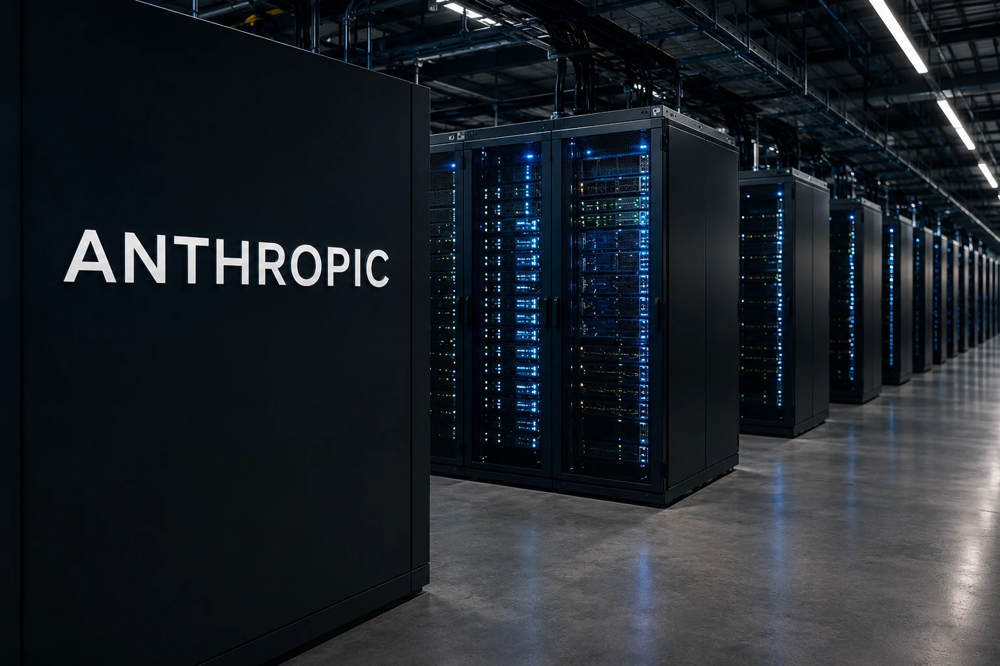
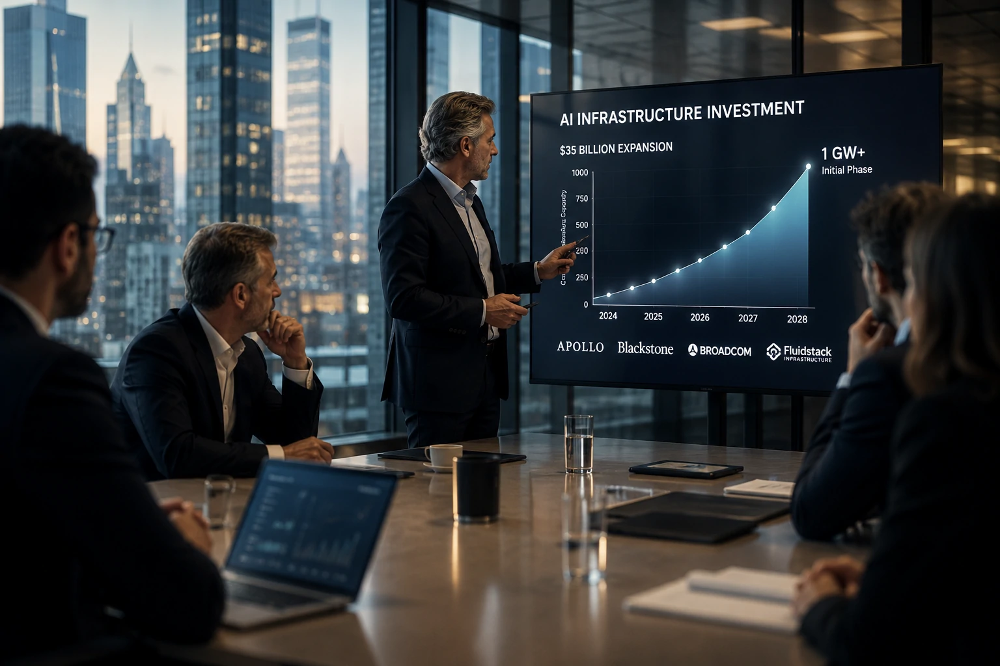
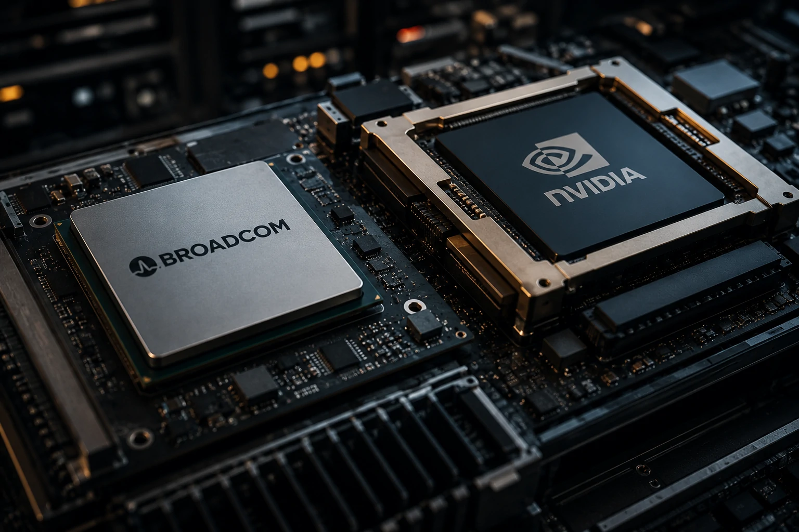

*A corrida da inteligência artificial está entrando em uma nova fase. Depois de anos focados na evolução dos modelos, as empresas agora disputam um recurso ainda mais escasso: infraestrutura computacional. O anúncio da expansão de aproximadamente US$ 35 bilhões da **Anthropic** mostra que a próxima batalha da IA será definida pela capacidade de construir, financiar e operar data centers, chips e redes em escala global.*

## Anthropic aposta na infraestrutura para sustentar o crescimento da IA

*Data centers e capacidade computacional tornaram-se ativos estratégicos para a nova economia da inteligência artificial.*

A **Anthropic** anunciou uma iniciativa de aproximadamente US$ 35 bilhões voltada para ampliar sua capacidade computacional por meio de uma parceria envolvendo **Apollo**, **Blackstone**, **Broadcom** e a operadora de infraestrutura **Fluidstack**.

O objetivo é adicionar inicialmente um gigawatt de capacidade computacional, criando uma das maiores expansões de infraestrutura já associadas a um laboratório de inteligência artificial.

A movimentação reforça uma mudança importante na indústria: o diferencial competitivo não está mais apenas nos modelos, mas na capacidade de executá-los em larga escala.

### O fim da vantagem baseada apenas em modelos

Durante os primeiros anos da IA generativa, a competição estava concentrada na qualidade dos modelos.

Empresas como **OpenAI**, **Anthropic**, **Google** e **Meta** disputavam avanços em raciocínio, contexto e desempenho.

Agora, o desafio passa a ser garantir recursos suficientes para sustentar a demanda crescente por inferência e treinamento.

### Infraestrutura como vantagem competitiva

A escassez global de capacidade computacional transformou data centers, energia e chips em ativos estratégicos.

Empresas que conseguirem garantir esses recursos poderão acelerar lançamentos, reduzir custos operacionais e responder mais rapidamente ao crescimento do mercado.

Esse movimento amplia discussões já observadas em [Google aposta US$ 80 bilhões em IA e infraestrutura computacional](https://noticiatech.com.br/negocios/google-aposta-80-bilhoes-ia-infraestrutura-computacional-guerra-mercado-digital/), onde a infraestrutura passou a ocupar papel central na estratégia corporativa.

## O capital institucional entra definitivamente na economia da IA

*Grandes investidores enxergam infraestrutura de IA como uma nova categoria estratégica de ativos.*

Um dos aspectos mais relevantes do projeto é a participação de gigantes do mercado financeiro.

**Apollo** e **Blackstone** estão financiando ativos físicos que serão utilizados para sustentar operações de inteligência artificial por muitos anos.

O movimento demonstra que a IA passou a ser vista como uma oportunidade estrutural de longo prazo.

### Data centers viram ativos estratégicos

Historicamente, fundos de infraestrutura concentravam investimentos em setores como energia, telecomunicações e transporte.

Agora, os data centers dedicados à inteligência artificial começam a ocupar a mesma categoria de relevância.

A expectativa é que a demanda por processamento continue crescendo à medida que agentes de IA e sistemas corporativos se tornem mais comuns.

### Uma nova economia baseada em computação

O avanço da IA está aproximando o setor de tecnologia de indústrias tradicionalmente intensivas em capital.

A capacidade computacional passa a funcionar como matéria-prima para geração de valor.

Isso cria uma nova camada econômica onde acesso à infraestrutura pode ser tão importante quanto acesso ao software.

## Broadcom amplia pressão sobre o domínio da Nvidia

*Fabricantes de chips disputam espaço na infraestrutura que sustentará a próxima geração de modelos de IA.*

Outro elemento relevante da operação envolve a participação da **Broadcom**.

A companhia pretende ampliar o uso de chips personalizados para atender demandas específicas de inteligência artificial.

Essa estratégia busca reduzir a dependência das GPUs da **Nvidia**, atualmente dominante no setor.

### A busca por alternativas

O crescimento acelerado da IA elevou a procura por hardware especializado.

Como consequência, empresas passaram a buscar arquiteturas alternativas capazes de oferecer melhor eficiência energética e custos mais previsíveis.

Os chips customizados aparecem como uma das principais apostas para atingir esse objetivo.

### Um ecossistema mais distribuído

Caso a estratégia avance, o mercado poderá se tornar menos dependente de um único fornecedor.

Isso favorece a criação de um ecossistema mais competitivo e resiliente.

Para laboratórios de IA, diversificar fornecedores pode representar maior segurança operacional e mais flexibilidade para expansão.

## O que a expansão da Anthropic revela sobre o futuro da inteligência artificial

A expansão da **Anthropic** não representa apenas mais um investimento bilionário.

Ela sinaliza uma mudança estrutural na forma como o mercado enxerga a inteligência artificial.

A próxima fase da competição provavelmente será definida pela capacidade de financiar e operar infraestrutura em escala global.

### A corrida dos data centers está apenas começando

Os maiores laboratórios de IA estão ampliando investimentos em infraestrutura própria.

A dependência de provedores terceirizados começa a ser vista como um risco estratégico.

Controlar capacidade computacional pode se tornar tão importante quanto desenvolver modelos avançados.

### A próxima disputa da IA

Nos últimos anos, a pergunta central era quem possuía o melhor modelo.

Nos próximos anos, a questão pode ser diferente: quem possui a infraestrutura necessária para operar os melhores modelos em escala global.

A expansão de US$ 35 bilhões da **Anthropic** sugere que a corrida da inteligência artificial está entrando em uma nova etapa. Uma etapa em que energia, chips, data centers e capacidade computacional podem determinar os vencedores da próxima década tão fortemente quanto os próprios avanços em algoritmos.

---