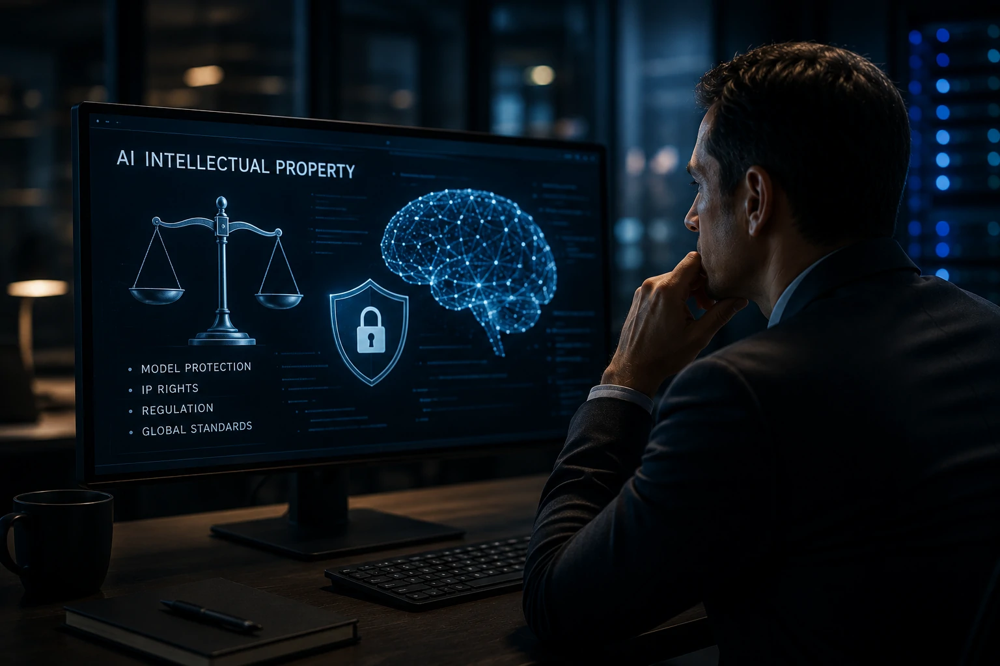
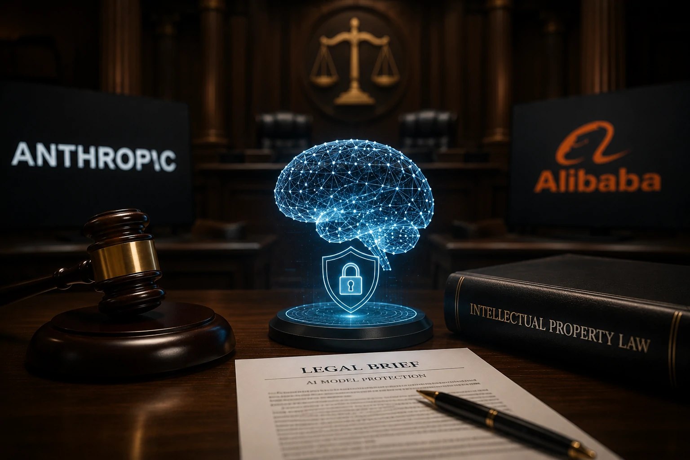
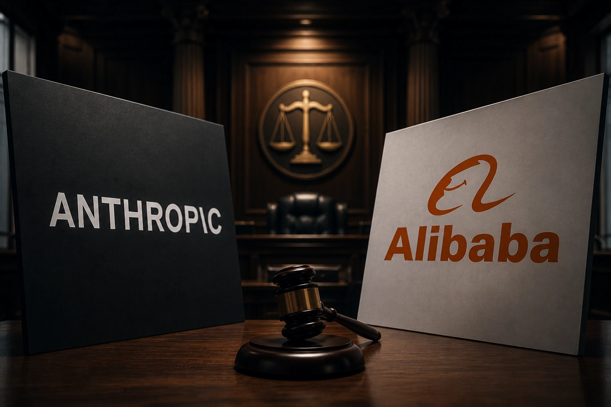

*À medida que a inteligência artificial se torna um dos ativos mais valiosos da economia digital, proteger modelos de IA deixou de ser apenas uma questão técnica e passou a fazer parte da estratégia competitiva das maiores empresas do setor. A acusação feita pela **Anthropic** contra o **Alibaba** mostra que a próxima grande batalha da indústria poderá acontecer muito antes do lançamento de novos modelos: ela começa na proteção do conhecimento que alimenta esses sistemas.*

## A acusação da Anthropic representa uma nova etapa da guerra da inteligência artificial

A **Anthropic** afirma ter identificado uma campanha que teria como objetivo reproduzir capacidades do **Claude** por meio de técnicas de **distilação de modelos**, levantando preocupações sobre uso indevido de propriedade intelectual e segurança dos sistemas de IA.

*Distilação de modelos tornou-se um dos temas mais sensíveis da atual corrida global pela inteligência artificial.*

Mais do que um conflito entre duas empresas, o episódio evidencia uma mudança importante no mercado: os modelos de IA passaram a ser tratados como ativos estratégicos comparáveis a patentes, chips avançados e infraestrutura de computação.

### O que é distilação de modelos?

A distilação consiste em utilizar as respostas produzidas por um modelo avançado para treinar outro modelo.

Em aplicações legítimas, essa técnica é amplamente utilizada para reduzir custos computacionais e criar versões menores de modelos complexos.

O problema surge quando esse processo ocorre sem autorização do desenvolvedor original, permitindo que concorrentes reproduzam parte do comportamento de sistemas proprietários.

### Por que isso preocupa o mercado?

Empresas como **Anthropic**, **OpenAI**, **Google**, **Meta** e **Mistral AI** investem bilhões de dólares no treinamento de modelos de linguagem.

Caso terceiros consigam reproduzir capacidades semelhantes utilizando consultas automatizadas, parte desse investimento poderá ser reduzida significativamente, criando riscos comerciais e jurídicos para todo o setor.

## O caso pode mudar a forma como empresas protegem modelos proprietários

A principal consequência dessa disputa não está apenas na relação entre **Anthropic** e **Alibaba**, mas na tendência de fortalecimento das estratégias de proteção dos modelos comerciais.

*Empresas de IA devem ampliar mecanismos de segurança para impedir extração indevida de conhecimento dos modelos.*

Nos últimos anos, diversas organizações passaram a limitar taxas de uso, monitorar padrões suspeitos de consultas e desenvolver mecanismos capazes de identificar tentativas automatizadas de extração de conhecimento.

Esse movimento reforça uma mudança importante: proteger modelos passa a ser tão relevante quanto desenvolver modelos mais avançados.

### Segurança deixa de ser apenas um tema técnico

Até pouco tempo, a discussão sobre segurança em IA estava concentrada em ataques cibernéticos e vazamento de dados.

Agora, a preocupação também envolve impedir que concorrentes utilizem o próprio modelo como fonte de treinamento para sistemas rivais.

Essa tendência dialoga diretamente com temas já discutidos pelo Notícia Tech, como a importância da governança corporativa em IA:

https://noticiatech.com.br/inteligencia-artificial/o-que-e-ai-governance-guia-completo-empresas-inteligencia-artificial/

### O impacto vai além da Anthropic

Mesmo empresas que trabalham com modelos abertos acompanham atentamente esse tipo de disputa.

Modelos proprietários representam investimentos bilionários em infraestrutura, pesquisa e aquisição de dados.

Quanto maior o desempenho alcançado por esses sistemas, maior tende a ser o interesse de concorrentes em reproduzir suas capacidades, tornando mecanismos de proteção um diferencial competitivo.

Outro movimento que ajuda a entender essa nova fase da indústria é a crescente disputa entre fornecedores globais de modelos, analisada anteriormente pelo Notícia Tech:

https://noticiatech.com.br/inteligencia-artificial/mistral-ai-alternativas-openai-disputa-inteligencia-artificial/

## A disputa pode acelerar novas regras para propriedade intelectual em IA

A acusação envolvendo **Anthropic** e **Alibaba** pode se tornar um marco para futuras regulamentações sobre treinamento de modelos de inteligência artificial.

*Governança, propriedade intelectual e proteção de modelos passam a ocupar posição estratégica na economia da inteligência artificial.*

Independentemente do desfecho jurídico, o caso reforça que empresas de IA precisarão investir cada vez mais em mecanismos de auditoria, rastreamento e monitoramento de acessos.

A tendência é que contratos corporativos passem a incluir cláusulas ainda mais rígidas sobre uso de APIs, compartilhamento de dados e desenvolvimento de modelos derivados.

### O mercado entra em uma nova fase competitiva

Durante os primeiros anos da IA generativa, a corrida era marcada principalmente pelo lançamento de modelos cada vez mais poderosos.

Agora, surge uma segunda frente de competição: proteger o conhecimento incorporado nesses modelos.

Na prática, empresas não disputam apenas usuários, mas também a preservação de bilhões de dólares investidos em pesquisa, infraestrutura computacional e aquisição de dados.

Isso explica por que grandes desenvolvedores vêm reforçando controles técnicos capazes de detectar padrões incomuns de utilização e possíveis tentativas de extração sistemática de conhecimento.

### Empresas usuárias também devem acompanhar esse movimento

Embora o conflito envolva duas gigantes da tecnologia, seus efeitos podem chegar rapidamente às organizações que utilizam IA em processos internos.

Mudanças em políticas de acesso, preços de APIs, contratos de licenciamento e requisitos de conformidade podem afetar empresas que utilizam soluções baseadas em modelos proprietários.

Para gestores, o episódio reforça a importância de acompanhar não apenas a evolução tecnológica dos modelos, mas também seus aspectos jurídicos, regulatórios e de governança.

Quem deseja implementar inteligência artificial de forma sustentável também precisa compreender como arquiteturas seguras são construídas. O guia do Notícia Tech sobre **Model Context Protocol (MCP)** mostra como a integração entre agentes e sistemas corporativos depende de controles robustos:

https://noticiatech.com.br/inteligencia-artificial/como-implementar-mcp-empresas-arquitetura-integracao-agentes-ia/

## A guerra da IA deixa de ser apenas tecnológica e passa a ser jurídica

A principal mensagem deixada pelo caso é clara: o diferencial competitivo da próxima geração de empresas de inteligência artificial não dependerá apenas da qualidade dos modelos.

Também será determinado pela capacidade de proteger propriedade intelectual, garantir conformidade regulatória e preservar vantagem competitiva em um mercado cada vez mais disputado.

Se a acusação da **Anthropic** contra o **Alibaba** resultar em mudanças regulatórias ou novos padrões de proteção, outras empresas como **OpenAI**, **Google**, **Meta**, **Microsoft** e **Mistral AI** provavelmente revisarão suas estratégias de segurança.

O mercado entra, assim, em uma nova etapa da corrida pela inteligência artificial: vencer não significará apenas criar o melhor modelo, mas também demonstrar que ele é capaz de permanecer protegido diante de um ambiente de competição global cada vez mais intenso.

---