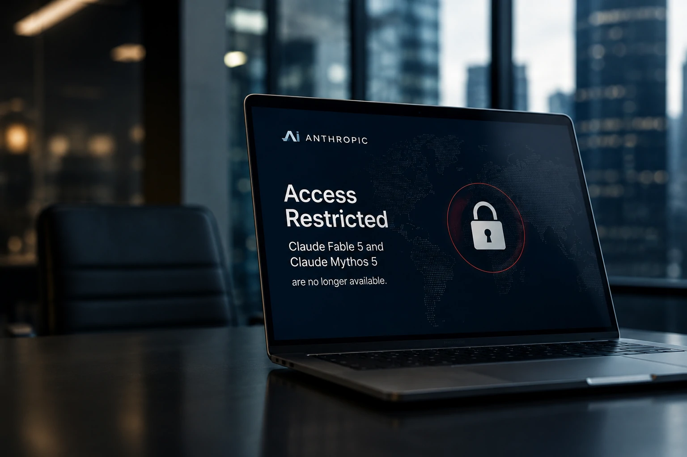
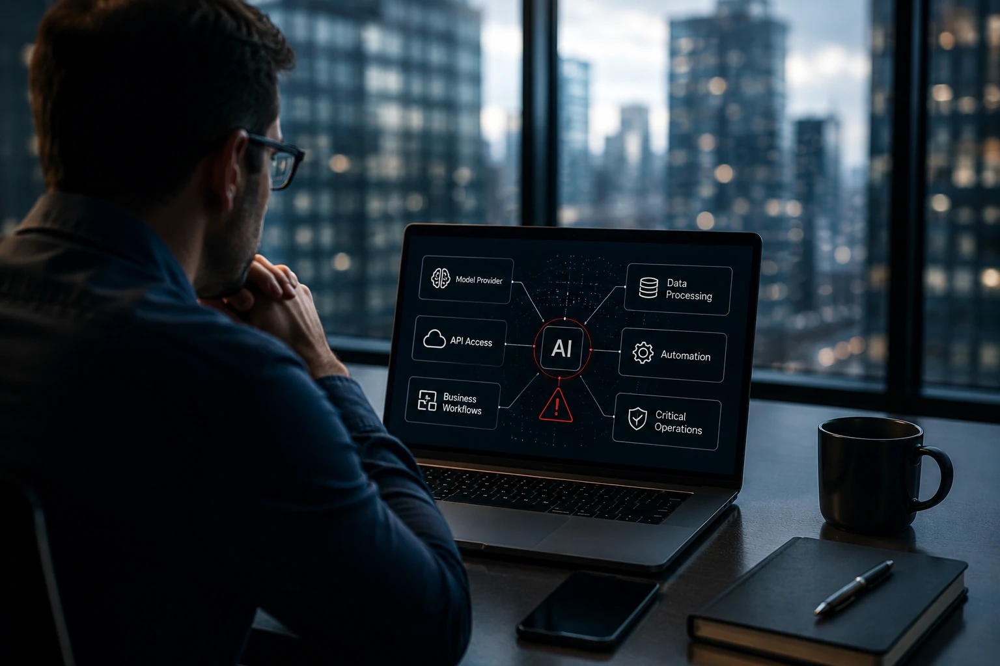

*A inteligência artificial entrou em uma nova fase de maturidade corporativa. O episódio envolvendo a **Anthropic** e seus modelos mais avançados mostra que a adoção de IA não depende apenas de inovação tecnológica. Questões regulatórias, geopolíticas e operacionais começam a influenciar diretamente a disponibilidade de ferramentas que muitas empresas consideravam permanentes.*

## A Anthropic restringiu o acesso aos seus modelos mais avançados

A decisão da **Anthropic** afeta diretamente os modelos **Claude Fable 5** e **Claude Mythos 5**, considerados entre os sistemas mais avançados já desenvolvidos pela empresa.

*Os modelos Claude Fable 5 e Claude Mythos 5 estão no centro de uma nova discussão sobre acesso e controle de tecnologias avançadas de IA.*

O movimento ocorre após medidas relacionadas às políticas de segurança nacional dos **Estados Unidos**, ampliando o debate sobre quem poderá acessar determinadas capacidades avançadas de inteligência artificial no futuro.

O caso ganhou repercussão global porque envolve uma das empresas mais relevantes da atual corrida da IA.

### O que aconteceu com os modelos Claude?

Os modelos afetados representam a camada mais avançada da plataforma **Claude**.

Eles são utilizados para tarefas complexas envolvendo raciocínio avançado, análise de informações, automação corporativa e suporte a decisões estratégicas.

A restrição de acesso gerou preocupação em empresas que dependem desses sistemas para operações críticas.

### Por que a notícia é relevante?

A relevância vai além da própria **Anthropic**.

O episódio demonstra que o acesso a modelos avançados pode ser influenciado por fatores externos ao mercado, incluindo decisões regulatórias e interesses nacionais.

Isso altera a forma como empresas avaliam riscos relacionados à inteligência artificial.

## Empresas passam a revisar estratégias de dependência tecnológica

O principal impacto imediato não está necessariamente na tecnologia.

O maior impacto está na percepção de risco.

*Organizações começam a avaliar com mais atenção a dependência de fornecedores específicos de inteligência artificial.*

Muitas empresas estruturaram fluxos inteiros de trabalho utilizando APIs de grandes laboratórios de IA.

Quando um fornecedor sofre limitações externas, essas organizações podem enfrentar desafios operacionais relevantes.

### O risco deixou de ser apenas técnico

Historicamente, os riscos mais analisados envolviam disponibilidade, custos e desempenho.

Agora surge uma nova variável.

A continuidade de acesso.

Empresas passam a considerar cenários em que mudanças regulatórias possam afetar serviços essenciais.

### Como organizações estão reagindo?

Algumas empresas estão acelerando estratégias multimodelo.

Outras avaliam soluções open source ou arquiteturas híbridas.

O objetivo é reduzir vulnerabilidades associadas à dependência excessiva de um único fornecedor de inteligência artificial.

## O caso da Anthropic cria um precedente importante para o mercado

A inteligência artificial está deixando de ser vista apenas como uma tecnologia comercial.

Ela passa a ocupar posição estratégica dentro das políticas nacionais de inovação e segurança.

*O mercado de IA enfrenta uma nova realidade em que tecnologia, regulação e estratégia corporativa se tornam inseparáveis.*

A consequência é uma aproximação cada vez maior entre governos, laboratórios de IA e grandes empresas de tecnologia.

### O que muda para o setor de IA?

O episódio sugere que modelos avançados poderão enfrentar níveis maiores de supervisão regulatória.

Isso não significa necessariamente mais restrições.

Mas indica que o ambiente regulatório tende a se tornar mais complexo.

Empresas precisarão acompanhar não apenas a evolução tecnológica, mas também mudanças legais e institucionais.

### O impacto pode atingir outros laboratórios?

Sim.

Embora a situação envolva a **Anthropic**, o mercado observa atentamente possíveis implicações para outras empresas relevantes do setor.

Entre elas estão **OpenAI**, **Google**, **Meta** e **Microsoft**, que também desenvolvem sistemas avançados de inteligência artificial.

## A principal lição para empresas é investir em resiliência

A inteligência artificial continua sendo uma das tecnologias mais transformadoras da economia digital.

Porém, o episódio demonstra que maturidade tecnológica exige também maturidade operacional.

### O que líderes corporativos devem observar?

Empresas devem avaliar:

- dependência de fornecedores;
- governança de IA;
- continuidade operacional;
- planos de contingência;
- diversificação tecnológica.

Esses fatores passam a ter peso semelhante ao desempenho dos modelos.

### O futuro da IA será mais estratégico

A adoção corporativa de inteligência artificial continuará acelerando.

Ao mesmo tempo, cresce a necessidade de estratégias capazes de lidar com riscos regulatórios, geopolíticos e operacionais.

A decisão envolvendo os modelos **Claude Fable 5** e **Claude Mythos 5** não representa apenas uma notícia sobre uma empresa específica. Ela oferece um sinal importante sobre a evolução do mercado. À medida que a IA se torna infraestrutura crítica para negócios, empresas precisarão equilibrar inovação, governança e resiliência para garantir vantagem competitiva sustentável em um cenário cada vez mais complexo.

---