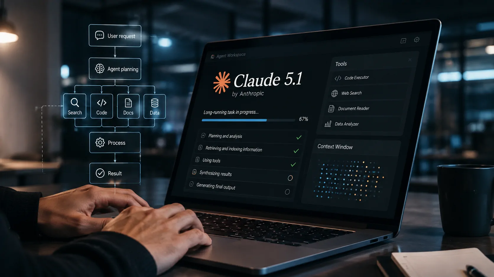
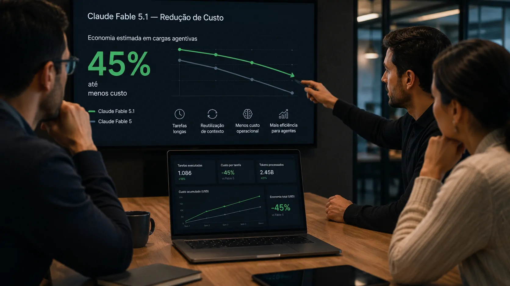

---

title: "Anthropic lança Claude Fable 5.1 e reduz custo de agentes de IA em até 45%"
slug: "anthropic-claude-fable-5-1-custo-agentes-ia"
translationKey: "anthropic-claude-fable-5-1-custo-agentes-ia"
date: "2026-09-03T00:15:00-03:00"
draft: false
author: "Por Aluisio Soares, fundador do blog Notícia Tech"
description: "A Anthropic lançou o Claude Fable 5.1 com foco em programação e trabalho de conhecimento e reduziu o custo de leitura de cache em 75%, buscando tornar agentes de IA mais econômicos em tarefas longas."
categories:
- "IA"
cover:
  image: "capa.webp"
  alt: "Claude Fable 5.1 em uma operação corporativa de agentes de inteligência artificial"
  caption: "O Claude Fable 5.1 combina maior capacidade para tarefas longas com uma redução significativa no custo de leitura de cache."
faq:
- pergunta: "O que é o Claude Fable 5.1?"
  resposta_curta: "O Claude Fable 5.1 é um modelo da Anthropic voltado para programação, trabalho de conhecimento e tarefas longas realizadas por agentes de IA."
  resposta_longa: "O Claude Fable 5.1 é a nova versão do modelo Fable da Anthropic, projetada para trabalhos complexos que podem exigir horas de execução, uso de ferramentas e múltiplas etapas. A empresa também posiciona o modelo para programação, pesquisa, análise e fluxos corporativos que exigem menor supervisão."
- pergunta: "Quanto custa o Claude Fable 5.1?"
  resposta_curta: "O Claude Fable 5.1 custa US$ 10 por milhão de tokens de entrada e US$ 50 por milhão de tokens de saída."
  resposta_longa: "Além dos preços de entrada e saída, a principal mudança econômica está no cache read, que passou a custar US$ 0,25 por milhão de tokens. Segundo a Anthropic, essa redução representa 75% menos nesse componente e pode diminuir o custo de cargas típicas em cerca de 25% e de cargas altamente agentivas em até aproximadamente 45%."
- pergunta: "Por que o corte no cache é importante para agentes de IA?"
  resposta_curta: "Porque agentes de IA podem reutilizar grandes volumes de contexto durante tarefas longas."
  resposta_longa: "Agentes que trabalham por horas precisam consultar repetidamente informações já processadas, como instruções, documentos e contexto de uma tarefa. A redução do preço do cache read pode diminuir o custo dessas operações recorrentes e tornar economicamente mais viáveis determinados fluxos agentivos."
- pergunta: "O Claude Fable 5.1 é voltado apenas para programação?"
  resposta_curta: "Não. O modelo também é direcionado a trabalho de conhecimento, pesquisa, análise e fluxos corporativos complexos."
  resposta_longa: "A Anthropic apresenta o Claude Fable 5.1 como um modelo para programação e trabalho de conhecimento. Entre os usos destacados estão tarefas longas, pesquisa, análise, operação de ferramentas e fluxos empresariais que podem ser executados com menor supervisão."

---

*O lançamento do Claude Fable 5.1 mostra uma mudança importante na disputa entre modelos de IA: além de buscar mais capacidade, a Anthropic está atacando um dos obstáculos à adoção de agentes, o custo de mantê-los trabalhando por longos períodos.*

## O Claude Fable 5.1 chega com uma mudança importante no custo

O **Claude Fable 5.1** é a nova versão do modelo da **Anthropic** voltada para programação, trabalho de conhecimento e tarefas complexas que podem se estender por horas. O lançamento ocorreu em 1º de setembro e amplia a estratégia da empresa em torno de sistemas capazes de executar trabalhos com menor supervisão humana.

### O que mudou no novo modelo

A principal mudança econômica está no **cache read**, recurso utilizado quando o modelo precisa reutilizar entradas que já foram processadas e armazenadas. No Fable 5.1, esse componente passou a custar **US$ 0,25 por milhão de tokens**, uma redução de **75%** em relação ao Fable 5.

O preço de entrada permanece em **US$ 10 por milhão de tokens**, enquanto o preço de saída é de **US$ 50 por milhão**. A diferença está justamente na forma como o contexto reutilizado é cobrado, algo especialmente relevante para aplicações que mantêm grandes volumes de informação durante uma execução prolongada.

### Por que a redução chama atenção

Segundo a **Anthropic**, o novo preço pode reduzir o custo de cargas típicas em aproximadamente **25%**. Em tarefas altamente agentivas, nas quais o sistema executa muitas etapas e reutiliza contexto, a economia pode chegar a aproximadamente **45%**.

A diferença é estratégica porque um agente de IA não funciona necessariamente como um chatbot convencional. Em vez de responder a uma única pergunta, ele pode planejar etapas, utilizar ferramentas, consultar informações e continuar trabalhando até completar um objetivo.

## A Anthropic está mirando o custo operacional dos agentes

A redução de preço ganha mais significado quando considerada junto à forma como a **Anthropic** posiciona o Fable 5.1. O modelo foi desenvolvido para trabalhos que podem durar horas, atravessar diferentes aplicações e exigir recuperação quando alguma etapa falha.

*O foco do Fable 5.1 está em tarefas prolongadas nas quais agentes precisam manter contexto e executar múltiplas etapas.*

### Agentes trabalham de maneira diferente

Um **agente de IA** é um sistema capaz de utilizar um modelo para planejar e executar etapas de uma tarefa, recorrendo a ferramentas e informações externas quando necessário. Isso aumenta a quantidade de operações realizadas durante uma única atividade.

Em um fluxo corporativo, por exemplo, um agente pode receber uma solicitação, consultar documentos, analisar dados, utilizar uma aplicação e produzir um resultado final. Quanto mais longa for essa sequência, maior pode ser a quantidade de contexto reutilizado.

### O cache se torna parte da economia

É nesse ponto que o corte no **cache read** ganha importância. Se uma aplicação precisa reapresentar ao modelo informações que já foram processadas, o custo dessa reutilização pode se acumular ao longo de uma execução extensa.

A redução de 75% nesse componente não significa que qualquer aplicação ficará 45% mais barata. A própria **Anthropic** diferencia cargas típicas das altamente agentivas. A economia final dependerá de como cada sistema utiliza tokens, contexto, ferramentas e ciclos de execução.

## Claude Fable 5.1 amplia a aposta em tarefas de longa duração

O Fable 5.1 não foi apresentado apenas como uma atualização de desempenho. A **Anthropic** o posiciona para trabalhos que exigem continuidade, capacidade de resolver problemas complexos e menor necessidade de acompanhamento constante.

### Programação entra no centro da estratégia

Na programação, o modelo é direcionado a projetos que atravessam bases de código inteiras, revisão de código, trabalho de desempenho e sessões autônomas prolongadas. A proposta é que o sistema consiga executar etapas, criar testes e verificar os resultados do próprio trabalho.

Esse posicionamento aproxima o modelo de uma função operacional dentro do desenvolvimento de software. Em vez de atuar somente como assistente para uma linha de código, a IA pode participar de processos que envolvem investigação, implementação, testes e verificação.

### O mesmo conceito chega ao trabalho de conhecimento

A estratégia também se estende para pesquisa, análise e outras atividades empresariais. A **Anthropic** descreve o Fable 5.1 como capaz de lidar com trabalhos complexos e com múltiplas etapas, permitindo que equipes entreguem projetos maiores ao modelo e concentrem sua atuação na revisão dos resultados.

Esse movimento ajuda a explicar por que o custo passou a ser uma parte tão importante do lançamento. Se a IA começa a assumir tarefas mais longas, o preço por operação deixa de ser apenas uma questão de infraestrutura e passa a influenciar diretamente a viabilidade econômica do processo.

## A redução de até 45% pode mudar a conta das empresas

Para empresas que experimentam agentes de IA, a questão central não é simplesmente qual modelo apresenta o melhor desempenho. O desafio é descobrir se o ganho de produtividade compensa o custo de executar o sistema repetidamente.

*Para aplicações corporativas, o custo por tarefa passa a ser uma variável importante na decisão de colocar agentes em produção.*

### Custo por tarefa ganha importância

Em uma aplicação tradicional, uma empresa pode medir o custo de uma consulta ou de uma chamada de API. Em um sistema agentivo, entretanto, uma única solicitação pode desencadear várias chamadas, uso de ferramentas e processamento de contexto.

Isso muda a métrica relevante. O indicador mais útil passa a ser o **custo para concluir uma tarefa**, e não apenas o preço isolado de um milhão de tokens. Uma redução no cache pode ter impacto maior justamente nos fluxos que reutilizam contexto de maneira intensa.

### Economia pode facilitar a experimentação

A redução também pode diminuir uma barreira para empresas que ainda estão testando agentes. Projetos experimentais frequentemente precisam executar muitas tarefas antes que uma organização consiga avaliar produtividade, confiabilidade e retorno sobre o investimento.

Se o custo de execução cair sem exigir uma redução equivalente na capacidade do modelo, aumenta a margem para experimentar automações mais longas. Isso não garante retorno financeiro, mas pode alterar a equação que determina quais projetos são economicamente aceitáveis.

Esse debate se conecta diretamente à crescente preocupação empresarial com a governança desses sistemas. O avanço dos agentes já começa a exigir novas formas de controle, como mostra a análise sobre **[como a Microsoft vê a necessidade de governança para agentes de IA nas empresas](https://noticiatech.com.br/inteligencia-artificial/microsoft-governanca-agentes-ia-empresas/)**.

## O movimento coloca eficiência no centro da competição entre modelos

O lançamento acontece em um mercado no qual capacidade, velocidade e preço estão cada vez mais interligados. A disputa não envolve apenas qual modelo consegue produzir a melhor resposta, mas também qual consegue realizar trabalhos complexos dentro de um custo operacional aceitável.

### Mais inteligência não resolve sozinha o problema

Modelos capazes de executar tarefas durante horas podem ampliar significativamente o escopo da automação. Mas, se cada tarefa longa gerar uma conta elevada, a adoção empresarial pode permanecer restrita a casos de alto valor.

Por isso, a redução anunciada pela **Anthropic** é relevante mesmo sem representar uma queda generalizada de 45% no preço. O objetivo parece ser reduzir especialmente uma parcela do custo que se torna mais importante conforme os agentes reutilizam contexto e permanecem ativos por mais tempo.

### O mercado começa a medir eficiência por resultado

Essa mudança também altera a forma como empresas podem comparar modelos. Benchmarks tradicionais continuam importantes, mas aplicações corporativas precisam considerar métricas como custo por tarefa concluída, quantidade de intervenções humanas e capacidade de manter qualidade durante processos prolongados.

Nesse cenário, a vantagem competitiva pode surgir da combinação entre **capacidade, custo e autonomia**. O modelo mais poderoso nem sempre será o mais interessante para uma operação se outro conseguir entregar resultado semelhante com menos tokens ou menos intervenção humana.

## Claude Fable 5.1 aponta para uma disputa além da inteligência

A principal mensagem do lançamento do **Claude Fable 5.1** está menos no número da versão e mais na economia por trás dos agentes. A **Anthropic** está tentando tornar mais acessível uma categoria de sistemas que precisa processar contexto repetidamente e trabalhar durante períodos mais longos.

*Agentes de IA mais econômicos podem ampliar o espaço para automações que hoje exigem acompanhamento humano constante.*

### O próximo teste será a produção

A redução anunciada é relevante, mas o impacto real dependerá das aplicações. Empresas precisarão medir se o menor custo de execução vem acompanhado de resultados consistentes, menor necessidade de supervisão e produtividade suficiente para justificar a mudança de processo.

A própria disponibilidade do Fable 5.1 para diferentes ambientes de desenvolvimento e plataformas corporativas amplia esse teste. Quanto mais empresas utilizarem o modelo em operações reais, mais fácil será avaliar onde a economia anunciada produz diferença concreta.

### A variável econômica ganha protagonismo

O lançamento sugere uma direção importante para o mercado de IA. À medida que os modelos passam de assistentes que respondem perguntas para agentes que executam trabalhos inteiros, **o custo de cada tarefa se torna tão estratégico quanto a capacidade do modelo**.

Ainda é cedo para afirmar que a redução de até 45% mudará o mercado de agentes. Mas o movimento da **Anthropic** sinaliza que a próxima fase da competição pode ser decidida não apenas por quem cria a IA mais capaz, mas por quem consegue fazê-la trabalhar por mais tempo com uma conta que as empresas estejam dispostas a pagar.

---