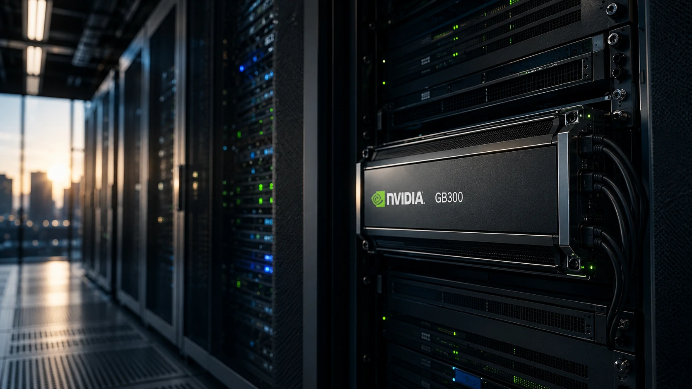
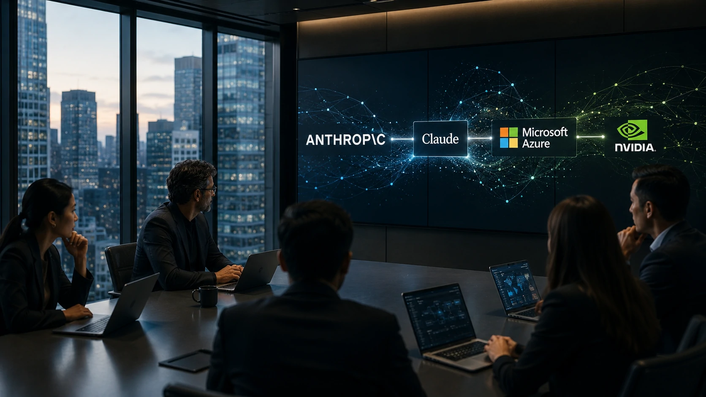

*O mercado de inteligência artificial continua migrando da disputa por melhores modelos para uma competição pela infraestrutura que sustenta aplicações corporativas. A nova parceria entre **Anthropic**, **Microsoft** e **NVIDIA** representa mais um passo nessa transformação e pode influenciar diretamente as estratégias de adoção de IA nas empresas.*

## Anthropic amplia sua presença no mercado corporativo por meio do Azure

A disponibilização dos modelos **Claude** dentro do **Microsoft Azure** fortalece a estratégia da **Anthropic** de expandir sua atuação no segmento empresarial. Em vez de depender apenas de acesso direto à própria plataforma, a empresa passa a integrar um dos maiores ecossistemas de computação em nuvem do mundo.

*Infraestrutura em nuvem passa a ser um diferencial competitivo para provedores de IA.*

Essa integração reduz barreiras para organizações que já utilizam serviços da **Microsoft**, permitindo incorporar modelos de linguagem avançados sem alterar significativamente sua arquitetura tecnológica.

### Mais opções para empresas

O movimento também amplia a liberdade de escolha das organizações. Em vez de depender exclusivamente de um único fornecedor de modelos, empresas podem selecionar soluções mais adequadas para diferentes casos de uso, equilibrando desempenho, custos e requisitos de governança.

### Infraestrutura ganha protagonismo

A corrida pela IA deixou de envolver apenas qualidade dos modelos. Hoje, capacidade computacional, disponibilidade global, segurança e integração com sistemas corporativos tornam-se fatores decisivos para grandes projetos de inteligência artificial.

## NVIDIA GB300 reforça a corrida pela infraestrutura de IA

A utilização das novas **GPUs NVIDIA GB300** demonstra que a infraestrutura passou a ocupar posição estratégica na evolução da inteligência artificial empresarial.

*Novas GPUs ampliam capacidade computacional para aplicações corporativas.*

Processar modelos cada vez maiores exige enorme capacidade computacional. Plataformas que conseguem oferecer alto desempenho com escalabilidade tendem a atrair empresas interessadas em desenvolver agentes inteligentes, automações e aplicações baseadas em IA generativa.

Essa tendência complementa outros movimentos já acompanhados pelo Notícia Tech, como a evolução da estratégia da **Mistral AI** no mercado enterprise:

https://noticiatech.com.br/inteligencia-artificial/mistral-ai-estrategia-enterprise-disputa-openai/

Outro exemplo é a crescente importância da infraestrutura para projetos baseados em **RAG** e dados corporativos:

https://noticiatech.com.br/inteligencia-artificial/rag-modelos-proprios-dados-corporativos-empresas/

## A integração amplia a competição entre as grandes plataformas de IA

A chegada do **Claude** ao **Microsoft Azure** aumenta a concorrência entre os principais ecossistemas de inteligência artificial utilizados por empresas. A tendência é que clientes passem a comparar não apenas modelos de linguagem, mas todo o conjunto de serviços oferecidos por cada plataforma.

*Grandes provedores disputam espaço na próxima geração da computação corporativa.*

Empresas avaliam fatores como custo operacional, facilidade de integração, segurança, conformidade regulatória e disponibilidade regional. Nesse cenário, oferecer múltiplos modelos dentro da mesma infraestrutura pode representar uma vantagem competitiva importante.

### A estratégia vai além dos modelos

Cada vez mais, organizações buscam plataformas capazes de combinar modelos de IA, bancos de dados, ferramentas de desenvolvimento, automação e governança em um único ambiente.

Esse movimento acompanha a evolução do mercado apresentada em outras análises do Notícia Tech, como a crescente importância da governança de IA para projetos corporativos:

https://noticiatech.com.br/inteligencia-artificial/o-que-e-ai-governance-guia-completo-empresas-inteligencia-artificial/

### O impacto para empresas

Para equipes de tecnologia, a integração tende a reduzir a complexidade de implantação e acelerar projetos baseados em inteligência artificial. Empresas que já operam no ecossistema **Microsoft Azure** poderão avaliar o **Claude** como alternativa para assistentes corporativos, automação de processos, atendimento ao cliente, geração de conteúdo e análise de documentos.

## O mercado entra em uma nova fase da corrida pela inteligência artificial

A expansão do **Claude** para o **Microsoft Azure** demonstra que a disputa entre as grandes empresas de IA está migrando para uma competição baseada em infraestrutura, disponibilidade e integração empresarial.

O sucesso das plataformas dependerá não apenas da qualidade dos modelos, mas também da capacidade de entregar desempenho, escalabilidade, segurança e governança para organizações que pretendem incorporar inteligência artificial em seus processos de negócio.

Para o mercado corporativo, essa mudança representa uma ampliação das opções tecnológicas disponíveis e acelera a transformação digital impulsionada por IA. Ao mesmo tempo, reforça que alianças entre desenvolvedores de modelos, provedores de nuvem e fabricantes de hardware serão cada vez mais decisivas para definir os próximos líderes da inteligência artificial empresarial.

---