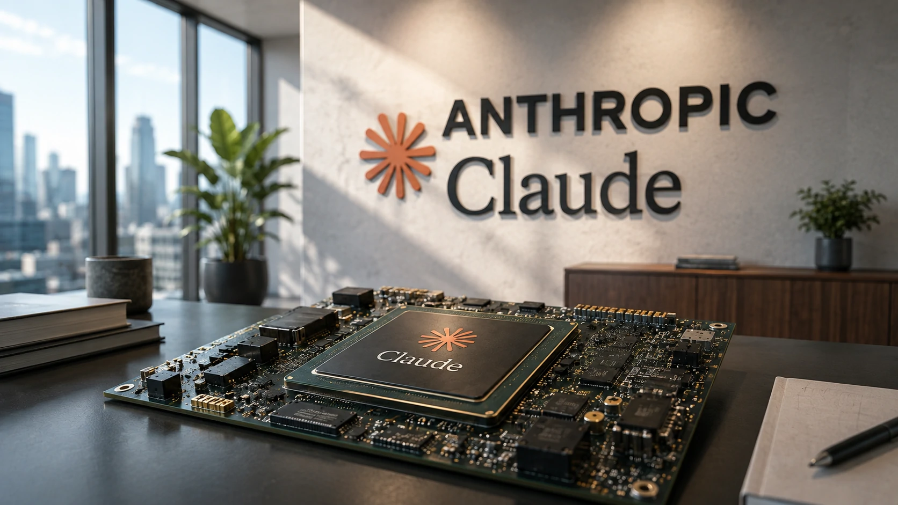
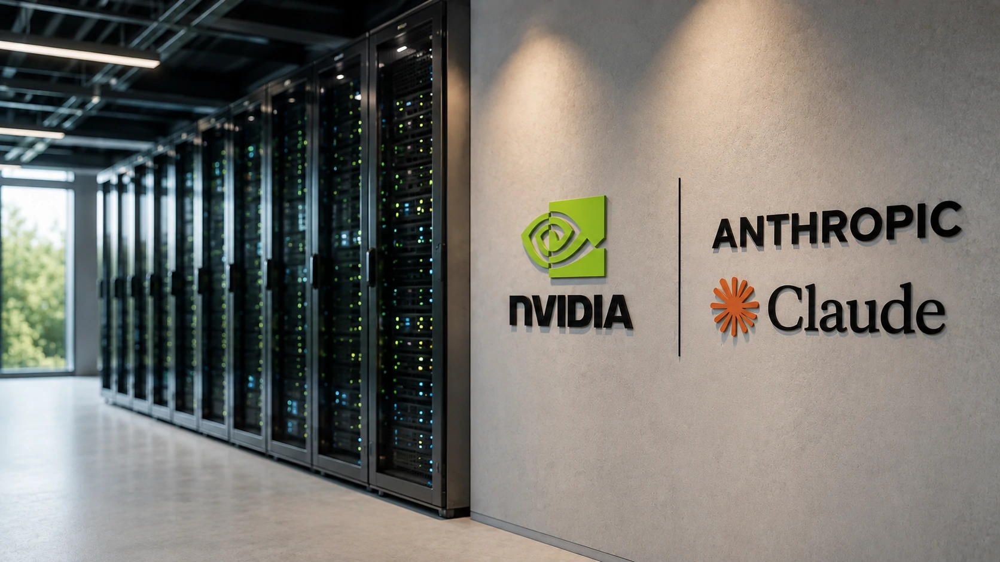
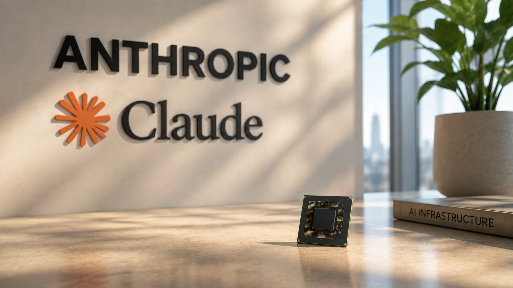

*Enquanto OpenAI, Google e Meta disputam a liderança dos modelos de inteligência artificial, uma batalha silenciosa começa a ganhar força nos bastidores. A Anthropic iniciou um movimento estratégico para desenvolver chips próprios para o Claude, uma decisão que pode alterar a dinâmica de poder do mercado de IA e reduzir a dependência das GPUs da Nvidia.*

*A iniciativa demonstra que a próxima grande disputa entre as gigantes da IA não acontecerá apenas no software. O controle da infraestrutura computacional pode se tornar um dos fatores mais importantes para definir quem liderará a próxima geração da inteligência artificial.*

## Anthropic quer controlar toda a cadeia da inteligência artificial

A Anthropic está estruturando uma equipe especializada em semicondutores com o objetivo de desenvolver aceleradores próprios para inteligência artificial. A iniciativa representa um passo estratégico semelhante ao adotado por outras gigantes da tecnologia que passaram a investir em hardware personalizado para aumentar desempenho e reduzir custos operacionais.

Embora a empresa continue utilizando a infraestrutura da Nvidia para treinamento e execução de seus modelos, criar chips próprios permite otimizar cargas específicas, melhorar a eficiência energética e reduzir a dependência de fornecedores externos.

Para especialistas do setor, esse tipo de investimento mostra que a corrida pela IA entrou em uma nova fase: não basta criar modelos mais inteligentes. Também será necessário controlar a infraestrutura capaz de sustentá-los.

Esse movimento reforça uma tendência observada em toda a indústria, na qual empresas buscam ampliar sua independência tecnológica e acelerar o desenvolvimento de novos modelos de IA.

Se você acompanha a evolução da Anthropic, vale a pena conhecer também como a empresa ampliou a disputa com a OpenAI em **[Claude desafia ChatGPT: Anthropic lança novo recurso e acirra a disputa pela liderança da IA](https://noticiatech.com.br/inteligencia-artificial/claude-desafia-chatgpt-anthropic-novo-recurso-disputa-ia/)**. Para entender como essa estratégia vem evoluindo nos últimos meses, confira também **[Claude Opus 5 aumenta pressão sobre o ChatGPT e intensifica a guerra da IA](https://noticiatech.com.br/inteligencia-artificial/claude-opus-5-pressiona-chatgpt-guerra-ia/)**.

## O domínio da Nvidia começa a ser desafiado

A liderança da Nvidia permanece praticamente incontestável no mercado de aceleradores para inteligência artificial. Entretanto, o crescimento acelerado da demanda por processamento fez com que empresas como Google, Amazon, Microsoft e agora Anthropic passassem a investir em soluções próprias.

O objetivo não é substituir imediatamente as GPUs da Nvidia, mas construir uma infraestrutura híbrida capaz de reduzir custos, aumentar disponibilidade e otimizar aplicações específicas.

Caso a estratégia da Anthropic tenha sucesso, a empresa poderá acelerar a evolução do Claude enquanto reduz despesas operacionais em larga escala, fortalecendo sua posição na disputa com OpenAI, Google e outras desenvolvedoras de modelos generativos.

Esse cenário também sinaliza que o futuro da inteligência artificial será decidido tanto pela qualidade dos modelos quanto pela capacidade de cada empresa em controlar sua própria infraestrutura computacional.

## Chips próprios podem redefinir a disputa entre Anthropic, OpenAI e Google

A decisão da Anthropic vai muito além da criação de um novo componente eletrônico. Ela representa uma mudança estratégica na forma como as empresas de inteligência artificial pretendem competir nos próximos anos.

Hoje, praticamente todos os grandes modelos dependem, em maior ou menor grau, da infraestrutura fornecida pela Nvidia. Essa concentração criou um cenário no qual a capacidade de expandir novos modelos está diretamente ligada à disponibilidade de GPUs de alto desempenho.

Ao desenvolver hardware próprio, a Anthropic busca reduzir esse gargalo e ganhar maior autonomia para evoluir o Claude em seu próprio ritmo.

Essa estratégia também permite criar chips otimizados para as características específicas dos modelos da empresa, aumentando eficiência energética, reduzindo latência e diminuindo o custo por inferência, fatores que podem se tornar decisivos conforme a adoção da IA cresce entre empresas.

Embora OpenAI, Google e Microsoft também invistam fortemente em infraestrutura personalizada, a entrada da Anthropic nessa corrida demonstra que o controle do hardware deixou de ser apenas uma vantagem competitiva e passou a ser uma necessidade estratégica.

A disputa por infraestrutura faz parte de uma estratégia maior das empresas de inteligência artificial. Entenda como a OpenAI também vem ampliando seus investimentos em hardware no artigo **[OpenAI entra na guerra do hardware e prepara nova geração de dispositivos para o ChatGPT](https://noticiatech.com.br/inteligencia-artificial/openai-guerra-hardware-dispositivos-chatgpt)**. Se quiser comparar como Claude, ChatGPT, Gemini, Grok e Mistral estão posicionados no mercado corporativo, leia também **[Qual IA é melhor para empresas em 2026? ChatGPT, Claude, Gemini, Grok e Mistral comparados](https://noticiatech.com.br/inteligencia-artificial/melhor-ia-empresas-2026-chatgpt-claude-gemini-grok-mistral/)**.

## O que essa movimentação significa para empresas e para o futuro da IA

Para empresas que utilizam inteligência artificial em larga escala, essa disputa tende a trazer benefícios importantes. Quanto maior a concorrência na infraestrutura, maior a pressão para reduzir custos, aumentar desempenho e acelerar a inovação.

Nos próximos anos, a diferenciação entre os grandes modelos poderá depender menos apenas da qualidade das respostas e mais da eficiência com que conseguem operar em escala global.

Nesse contexto, o investimento da Anthropic em chips próprios representa um sinal claro de que a corrida pela inteligência artificial entrou em uma nova etapa. A disputa deixa de acontecer apenas entre modelos como Claude, ChatGPT e Gemini e passa a envolver toda a cadeia tecnológica necessária para sustentá-los.

Para o mercado, isso significa uma competição ainda mais intensa entre as gigantes da IA. Para empresas usuárias dessas tecnologias, pode representar soluções mais rápidas, mais eficientes e, no longo prazo, potencialmente mais acessíveis.

A estratégia da Anthropic ainda está em seus estágios iniciais, mas reforça uma tendência que deve marcar os próximos anos: o futuro da inteligência artificial será definido não apenas pelos modelos mais inteligentes, mas também por quem conseguir construir a infraestrutura mais eficiente para executá-los.