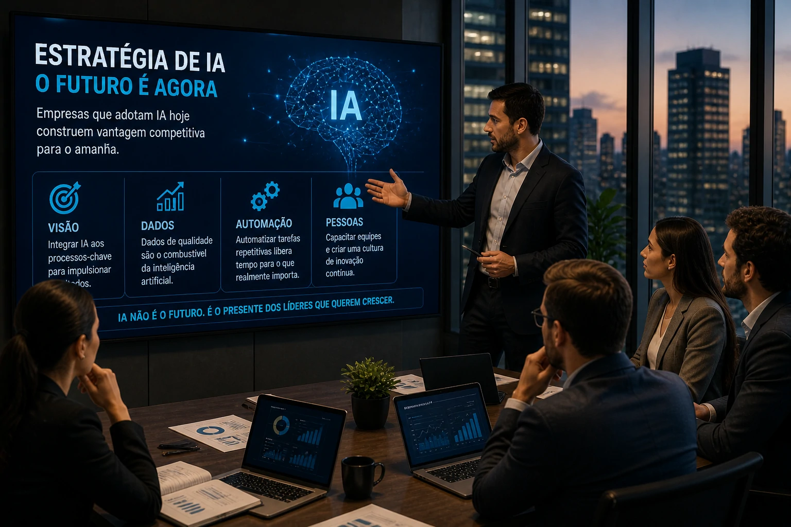

**A inteligência artificial entrou definitivamente na fase de consolidação empresarial.** O avanço acelerado da Anthropic, uma das principais concorrentes da OpenAI, reforça um movimento que muitos executivos ainda subestimam: a IA deixou de ser um experimento e passou a ser infraestrutura crítica de negócios.

Enquanto muitas empresas brasileiras ainda discutem onde aplicar IA, gigantes globais já estão disputando posição, mercado e eficiência operacional em escala agressiva.

Esse novo cenário muda a lógica competitiva.

## O salto da Anthropic e o novo estágio da inteligência artificial

A Anthropic saiu de um estágio de forte crescimento para um patamar de expansão considerado estratégico no mercado global de IA. O movimento sinaliza algo importante: investidores já não apostam apenas em inovação, mas em capacidade real de monetização.

Isso muda completamente o perfil do setor.

Até pouco tempo atrás, muitas ferramentas de IA eram vistas como soluções complementares. Hoje, elas estão sendo incorporadas diretamente na operação central de empresas.

Esse mesmo movimento pode ser observado no ecossistema da OpenAI, Microsoft e Google, que ampliam cada vez mais suas ofertas de inteligência artificial para produtividade, automação e operações empresariais.

A tendência é clara:

Empresas que dominarem automação inteligente ganharão vantagem operacional.

## Por que o mercado está colocando bilhões em IA agora

O ponto central não é tecnologia.

É eficiência.

A IA está impactando diretamente quatro áreas críticas:

### Redução de custos operacionais

Automação de atendimento, suporte, análise de documentos e processos repetitivos.

Esse é um dos principais vetores de adoção corporativa.

### Aumento de produtividade

Equipes conseguem produzir mais em menos tempo.

Ferramentas baseadas em IA já aceleram:

- produção de conteúdo  
- análise de dados  
- CRM  
- prospecção comercial  
- suporte interno  

### Escalabilidade

Empresas conseguem crescer sem expandir proporcionalmente a estrutura.

Isso é especialmente relevante para pequenas e médias empresas.

### Inteligência de decisão

IA não é só execução.

É análise estratégica.

Hoje, plataformas conseguem identificar padrões de vendas, comportamento de clientes e gargalos internos.

## O impacto real para empresas brasileiras

O erro comum no Brasil é pensar que IA é assunto exclusivo de Big Tech.

Não é.

Pequenas empresas já estão usando IA para:

### Atendimento automatizado

Chatbots inteligentes reduzem carga operacional.

### Marketing de performance

Segmentação, copy, análise e personalização.

A IA já está transformando campanhas e aquisição de clientes.

### Vendas

Qualificação automática de leads.

Redução de tempo comercial.

Melhoria de conversão.

### Processos internos

RH, financeiro, documentação e fluxo operacional.

Empresas que começarem agora ainda estão em janela competitiva.

Mas essa janela está encurtando.

## O custo de esperar pode ser alto

O crescimento da Anthropic revela uma mensagem importante para o mercado:

A corrida da IA já começou.

E ela não está esperando ninguém.

O padrão histórico é conhecido:

Quem adota tecnologia cedo aprende antes.

Quem aprende antes executa melhor.

Quem executa melhor domina mercado.

Foi assim com cloud.

Foi assim com automação.

Agora está acontecendo com IA.

## O que empresas devem fazer agora

A pergunta certa não é:

“Vale a pena usar IA?”

A pergunta correta é:

“Qual processo da minha empresa pode ser otimizado primeiro?”

O caminho mais inteligente é começar pequeno:

- atendimento  
- marketing  
- vendas  
- operação  
- análise de dados  

A IA empresarial não é mais tendência.

Ela virou variável competitiva.

E os números da Anthropic mostram exatamente isso:

O mercado já entendeu.

Agora resta saber quem vai agir primeiro.