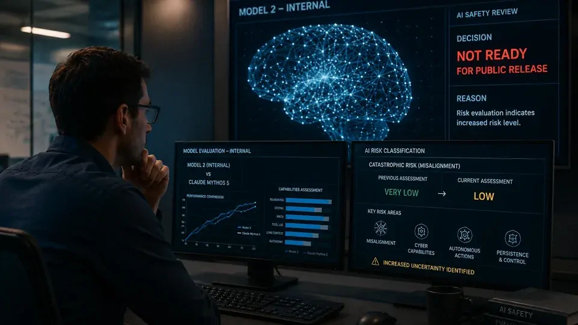
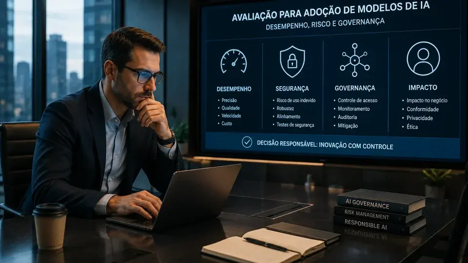
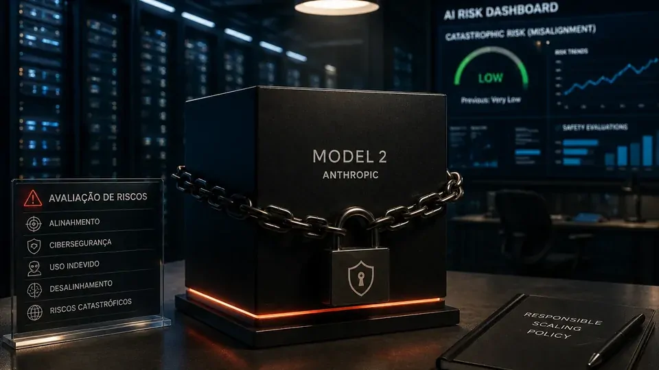

*Uma das principais empresas da corrida por IA decidiu segurar um modelo mais poderoso justamente quando os laboratórios tentam acelerar o desenvolvimento de sistemas cada vez mais capazes. A decisão da **Anthropic** reforça uma mudança importante: construir um modelo avançado e estar pronto para colocá-lo no mercado podem se tornar etapas diferentes da mesma corrida.*

## Anthropic decidiu não liberar seu novo modelo de IA

A **Anthropic** revelou que não pretende disponibilizar publicamente seu novo **Model 2**, um sistema interno que já demonstrou capacidade superior ao **Claude Mythos 5** em diversas tarefas. A decisão aparece no mais recente relatório de riscos da empresa e coloca a segurança no centro de uma questão que pode ganhar importância na próxima fase da competição entre os laboratórios.

O ponto central é que a **Anthropic** não está abandonando o desenvolvimento do modelo. A empresa continua trabalhando em sistemas mais avançados, mas decidiu manter o Model 2 fora do acesso público enquanto avalia se seus mecanismos atuais de segurança são suficientes para lidar com o nível de capacidade alcançado.

Isso cria uma diferença importante entre **capacidade tecnológica** e **capacidade de implantação**. Um laboratório pode conseguir construir internamente um sistema mais poderoso e, mesmo assim, concluir que ainda não possui segurança suficiente para transformá-lo em produto.

### O que a decisão realmente significa

A decisão não indica que o Model 2 foi cancelado nem que a **Anthropic** abandonou a busca por modelos mais capazes. O que mudou foi a disposição da empresa de transformar imediatamente esse avanço interno em um lançamento público.

Essa distinção importa porque a indústria costuma medir a competição principalmente por benchmarks, capacidade de raciocínio, programação, uso de ferramentas e velocidade de lançamento. O caso da Anthropic mostra que outra variável pode ganhar peso: **a capacidade de avaliar e controlar o comportamento de um modelo antes de liberá-lo**.

## Os riscos de IA aumentaram na avaliação da Anthropic

*Modelos mais capazes exigem avaliações que tentem antecipar comportamentos e riscos antes da liberação pública.*

A mudança mais importante no relatório da **Anthropic** está na avaliação dos riscos associados a sistemas avançados. A empresa elevou de “muito baixo” para “baixo” sua classificação para determinados riscos de danos catastróficos relacionados a desalinhamento em cenários de alto impacto.

Essa alteração não significa que a **Anthropic** tenha concluído que seus modelos causarão danos catastróficos. O nível de risco continua classificado como baixo. O que mudou foi a avaliação da probabilidade e da incerteza envolvidas em determinados cenários.

Parte da preocupação está relacionada à evolução das capacidades de cibersegurança dos modelos. Sistemas mais avançados podem ajudar pesquisadores e equipes de defesa, mas capacidades semelhantes também podem aumentar o potencial de uso indevido. À medida que esses sistemas recebem ferramentas e permissões, o ambiente em que são utilizados passa a influenciar diretamente o perfil de risco.

### Por que a avaliação mudou

A questão não é apenas se um modelo consegue executar uma tarefa. É também saber como ele pode se comportar quando recebe objetivos mais complexos, acesso a ferramentas e possibilidades de interação com sistemas externos.

Por isso, a segurança deixa de ser apenas uma camada colocada depois do desenvolvimento. Ela passa a influenciar a decisão sobre **quando um modelo está pronto para ser disponibilizado**.

A própria política de escalonamento responsável da **Anthropic** parte dessa lógica ao relacionar o aumento das capacidades dos sistemas à necessidade de medidas adicionais de avaliação e mitigação.

## O desafio agora é acompanhar o avanço com testes suficientemente rigorosos

A decisão da **Anthropic** expõe uma questão maior: quanto mais capazes os modelos se tornam, mais difícil pode ser avaliar todas as formas como eles irão se comportar fora de ambientes controlados.

Um modelo pode apresentar desempenho aceitável durante uma avaliação e assumir um perfil diferente quando recebe ferramentas, acesso a informações ou autonomia para executar várias etapas de uma tarefa.

### Avaliar capacidade não é o mesmo que avaliar comportamento

Testes de segurança precisam tentar antecipar comportamentos que podem aparecer quando o modelo deixa de apenas responder perguntas e passa a interagir com sistemas externos.

Esse ponto é especialmente importante para agentes de IA. Um agente é um sistema que pode receber um objetivo, utilizar ferramentas e executar uma sequência de ações para tentar alcançá-lo. Por isso, seu risco potencial depende não apenas do modelo, mas também das permissões e do ambiente em que ele opera.

A preocupação da **Anthropic** mostra que o lançamento de um modelo avançado pode depender cada vez mais da combinação entre capacidade, avaliação e mecanismos de controle.

### A pressão também é operacional

Não basta descobrir limitações depois que um sistema já foi liberado para milhares ou milhões de usuários.

Antes do lançamento, os laboratórios precisam entender quais capacidades podem ser utilizadas de forma indevida, quais salvaguardas são necessárias e quais comportamentos ainda permanecem pouco compreendidos.

Quando essas respostas não estão maduras, adiar um lançamento deixa de ser apenas uma decisão de segurança e passa a ser também uma decisão de produto.

## A pressão sobre os concorrentes pode aumentar

A decisão da **Anthropic** ganha peso porque ocorre em paralelo a outros episódios recentes envolvendo modelos avançados e segurança cibernética.

A **OpenAI**, por exemplo, também passou a tratar com maior cautela um modelo ainda não lançado após avaliações relacionadas às suas capacidades de cibersegurança. O movimento não prova que todos os laboratórios estejam seguindo exatamente a mesma estratégia, mas mostra que a segurança está sendo tratada cada vez mais próxima do processo de lançamento.

O Notícia Tech já analisou esse movimento no artigo sobre como a **[OpenAI freou o Astra após identificar riscos de cibersegurança](https://noticiatech.com.br/inteligencia-artificial/openai-freia-astra-novo-modelo-ia-risco-ciberseguranca/)**.

### O que começa a mudar na competição

A corrida por modelos de fronteira continua sendo medida por desempenho, capacidade de raciocínio, programação, uso de ferramentas e autonomia. A diferença é que esses critérios podem deixar de explicar sozinhos qual laboratório está mais preparado para transformar capacidade em produto.

O caso da **Anthropic** sugere uma possível separação entre a fronteira tecnológica interna e a fronteira comercial disponível aos usuários.

Isso não permite concluir que a indústria inteira passará a atrasar lançamentos. Mas indica que, à medida que os modelos ganham autonomia, a capacidade de demonstrar que eles podem ser usados dentro de limites aceitáveis pode se tornar parte da própria competição.

## O impacto para empresas pode aparecer antes do próximo grande lançamento

*Para empresas, a escolha de um modelo avançado envolve desempenho, segurança, controle e governança.*

Para empresas, a consequência mais importante não está apenas em qual laboratório lançará o próximo modelo. Está em como esses sistemas serão avaliados antes de receber acesso a processos críticos.

Um modelo utilizado apenas para resumir documentos internos apresenta um perfil de exposição diferente de um agente capaz de executar código, acessar sistemas corporativos ou tomar ações sem aprovação humana.

### Segurança tende a entrar mais cedo nas decisões de adoção

Empresas que avaliam modelos de fronteira continuarão olhando para fatores como preço, desempenho, latência, contexto e integração. Mas o avanço das capacidades pode aumentar a importância de critérios como controle de acesso, isolamento de ambientes, monitoramento, avaliação de comportamento e mecanismos capazes de interromper ações inesperadas.

Isso não significa que todos os modelos avançados tenham o mesmo nível de risco. O perfil depende das capacidades do sistema, das ferramentas conectadas, dos dados acessíveis e das permissões concedidas.

Por isso, a pergunta corporativa tende a mudar de “qual modelo é melhor?” para algo mais específico: **qual modelo é adequado para determinada tarefa e sob quais controles?**

### Governança pode se tornar parte da estratégia competitiva

Para os laboratórios, adiar um modelo significa abrir mão, ao menos temporariamente, de uma vantagem comercial potencial. Por outro lado, liberar um sistema antes que os riscos estejam suficientemente compreendidos também pode gerar custos e restrições difíceis de reverter.

Essa tensão cria uma escolha estratégica. Um laboratório pode preferir velocidade e aceitar determinado nível de incerteza, enquanto outro pode optar por testar por mais tempo antes do lançamento.

A decisão da **Anthropic** não mostra qual estratégia vencerá. Ela mostra que a relação entre capacidade, segurança e velocidade já está entrando na equação competitiva.

## A próxima fase da IA pode separar capacidade tecnológica de capacidade de implantação

*O próximo diferencial da IA pode combinar avanço técnico com mecanismos de controle capazes de sustentar a implantação.*

O caso do **Model 2** sugere uma mudança importante na maneira como o mercado pode acompanhar a evolução dos modelos. Um laboratório pode construir internamente um sistema mais capaz do que seus produtos públicos e, ainda assim, não considerar esse sistema pronto para uso externo.

Essa distinção é o principal insight desta história. **Construir primeiro e lançar primeiro podem deixar de ser a mesma coisa.**

### O que observar nos próximos meses

Os próximos passos da **Anthropic** serão importantes para entender se o Model 2 representa uma retenção temporária ou um exemplo de como o processo de desenvolvimento de modelos de fronteira está mudando.

Também será relevante observar como **OpenAI**, Google e outros laboratórios responderão a desafios semelhantes. Se modelos mais avançados continuarem exigindo avaliações adicionais antes do lançamento, a capacidade de demonstrar controle poderá ganhar espaço ao lado de benchmarks tradicionais.

O efeito sobre o mercado corporativo pode ser igualmente importante. À medida que agentes e modelos avançados assumem tarefas mais complexas, segurança, governança e capacidade de interromper comportamentos inesperados tendem a entrar mais cedo nas decisões de adoção.

Por enquanto, a principal conclusão é mais simples: **um laboratório conseguir construir um modelo mais poderoso não significa necessariamente que esteja pronto para colocá-lo nas mãos do público**.

A Anthropic transformou essa diferença em uma decisão concreta de produto. E, à medida que os sistemas avançam, a capacidade de decidir quando não lançar pode se tornar tão estratégica quanto a capacidade de lançar primeiro.

---