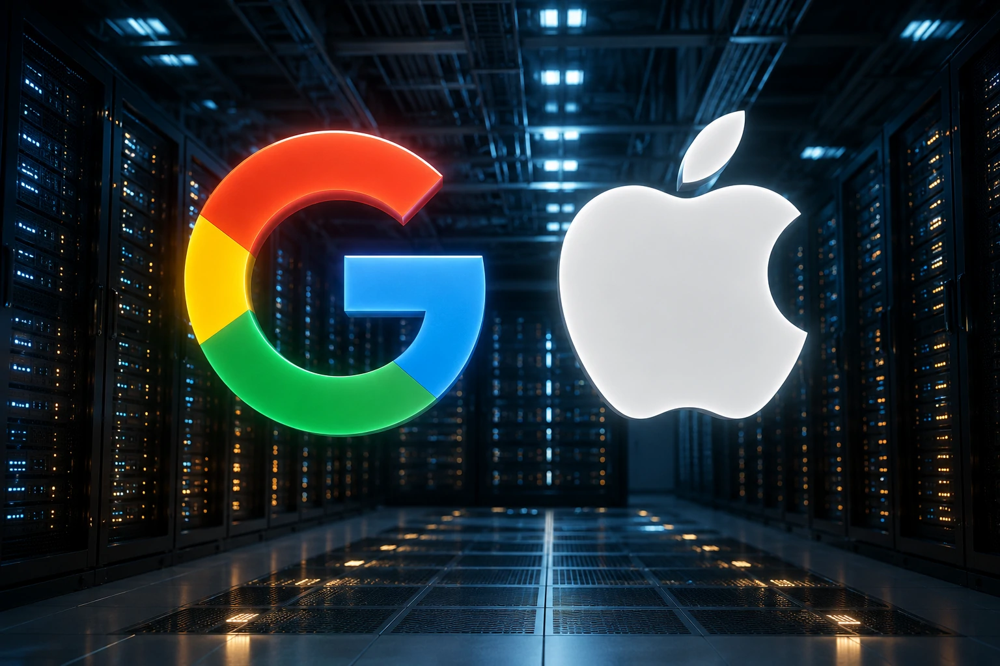

*Enquanto boa parte do mercado concentrou atenção na nova geração da Siri e nas novidades do Apple Intelligence, um anúncio técnico feito durante a WWDC 2026 pode ter implicações muito maiores para empresas, desenvolvedores e fornecedores de software corporativo. A evolução do **Foundation Models Framework** sugere que a Apple pretende transformar seus modelos de IA em uma camada nativa de desenvolvimento, criando um novo campo de disputa contra **OpenAI**, **Google**, **Microsoft** e **Anthropic**.*

## O Foundation Models Framework representa a abertura controlada da infraestrutura de IA da Apple

*Desenvolvedores passam a acessar capacidades nativas de IA diretamente dentro do ecossistema Apple.*

A principal mudança anunciada pela **Apple** é que desenvolvedores ganham acesso cada vez mais amplo aos modelos que alimentam o **Apple Intelligence**, permitindo incorporar recursos avançados de linguagem diretamente em aplicativos e sistemas. A empresa também destacou novos recursos para execução local, integração multimodal e expansão das capacidades do framework.

Diferentemente da estratégia adotada por plataformas baseadas exclusivamente em nuvem, a proposta da Apple combina processamento local, privacidade e integração profunda com seus sistemas operacionais. O objetivo não é apenas oferecer um chatbot melhor, mas criar uma camada nativa de inteligência distribuída em todo o ecossistema.

### Por que isso é relevante para desenvolvedores?

Historicamente, empresas dependiam de APIs externas para incorporar IA generativa em aplicativos.

Agora, parte dessas capacidades pode ser executada dentro da própria infraestrutura da Apple, reduzindo dependência de serviços externos e simplificando determinados fluxos de desenvolvimento.

### O que muda tecnicamente?

Os anúncios da WWDC indicam evolução do framework com suporte ampliado para processamento multimodal, uso de imagens, ferramentas personalizadas e novas possibilidades de execução de modelos.

Isso aproxima a plataforma de arquiteturas utilizadas atualmente por agentes autônomos e aplicações corporativas avançadas.

## A disputa deixou de ser por chatbots e passou a ser por plataformas de desenvolvimento

*O mercado entra em uma nova fase na qual a infraestrutura importa mais do que a interface.*

Nos últimos dois anos, a competição entre empresas de IA ficou concentrada em assistentes conversacionais.

A movimentação da **Apple** sugere uma mudança importante: a verdadeira disputa passa a ocorrer na camada de desenvolvimento.

Quem controlar os frameworks, SDKs e ambientes de execução poderá influenciar a próxima geração de softwares inteligentes.

### A estratégia se aproxima da visão da Microsoft

A **Microsoft** vem posicionando o **Copilot** como uma camada operacional integrada ao software corporativo.

Uma lógica semelhante pode ser observada em iniciativas recentes como o **Project Solara**, que busca aproximar agentes de IA dos fluxos de trabalho empresariais.

Para entender esse movimento, vale conferir:

[Microsoft Project Solara e a era dos dispositivos agent-first](https://noticiatech.com.br/negocios/microsoft-project-solara-dispositivos-agent-first-software-corporativo/)

### A Apple está criando seu próprio ecossistema de agentes?

Ainda que a empresa evite utilizar o termo "agente" com a mesma intensidade de concorrentes, os recursos apresentados apontam para uma direção semelhante.

Quando modelos ganham acesso a contexto, ferramentas, multimodalidade e integração com aplicativos, o resultado tende a convergir para arquiteturas agentic.

## A parceria com o Google revela uma mudança estratégica importante

*O avanço da IA exige cooperação mesmo entre empresas historicamente concorrentes.*

Outro aspecto relevante da WWDC foi a confirmação de colaboração entre a **Apple** e os modelos da família **Gemini** para sustentar a próxima geração do Apple Intelligence.

Essa decisão mostra que a corrida atual não está sendo vencida apenas por quem possui usuários ou hardware.

Ela depende de acesso a modelos cada vez mais sofisticados e infraestrutura massiva de treinamento.

### O que isso significa para o mercado?

A parceria indica que até mesmo empresas com enorme capacidade tecnológica reconhecem a dificuldade de competir sozinhas na construção de modelos de fronteira.

Isso reforça uma tendência observada em todo o setor: alianças estratégicas passam a ser tão importantes quanto inovação própria.

### O impacto sobre a cadeia de software corporativo

Empresas que desenvolvem aplicativos para iPhone, iPad e Mac poderão incorporar recursos avançados de IA com menos dependência de fornecedores externos.

Na prática, isso pode acelerar o surgimento de novas categorias de software inteligente voltadas para produtividade, automação, suporte operacional e análise de dados.

## O verdadeiro impacto pode aparecer dentro das empresas

A consequência mais relevante da WWDC talvez não esteja no consumidor final.

Ela pode surgir dentro dos departamentos de tecnologia, produto e inovação.

Quando plataformas oferecem modelos nativos, ferramentas de desenvolvimento e integração profunda com sistemas operacionais, a adoção corporativa tende a acelerar.

### Como isso se conecta à corrida dos agentes corporativos?

O mercado já observa uma disputa intensa para transformar IA em infraestrutura operacional.

Temas como **MCP**, engenharia de contexto e software agentic mostram que a próxima fase da IA depende menos de conversas e mais de execução.

Leituras relacionadas:

- [MCP pode se tornar a infraestrutura invisível que conecta agentes de IA aos sistemas corporativos](https://noticiatech.com.br/inteligencia-artificial/mcp-infraestrutura-conecta-agentes-ia-sistemas-corporativos/)
- [Context Engineering pode definir quais agentes de IA realmente funcionam nas empresas](https://noticiatech.com.br/inteligencia-artificial/context-engineering-agentes-ia-empresas/)

### O que observar nos próximos meses?

Os indicadores mais importantes não serão downloads da Siri ou reações do mercado consumidor.

Os sinais decisivos estarão em:

- quantidade de aplicativos utilizando o framework;
- adoção corporativa;
- surgimento de agentes especializados;
- integração com fluxos empresariais;
- expansão das capacidades multimodais.

A WWDC 2026 mostrou que a **Apple** não pretende competir apenas na camada de interface. Ao abrir gradualmente os recursos do **Foundation Models Framework**, a empresa começa a disputar uma posição muito mais estratégica: tornar-se uma das plataformas fundamentais sobre as quais a próxima geração de software inteligente será construída.

---