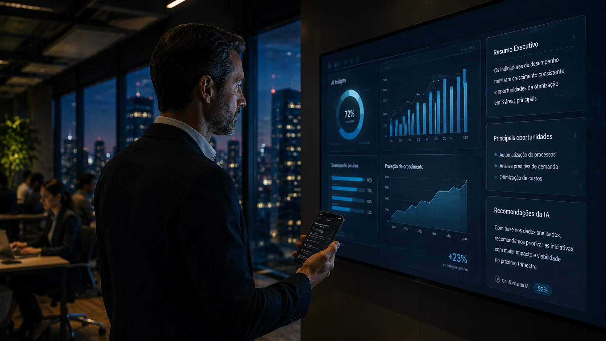

*A corrida da inteligência artificial está entrando em uma nova fase. Depois de dois anos dominados por modelos generativos e infraestrutura de nuvem, o mercado começa a direcionar atenção para outro ativo estratégico: a interface utilizada pelas pessoas para interagir com a IA. Nesse cenário, a **Apple** surge como uma das empresas mais observadas do setor, impulsionada pela possibilidade de transformar o **iPhone** em uma plataforma operacional para agentes inteligentes corporativos.*

## A estratégia de IA da Apple vai além de novos recursos para o iPhone

*O diferencial da Apple pode estar na integração entre dispositivos, contexto e experiência de uso.*

A estratégia de **inteligência artificial** da **Apple** não se resume à adição de funcionalidades inteligentes ao sistema operacional. O movimento aponta para uma tentativa de posicionar o ecossistema da empresa como uma camada permanente de produtividade.

A principal vantagem competitiva da companhia está na combinação entre hardware, software e distribuição. Diferentemente de concorrentes que dependem exclusivamente de aplicativos ou serviços em nuvem, a **Apple** já possui acesso direto a milhões de profissionais que utilizam seus dispositivos diariamente.

### Por que o mercado acompanha essa movimentação?

O interesse do mercado está relacionado ao alcance do ecossistema da empresa.

Enquanto muitas plataformas ainda precisam conquistar usuários, a **Apple** pode distribuir recursos de IA diretamente para dispositivos já inseridos no cotidiano corporativo.

### O contexto pode valer mais do que o modelo

A próxima fase da IA parece depender menos de respostas e mais de contexto.

Temas como memória digital, histórico de interações e compreensão de objetivos ganharam relevância nos últimos meses. Essa tendência se conecta diretamente a análises já publicadas pelo Notícia Tech, como [A próxima guerra da IA pode ser pela sua memória digital](https://noticiatech.com.br/inteligencia-artificial/guerra-memoria-digital-inteligencia-artificial/) e [Context Engineering: a nova corrida silenciosa que pode definir quais agentes de IA realmente funcionam nas empresas](https://noticiatech.com.br/inteligencia-artificial/context-engineering-agentes-ia-empresas/).

## O iPhone pode evoluir para um agente inteligente corporativo

*O smartphone pode deixar de ser apenas uma ferramenta de acesso para se tornar um operador digital.*

O conceito mais relevante por trás da estratégia da **Apple** é a possibilidade de transformar o **iPhone** em um agente inteligente capaz de executar tarefas, interpretar contexto e auxiliar decisões.

Isso representa uma mudança importante na relação entre pessoas e tecnologia.

Em vez de abrir aplicativos e navegar entre sistemas, profissionais poderão interagir diretamente com objetivos e resultados.

### O que muda na prática?

Um executivo pode solicitar um resumo de reuniões, identificar pendências abertas e organizar prioridades sem precisar consultar manualmente múltiplas plataformas.

A IA passa a funcionar como intermediária entre usuário e software.

### O que muda para pequenas empresas?

Pequenas empresas podem obter ganhos significativos de produtividade sem grandes investimentos em infraestrutura.

Entre os benefícios potenciais estão:

- automação de tarefas administrativas;
- organização de informações;
- priorização de atividades;
- apoio à tomada de decisão;
- redução de retrabalho.

### O que muda para grandes organizações?

Grandes empresas enfrentam um desafio diferente: excesso de sistemas.

Nesse contexto, agentes inteligentes podem funcionar como uma camada unificadora capaz de conectar aplicações corporativas e reduzir complexidade operacional.

## Apple, OpenAI, Google e Microsoft disputam a próxima interface da computação

*O mercado de IA está migrando dos modelos para a experiência de uso.*

A competição atual deixou de ser apenas uma corrida por modelos de linguagem.

Empresas como **OpenAI**, **Google**, **Microsoft** e **Apple** passaram a disputar algo ainda mais estratégico: o ponto de contato entre usuários e sistemas inteligentes.

Quem controlar essa interface poderá influenciar a forma como pessoas trabalham, pesquisam informações e tomam decisões.

### A próxima guerra pode acontecer na camada operacional

Historicamente, navegadores e smartphones funcionaram como portas de entrada para a internet.

Agora, agentes inteligentes podem assumir esse papel.

Em vez de procurar informações manualmente, usuários poderão delegar tarefas completas para sistemas capazes de executar ações em múltiplas plataformas.

### O movimento já é visível em todo o setor

Essa transformação aparece em iniciativas ligadas a navegadores inteligentes, agentes corporativos e plataformas operacionais baseadas em IA.

O tema foi explorado pelo Notícia Tech em [Google, OpenAI e Perplexity aceleram corrida pelos navegadores com IA e ameaçam a economia tradicional da web](https://noticiatech.com.br/inteligencia-artificial/google-openai-e-perplexity-aceleram-corrida-pelos-navegadores-com-ia-e-ameacam-a-economia-tradicional-da-web/) e também em [OpenAI e Salesforce aceleram a era do Agentic SaaS e pressionam empresas a repensar seus softwares corporativos](https://noticiatech.com.br/negocios/openai-salesforce-agentic-saas-transformacao-softwares-corporativos/).

## O impacto para empresas pode ser maior do que parece

Empresas estão procurando maneiras concretas de transformar inteligência artificial em vantagem competitiva.

Nesse cenário, a estratégia da **Apple** pode acelerar a adoção corporativa da tecnologia ao reduzir barreiras de uso e integração.

### A privacidade pode se tornar um diferencial competitivo

Um dos pontos mais observados pelo mercado é a forma como a empresa pretende equilibrar IA e proteção de dados.

A aposta em processamento local e integração nativa pode atrair setores que operam sob exigências regulatórias rigorosas, como saúde, finanças e jurídico.

### O smartphone pode continuar no centro da transformação digital

Durante os últimos meses surgiram diversas previsões sobre um futuro pós-smartphone.

No entanto, existe outra hipótese ganhando força.

Em vez de ser substituído, o smartphone pode se tornar a principal plataforma para agentes inteligentes.

Essa possibilidade ajuda a explicar por que os movimentos da **Apple** são acompanhados de perto por investidores, concorrentes e líderes empresariais.

Mais do que lançar novos recursos, a empresa pode estar tentando ocupar uma posição estratégica na próxima geração da computação. Se essa visão se concretizar, o **iPhone** deixará de ser apenas um dispositivo móvel e passará a atuar como uma das principais portas de entrada para a economia dos agentes inteligentes.

 ---