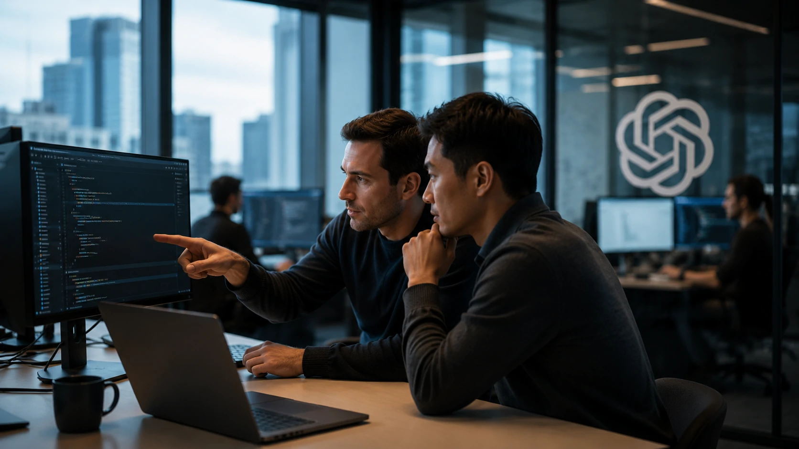
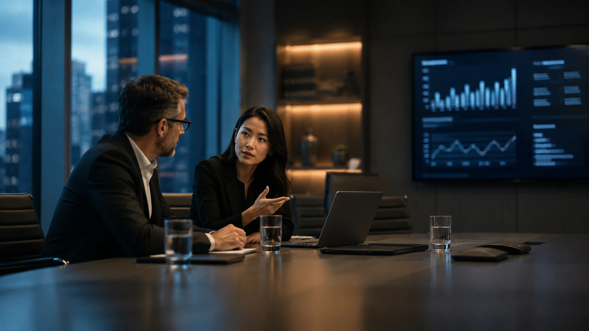
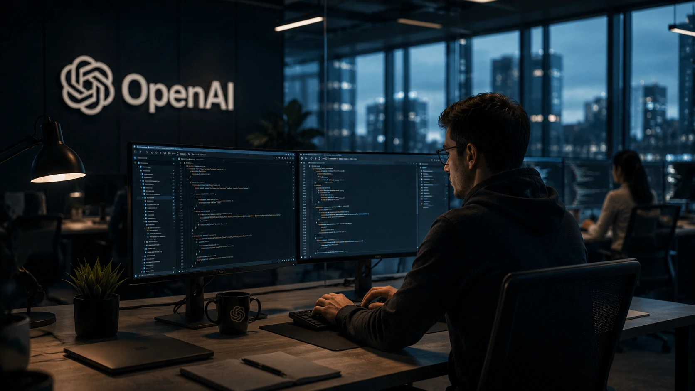

*A corrida pela liderança em inteligência artificial deixou de ser medida apenas pela evolução dos modelos e pelo investimento em infraestrutura. O conflito entre **Apple** e **OpenAI** mostra que o ativo mais disputado do mercado passou a ser o conhecimento acumulado pelos profissionais responsáveis por desenvolver a próxima geração de sistemas inteligentes.*

# Apple processa OpenAI por disputa de talentos e caso pode mudar a corrida da inteligência artificial

A disputa judicial entre **Apple** e **OpenAI** marca uma mudança importante na dinâmica competitiva da inteligência artificial. Em vez de anunciar um novo modelo de IA ou uma infraestrutura mais robusta, duas das empresas mais influentes do setor passaram a disputar espaço nos tribunais.

Segundo informações publicadas pela imprensa internacional, a **Apple** questiona a contratação de profissionais ligados a projetos estratégicos pela **OpenAI**, levantando discussões sobre confidencialidade, propriedade intelectual e transferência de conhecimento técnico.

Mais do que um conflito jurídico, o caso evidencia que a corrida pela liderança em IA entrou em uma nova fase, em que pessoas altamente qualificadas passaram a representar um dos ativos mais valiosos da indústria.

## A disputa por talentos redefine a vantagem competitiva das Big Techs

*Equipes altamente especializadas passaram a representar um dos principais diferenciais competitivos das empresas de inteligência artificial.*

Durante os últimos anos, empresas como **OpenAI**, **Google**, **Anthropic**, **Microsoft** e **Meta** concentraram seus investimentos em infraestrutura computacional, grandes modelos de linguagem e expansão de serviços baseados em IA.

Entretanto, o crescimento acelerado desse mercado revelou um novo gargalo: profissionais capazes de desenvolver modelos avançados são extremamente escassos.

### Conhecimento tornou-se um ativo estratégico

Especialistas em arquitetura de modelos, treinamento de **LLMs**, segurança, inferência e agentes autônomos acumulam experiência que dificilmente pode ser substituída apenas com investimentos em hardware.

Quando uma empresa consegue atrair equipes completas de pesquisadores e engenheiros experientes, ela reduz significativamente o tempo necessário para lançar novas soluções e responder às mudanças do mercado.

### A competição deixou de acontecer apenas entre modelos

Nos últimos anos, comparações entre **GPT**, **Gemini**, **Claude** e **Llama** dominaram a discussão sobre inteligência artificial.

Agora, a competição também ocorre nos bastidores, onde empresas disputam profissionais responsáveis por criar essas tecnologias.

Esse movimento ajuda a explicar por que processos envolvendo propriedade intelectual e mobilidade de talentos ganharam tanta relevância dentro da indústria.

## O processo revela novos desafios para a governança corporativa

*Empresas passaram a equilibrar inovação, retenção de talentos e proteção de conhecimento estratégico.*

Independentemente do desfecho jurídico, o caso reforça uma preocupação crescente entre grandes empresas de tecnologia: como incentivar inovação sem comprometer informações estratégicas.

A proteção de conhecimento interno tornou-se tão importante quanto a proteção de patentes, algoritmos ou infraestrutura tecnológica.

### Empresas precisarão rever políticas internas

A tendência é que organizações fortaleçam contratos de confidencialidade, programas de retenção de talentos e mecanismos internos de gestão do conhecimento.

Esse movimento também pode estimular investimentos em documentação técnica, compartilhamento estruturado de conhecimento e redução da dependência de profissionais específicos.

Além disso, a governança sobre propriedade intelectual deverá ganhar ainda mais relevância à medida que a inteligência artificial se torna um componente central das estratégias corporativas.

### O impacto vai além das Big Techs

Embora o caso envolva duas gigantes do setor, empresas menores também acompanham atentamente seus desdobramentos.

Organizações que desenvolvem soluções baseadas em IA poderão utilizar esse precedente para revisar processos internos, fortalecer políticas de segurança da informação e criar ambientes mais preparados para preservar conhecimento estratégico.

Para compreender como os agentes inteligentes estão transformando a produtividade empresarial, veja também **ChatGPT Work inaugura a era dos agentes de IA para produtividade corporativa**:
https://noticiatech.com.br/inteligencia-artificial/chatgpt-work-era-agentes-ia-produtividade-corporativa/

Outro tema relacionado é **O que é AI Orchestration e por que ela está substituindo a disputa entre modelos de IA nas empresas**, que mostra como a vantagem competitiva está migrando dos modelos para a integração inteligente entre eles:
https://noticiatech.com.br/automacao/o-que-e-ai-orchestration-substitui-disputa-modelos-ia-empresas/

## A guerra por especialistas pode remodelar todo o mercado de IA

*Empresas de tecnologia tratam equipes de IA como ativos estratégicos para manter vantagem competitiva.*

A disputa entre **Apple** e **OpenAI** representa apenas um capítulo de uma transformação muito maior. A corrida pela inteligência artificial deixou de depender exclusivamente da evolução dos modelos e passou a incluir uma competição intensa por profissionais altamente especializados.

Esse movimento tende a aumentar os investimentos em programas de retenção, remuneração baseada em ações e desenvolvimento interno de talentos. Ao mesmo tempo, organizações deverão fortalecer mecanismos de proteção de propriedade intelectual para reduzir riscos relacionados à saída de profissionais estratégicos.

### O custo da escassez continuará aumentando

A oferta de pesquisadores experientes em inteligência artificial permanece limitada diante da crescente demanda global.

Isso significa que salários, bônus, participação societária e benefícios devem continuar aumentando, principalmente para profissionais especializados em modelos fundacionais, agentes autônomos, infraestrutura distribuída e segurança de IA.

Essa valorização poderá ampliar ainda mais a distância entre grandes empresas de tecnologia e organizações menores que também buscam desenvolver soluções baseadas em inteligência artificial.

### O mercado corporativo também será impactado

Embora a disputa aconteça entre gigantes da tecnologia, seus efeitos alcançam empresas de diversos setores.

Negócios que dependem de transformação digital precisarão investir não apenas em ferramentas de IA, mas também em políticas capazes de preservar conhecimento interno, reduzir dependência de profissionais específicos e estruturar processos de sucessão técnica.

A valorização do capital intelectual passa a ser um diferencial competitivo para qualquer organização que utilize inteligência artificial como parte de sua estratégia.

## O caso reforça uma mudança estrutural na corrida da inteligência artificial

Durante muitos anos, a liderança em IA foi associada principalmente ao lançamento de modelos cada vez mais avançados.

Hoje, esse cenário se tornou mais complexo.

### A vantagem competitiva está migrando para o conhecimento

Modelos podem evoluir rapidamente e infraestrutura pode ser adquirida com investimentos bilionários.

Já equipes altamente qualificadas levam anos para serem formadas.

Esse conhecimento acumulado passou a representar um patrimônio estratégico capaz de acelerar inovação, reduzir tempo de desenvolvimento e criar vantagens competitivas sustentáveis.

### Empresas precisarão combinar inovação e governança

A inteligência artificial continuará avançando em ritmo acelerado, mas também exigirá estruturas mais maduras de governança.

Questões relacionadas à confidencialidade, proteção de propriedade intelectual, retenção de talentos e gestão do conhecimento tendem a ganhar ainda mais importância nos próximos anos.

Para organizações que acompanham a evolução da IA, essa mudança representa um sinal claro de que inovação tecnológica e estratégia corporativa caminham cada vez mais lado a lado.

Em vez de encerrar apenas uma disputa judicial, o processo entre **Apple** e **OpenAI** pode marcar o início de uma nova fase da inteligência artificial, na qual o maior diferencial competitivo não será apenas desenvolver o melhor modelo, mas reunir, preservar e potencializar as equipes capazes de construir a próxima geração de tecnologias inteligentes.

---