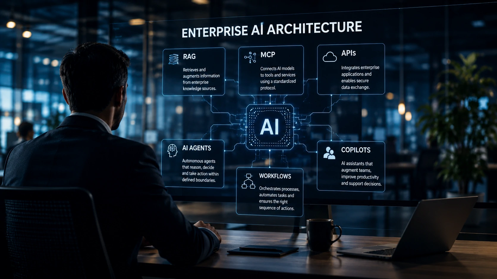
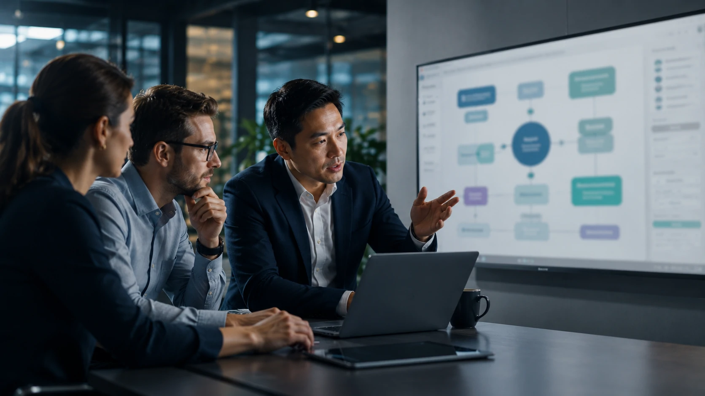

*Nos últimos meses, termos como **MCP**, **RAG**, **Agentes de IA**, **Copilotos**, **APIs** e **AI Orchestration** passaram a aparecer em praticamente todas as discussões sobre transformação digital. O problema é que, normalmente, cada conceito é explicado de forma isolada. Na prática, empresas competitivas utilizam todos esses componentes em conjunto para construir arquiteturas capazes de automatizar processos, conectar sistemas e gerar inteligência de negócio.*

## O que é uma arquitetura moderna de IA empresarial?



*Arquitetura de IA moderna integra diferentes tecnologias em um único ecossistema inteligente.*

Uma arquitetura de **Inteligência Artificial** empresarial representa o conjunto de tecnologias responsáveis por transformar modelos generativos em soluções realmente úteis para o negócio.

Enquanto um chatbot tradicional responde perguntas, uma arquitetura completa consegue acessar documentos, consultar bancos de dados, executar tarefas, conversar com sistemas internos e acionar processos automaticamente.

Nesse cenário, **MCP**, **RAG**, **APIs**, agentes inteligentes e workflows deixam de competir entre si e passam a exercer funções complementares.

### Cada componente resolve um problema diferente

O **RAG** fornece conhecimento atualizado.

O **MCP** conecta ferramentas.

As **APIs** integram aplicações.

Os **Agentes de IA** tomam decisões dentro de limites definidos.

Os **Workflows** organizam toda a sequência operacional.

Essa divisão reduz complexidade, facilita manutenção e permite escalar projetos corporativos.

### A IA deixa de ser apenas um chatbot

A principal mudança é estratégica.

Empresas mais maduras já não enxergam a IA apenas como um assistente conversacional, mas como uma camada inteligente distribuída entre diversos sistemas.

Esse movimento explica o crescimento de arquiteturas baseadas em múltiplos agentes e orquestração inteligente.

Para entender melhor essa evolução, vale conhecer também o artigo **[O que é AI Orchestration? Por que ela substitui a disputa entre modelos de IA nas empresas](https://noticiatech.com.br/automacao/ai-orchestration-empresas-multiplos-agentes-ia/)**.

## Como MCP, RAG e APIs trabalham juntos



*Cada componente possui uma função específica dentro da arquitetura de IA.*

Um dos maiores equívocos é acreditar que **MCP**, **RAG** e **APIs** desempenham exatamente o mesmo papel.

Na realidade, eles atuam em camadas diferentes da arquitetura.

### O papel do RAG

O **RAG** fornece contexto para que o modelo consulte documentos internos antes de responder.

Isso reduz respostas incorretas e melhora a confiabilidade das informações.

### O papel do MCP

Já o **MCP** organiza como modelos descobrem ferramentas, acessam recursos e executam ações em diferentes sistemas.

Ele funciona como um protocolo padronizado para comunicação entre IA e aplicações corporativas.

As **APIs**, por sua vez, continuam responsáveis por conectar sistemas e transportar dados entre plataformas.

Essa combinação cria soluções muito mais flexíveis do que depender apenas de integrações tradicionais.

Se você ainda não conhece o funcionamento do RAG avançado, recomendamos também a leitura de **[O que é GraphRAG e por que ele supera o RAG tradicional nas empresas](https://noticiatech.com.br/inteligencia-artificial/o-que-e-graphrag-supera-rag-tradicional-empresas/)**.

## Agentes de IA e Workflows: onde acontece a automação inteligente


*Os agentes transformam informações em ações enquanto os workflows coordenam toda a operação.*

Depois que **RAG**, **MCP** e **APIs** fornecem conhecimento e conectividade, entram em cena os **Agentes de IA** e os **Workflows**, responsáveis por executar processos completos.

Enquanto um agente pode interpretar uma solicitação, consultar documentos e tomar uma decisão, o workflow garante que cada etapa aconteça na ordem correta, envolvendo pessoas, sistemas e aprovações quando necessário.

Essa combinação permite automatizar atividades muito mais complexas do que simples respostas em um chatbot.

### Como funciona um fluxo na prática

Uma empresa recebe um pedido enviado por e-mail.

O processo pode seguir esta sequência:

1. O workflow identifica a chegada do e-mail.
2. Um agente interpreta a solicitação.
3. O **RAG** consulta contratos e políticas internas.
4. O **MCP** localiza as ferramentas necessárias.
5. As **APIs** enviam informações ao ERP e ao CRM.
6. O agente gera a resposta e registra toda a operação.

Em plataformas como **n8n**, **Make** ou **Zapier**, esse fluxo pode ser implementado visualmente, reduzindo trabalho manual e aumentando a produtividade.

### Exemplo de prompt para um agente corporativo

```text
Você é um agente de atendimento B2B.

Objetivo:
Analisar solicitações comerciais utilizando apenas documentos internos.

Fluxo:
1. Consultar base RAG.
2. Identificar cliente.
3. Validar regras comerciais.
4. Resumir informações.
5. Gerar resposta objetiva.
6. Caso exista dúvida, encaminhar para um colaborador humano.

Formato da resposta:
- Resumo
- Próxima ação
- Nível de confiança
```

Mesmo em arquiteturas avançadas, o conceito de **Human-in-the-Loop** continua essencial. A supervisão humana reduz riscos, valida decisões críticas e evita impactos causados por respostas incorretas ou informações desatualizadas.

## Como montar uma arquitetura de IA preparada para crescer

A escolha das tecnologias deve acompanhar a maturidade da empresa.

Projetos menores normalmente começam utilizando apenas um modelo de linguagem e algumas integrações por API.

À medida que novas demandas surgem, componentes como **RAG**, **MCP**, agentes especializados e orquestração passam a fazer parte da arquitetura.

### Uma arquitetura escalável

Uma estrutura moderna pode ser organizada da seguinte forma:

- **Modelo de IA:** responsável pelo raciocínio.
- **RAG:** fornece contexto corporativo.
- **MCP:** conecta ferramentas e serviços.
- **APIs:** integram aplicações existentes.
- **Agentes:** executam tarefas específicas.
- **Workflows:** coordenam processos completos.
- **Monitoramento:** acompanha desempenho, custos e segurança.

Esse modelo reduz dependências, facilita manutenção e permite substituir componentes sem reconstruir toda a solução.

### O futuro será baseado em ecossistemas inteligentes

A tendência do mercado não aponta para uma única tecnologia dominante, mas para arquiteturas compostas por diversos componentes especializados trabalhando em conjunto.

Empresas que compreenderem o papel de cada elemento conseguirão desenvolver soluções mais flexíveis, seguras e preparadas para evoluir conforme surgirem novos modelos e protocolos.

Mais importante do que escolher entre **MCP**, **RAG**, **APIs** ou **Agentes de IA** é entender como essas tecnologias se complementam para criar uma plataforma inteligente capaz de apoiar decisões, automatizar processos e gerar vantagem competitiva de longo prazo.

---