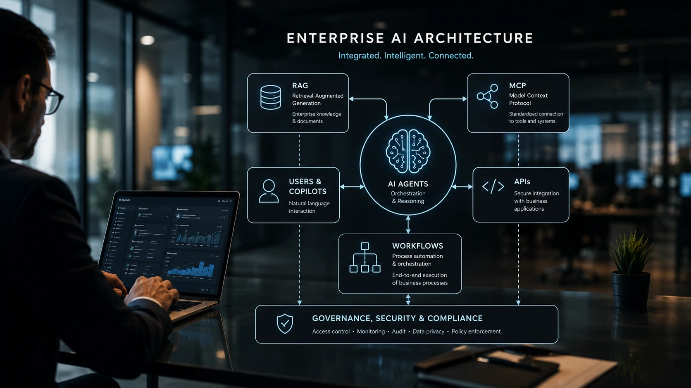
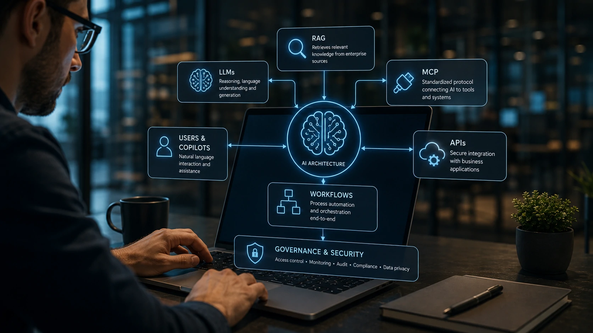
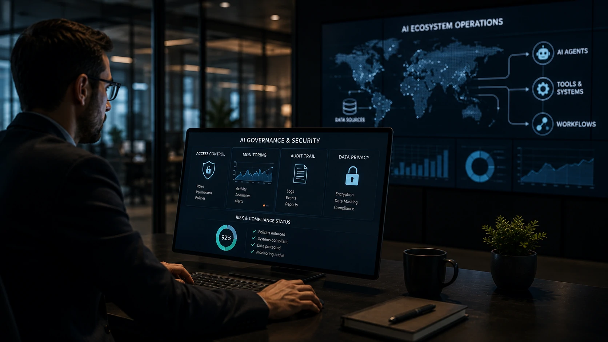

*Enquanto muitas empresas discutem qual modelo de inteligência artificial oferece melhores respostas, a verdadeira vantagem competitiva está na arquitetura que conecta modelos, dados e sistemas corporativos. Compreender como **MCP**, **RAG**, **APIs**, **workflows**, **copilotos** e **agentes de IA** trabalham em conjunto tornou-se um diferencial estratégico para organizações que desejam transformar produtividade em vantagem de mercado.*

*A nova geração da inteligência artificial empresarial deixou de depender apenas da qualidade dos modelos. Hoje, o desempenho é definido pela capacidade de integrar conhecimento, contexto e automação em uma arquitetura capaz de operar de forma segura, escalável e alinhada aos objetivos do negócio.*

## Como funciona a arquitetura moderna da inteligência artificial nas empresas



*Arquiteturas modernas conectam modelos de linguagem, bases de conhecimento, APIs e aplicações corporativas em um único ecossistema inteligente.*

Durante os primeiros anos da **IA generativa**, muitas empresas acreditavam que bastava contratar um modelo como **ChatGPT**, **Claude** ou **Gemini** para iniciar sua transformação digital. A prática mostrou um cenário bastante diferente.

Os modelos de linguagem possuem enorme capacidade de raciocínio, mas não conhecem os processos internos de uma organização, não acessam automaticamente bancos de dados corporativos e tampouco executam tarefas críticas sem integrações específicas.

É justamente nesse ponto que surge a **Arquitetura de IA Empresarial**, um conjunto de componentes responsáveis por transformar um modelo de linguagem em uma plataforma capaz de gerar valor real para o negócio.

### A inteligência artificial deixou de ser apenas um chatbot

Nas empresas, a IA moderna funciona como uma camada de inteligência posicionada sobre diversos sistemas já existentes.

Em vez de substituir o **ERP**, o **CRM**, os sistemas financeiros ou plataformas de atendimento, ela conecta essas soluções para interpretar informações, executar fluxos e apoiar decisões.

Essa mudança explica por que o mercado passou a discutir temas como **MCP**, **RAG**, **AI Orchestration**, agentes inteligentes e governança muito mais do que simplesmente comparar modelos de IA.

### Cada componente possui uma função específica

Uma arquitetura corporativa normalmente reúne diferentes tecnologias trabalhando simultaneamente.

Entre elas estão:

- **Modelo de linguagem (LLM)** responsável pelo raciocínio.
- **RAG** para consultar documentos internos.
- **MCP** para conectar sistemas.
- **APIs** para comunicação entre aplicações.
- **Workflows** que automatizam processos.
- **Agentes de IA** capazes de executar tarefas.
- Camadas de segurança, auditoria e governança.

O diferencial competitivo não está em apenas um desses componentes, mas na forma como eles trabalham em conjunto.

Para compreender como a coordenação entre agentes ocorre na prática, vale conhecer também o artigo **[O que é AI Orchestration? Por que ela substitui a disputa entre modelos de IA nas empresas](https://noticiatech.com.br/automacao/ai-orchestration-empresas-multiplos-agentes-ia/)**, que aprofunda justamente a camada responsável por organizar múltiplas inteligências artificiais.


## Os principais componentes que formam uma arquitetura de IA empresarial



*Cada componente resolve um problema específico. O verdadeiro diferencial está na integração entre todas as camadas da arquitetura.*

Embora existam dezenas de tecnologias envolvidas, praticamente todas as arquiteturas modernas podem ser explicadas por seis blocos fundamentais.

### Modelo de linguagem (LLM)

O **LLM** é o cérebro responsável por interpretar linguagem natural, responder perguntas, gerar conteúdo e tomar decisões baseadas em contexto.

No entanto, ele não conhece automaticamente documentos internos nem possui acesso aos sistemas da empresa.

### RAG (Retrieval-Augmented Generation)

O **RAG** amplia o conhecimento do modelo.

Antes de produzir uma resposta, ele consulta documentos, contratos, bases técnicas, manuais ou políticas internas, reduzindo alucinações e aumentando a precisão das respostas.

Esse mecanismo é especialmente importante para organizações que trabalham com informações constantemente atualizadas.

Caso queira entender em profundidade essa tecnologia, o **Notícia Tech** publicou também **[O que é GraphRAG e por que ele supera o RAG tradicional nas empresas](https://noticiatech.com.br/inteligencia-artificial/o-que-e-graphrag-supera-rag-tradicional-empresas/)**, mostrando como os grafos elevam ainda mais a qualidade da recuperação de contexto.

### MCP (Model Context Protocol)

O **MCP** padroniza a comunicação entre modelos de IA e aplicações externas.

Na prática, ele permite que diferentes modelos utilizem ferramentas, bancos de dados, sistemas internos e aplicações empresariais sem que cada integração precise ser construída do zero.

Essa padronização tende a reduzir custos de desenvolvimento, facilitar manutenção e aumentar a interoperabilidade entre plataformas.

### APIs

As **APIs** continuam sendo responsáveis pela comunicação entre softwares.

Quando um agente consulta um CRM, cria uma oportunidade de venda ou envia uma mensagem ao cliente, normalmente existe uma API realizando essa comunicação nos bastidores.

Elas permanecem como uma das camadas mais importantes da arquitetura moderna.

### Workflows inteligentes

Os **workflows** definem a sequência lógica das operações.

Um fluxo típico pode seguir esta estrutura:

1. Cliente envia uma solicitação.
2. O sistema dispara um gatilho.
3. O agente consulta documentos usando **RAG**.
4. O **LLM** interpreta o contexto.
5. O **MCP** conecta ferramentas corporativas.
6. APIs executam ações.
7. O resultado retorna ao usuário.

Essa organização reduz erros operacionais e torna os processos repetíveis e escaláveis.

### Agentes de IA

Os **agentes inteligentes** representam a evolução mais recente dessa arquitetura.

Em vez de apenas responder perguntas, eles conseguem executar objetivos completos, utilizar múltiplas ferramentas, decidir próximos passos e adaptar seu comportamento conforme o contexto recebido.

É justamente essa combinação entre **LLMs**, **RAG**, **MCP**, **APIs** e **workflows** que explica por que a arquitetura passou a ser considerada muito mais importante do que escolher apenas um modelo de inteligência artificial.

## Governança, segurança e supervisão humana são os pilares da IA empresarial



*Uma arquitetura eficiente não depende apenas de modelos avançados, mas também de governança, auditoria e supervisão humana contínua.*

À medida que a **Inteligência Artificial** assume processos críticos dentro das empresas, cresce também a necessidade de controlar como as decisões são tomadas. Uma arquitetura moderna não termina na integração entre **LLMs**, **MCP**, **RAG** e **APIs**. Ela precisa incorporar mecanismos que garantam segurança, rastreabilidade e conformidade.

Organizações que ignoram essa camada aumentam significativamente os riscos de vazamento de informações, respostas incorretas e decisões automatizadas sem contexto suficiente.

É por isso que temas como governança passaram a ocupar posição central nas estratégias corporativas de adoção da IA.

### Human-in-the-Loop continua indispensável

Mesmo os modelos mais avançados ainda podem apresentar alucinações, interpretar instruções de maneira inadequada ou utilizar informações desatualizadas.

Por esse motivo, processos críticos devem sempre contar com revisão humana antes da execução de ações irreversíveis.

Na prática, o especialista deixa de executar tarefas repetitivas e passa a atuar como supervisor da inteligência artificial, validando decisões estratégicas e corrigindo eventuais inconsistências.

Essa combinação entre automação e supervisão reduz riscos sem comprometer os ganhos de produtividade.

Para compreender por que a proteção dos dados tornou-se uma prioridade para empresas, vale aprofundar também a leitura em **[O que é Segurança em IA e por que ela será prioridade nas empresas](https://noticiatech.com.br/inteligencia-artificial/o-que-e-seguranca-ia-prioridade-empresas/)**.

### Como funciona um fluxo completo de IA empresarial

Uma arquitetura corporativa costuma seguir uma sequência semelhante à abaixo:

1. O usuário inicia uma solicitação em linguagem natural.
2. O agente interpreta o objetivo utilizando um **LLM**.
3. O **RAG** consulta documentos internos atualizados.
4. O **MCP** identifica quais sistemas precisam ser utilizados.
5. As **APIs** executam consultas ou atualizações.
6. O workflow organiza toda a sequência de tarefas.
7. O resultado passa por validação humana quando necessário.
8. A ação é registrada para auditoria e melhoria contínua.

Essa lógica demonstra que nenhum componente trabalha isoladamente. O valor surge da colaboração entre todas as camadas da arquitetura.

### Exemplo de prompt para um agente corporativo

Um dos princípios recomendados para aumentar a qualidade das respostas é fornecer contexto suficiente ao agente.

Exemplo:

```text
Você é um consultor de operações.

Objetivo:
Analisar solicitações de compra da empresa.

Contexto:
Utilize apenas informações presentes na base documental recuperada pelo RAG.

Critérios:
- verificar orçamento disponível;
- identificar fornecedor homologado;
- apontar riscos;
- recomendar aprovação ou reprovação.

Formato da resposta:
Resumo executivo
Análise detalhada
Riscos identificados
Recomendação final
```

Prompts estruturados reduzem ambiguidades e aumentam a previsibilidade dos resultados, principalmente quando integrados a fluxos automatizados.

## O futuro da arquitetura de IA será definido pela integração, não pelo modelo

Nos próximos anos, a vantagem competitiva das empresas dificilmente será determinada apenas por qual modelo de linguagem utilizam.

O verdadeiro diferencial estará na capacidade de integrar **Inteligência Artificial**, dados corporativos, sistemas internos, automações e governança em uma arquitetura escalável.

Modelos continuarão evoluindo rapidamente, mas organizações que construírem uma base tecnológica flexível poderão substituir provedores, incorporar novas ferramentas e adaptar seus processos sem reconstruir toda a infraestrutura.

Essa mudança já pode ser observada nas estratégias das principais empresas de tecnologia, que passaram a investir muito mais em interoperabilidade, protocolos abertos, agentes inteligentes e plataformas de orquestração do que em um único modelo proprietário.

Para gestores e profissionais de tecnologia, compreender essa arquitetura deixa de ser apenas conhecimento técnico. Passa a ser uma competência estratégica para identificar oportunidades, reduzir riscos e preparar a empresa para um cenário em que a **Inteligência Artificial** estará presente em praticamente todos os processos de negócio. É justamente essa visão sistêmica que tende a diferenciar as organizações que apenas utilizam IA daquelas que conseguem transformá-la em uma vantagem competitiva sustentável.

---