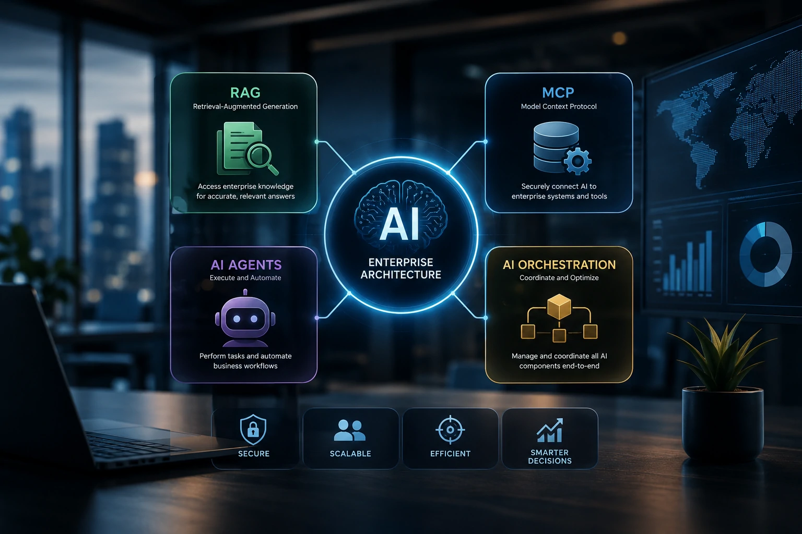
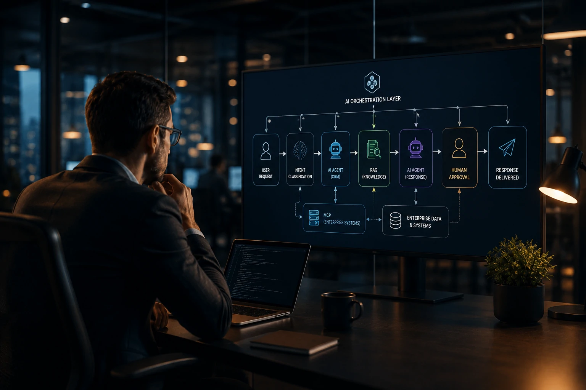
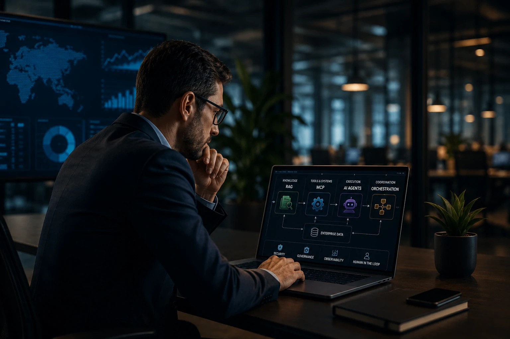

*Durante os últimos dois anos, a Inteligência Artificial deixou de ser apenas um chatbot inteligente. Empresas passaram a construir ecossistemas completos capazes de consultar bases de conhecimento, acessar sistemas internos, executar tarefas e coordenar múltiplos agentes. Essa mudança criou uma nova dúvida recorrente: afinal, como todas essas tecnologias funcionam juntas?*

A adoção da **Inteligência Artificial** nas empresas evoluiu rapidamente. O que antes era apenas uma conversa com um grande modelo de linguagem agora envolve componentes especializados capazes de recuperar informações, acessar sistemas corporativos, executar processos e coordenar fluxos complexos.

Nesse cenário surgem termos como **RAG**, **MCP**, **AI Agents** e **AI Orchestration**. Embora sejam frequentemente apresentados separadamente, eles fazem parte da mesma arquitetura tecnológica.

Este guia mostra como essas peças se conectam e por que compreender essa estrutura tornou-se um diferencial para empresas que desejam escalar projetos de IA com segurança, produtividade e governança.

## O que é uma arquitetura moderna de IA para empresas



*Uma arquitetura corporativa combina modelos de IA, conhecimento empresarial, integrações e automação em um único ecossistema.*

Uma arquitetura moderna de **IA empresarial** pode ser comparada à estrutura de uma organização. O modelo de linguagem representa o cérebro, enquanto outros componentes fornecem memória, acesso a sistemas e capacidade operacional.

Os **LLMs** respondem perguntas, resumem documentos e produzem conteúdo. Porém, sozinhos, possuem limitações importantes: não conhecem dados privados da empresa e não conseguem executar ações em sistemas corporativos.

É justamente por isso que tecnologias complementares passaram a fazer parte da arquitetura.

### O papel do modelo de linguagem

O modelo é responsável pelo raciocínio, compreensão do contexto e geração de respostas.

Entretanto, ele depende de outras camadas para acessar informações atualizadas e realizar tarefas práticas.

### As quatro camadas principais

Uma arquitetura empresarial normalmente reúne:

- **LLM** para interpretação e geração de respostas;
- **RAG** para consultar conhecimento;
- **MCP** para conectar sistemas;
- **Agentes de IA** para executar processos.

Essa organização reduz limitações e aumenta a confiabilidade das respostas produzidas.

## Como RAG, MCP e agentes trabalham juntos

O **RAG** adiciona contexto ao modelo consultando documentos internos, políticas, contratos ou bases técnicas antes da geração da resposta.

Já o **MCP** atua de forma diferente. Em vez de recuperar conhecimento, ele conecta a IA com CRMs, ERPs, bancos de dados, APIs e ferramentas corporativas.

Quem executa efetivamente as tarefas são os **Agentes de IA**, capazes de utilizar essas integrações para realizar operações completas.

Para compreender melhor cada tecnologia, vale aprofundar também em **GraphRAG**, que amplia a recuperação contextual utilizando relacionamentos entre informações:

[O que é GraphRAG e por que ele pode superar o RAG tradicional nas empresas](https://noticiatech.com.br/inteligencia-artificial/o-que-e-graphrag-supera-rag-tradicional-empresas/)

Além disso, empresas que desejam conectar sistemas internos podem conhecer o funcionamento do **Model Context Protocol** neste guia publicado pelo Notícia Tech:

[Como criar um servidor MCP para empresas e integrar IA aos sistemas corporativos](https://noticiatech.com.br/automacao/como-criar-servidor-mcp-empresas-integrar-ia-sistemas/)

### Exemplo prático

Imagine um vendedor perguntando:

> "Quais clientes têm contratos vencendo nos próximos 30 dias e quais apresentam maior potencial de renovação?"

O fluxo ocorre assim:

1. O agente recebe a solicitação.
2. O **MCP** consulta o CRM.
3. O **RAG** recupera políticas comerciais.
4. O modelo interpreta todas as informações.
5. O agente gera o relatório e agenda as próximas ações.

### Onde entra o Human-in-the-Loop

Mesmo com automação avançada, decisões críticas continuam exigindo validação humana.

A supervisão reduz riscos de alucinações, garante conformidade regulatória e evita decisões incorretas baseadas em informações incompletas.

## O papel da AI Orchestration na arquitetura corporativa



*Em arquiteturas modernas, a orquestração distribui tarefas entre modelos, agentes e sistemas corporativos de forma coordenada.*

À medida que as empresas aumentam o número de modelos, integrações e agentes, surge um novo desafio: coordenar todo esse ecossistema.

É exatamente essa a função da **AI Orchestration**.

Enquanto um agente executa uma tarefa específica, a orquestração define qual agente deve atuar, qual ferramenta utilizar, quais dados consultar e em que ordem cada etapa será executada.

Na prática, ela funciona como um maestro conduzindo diversos especialistas.

Sem essa camada, múltiplos agentes poderiam executar atividades redundantes, gerar conflitos ou acessar informações incorretas.

### Exemplo de fluxo completo

Imagine um processo de atendimento B2B:

1. Um cliente envia uma solicitação.
2. O orquestrador identifica o tipo de demanda.
3. Um agente consulta o CRM utilizando **MCP**.
4. Outro agente utiliza **RAG** para recuperar procedimentos internos.
5. Um terceiro agente gera a resposta.
6. O gestor recebe a sugestão para aprovação.
7. Após validação humana, o sistema responde ao cliente.

Esse fluxo reduz tempo operacional e mantém o controle humano sobre decisões críticas.

Quem deseja aprofundar esse conceito pode conferir também o conteúdo publicado pelo **Notícia Tech** sobre **AI Orchestration**:

[O que é AI Orchestration e por que ela será essencial para empresas que usam múltiplos agentes de IA](https://noticiatech.com.br/automacao/ai-orchestration-empresas-multiplos-agentes-ia/)

### Exemplo de prompt para um agente corporativo

```text
Você é um agente de atendimento empresarial.

Objetivo:
Responder solicitações de clientes utilizando apenas documentos internos.

Fluxo:
1. Consultar o RAG.
2. Caso seja necessário acessar dados do cliente, utilizar MCP.
3. Nunca inventar informações.
4. Caso existam dúvidas, encaminhar para aprovação humana.
5. Responder utilizando linguagem corporativa.
```

Esse tipo de prompt ajuda a definir responsabilidades e reduz comportamentos inesperados da IA.

## Como escolher a arquitetura ideal para sua empresa



*Não existe uma arquitetura única para todas as empresas. A maturidade digital determina quais componentes devem ser implementados primeiro.*

Um erro comum é acreditar que toda empresa precisa implementar imediatamente agentes inteligentes e dezenas de integrações.

Na realidade, a melhor arquitetura depende da maturidade tecnológica, da qualidade dos dados e dos objetivos do negócio.

Para pequenas equipes, um **LLM** combinado com **RAG** costuma resolver boa parte das necessidades relacionadas à busca de informações e produtividade.

Empresas que já possuem processos estruturados podem evoluir para integrações via **MCP**, permitindo que a IA consulte sistemas internos com segurança.

Já organizações que buscam automação ponta a ponta encontram nos **Agentes de IA** e na **AI Orchestration** a capacidade de executar processos completos envolvendo múltiplos departamentos.

### Roadmap recomendado

Uma sequência de adoção costuma seguir estas etapas:

1. Implantar um modelo de linguagem.
2. Adicionar **RAG** para utilizar documentos internos.
3. Integrar sistemas utilizando **MCP**.
4. Automatizar tarefas repetitivas com agentes.
5. Implementar uma camada de orquestração.
6. Adotar monitoramento, governança e supervisão humana.

Essa evolução reduz riscos, facilita a gestão e melhora o retorno sobre o investimento.

### O futuro da arquitetura empresarial

A tendência é que empresas deixem de falar apenas sobre modelos como **ChatGPT**, **Claude**, **Gemini** ou **Mistral**.

O diferencial competitivo passará a ser a arquitetura construída ao redor desses modelos.

Organizações capazes de combinar conhecimento corporativo, integrações seguras, agentes especializados e orquestração inteligente terão maior produtividade, melhor governança e maior capacidade de adaptação às mudanças tecnológicas.

Mais do que escolher a melhor IA, o desafio dos próximos anos será construir uma arquitetura capaz de conectar pessoas, dados e processos em um único ecossistema inteligente. É justamente essa integração que deve definir a próxima geração da transformação digital nas empresas.

---