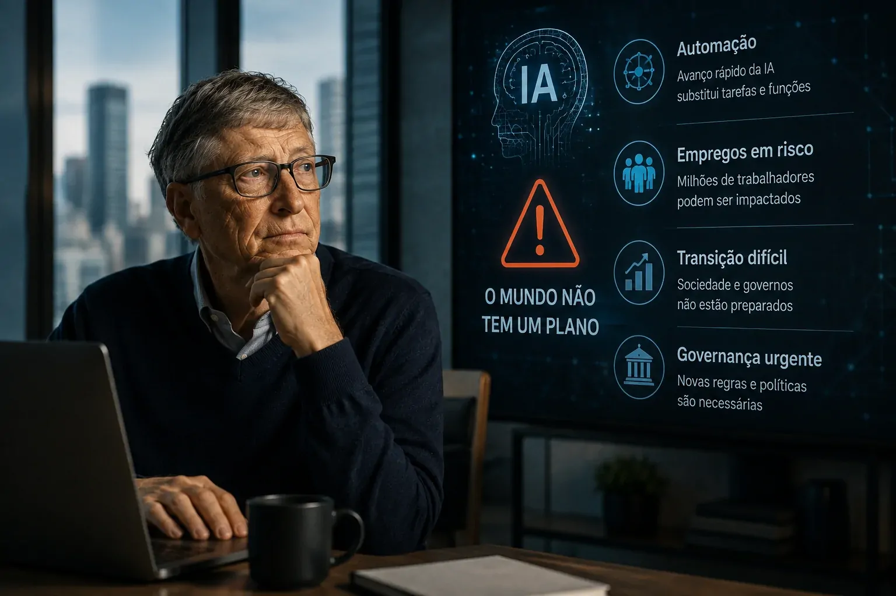
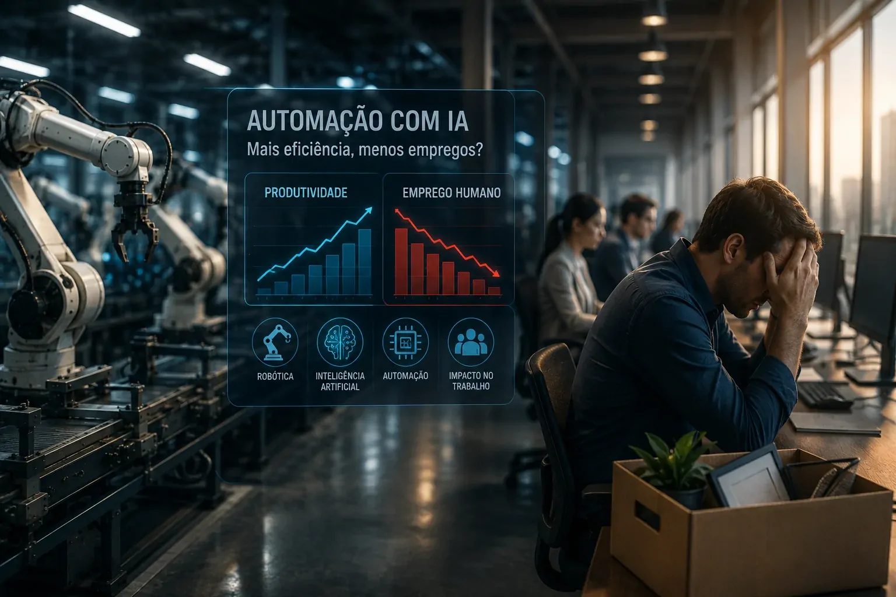

*Bill Gates continua vendo enorme potencial na inteligência artificial, mas seu novo alerta muda o centro da discussão: o desafio agora não é apenas fazer a IA produzir mais, e sim administrar a transição econômica provocada pela automação.*

## Bill Gates mudou a pergunta sobre o futuro da IA

### De otimista tecnológico a defensor de cautela

**Bill Gates** publicou em 26 de agosto um ensaio de quase 6 mil palavras no qual adotou um tom significativamente mais preocupado com os efeitos da **inteligência artificial** sobre empregos, segurança e sociedade. Ele afirmou que gostaria que o avanço de uma nova tecnologia desacelerasse, algo que considera incomum em sua trajetória. 

Isso não significa que Gates tenha passado a rejeitar a IA. O próprio ensaio reconhece benefícios importantes em áreas como saúde, ciência e educação. A mudança está na avaliação de que esses ganhos não acontecerão automaticamente e precisam ser acompanhados por políticas capazes de administrar os custos da transição. 

### O avanço tecnológico chegou antes da preparação institucional

O argumento mais relevante de Gates é que a velocidade da tecnologia pode estar superando a capacidade de governos e empresas de reorganizar trabalho, tributação e mecanismos de proteção. Para ele, esperar que os problemas apareçam para só então reagir aumenta o risco de uma transição desordenada. 

É essa mudança que torna o discurso relevante para negócios. Durante anos, a conversa empresarial sobre IA esteve concentrada em produtividade, redução de custos e novas capacidades. Gates está colocando outra pergunta no centro: **como uma empresa administra uma tecnologia que pode alterar a própria estrutura do trabalho?**

## O problema deixou de ser apenas produtividade

*O avanço da IA começa a deslocar a discussão empresarial de produtividade para reorganização da força de trabalho.*

### A automação pode atingir mais do que tarefas administrativas

A primeira fase da adoção corporativa de **IA** concentrou-se principalmente em atividades digitais e tarefas repetitivas. O alerta de Gates é que a combinação entre modelos mais capazes e robôs mais eficientes pode ampliar a pressão para ocupações que até agora pareciam menos expostas à automação. 

Isso muda a natureza do planejamento empresarial. Se uma tecnologia passa de ferramenta de apoio para substituta parcial de determinadas tarefas, o investimento deixa de ser apenas uma decisão sobre software. Ele passa a envolver estrutura organizacional, treinamento, contratação e distribuição de responsabilidades.

### A transição econômica pode se tornar o novo desafio

O ponto central não é que todos os empregos desaparecerão. A questão é que algumas funções podem ser reduzidas ou transformadas mais rapidamente do que trabalhadores conseguem migrar para novas ocupações. Gates considera esse descompasso um problema econômico que não pode ser resolvido apenas dizendo aos profissionais para aprenderem novas habilidades. 

Para empresas, isso cria uma camada adicional de planejamento. A adoção de **IA** pode aumentar produtividade e, ao mesmo tempo, exigir investimentos em requalificação, redesenho de funções e gestão da transição. Essa combinação tende a tornar o cálculo de retorno sobre automação mais complexo.

## A proposta mais controversa de Gates é reservar trabalho para humanos

### O que significa Human Reserved

Gates propôs o conceito de **“Human Reserved”**, pelo qual determinadas atividades poderiam ser deliberadamente reservadas para pessoas mesmo quando sistemas de IA ou robôs fossem tecnicamente capazes de realizá-las. Ele cita situações em saúde, educação, cuidado e outras funções nas quais a dimensão humana pode ter valor além da eficiência. 

A proposta não significa simplesmente proibir IA. Em alguns casos, a tecnologia poderia continuar sendo utilizada como ferramenta de apoio enquanto determinadas responsabilidades permaneceriam humanas. Em outros, a proteção poderia ser temporária para dar tempo aos trabalhadores de uma área em transformação. 

### O problema para as empresas é decidir onde termina a automação

É justamente aqui que a proposta de Gates deixa de ser apenas uma discussão sobre tecnologia e entra no território da **governança corporativa**. Se determinadas funções forem consideradas importantes demais para serem totalmente automatizadas, empresas precisarão lidar com regras, critérios e responsabilidades diferentes.

Ainda não existe uma definição universal de quais empregos deveriam ser classificados dessa maneira. O próprio debate levanta perguntas difíceis: quem decide, quais critérios devem ser usados e como impedir que empresas contornem as regras? 

## Gates também quer mudar o incentivo econômico à automação

*Bill Gates argumenta que o sistema tributário atual pode criar incentivos diferentes para contratar pessoas e investir em máquinas.*

### Por que ele fala em taxar robôs e tokens

Gates também defende uma mudança na tributação. Segundo seu argumento, uma empresa que contrata uma pessoa paga impostos relacionados à folha de pagamento, enquanto a aquisição de um robô pode receber tratamento fiscal diferente. Na visão dele, essa estrutura pode criar um incentivo adicional para substituir trabalho humano por máquinas. 

A proposta é aplicar algum tipo de imposto sobre **robôs e tokens de IA**, desacelerando parcialmente o ritmo de substituição e criando recursos para financiar requalificação e redes de proteção social. Gates reconhece que o desenho desse mecanismo precisaria evitar que usos considerados benéficos da IA fossem prejudicados. 

### O impacto potencial sobre a estratégia empresarial

Se uma política desse tipo fosse adotada, o custo econômico da automação mudaria. Investimentos em IA deixariam de ser avaliados apenas pela economia de mão de obra e poderiam incorporar custos tributários associados ao uso da tecnologia.

Isso não significa que a proposta esteja próxima de virar lei. Ela é uma sugestão de política pública apresentada por Gates. Mas sua existência é relevante porque coloca no debate uma questão que empresas precisarão acompanhar: **o ambiente regulatório pode passar a tratar automação e trabalho humano de maneira diferente da atual.**

## A discussão de Gates já ultrapassou as fronteiras dos Estados Unidos

### A conversa com Xi Jinping

A mudança de discurso também ganhou dimensão internacional. **Bill Gates** pretende discutir políticas globais de IA com o presidente chinês **Xi Jinping**, em uma possível reunião durante uma viagem à China prevista para novembro, segundo a Reuters. Gates defende que Estados Unidos e China trabalhem em mecanismos para reduzir riscos associados a modelos de IA potencialmente perigosos. 

Entre os temas citados por Gates está o monitoramento da capacidade de sistemas de IA criarem moléculas perigosas e facilitarem ataques biológicos. A proposta amplia a discussão para além de emprego e produtividade, colocando segurança e governança internacional no mesmo debate. 

### O precedente para a governança da IA

A preocupação de Gates é que determinados riscos não possam ser administrados por uma única empresa ou país. Se sistemas avançados forem capazes de produzir efeitos que atravessam fronteiras, regras exclusivamente nacionais podem não ser suficientes.

Ainda não há acordo internacional que corresponda à visão defendida por Gates. O que existe, neste momento, é uma tentativa de colocar a governança da **IA avançada** no mesmo nível de prioridade de outras tecnologias consideradas capazes de produzir impactos sistêmicos.

## O que muda para as empresas a partir dessa discussão

*O próximo estágio da adoção de IA pode exigir das empresas decisões sobre pessoas, processos e governança além da escolha das ferramentas.*

### Produtividade não será mais o único indicador

Para as empresas, a principal consequência do novo discurso de **Bill Gates** não é a necessidade imediata de adotar ou abandonar determinada tecnologia. É a ampliação do conjunto de variáveis que precisa entrar no planejamento.

A empresa que avalia automação apenas pelo ganho de produtividade pode ignorar custos de transição, mudanças regulatórias, necessidade de novas competências e funções que continuarão dependendo de julgamento humano. O debate sobre IA começa, portanto, a se aproximar do planejamento estratégico de força de trabalho.

Essa discussão já aparece em diferentes frentes do mercado. Enquanto empresas avançam para agentes capazes de executar tarefas, o próprio Notícia Tech mostrou como **Sam Altman** colocou a automação do trabalho no centro de uma discussão sobre o futuro dos e-mails e das atividades digitais: **[a experiência de Sam Altman mostra o desafio de trabalhar sem IA](https://noticiatech.com.br/inteligencia-artificial/sam-altman-e-mails-sem-ia-desafio-automacao/)**.

### A próxima disputa pode ser sobre os limites da automação

O avanço da IA continuará pressionando empresas a decidir onde automatizar, onde complementar profissionais e onde preservar participação humana. Essa fronteira não será determinada apenas pela capacidade técnica dos modelos, mas também por custo, risco, regulação e valor atribuído ao trabalho humano.

É nesse ponto que o alerta de Gates ganha importância. A questão empresarial já não é somente **“o que a IA consegue fazer?”**, mas também **“o que uma empresa deve permitir que ela faça?”**

Essa mudança de perspectiva acontece enquanto a infraestrutura e as capacidades dos sistemas continuam avançando. A própria corrida por modelos e aplicações empresariais mostra que a IA está se tornando parte cada vez mais estrutural das operações, como ocorre com a expansão da busca agentiva discutida pelo **Mistral** em documentos complexos: **[a nova geração de agentes de IA começa a disputar tarefas empresariais mais complexas](https://noticiatech.com.br/inteligencia-artificial/mistral-agentic-search-documentos-complexos-ia/)**.

O ensaio de **Bill Gates** não apresenta uma solução definitiva para essa transição. Ele apresenta um problema que empresas, governos e trabalhadores ainda estão tentando dimensionar. A diferença é que, agora, a discussão começa a sair do campo da promessa de produtividade e entrar no terreno mais difícil da distribuição dos ganhos, dos custos da automação e dos limites que a sociedade estará disposta a estabelecer.

Para empresas, acompanhar essa mudança pode ser tão importante quanto acompanhar a evolução dos próprios modelos de **IA**. A tecnologia continuará avançando. A questão estratégica será decidir como incorporar esse avanço sem transformar eficiência de curto prazo em um problema maior de longo prazo.

---