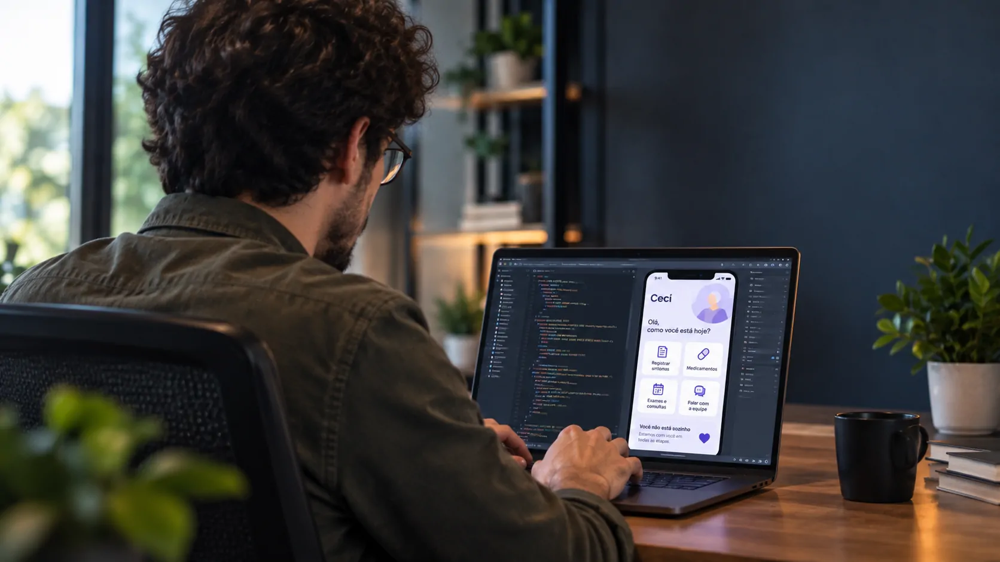
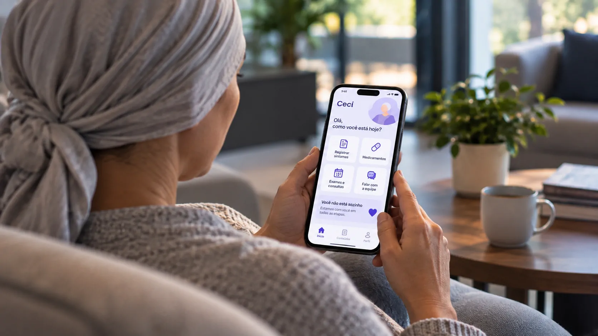
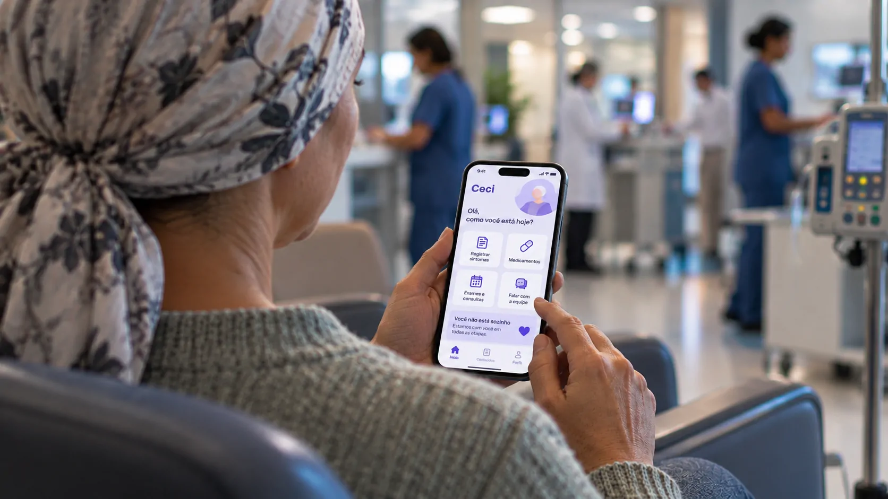

*Uma experiência familiar durante um tratamento contra o câncer acabou dando origem a uma tecnologia brasileira de acompanhamento oncológico. O caso mostra como uma necessidade observada de perto pode se transformar em uma solução digital com escala e impacto concreto na jornada do paciente.*

## A experiência com a mãe mostrou um problema que a tecnologia poderia ajudar a acompanhar

A criação do aplicativo começou a partir de uma experiência pessoal de **César Filho**, biólogo que acompanhou de perto o tratamento da própria mãe, Dona Cida. Foi durante essa jornada que ele percebeu dificuldades que iam além do atendimento dentro do hospital.

### O tratamento não termina quando o paciente sai do hospital

A rotina de quem enfrenta um câncer envolve consultas, medicamentos, exames, efeitos colaterais e dúvidas que podem surgir entre uma visita e outra. Para familiares e cuidadores, acompanhar essas mudanças também pode ser difícil.

Foi nesse espaço entre o atendimento presencial e a rotina em casa que surgiu a ideia de criar uma ferramenta capaz de registrar informações e aproximar o paciente de uma estrutura de apoio.

### O primeiro aplicativo nasceu antes da empresa

Antes de transformar a ideia em negócio, **César Filho** precisou encontrar maneiras de financiar o desenvolvimento. Segundo a história contada pela própria empresa, ele chegou a vender brigadeiros durante a universidade e outros produtos para conseguir recursos.

Com ajuda de amigos, desenvolveu a primeira versão do aplicativo. A ideia ainda era pequena, mas já partia de um problema concreto vivido por uma família.

## A história ganhou escala quando outro filho encontrou o mesmo problema

*Uma necessidade observada durante o tratamento familiar deu origem ao desenvolvimento de uma ferramenta digital para acompanhamento de pacientes.*

A **WeCancer** surgiu oficialmente em 17 de janeiro de 2017, quando César Filho se uniu a **Lorenzo**. Os dois haviam acompanhado suas respectivas mães durante tratamentos contra o câncer e perceberam que experiências diferentes apresentavam desafios semelhantes.

### Duas experiências, um mesmo desafio

A mãe de César, Dona Cida, realizou seu tratamento pelo **SUS**. A mãe de Lorenzo, Nick, passou pela rede privada. Apesar das diferenças entre os dois contextos, os fundadores identificaram dificuldades comuns na jornada do paciente.

Essa percepção ajudou a transformar uma iniciativa individual em uma empresa dedicada ao desenvolvimento de tecnologia para acompanhamento oncológico.

### O projeto encontrou espaço no ecossistema de saúde

Em 2018, a empresa se mudou para São Paulo e passou a funcionar na **Eretz Bio**, incubadora do **Hospital Israelita Albert Einstein**. No ano seguinte, o Einstein tornou-se o primeiro investidor institucional da empresa.

Em 2021, a **VOX Capital** anunciou investimento na WeCancer. O movimento ajudou a colocar a solução dentro de uma lógica maior de tecnologia aplicada à saúde, conectando cuidado, dados e acompanhamento remoto.

## O aplicativo transformou a rotina do paciente em dados que podem ser acompanhados

O **Cecí**, nome atual do aplicativo, permite que pacientes registrem informações sobre sua rotina e sintomas, criando um histórico que pode ajudar no acompanhamento durante o tratamento.

### Sintomas podem ser registrados diariamente

Entre os recursos estão o registro diário de sintomas e o acompanhamento por profissionais de saúde. O paciente também pode conversar pelo aplicativo com enfermeiros e receber suporte de nutricionistas e psicólogos.

A plataforma reúne ainda conteúdos sobre câncer e bem-estar, além de lembretes relacionados a medicamentos, exames e consultas.

### O objetivo é levar parte do cuidado para fora do hospital

A proposta não é substituir o médico ou o tratamento presencial. O papel da tecnologia é complementar o cuidado, facilitando a comunicação e permitindo que determinadas informações da rotina do paciente sejam registradas de forma organizada.

Quando existe vínculo com um hospital ou centro de tratamento parceiro, esses dados também podem contribuir para que a equipe médica acompanhe a evolução do paciente à distância.

Esse modelo se conecta a uma transformação mais ampla na saúde brasileira: o uso de tecnologia para acompanhar pacientes fora das estruturas hospitalares. O **Notícia Tech** já mostrou como esse conceito aparece em soluções de **[UTIs inteligentes que utilizam uma central de IA para acompanhar informações em tempo real](https://noticiatech.com.br/inteligencia-artificial/sus-utis-inteligentes-central-ia-tempo-real/)**.

## A mudança para Cecí preservou a tecnologia e reforçou a história das mães

*O Cecí concentra registros, comunicação com profissionais de saúde e informações para apoiar o paciente durante a jornada oncológica.*

Em junho de 2024, o aplicativo deixou de se chamar **WeCancer** e passou a se chamar **Cecí**. A mudança teve uma razão diretamente ligada à história dos fundadores e às pessoas que deram origem ao projeto.

### O novo nome é uma homenagem

Segundo a empresa, **Cecí** significa “mãe” em tupi-guarani e foi escolhido para homenagear Dona Cida e Nick, as mães de César e Lorenzo.

A alteração também buscou tornar a identidade do aplicativo mais acolhedora, sem abandonar a proposta original de oferecer suporte durante a jornada contra o câncer.

### A plataforma continuou gratuita para pacientes

A mudança de marca não significou abandonar a proposta de acesso ao cuidado. A **WeCancer** informa que o aplicativo e seu atendimento para pacientes continuam gratuitos.

Esse detalhe é relevante porque coloca a tecnologia em uma posição diferente de aplicativos convencionais de saúde voltados principalmente ao consumidor pagante.

## Mais de 26 mil pacientes mostram como uma solução pequena pode ganhar escala

A **WeCancer informa que já transformou a vida de mais de 26 mil pacientes** desde sua criação. O número representa uma evolução significativa em relação aos primeiros milhares registrados pela empresa nos anos iniciais.

### A escala veio de um problema muito específico

A trajetória mostra uma característica comum em tecnologias de saúde que conseguem encontrar espaço no mercado: a solução não nasceu de uma tentativa genérica de “digitalizar a saúde”.

Ela começou com uma situação concreta. Um familiar percebeu uma dificuldade durante o tratamento, transformou essa dificuldade em uma hipótese de produto e, posteriormente, encontrou parceiros e estrutura para ampliar a solução.

Esse percurso também ajuda a explicar por que tecnologias de acompanhamento remoto podem ganhar relevância: elas atacam uma parte da jornada que acontece longe do consultório, justamente quando o paciente continua precisando de informação e suporte.

### A tecnologia também interessa às instituições de saúde

Para hospitais e centros especializados, o valor potencial está menos no aplicativo como produto isolado e mais na possibilidade de acompanhar informações da jornada do paciente de maneira estruturada.

Esse movimento faz parte de uma transformação maior no setor. O avanço de tecnologias digitais na saúde também aumenta a necessidade de estabelecer regras claras sobre como médicos e instituições podem utilizar ferramentas de **IA** e dados de pacientes, tema que já vem sendo acompanhado no Brasil pelo **[debate sobre novas regras para o uso de IA por médicos e instituições de saúde](https://noticiatech.com.br/inteligencia-artificial/brasil-cria-novas-regras-uso-ia-medicos-instituicoes-saude/)**.

## O próximo passo é transformar acompanhamento digital em cuidado contínuo

*O acompanhamento digital cria uma ponte entre a rotina do paciente e os profissionais envolvidos no cuidado, ampliando o suporte para além do ambiente hospitalar.*

A trajetória da **WeCancer** sugere que o principal valor de uma tecnologia de saúde pode estar menos em substituir profissionais e mais em criar uma camada de acompanhamento entre os momentos presenciais do tratamento.

### O desafio está na qualidade do acompanhamento

Registrar sintomas é apenas o primeiro passo. Para que dados produzidos pelo paciente tenham utilidade real, eles precisam ser organizados, interpretados e encaminhados para as pessoas certas quando necessário.

É justamente nessa conexão entre informação, equipe de saúde e paciente que soluções de monitoramento remoto podem ganhar importância.

### A história começou com uma família, mas chegou a uma rede maior

O caso de **César Filho** mostra uma trajetória que começou em uma experiência pessoal e passou por desenvolvimento tecnológico, incubação, investimento e expansão.

O aplicativo que nasceu depois de ele acompanhar a própria mãe hoje faz parte de uma estrutura de cuidado que, segundo a empresa, já alcançou mais de 26 mil pacientes. A mudança de **WeCancer para Cecí** preservou essa origem e transformou a história das duas mães em parte da identidade da plataforma.

Para o mercado de tecnologia em saúde, o caso deixa uma mensagem mais concreta do que a ideia genérica de que “a tecnologia pode ajudar”: soluções digitais ganham relevância quando conseguem resolver uma dificuldade específica da vida real e transformar essa solução em um processo que pode ser repetido em escala.

---