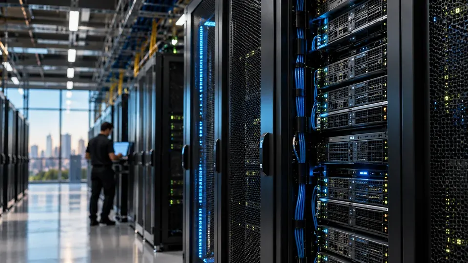
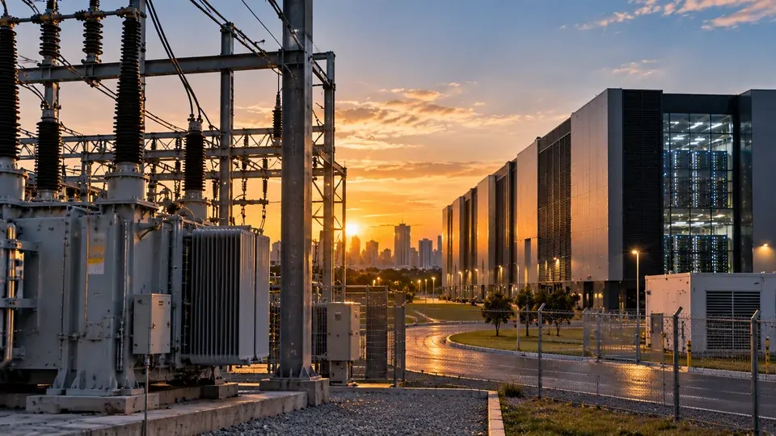
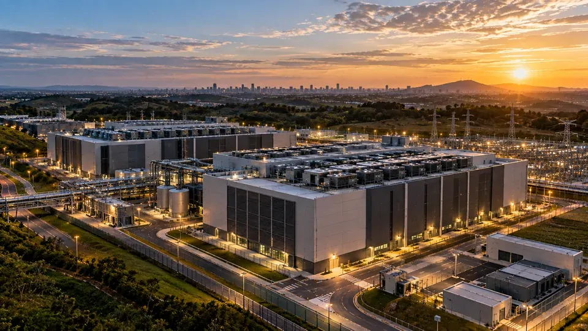

*O Brasil está ampliando rapidamente a infraestrutura que sustenta a economia digital. Com 706 MW de capacidade instalada em data centers e novos projetos previstos para 2026, a expansão acompanha uma necessidade cada vez mais concreta: processar a quantidade crescente de dados e cargas computacionais associadas à inteligência artificial.*

## Brasil já tem 706 MW de capacidade instalada

O Brasil encerrou o primeiro semestre de 2026 com **706 MW** de capacidade instalada em **data centers**, segundo levantamento da **JLL**. O volume é mais de seis vezes superior ao registrado em 2012, mostrando como a infraestrutura digital brasileira ganhou escala em pouco mais de uma década.

### Um salto que deixou de ser apenas promessa

Somente nos primeiros seis meses de 2026, foram entregues **106 MW** de nova capacidade. Outros **134 MW** estão previstos até dezembro, o que coloca o ano entre os períodos de maior expansão do setor no país.

A taxa de vacância nacional também ajuda a dimensionar a demanda. Segundo a JLL, ela está em apenas **4%**, enquanto 56% do novo estoque que está em construção já foi pré-locado.

### A capacidade precisa acompanhar a computação

A importância desses números vai além do mercado imobiliário. Um data center é a infraestrutura física onde ficam servidores, sistemas de armazenamento, redes e equipamentos responsáveis por processar dados e aplicações digitais.

No caso da **IA**, a exigência computacional pode ser ainda maior. Modelos precisam de capacidade para treinamento, processamento e inferência, etapa em que um sistema já treinado gera respostas e executa tarefas para usuários.

## A IA está mudando a escala da infraestrutura digital

*Grandes instalações de computação precisam combinar servidores, armazenamento, conectividade e energia para atender à nova demanda criada pela IA.*

A expansão dos data centers acontece em um momento em que empresas brasileiras ampliam o uso de inteligência artificial em diferentes áreas. Isso significa que a demanda não vem apenas dos grandes laboratórios que desenvolvem modelos, mas também de aplicações corporativas que dependem de computação em nuvem e processamento de dados.

### Mais IA significa mais processamento

Uma ferramenta de IA pode parecer um serviço totalmente digital para o usuário, mas sua operação depende de uma cadeia física. Servidores precisam executar os modelos, armazenar informações, transportar dados pela rede e responder às solicitações em tempo real.

Esse movimento ajuda a explicar por que **data centers**, **cloud computing**, GPUs e conectividade passaram a fazer parte da mesma discussão estratégica. Para empresas que estão aumentando a adoção de IA, a disponibilidade dessa infraestrutura influencia capacidade, latência e, em determinadas aplicações, custos.

Essa mudança aparece também no comportamento das empresas. O crescimento da adoção corporativa de IA no Brasil mostra que a demanda por computação não está restrita aos provedores de tecnologia. **Empresas brasileiras** já utilizam IA em diferentes níveis para automatizar processos e apoiar operações, ampliando o mercado consumidor dessa infraestrutura. **[Veja como empresas brasileiras estão avançando no uso de IA](https://noticiatech.com.br/inteligencia-artificial/empresas-brasileiras-usam-ia-nivel-avancado/)**.

### O mercado está construindo antes da demanda chegar ao limite

Outro sinal relevante é o volume de capacidade que já está sendo construído. A JLL aponta **660 MW em construção** no Brasil e projeta que o mercado dobre de tamanho até 2030.

O fato de parte relevante dessa capacidade já estar pré-locada reduz a interpretação de que toda a expansão seja apenas uma aposta especulativa. Existe demanda contratada por empresas que precisam ampliar sua capacidade computacional.

## São Paulo continua no centro, mas novos polos aparecem

A concentração geográfica é outro aspecto importante dessa corrida. **São Paulo** continua sendo o principal hub brasileiro de data centers, concentrando 38% dos megawatts instalados no país, segundo a JLL.

### Campinas e Barueri concentram capacidade

**Campinas** e a região de **São Paulo e Barueri** formam os principais polos operacionais do mercado brasileiro. Juntos, os dois submercados concentram mais da metade da capacidade instalada do país.

Essa concentração não acontece por acaso. Data centers precisam de conectividade robusta, disponibilidade de energia, proximidade de grandes mercados consumidores e infraestrutura capaz de suportar operações contínuas.

### Fortaleza surge como novo polo

Ao mesmo tempo, **Fortaleza** ganhou espaço no mapa. A cidade possui **227 MW em construção**, segundo a JLL, e grande parte dessa capacidade já está pré-locada por uma grande empresa de tecnologia chinesa.

O movimento mostra que a expansão não precisa ficar limitada ao eixo tradicional do Sudeste. Regiões com disponibilidade energética e condições adequadas de conectividade podem ganhar importância conforme novos projetos procuram espaço para crescer.

Para o mercado brasileiro, essa descentralização pode ser relevante porque reduz a dependência de poucos polos e cria novas oportunidades para fornecedores de energia, conectividade, segurança, construção e serviços especializados.

## Energia pode definir até onde essa expansão consegue chegar

*O crescimento dos data centers depende não apenas de servidores, mas também da disponibilidade de energia e da capacidade de conexão à rede elétrica.*

Construir um data center não significa apenas levantar um prédio e instalar servidores. A operação depende de uma infraestrutura energética capaz de fornecer eletricidade de forma contínua e confiável.

### Computação e energia caminham juntas

Essa relação se torna ainda mais importante com a expansão da **IA**, porque cargas computacionais intensivas podem aumentar significativamente a demanda energética de grandes instalações.

O Brasil possui uma vantagem relevante em disponibilidade de energia renovável, mas isso não significa que qualquer região tenha capacidade imediata para receber um grande data center. Geração, transmissão e conexão precisam estar disponíveis no local e no prazo exigido pelo projeto.

Essa questão já aparece como um dos principais pontos de atenção do setor. A própria JLL destaca energia e infraestrutura como fatores que influenciam a localização dos novos empreendimentos.

### O gargalo não está apenas dentro do data center

A expansão também depende de infraestrutura externa. Linhas de transmissão, subestações, fibra óptica e conexões de rede precisam acompanhar o ritmo das construções.

Isso cria uma situação particular: um projeto pode ter capital, terreno e equipamentos disponíveis, mas ainda depender de uma conexão energética adequada para começar a operar plenamente.

A discussão sobre infraestrutura energética ganhou ainda mais importância justamente porque a expansão da IA aumenta a quantidade de computação necessária. O tema já aparece associado aos limites físicos que podem acompanhar o crescimento dos data centers no Brasil.

## Os bilhões mostram que a corrida já entrou na economia real

Os números de investimento ajudam a dimensionar a transformação. A JLL estima aproximadamente **US$ 8 bilhões** em investimentos relacionados às novas entregas previstas para 2026.

### O mercado está atraindo novos projetos

O valor não representa apenas gasto com servidores. A expansão envolve terrenos, construção, sistemas elétricos, refrigeração, conectividade, segurança física e digital e equipamentos especializados.

Até 2030, a JLL estima **660 MW em construção** e aproximadamente **US$ 17,4 bilhões** em investimentos, além de milhares de megawatts adicionais em projetos planejados.

Esse volume transforma os data centers em uma questão de infraestrutura econômica. A capacidade de processamento passa a ter relação direta com a capacidade de empresas oferecerem serviços digitais, aplicações de IA e plataformas em escala.

### Cloud e IA ampliam o mercado consumidor

Os grandes provedores de nuvem e empresas de tecnologia estão entre os principais demandantes dessa capacidade. Ao mesmo tempo, companhias de outros setores dependem cada vez mais da nuvem para armazenar dados, executar sistemas e incorporar inteligência artificial aos processos.

É nesse ponto que a expansão dos data centers deixa de ser um assunto restrito ao setor de tecnologia. Bancos, varejistas, indústrias, empresas de serviços e negócios digitais dependem dessa infraestrutura para operar aplicações cada vez mais intensivas em dados.

O crescimento da capacidade brasileira, portanto, cria uma camada física para uma economia que está se tornando progressivamente mais dependente de processamento computacional.

## A corrida brasileira ainda depende de infraestrutura suficiente

*Novos campi de data centers representam uma combinação de infraestrutura física, energia, conectividade e capacidade computacional para sustentar serviços digitais em escala.*

O Brasil já entrou em uma fase de expansão acelerada dos data centers, mas os próximos passos dependerão da capacidade de transformar projetos em operações efetivas.

### O desafio será sincronizar diferentes infraestruturas

Um data center precisa chegar ao mesmo tempo que energia, conectividade, equipamentos e demanda. Se um desses componentes atrasar, a capacidade física construída pode não se transformar imediatamente em capacidade computacional disponível.

Esse ponto é especialmente importante para a **inteligência artificial**. A construção de servidores e instalações pode aumentar a oferta, mas o benefício econômico depende de essas estruturas conseguirem operar com eficiência e atender clientes.

O cenário atual sugere que a disputa não será apenas por espaço físico. Energia, conectividade, equipamentos de computação e capacidade de expansão também fazem parte da competição entre os diferentes polos brasileiros.

### O que acompanhar daqui para frente

Os próximos indicadores mais importantes serão a entrada em operação dos **134 MW previstos para 2026**, a evolução dos **660 MW em construção** e a capacidade de novos polos atraírem projetos fora dos principais centros atuais.

Também será necessário acompanhar como o setor resolverá seus gargalos de energia e conectividade. A expansão da infraestrutura brasileira já acompanha a explosão da IA, mas a velocidade dessa expansão dependerá de quanto o país consegue alinhar construção, energia e demanda computacional.

A mudança mais importante, portanto, é que **IA deixou de ser apenas uma questão de software**. À medida que modelos e aplicações ganham escala, a capacidade de processamento passa a depender de uma infraestrutura física cada vez maior — e o Brasil está construindo parte dela agora. Para as empresas, isso significa que a próxima etapa da adoção de IA será influenciada não apenas pelos modelos disponíveis, mas também por onde e como a computação necessária para executá-los estará instalada.

---