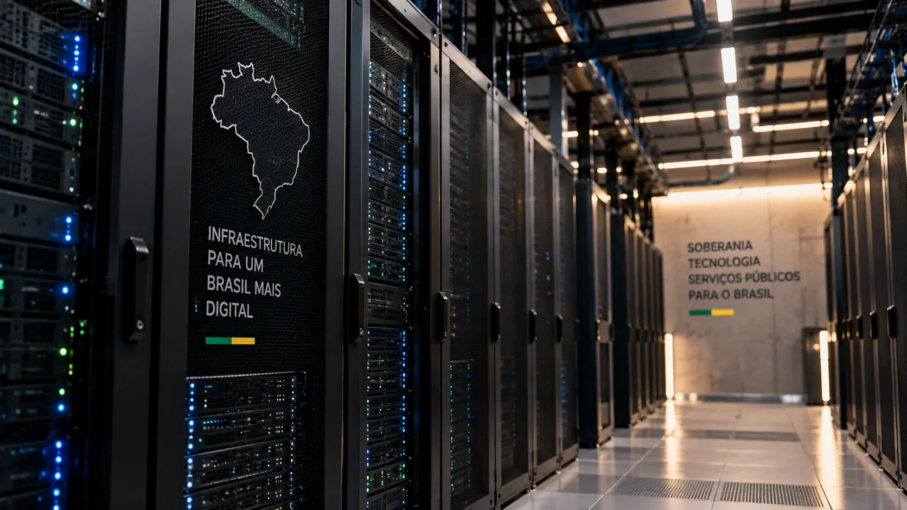
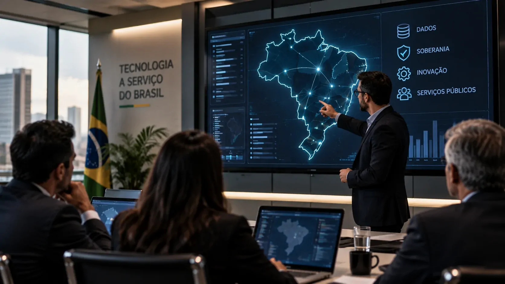

*O governo federal está estruturando uma infraestrutura nacional de computação em nuvem para concentrar parte dos dados públicos mais estratégicos sob maior controle brasileiro. A proposta vai além de manter servidores dentro do país: envolve também quem opera a infraestrutura e quais dependências tecnológicas permanecem no exterior.*

## O Brasil está criando uma nova camada de infraestrutura digital

A **Nuvem Brasileira** está sendo estruturada pelo **Ministério da Gestão e da Inovação em Serviços Públicos (MGI)**, **Serpro**, **BNDES** e **ABDI** com uma proposta que vai além de simplesmente armazenar dados em servidores localizados no país.

O objetivo é ampliar a **soberania digital** sobre dados, infraestrutura e tecnologia utilizados pelo governo em serviços considerados estratégicos.

O projeto ainda está em fase de modelagem. Depois dos estudos iniciais e da escuta de mercado realizada em setembro, o governo trabalha agora na definição do modelo técnico, jurídico e empresarial da solução.

A discussão ganhou importância porque a nuvem passou a sustentar sistemas críticos, grandes bases de dados e aplicações essenciais para o funcionamento do Estado.

A pergunta central deixa de ser apenas **onde os dados estão armazenados** e passa a envolver também quem controla a infraestrutura responsável por processá-los.

## A Nuvem Brasileira não será apenas um data center nacional

*Representação de uma infraestrutura nacional de computação em nuvem destinada a dados estratégicos do Estado.*

### Uma nova camada para dados estratégicos

O Brasil já possui uma **Nuvem de Governo**, utilizada para informações que exigem requisitos específicos de segurança, privacidade e controle.

A Nuvem Brasileira deverá funcionar como uma camada adicional, voltada principalmente para cargas consideradas mais estratégicas e sigilosas.

Isso significa que a proposta não é retirar automaticamente todos os dados públicos de provedores privados. Diferentes modelos de nuvem poderão continuar coexistindo de acordo com a necessidade de cada sistema.

### Soberania envolve mais do que localização

Segundo o **Serpro**, a análise de soberania considera três dimensões principais: **dados, operação e tecnologia**.

Na prática, isso envolve saber quem administra a infraestrutura, quem controla acessos, quais tecnologias são utilizadas e quais componentes dependem de fornecedores externos.

Por isso, uma infraestrutura localizada no Brasil ainda pode possuir dependências tecnológicas fora do país.

## Por que guardar o dado no Brasil não resolve tudo

### O problema das dependências externas

Um servidor instalado fisicamente no Brasil pode utilizar softwares, ferramentas de gerenciamento ou tecnologias submetidas a empresas estrangeiras.

É nesse ponto que aparece a diferença entre **soberania de dados** e **soberania tecnológica**.

A ministra **Esther Dweck** citou o **Cloud Act**, dos Estados Unidos, como um dos elementos considerados pelo governo. A legislação pode permitir o acesso a determinados dados sob controle de empresas sujeitas à jurisdição americana, mesmo quando essas informações estão armazenadas fora dos EUA.

A ministra também afirmou que não houve até agora um grande incidente desse tipo envolvendo o serviço público brasileiro. A preocupação apresentada pelo governo é principalmente preventiva.

### O teste é descobrir o que acontece sem conexão externa

O **Serpro** informou que utiliza avaliações capazes de verificar se determinadas soluções continuam funcionando quando conexões externas são interrompidas.

Esse tipo de teste pode revelar dependências que não aparecem em uma análise tradicional.

Uma plataforma pode estar instalada no território nacional e ainda depender de um serviço externo para administração ou funcionamento.

Para empresas que operam sistemas críticos, a mesma lógica pode ser aplicada na avaliação de **continuidade, segurança e dependência de fornecedores**.

## Como será criada a empresa por trás da Nuvem Brasileira

*O modelo em discussão prevê participação do Serpro e de empresas privadas brasileiras na construção da nova infraestrutura.*

### Uma parceria entre setor público e empresas brasileiras

O modelo ainda não foi definido, mas o governo trabalha com a possibilidade de uma **joint venture entre o Serpro e empresas privadas brasileiras**.

O **BNDES** poderá apoiar a iniciativa por meio de financiamento ou participação acionária.

Segundo Esther Dweck, as empresas privadas participantes deverão ter **capital nacional**, com maioria brasileira.

Outro ponto apresentado pelo governo é que o **código-fonte da solução deverá permanecer no Brasil e sob domínio nacional**.

A ideia, portanto, não é apenas contratar capacidade de nuvem pronta, mas ajudar a formar uma infraestrutura tecnológica nacional.

### O projeto ainda está sendo desenhado

A escuta de mercado realizada em setembro reuniu **270 participantes de 70 instituições**, incluindo **59 empresas privadas**.

O próximo marco anunciado é o lançamento do edital para seleção dos parceiros, previsto para **novembro de 2026**.

Até lá, ainda serão definidas questões de arquitetura, governança, financiamento, propriedade tecnológica e operação.

Por isso, a Nuvem Brasileira ainda deve ser entendida como **um projeto em construção**, e não como uma infraestrutura já pronta.

## A nuvem também faz parte da estratégia brasileira de IA

### IA exige cada vez mais infraestrutura

A relação com **inteligência artificial** torna o projeto ainda mais relevante.

Modelos de IA dependem de grandes volumes de dados, capacidade computacional e infraestrutura capaz de processar essas informações.

Quanto mais o governo utiliza IA em serviços públicos, maior se torna a importância de controlar a infraestrutura onde esses sistemas são executados.

O movimento conecta **dados, computação, data centers e inteligência artificial** em uma mesma estratégia.

Essa transformação também pode ser observada na expansão dos **[data centers voltados à inteligência artificial no Brasil](https://noticiatech.com.br/inteligencia-artificial/redata-incentivo-data-centers-ia-brasil/)**.

### Uma oportunidade para fornecedores nacionais

A nova demanda pode movimentar segmentos como **data centers, GPUs, armazenamento, conectividade, software de infraestrutura e segurança**.

O poder de compra do Estado pode ajudar empresas brasileiras a ganhar escala em áreas que exigem investimentos elevados.

Mas a infraestrutura precisará demonstrar **segurança, desempenho, disponibilidade e custo competitivo** para se tornar sustentável.

A soberania, nesse caso, dependerá menos do discurso e mais da capacidade técnica entregue pela solução.

## O que a Nuvem Brasileira pode mudar para empresas e para o mercado

*O debate sobre soberania digital também amplia a discussão empresarial sobre dependência tecnológica, segurança e continuidade de serviços críticos.*

### Segurança passa a incluir dependência tecnológica

O projeto é direcionado principalmente ao setor público, mas a discussão interessa também às empresas.

Ao avaliar uma infraestrutura de nuvem, normalmente entram na conta **custo, desempenho, disponibilidade e segurança**.

A experiência da Nuvem Brasileira acrescenta outra variável: **dependência tecnológica**.

Uma empresa pode possuir backup e redundância e ainda depender de um fornecedor externo para componentes importantes da operação.

Isso não significa que tecnologias estrangeiras sejam necessariamente inseguras. Significa que, em sistemas críticos, é importante entender o que acontece caso determinado fornecedor sofra uma interrupção, altere suas condições ou deixe de disponibilizar uma tecnologia.

Essa preocupação ganha ainda mais peso diante do avanço de ataques digitais com uso de IA, tema analisado pelo Notícia Tech em **[como a inteligência artificial está acelerando ataques cibernéticos no Brasil](https://noticiatech.com.br/inteligencia-artificial/ia-acelera-ataques-ciberneticos-brasil/)**.

### O verdadeiro teste começa depois do edital

A publicação do edital será apenas uma etapa.

A Nuvem Brasileira precisará transformar o conceito de soberania em uma infraestrutura capaz de entregar **segurança, desempenho, interoperabilidade, disponibilidade e custo competitivo**.

Também será necessário evitar que novas dependências sejam criadas em outras camadas da tecnologia.

Se o cronograma anunciado for mantido, **novembro de 2026** deverá ser um momento importante para o projeto, quando a modelagem dará lugar à escolha dos parceiros responsáveis pela construção da solução.

Mais do que criar uma nova nuvem, o Brasil está tentando responder a uma questão que deverá ganhar espaço também no setor privado: **não basta saber onde os dados estão; é preciso entender quem controla a tecnologia que mantém esses dados funcionando.**

---