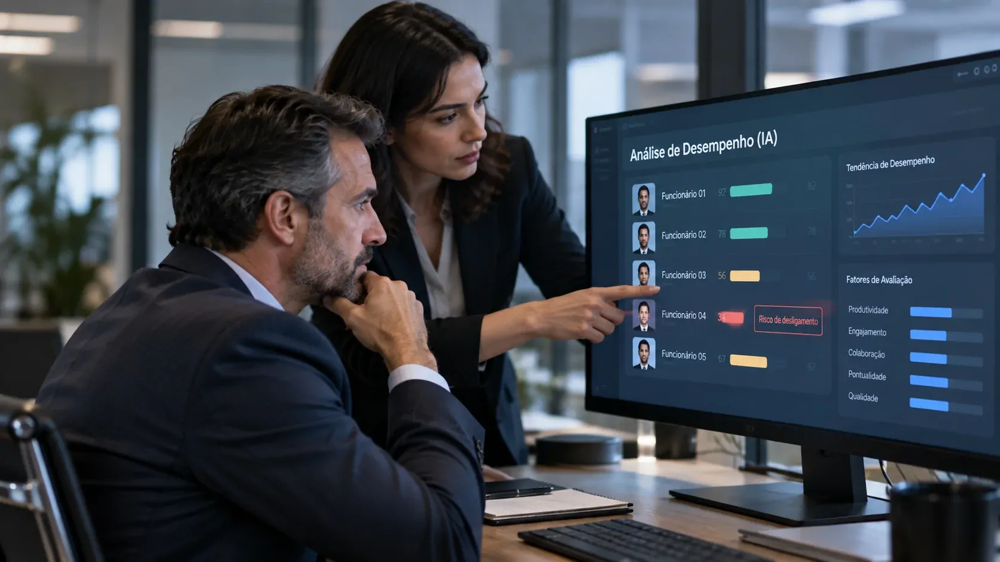
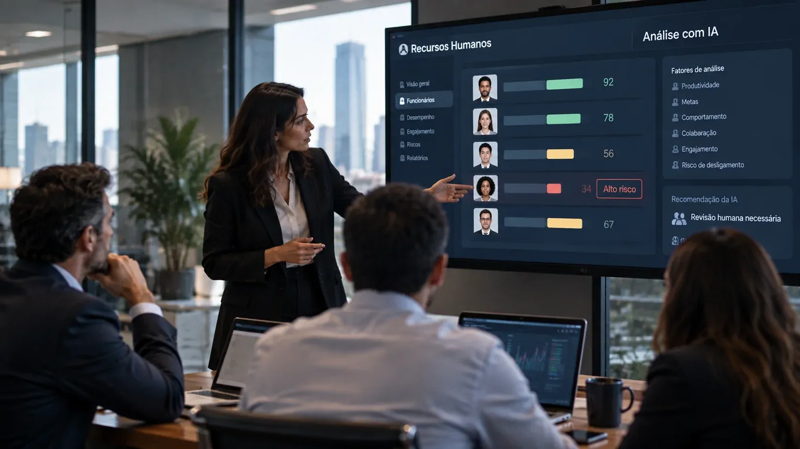

*Um projeto aprovado pela Legislatura da Califórnia coloca um limite concreto para o uso de inteligência artificial no ambiente de trabalho: empresas não poderão depender exclusivamente de sistemas automatizados para decidir pela demissão ou punição de funcionários se a proposta for sancionada. A mudança pode transformar a forma como empresas documentam e supervisionam decisões tomadas com auxílio de IA.*

## Califórnia quer colocar um humano entre a IA e a demissão

A **Califórnia** aprovou em 31 de agosto o **SB 947**, conhecido como **No Robo Bosses Act of 2026**, projeto de lei criado para impedir que sistemas de decisão automatizada tenham controle exclusivo sobre decisões de demissão e disciplina de trabalhadores.

O texto avançou no Senado por **28 votos a 10**, depois de ter sido aprovado pela Assembleia por **53 votos a 14**. Agora, a proposta está na mesa do governador **Gavin Newsom** e ainda precisa ser sancionada para se tornar lei.

O ponto central é simples: uma empresa poderá continuar usando **inteligência artificial** para auxiliar processos internos, mas o sistema não poderá ser a única autoridade para determinar que um funcionário seja demitido ou punido.

### A diferença entre auxiliar e decidir

Essa distinção é importante porque muda a discussão sobre automação no trabalho. Uma ferramenta pode analisar dados, identificar padrões ou sinalizar problemas sem necessariamente receber autoridade para tomar a decisão final.

O **SB 947** estabelece justamente essa fronteira. Quando um sistema automatizado participar de uma decisão de demissão ou disciplina, deverá existir **supervisão e verificação humana**.

Isso cria uma separação importante entre utilizar IA como ferramenta de apoio e permitir que um algoritmo assuma responsabilidade direta por uma decisão que pode alterar a vida profissional de uma pessoa.

## O que o projeto de lei exige das empresas

*O projeto busca manter a decisão final sobre emprego e disciplina sob responsabilidade humana.*

A proposta não trata a **inteligência artificial** como algo que precisa ser retirado das empresas. O foco está em limitar o poder de sistemas automatizados quando suas decisões podem afetar diretamente a vida profissional de uma pessoa.

Na prática, empresas que utilizarem esses sistemas para apoiar decisões de demissão ou punição terão de incorporar **revisão humana e verificação** ao processo. O objetivo é evitar que uma recomendação produzida por um algoritmo seja transformada automaticamente em uma consequência profissional.

Outro ponto importante é a transparência. O trabalhador deverá ser informado quando um sistema automatizado tiver sido utilizado na decisão de demissão ou disciplina. A proposta também prevê mecanismos relacionados às informações utilizadas pelo sistema para chegar à decisão.

### O problema não é apenas tecnológico

Uma decisão automatizada pode parecer objetiva porque é apresentada na forma de dados, pontuações ou classificações. Isso não significa, porém, que o resultado seja necessariamente correto ou adequado ao contexto individual de um funcionário.

É justamente nesse espaço que a **revisão humana** ganha importância. O projeto parte da ideia de que uma decisão que afeta salário, emprego e carreira não deveria ser reduzida a uma saída automática de software.

A proposta também acompanha uma discussão maior sobre a autonomia que as empresas estão concedendo aos sistemas de IA. Quanto mais tarefas passam a ser executadas sem intervenção direta de pessoas, maior se torna a necessidade de estabelecer limites claros para essas decisões.

## Por que a decisão chama atenção de quem trabalha

A discussão deixa de ser abstrata quando a **inteligência artificial** entra em decisões que podem determinar se uma pessoa continuará ou não recebendo seu salário.

O próprio debate em torno do **SB 947** ganhou força após relatos de sistemas automatizados usados no ambiente de trabalho produzirem decisões consideradas problemáticas, incluindo casos de trabalhadores que teriam sido desligados de forma equivocada. O gabinete do senador **Jerry McNerney** também cita a expansão de ferramentas conhecidas como **bossware**, usadas para monitorar e administrar trabalhadores.

Esse é o aspecto mais relevante da proposta: a **Califórnia** está tratando a IA no trabalho não apenas como uma ferramenta de produtividade, mas como uma tecnologia capaz de interferir diretamente na relação entre empresa e funcionário.

### Quando um algoritmo afeta uma carreira

Para o trabalhador, a diferença entre uma recomendação e uma decisão é enorme.

Um sistema pode apontar que determinado funcionário apresentou determinado comportamento ou desempenho. Mas transformar essa avaliação em uma demissão envolve contexto, histórico, circunstâncias e responsabilidade jurídica e administrativa.

A proposta californiana tenta impedir que essa última etapa desapareça atrás de uma decisão automatizada.

O debate ocorre justamente quando grandes empresas estão ampliando o uso de **agentes de IA** para executar tarefas antes realizadas por funcionários. Esse movimento já foi analisado pelo Notícia Tech na reportagem sobre como a **[Meta pretende substituir funcionários por agentes de IA](https://noticiatech.com.br/inteligencia-artificial/zuckerberg-meta-substituir-funcionarios-agentes-ia-project-ot/)**, mostrando que a discussão sobre automação do trabalho vai muito além dos departamentos de recursos humanos.

## Para as empresas, a IA no RH pode ficar mais responsável

*O avanço da legislação pode aumentar a necessidade de documentação e governança sobre sistemas de IA utilizados em decisões trabalhistas.*

Se o **SB 947** for sancionado, empresas que utilizam sistemas automatizados em processos trabalhistas terão de olhar com mais atenção para a forma como essas ferramentas participam das decisões.

Isso pode significar processos internos mais estruturados, registros das decisões, identificação de quando a **IA** foi utilizada e definição clara de quem é responsável pela revisão humana.

A mudança também reforça uma discussão que já começa a aparecer em outras áreas da tecnologia empresarial: quanto mais autonomia uma empresa entrega a sistemas de **IA**, maior tende a ser a necessidade de **governança, supervisão e mecanismos de controle**.

Essa preocupação já aparece no mercado corporativo. O avanço de sistemas capazes de executar tarefas com maior autonomia está levando empresas a discutir novas formas de controle. O Notícia Tech já mostrou como a **[Microsoft alerta que agentes de IA exigem uma nova governança nas empresas](https://noticiatech.com.br/inteligencia-artificial/microsoft-governanca-agentes-ia-empresas/)**, uma discussão diretamente relacionada ao tipo de supervisão que o SB 947 pretende estabelecer no ambiente de trabalho.

### O custo da decisão automatizada

Para uma empresa, automatizar uma decisão pode reduzir tempo e custos. Mas uma decisão automatizada que produz um resultado incorreto pode criar outro tipo de custo: disputas, retrabalho, perda de confiança e riscos regulatórios.

O desafio passa a ser encontrar um equilíbrio entre **produtividade e responsabilidade**.

A questão não é simplesmente se a empresa pode usar IA. É **em quais decisões ela pode confiar na IA, com qual nível de autonomia e quem responde pelo resultado**.

## A Califórnia pode estar criando um novo limite para a IA no trabalho

*O debate sobre IA no trabalho começa a avançar da produtividade para a responsabilidade sobre decisões que afetam pessoas.*

O **SB 947** ainda não permite afirmar que a Califórnia proibiu definitivamente empresas de usar IA em decisões trabalhistas. O projeto precisa ser sancionado pelo governador antes de produzir os efeitos previstos.

Mas a aprovação pela Legislatura já sinaliza uma mudança importante no debate regulatório: **a discussão deixou de ser apenas sobre o que a IA consegue fazer e passou a envolver o que uma empresa deveria permitir que ela faça sozinha**.

Se o projeto entrar em vigor, a Califórnia poderá se tornar o primeiro estado americano a estabelecer esse tipo de exigência específica para decisões de demissão e disciplina baseadas em sistemas automatizados.

Para empresas que estão ampliando o uso de **IA**, a mensagem é relevante. A automação pode assumir tarefas, analisar informações e recomendar ações, mas decisões com impacto direto sobre pessoas podem exigir uma camada adicional de responsabilidade.

Esse movimento também ajuda a explicar por que a **governança de IA** está se tornando parte central da adoção empresarial da tecnologia. À medida que sistemas deixam de apenas responder perguntas e passam a influenciar decisões reais, **controle humano, documentação e responsabilização deixam de ser detalhes de conformidade e passam a fazer parte da própria arquitetura da automação**.

O próximo passo, portanto, não será apenas acompanhar se o governador da Califórnia sancionará o **SB 947**. Será observar se outras jurisdições e empresas começarão a estabelecer limites semelhantes para definir até onde uma inteligência artificial pode decidir sobre o trabalho de uma pessoa.

---