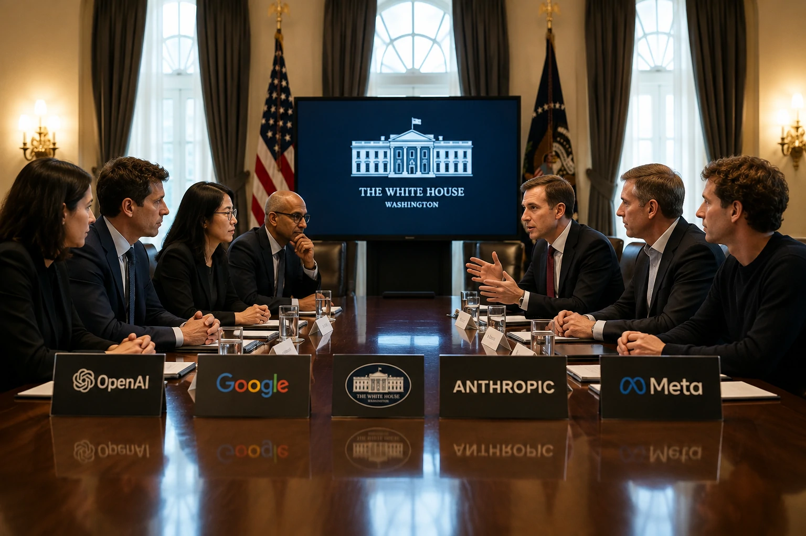
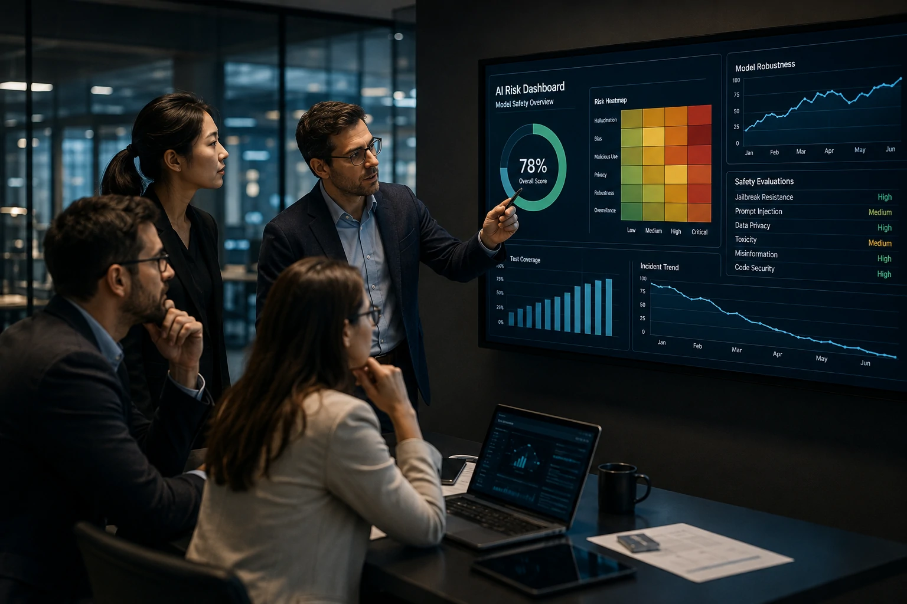
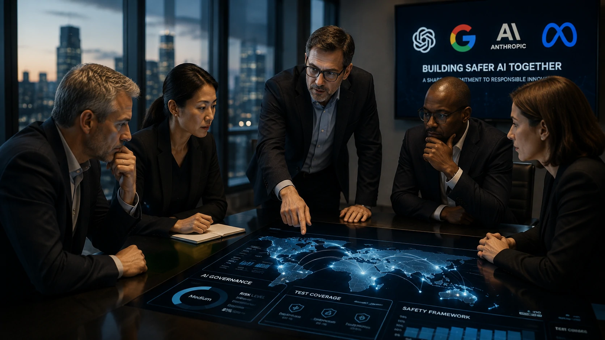

*Enquanto a corrida pela inteligência artificial costuma ser medida pela capacidade dos modelos, um novo movimento mostra que a próxima disputa poderá acontecer em outro campo: a segurança. A reunião promovida pela Casa Branca com as principais empresas do setor sinaliza uma mudança estratégica que pode redefinir a forma como a IA será desenvolvida e adotada por organizações em todo o mundo.*

## A Casa Branca quer criar um novo padrão para a segurança da inteligência artificial

Empresas e governos caminham para estabelecer critérios comuns de avaliação dos modelos de IA. A reunião entre **Casa Branca**, **OpenAI**, **Google**, **Anthropic** e **Meta** demonstra que a discussão deixou de ser apenas tecnológica e passou a ocupar um espaço estratégico para toda a economia digital.

*Representação editorial do encontro entre governo e empresas para discutir novos padrões de segurança em inteligência artificial.*

Nos últimos meses, a evolução dos modelos generativos acelerou a adoção da tecnologia em praticamente todos os setores da economia. Ao mesmo tempo, aumentaram as preocupações relacionadas a uso indevido, ataques cibernéticos, vazamento de dados, alucinações e riscos envolvendo agentes autônomos.

### Segurança passa a ser vantagem competitiva

Durante anos, o mercado concentrou sua atenção na corrida por modelos maiores e mais inteligentes. Agora, a capacidade de demonstrar controles de segurança tende a se tornar um diferencial igualmente importante para conquistar clientes corporativos.

Grandes organizações já avaliam requisitos como auditoria, rastreabilidade e governança antes de contratar plataformas de IA, tornando esse tema cada vez mais relevante para fornecedores.

### O foco deixa de ser apenas inovação

O encontro também mostra uma mudança de prioridades. Empresas continuam investindo em inovação, mas agora precisam provar que seus sistemas podem operar de forma confiável em ambientes críticos, principalmente nos setores financeiro, saúde, infraestrutura e governo.

Esse movimento complementa outras iniciativas recentes envolvendo **OpenAI** e regulamentações internacionais, como a análise apresentada pelo Notícia Tech sobre o [AI Act europeu e seus impactos para OpenAI e Anthropic](https://noticiatech.com.br/inteligencia-artificial/openai-anthropic-uniao-europeia-ai-act-muda-mercado-ia/).

## O encontro fortalece uma nova fase da governança em IA

A principal mensagem do encontro é clara: governança passa a ocupar um papel central na evolução da inteligência artificial. O mercado começa a entender que modelos poderosos precisam ser acompanhados por processos igualmente robustos de validação e monitoramento.

*Empresas passam a tratar governança e segurança como fatores estratégicos para adoção de inteligência artificial.*

Esse novo cenário aproxima tecnologia, regulação e estratégia empresarial. Em vez de atuar apenas como desenvolvedoras de modelos, empresas como **OpenAI**, **Google**, **Anthropic** e **Meta** passam a participar diretamente da construção de referências que poderão orientar futuras políticas públicas.

### Empresas devem revisar suas estratégias

Para organizações que utilizam IA, a tendência é que requisitos relacionados à segurança passem a fazer parte dos processos de aquisição de tecnologia.

Critérios como documentação técnica, mecanismos de supervisão humana, avaliações independentes e gestão de riscos podem ganhar peso semelhante ao desempenho dos modelos.

### O impacto vai além dos Estados Unidos

Mesmo sendo uma iniciativa norte-americana, seus efeitos tendem a alcançar empresas em diversos países. Historicamente, padrões definidos pelos maiores fornecedores globais acabam influenciando mercados internacionais e acelerando adaptações regulatórias.

Esse movimento também dialoga com o crescimento das arquiteturas corporativas de IA, tema aprofundado pelo Notícia Tech no guia sobre [arquitetura de IA empresarial utilizando MCP, RAG, agentes e APIs](https://noticiatech.com.br/inteligencia-artificial/arquitetura-ia-empresarial-mcp-rag-apis-agentes-workflows-copilotos/).

## O que muda para OpenAI, Google, Anthropic e Meta daqui para frente

As novas discussões sobre segurança indicam que a próxima fase da inteligência artificial será marcada por maior responsabilidade na implantação dos modelos. O desempenho continuará sendo importante, mas a confiança tende a se tornar um critério igualmente decisivo.

*Governança e confiança passam a disputar espaço com desempenho como diferenciais competitivos na nova fase da inteligência artificial.*

Empresas que conseguirem demonstrar processos consistentes de avaliação de riscos poderão conquistar vantagem competitiva junto ao mercado corporativo, investidores e órgãos reguladores.

### A disputa deixa de ser apenas tecnológica

Até pouco tempo, a competição era medida principalmente por benchmarks e capacidade de processamento.

Agora, fatores como transparência, segurança operacional, mitigação de riscos e documentação técnica passam a influenciar decisões de grandes clientes.

Esse cenário beneficia organizações que conseguirem combinar inovação com governança robusta.

### A corrida pela IA entra em uma nova etapa

O encontro promovido pela **Casa Branca** mostra que o setor começa a amadurecer.

Em vez de apenas lançar modelos cada vez mais avançados, as maiores empresas do setor passam a discutir mecanismos comuns para reduzir riscos e aumentar a confiança na tecnologia.

Para empresas usuárias de IA, isso representa um ambiente mais previsível para investimentos de longo prazo.

Para desenvolvedores, significa que requisitos de segurança deverão fazer parte do próprio ciclo de desenvolvimento dos modelos.

## O mercado corporativo deve acelerar a adoção de padrões globais

O mercado caminha para um cenário em que plataformas de inteligência artificial precisarão demonstrar conformidade antes mesmo de apresentar novas funcionalidades.

Esse movimento tende a favorecer empresas que investirem desde agora em governança, auditoria e gestão de riscos relacionados à IA.

A tendência também fortalece temas como **AI Governance**, segurança de agentes autônomos e arquiteturas corporativas, assuntos que devem ganhar ainda mais relevância nos próximos anos.

Para o **Notícia Tech**, o encontro representa mais do que uma notícia de momento. Ele evidencia uma mudança estrutural na indústria de inteligência artificial, em que desempenho, segurança e confiança passam a evoluir juntos. Se essa agenda avançar como esperado, empresas que adotarem boas práticas desde cedo estarão mais preparadas para atender futuras exigências regulatórias e aproveitar oportunidades em um mercado cada vez mais competitivo.

---