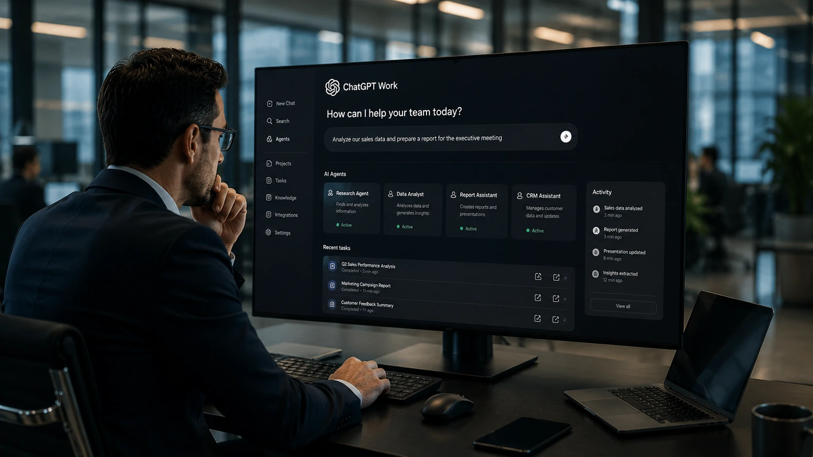
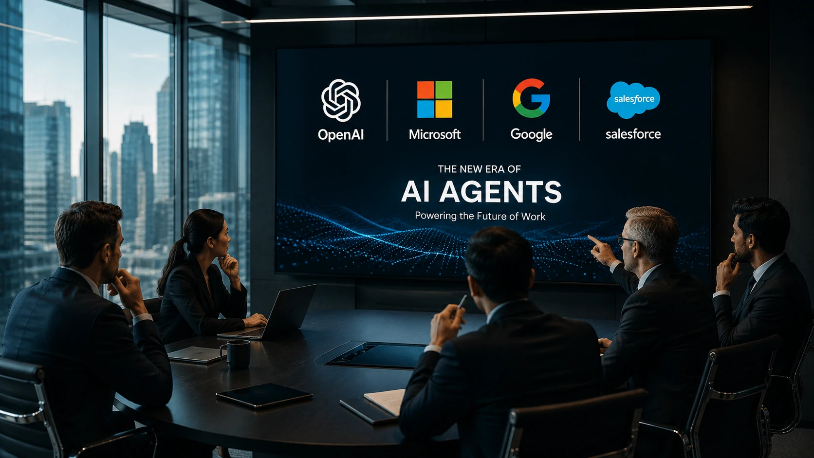
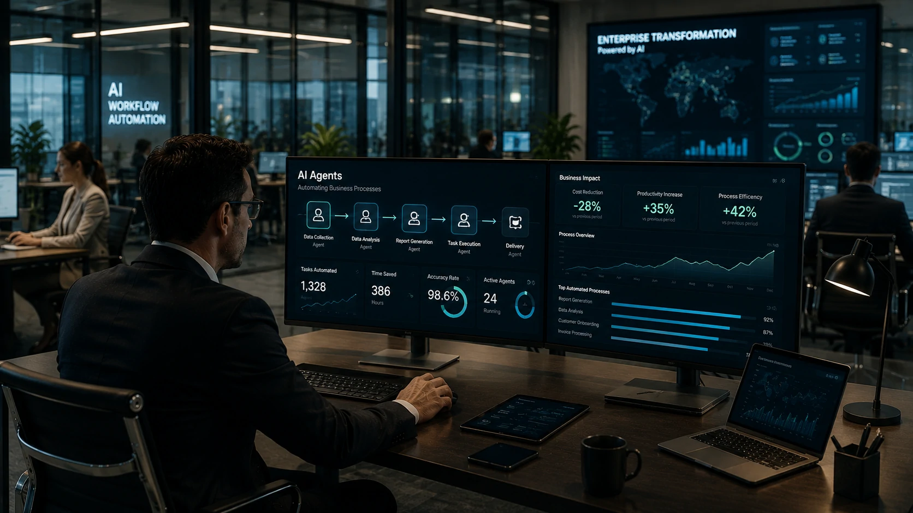

*Durante décadas, empresas cresceram adicionando mais softwares ao seu ambiente tecnológico. Agora, a estratégia começa a mudar. O avanço do **ChatGPT Work** indica que o futuro poderá ser baseado em agentes inteligentes capazes de executar tarefas completas, reduzindo a dependência de aplicações tradicionais. Mais do que uma atualização de produto, trata-se de uma mudança estrutural que movimenta todo o mercado de tecnologia corporativa.*

## O ChatGPT Work representa uma mudança na lógica do software corporativo

Empresas começam a enxergar os **agentes de IA** como uma nova camada operacional capaz de substituir parte da interação direta com softwares tradicionais.

*Agentes inteligentes passam a assumir tarefas antes executadas manualmente em diferentes plataformas.*

Historicamente, profissionais precisavam alternar entre sistemas de CRM, planilhas, plataformas de comunicação e ferramentas de gestão para concluir uma única atividade. Com o **ChatGPT Work**, a proposta muda: o agente recebe um objetivo e executa grande parte do fluxo automaticamente.

### O foco deixa de ser o software

O valor passa a estar na execução da tarefa, não na ferramenta utilizada.

Em vez de perguntar "qual sistema devo abrir?", o usuário pergunta "qual resultado preciso alcançar?". Essa inversão de lógica pode transformar profundamente o mercado de software empresarial.

### A OpenAI acelera a corrida dos agentes

O crescimento da plataforma fortalece a estratégia da **OpenAI** de posicionar agentes inteligentes como a principal interface de produtividade corporativa.

Esse movimento amplia uma tendência já discutida pelo Notícia Tech em análite sobre a [era dos agentes de IA na produtividade corporativa](https://noticiatech.com.br/inteligencia-artificial/chatgpt-work-era-agentes-ia-produtividade-corporativa/), mas agora com foco no impacto competitivo sobre o mercado de software.

## Microsoft, Google e Salesforce entram em uma nova disputa

A competição deixa de ser apenas entre modelos de linguagem e passa para quem controla a experiência completa de trabalho baseada em IA.

*Gigantes da tecnologia aceleram investimentos para transformar agentes inteligentes na principal interface de trabalho.*

**Microsoft**, **Google**, **Salesforce** e outras empresas vêm incorporando Inteligência Artificial em seus produtos, mas a evolução dos agentes muda o nível da competição.

### O software deixa de ser protagonista

Em vez de navegar por menus e telas, usuários podem simplesmente descrever uma necessidade.

O agente interpreta a solicitação, consulta diferentes sistemas, produz documentos, organiza informações e entrega o resultado final.

### O impacto vai além da produtividade

Essa mudança pode reduzir custos operacionais, simplificar treinamentos e diminuir o tempo gasto em tarefas repetitivas.

Ao mesmo tempo, cria pressão para que fornecedores tradicionais reinventem seus produtos diante da nova realidade impulsionada pela **Inteligência Artificial**.

## Empresas precisarão rever sua estratégia de transformação digital

A adoção de **agentes de IA** não significa apenas trocar uma ferramenta por outra. Ela representa uma mudança na forma como processos são planejados, automatizados e monitorados dentro das organizações.

*O foco da transformação digital passa da implantação de softwares para a automação inteligente orientada por objetivos.*

Organizações que antes investiam em dezenas de aplicações especializadas começam a avaliar plataformas capazes de integrar diferentes serviços utilizando **Inteligência Artificial**.

### A integração passa a valer mais que o número de ferramentas

Empresas que conseguirem conectar seus sistemas por meio de agentes inteligentes poderão reduzir retrabalho, eliminar tarefas repetitivas e acelerar processos internos.

Nesse cenário, conceitos como **MCP (Model Context Protocol)** ganham ainda mais importância por facilitar a comunicação entre modelos de IA e aplicações corporativas. O tema é aprofundado no artigo sobre [como criar um servidor MCP para integrar IA aos sistemas das empresas](https://noticiatech.com.br/automacao/como-criar-servidor-mcp-empresas-integrar-ia-sistemas/).

### O mercado de software entra em uma nova fase

O modelo tradicional baseado apenas na venda de licenças tende a evoluir para plataformas orientadas por resultados.

Em vez de oferecer funcionalidades isoladas, fornecedores deverão disponibilizar agentes especializados capazes de executar processos completos utilizando dados distribuídos entre diversos sistemas.

## O avanço do ChatGPT Work indica para onde caminha o mercado

O crescimento do **ChatGPT Work** sinaliza que a próxima disputa entre as grandes empresas de tecnologia acontecerá na camada operacional da **Inteligência Artificial**, onde agentes deixam de apenas responder perguntas para executar atividades complexas.

A **OpenAI** amplia sua presença no ambiente corporativo enquanto **Microsoft**, **Google**, **Salesforce** e outros fornecedores aceleram investimentos para manter competitividade nesse novo cenário.

Para gestores e profissionais de tecnologia, a principal lição é clara: o diferencial competitivo não estará apenas em utilizar IA, mas em construir processos capazes de trabalhar lado a lado com agentes inteligentes.

Nos próximos anos, o mercado provavelmente deixará de perguntar qual é o melhor software para determinada tarefa e passará a discutir qual agente entrega o melhor resultado. Essa mudança pode redefinir a forma como empresas compram tecnologia, estruturam suas operações e conduzem sua transformação digital.

---