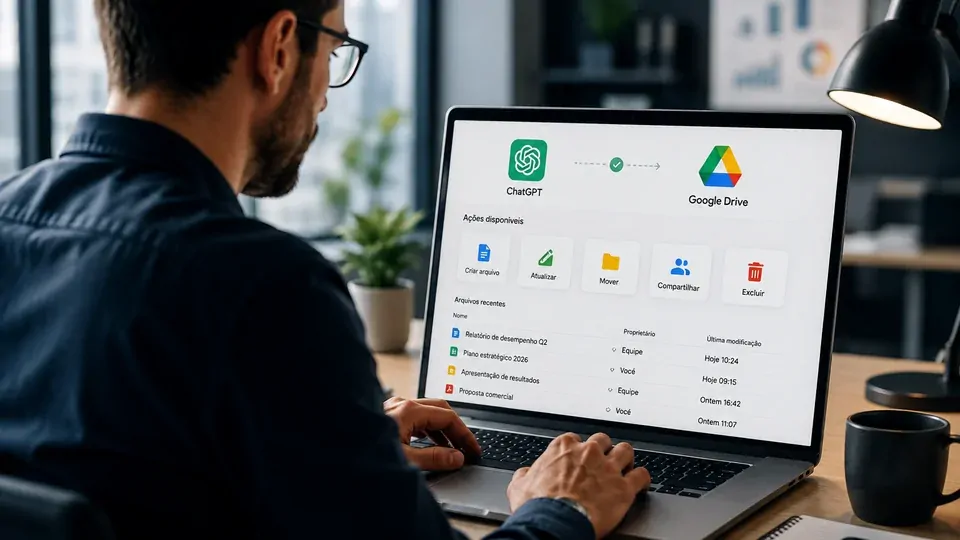
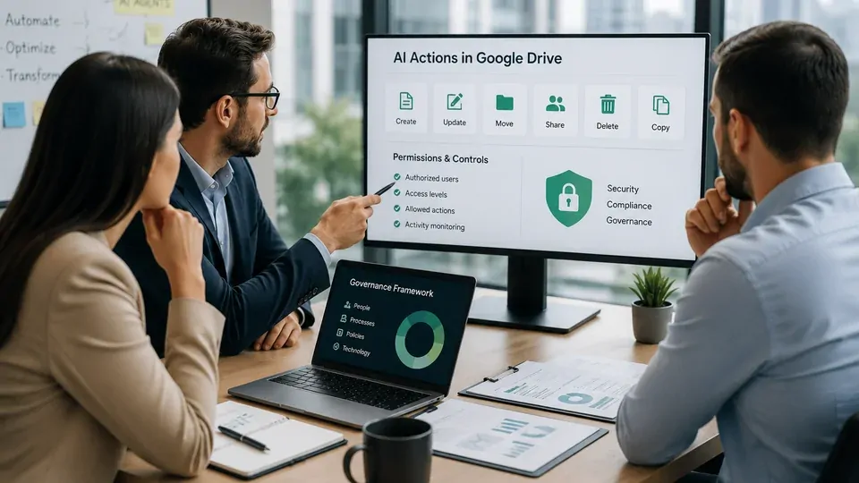
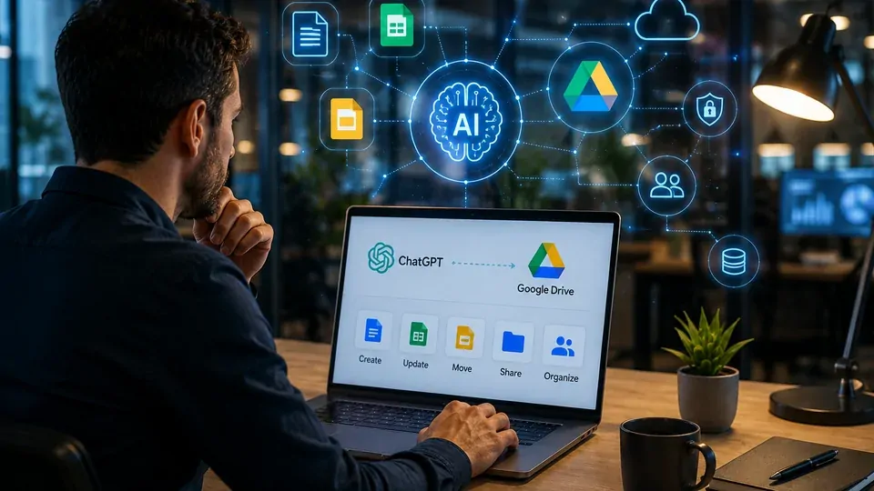

*O ChatGPT está avançando de uma ferramenta usada para consultar e produzir informações para uma camada de software capaz de executar tarefas dentro dos sistemas que as empresas já utilizam. A integração com o Google Drive mostra por que essa mudança pode ser mais importante do que uma simples atualização de produtividade.*

## O que mudou na integração do ChatGPT com o Google Drive

### O ChatGPT passou da consulta para a ação

O **ChatGPT** já podia trabalhar com informações armazenadas em serviços conectados. A mudança mais relevante está na capacidade de executar ações diretamente sobre arquivos do **Google Drive**, incluindo operações relacionadas a **Documentos, Planilhas e Apresentações Google**.

A documentação da **OpenAI** descreve ações que podem criar, atualizar, compartilhar, mover, enviar, copiar ou excluir arquivos da família do Drive. Isso coloca o ChatGPT em uma posição diferente de uma ferramenta que apenas lê documentos e responde perguntas.

### A integração foi unificada no Google Drive

A **OpenAI** também unificou as ações de Docs, Sheets e Slides dentro do aplicativo do **Google Drive**. Para empresas, isso simplifica a arquitetura da integração, mas também concentra em uma única conexão uma quantidade maior de permissões.

Esse detalhe é importante porque o ganho de produtividade passa a vir acompanhado de uma questão operacional: até onde a empresa permitirá que a IA atue sobre seus próprios dados?

## Por que isso muda o papel da IA no trabalho

*O avanço mais importante não está apenas no acesso aos arquivos, mas na possibilidade de a IA executar ações sobre eles.*

### De assistente de informação para agente de trabalho

Durante boa parte da evolução da IA generativa, o fluxo era relativamente simples: o profissional fazia uma pergunta, o modelo produzia uma resposta e a pessoa executava o trabalho nos sistemas da empresa.

A integração com o **Google Drive** reduz essa separação. O modelo pode receber uma tarefa relacionada a documentos e, dependendo das permissões disponíveis, realizar parte da operação no próprio ambiente de arquivos.

Essa diferença aproxima o **ChatGPT** do conceito de agente de IA: um sistema que não apenas gera conteúdo, mas também utiliza ferramentas para executar etapas de uma tarefa.

### A produtividade deixa de ser apenas conversacional

Isso muda a lógica de uso corporativo. Em vez de pedir ao funcionário que copie uma resposta produzida pela IA para um documento, o objetivo passa a ser fazer com que a própria IA participe do fluxo de trabalho.

Na prática, a fronteira entre conversar com uma IA e operar um software começa a desaparecer. O chat deixa de ser apenas uma interface para respostas e passa a funcionar como uma camada de acesso às ferramentas da empresa.

Esse movimento também ajuda a explicar por que o mercado está direcionando tanta atenção para **agentes de IA** e automação.

Para entender como essa mudança se encaixa na infraestrutura corporativa, o Notícia Tech já analisou **[como uma arquitetura de IA empresarial conecta agentes, APIs, MCP e outros sistemas](https://noticiatech.com.br/inteligencia-artificial/arquitetura-ia-empresarial-mcp-rag-apis-agentes-workflows-copilotos/)**.

## O novo desafio passa a ser controlar o que a IA pode fazer

### A permissão se torna parte central da estratégia

Para uma empresa, permitir que uma IA leia um documento é diferente de permitir que ela altere seu conteúdo. E permitir alterações é diferente de autorizar compartilhamento, movimentação ou exclusão de arquivos.

A própria **OpenAI** informa que as novas ações do Google Drive exigem escopos adicionais de autorização no **Google Workspace**. Administradores podem revisar quais ações estão habilitadas e quais permissões serão concedidas.

Isso significa que a adoção empresarial não deveria começar apenas pela pergunta “o que a IA consegue fazer?”, mas também por “o que estamos dispostos a permitir que ela faça?”.

### O risco muda junto com a capacidade

Quanto maior a autonomia de um sistema, maior também é o impacto de uma ação incorreta.

Uma resposta errada em um chat pode ser simplesmente ignorada. Uma instrução executada sobre um arquivo corporativo pode alterar informações, compartilhar dados com pessoas inadequadas ou modificar um processo de trabalho.

Por isso, a expansão das ações do **ChatGPT** reforça uma tendência que o mercado já vinha enfrentando: governança de IA deixa de ser apenas uma discussão sobre modelos e passa a envolver permissões, processos e responsabilidades operacionais.

Esse problema já foi analisado pelo Notícia Tech em **[Agentes de IA criam um novo problema para as empresas: quem responde por ações autônomas?](https://noticiatech.com.br/inteligencia-artificial/agentes-ia-responsabilidade-empresas-acoes-autonomas/)**.

## O que isso representa para as empresas

*À medida que a IA ganha capacidade de agir, segurança e governança passam a fazer parte da decisão de adoção.*

### O ganho potencial está na redução de tarefas intermediárias

O principal benefício não é simplesmente “usar o ChatGPT dentro do Drive”. O ganho está em reduzir etapas manuais entre a informação e a execução.

Uma equipe pode, por exemplo, trabalhar com documentos, planilhas e apresentações sem precisar alternar constantemente entre diferentes ferramentas para cada etapa de uma tarefa.

Esse modelo pode reduzir trabalho operacional e acelerar processos que antes dependiam de copiar informações de um sistema para outro.

### A adoção exige políticas mais claras

Ao mesmo tempo, empresas precisarão definir quais usuários podem utilizar essas ações, quais arquivos podem ser acessados e quais operações devem exigir aprovação.

Esse cenário é especialmente relevante em organizações que lidam com contratos, dados financeiros, informações de clientes ou documentos internos.

A questão, portanto, não é impedir a utilização da IA. É estabelecer limites compatíveis com o risco de cada operação.

## ChatGPT e Gemini entram em uma disputa diferente

### O Google continua tendo uma vantagem estrutural

A expansão do **ChatGPT** dentro do Google Drive acontece justamente em um território no qual o **Google Gemini** possui uma vantagem natural: o Workspace.

O Gemini está integrado aos produtos do Google e continua recebendo recursos para trabalhar dentro do Docs, Drive, Gmail, Sheets e outros serviços. Isso significa que o Google não disputa apenas pela qualidade do modelo, mas pelo controle da experiência de trabalho.

A entrada mais profunda do ChatGPT nesse ambiente torna essa disputa mais interessante porque a competição passa a acontecer também na camada de execução.

### A batalha será pela interface do trabalho

Se diferentes modelos conseguirem acessar os mesmos arquivos e executar tarefas semelhantes, o diferencial pode migrar para a qualidade da integração, confiabilidade, segurança, permissões e capacidade de coordenar processos.

Nesse cenário, o usuário pode deixar de escolher uma IA apenas pela resposta que ela produz.

A escolha pode depender de qual sistema consegue realizar uma tarefa completa com menos intervenção humana e dentro das regras da organização.

## O Google Drive pode ser apenas o começo

*O avanço das integrações aponta para uma IA cada vez mais conectada aos sistemas onde o trabalho realmente acontece.*

### A tendência aponta para mais sistemas conectados

A expansão das ações do **ChatGPT** mostra uma direção clara: modelos de IA estão deixando de funcionar isoladamente e passando a operar conectados a ferramentas externas.

Esse movimento é particularmente importante no ambiente empresarial porque os dados mais valiosos normalmente não estão dentro do modelo. Eles estão espalhados por documentos, sistemas de CRM, bancos de dados, e-mails e plataformas internas.

Quanto maior a capacidade da IA de acessar e modificar esses ambientes, maior será o potencial de automação.

### O próximo diferencial será autonomia com controle

O mercado não precisa apenas de IAs capazes de executar mais tarefas. Precisa de sistemas que consigam executar essas tarefas dentro de limites previsíveis.

É por isso que a discussão sobre **agentes de IA e governança empresarial** ganha importância à medida que ferramentas como o ChatGPT passam a receber permissões para agir sobre sistemas reais.

O avanço do Google Drive aponta para uma mudança maior: a IA corporativa está deixando de ser apenas uma ferramenta de geração de conteúdo e começando a assumir funções dentro dos fluxos de trabalho.

Para as empresas, o desafio dos próximos meses será encontrar o equilíbrio entre duas forças que antes eram tratadas separadamente: **autonomia e controle**.

---