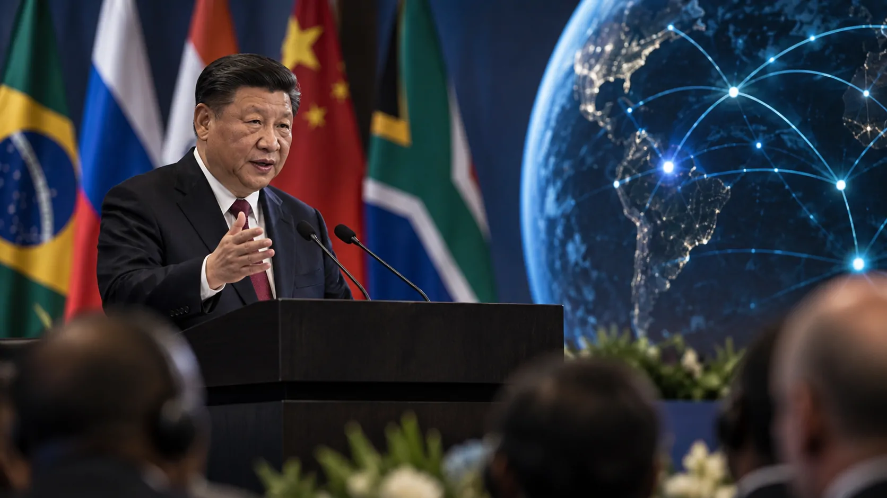

*O movimento anunciado por **Xi Jinping** coloca a inteligência artificial de código aberto dentro de uma agenda que vai além da tecnologia: envolve autonomia digital, cooperação industrial e a tentativa de ampliar a influência tecnológica do **BRICS**. Para o **Brasil**, a questão central será transformar participação política em capacidade tecnológica e oportunidades concretas para empresas e pesquisadores.*

## China quer transformar o código aberto em estratégia do BRICS

A **China** quer colocar a inteligência artificial de código aberto no centro da cooperação tecnológica do **BRICS**. A proposta apresentada por **Xi Jinping** prevê a criação de uma zona de IA aberta liderada pelo país asiático.

### Uma proposta que nasce dentro do BRICS

O anúncio ocorreu durante a cúpula do **BRICS em Nova Délhi**, na Índia, dentro de um conjunto mais amplo de iniciativas para ampliar a cooperação entre os países do bloco.

A proposta prevê colaboração no desenvolvimento e na aplicação de **grandes modelos de linguagem**, além de treinamento especializado e construção de um ecossistema aberto de inteligência artificial.

### O que muda na estratégia tecnológica

A importância do anúncio está em tratar o **código aberto** não apenas como uma escolha técnica, mas como instrumento de cooperação entre países.

A iniciativa ainda não representa uma plataforma única do BRICS. O que existe neste momento é uma proposta política para criar mecanismos de colaboração tecnológica que precisarão ser detalhados.

## A proposta chinesa vai além dos modelos de IA

*Xi Jinping apresentou a cooperação em inteligência artificial como parte de uma agenda mais ampla de integração tecnológica entre os países do BRICS.*

A iniciativa chinesa pode ser entendida como parte de uma agenda maior de infraestrutura digital, porque o plano apresentado por **Xi Jinping** também inclui cooperação em nuvem, manufatura inteligente e formação de profissionais.

### IA conectada à indústria

A combinação dessas propostas mostra que a **China** pretende relacionar inteligência artificial com infraestrutura, indústria e qualificação profissional.

Para o setor empresarial, isso pode ser mais relevante do que simplesmente disponibilizar um novo modelo. Uma tecnologia aberta precisa de computação, dados, profissionais e sistemas capazes de transformá-la em aplicações.

### A diferença entre acesso e capacidade

Ter acesso a modelos abertos não significa automaticamente possuir autonomia tecnológica. Empresas ainda precisam adaptar sistemas, proteger dados, avaliar desempenho e integrar a IA aos processos existentes.

Esse ponto será decisivo para o **Brasil**, caso a proposta avance. A oportunidade dependerá menos do anúncio em si e mais da capacidade de transformar cooperação em projetos concretos.

## Por que o Brasil pode ganhar importância nessa agenda

O **Brasil** pode assumir uma posição relevante porque integra o BRICS e possui um mercado empresarial amplo para aplicações de inteligência artificial, embora ainda exista uma distância entre experimentação e adoção estratégica.

### Um mercado que já está experimentando IA

Empresas brasileiras já utilizam **inteligência artificial** em diferentes níveis. O desafio está em transformar ferramentas isoladas em capacidade tecnológica incorporada aos negócios.

Esse cenário ajuda a entender por que uma eventual cooperação internacional pode ser relevante. O acesso a modelos, treinamento e projetos conjuntos poderia ampliar as alternativas disponíveis para organizações brasileiras.

### O desafio de transformar participação em capacidade

O Brasil não anunciou, até o momento, que terá uma posição específica dentro da nova zona de IA. Por isso, seria prematuro tratar a proposta como uma vantagem automática para o país.

O cenário doméstico também mostra essa diferença. O Notícia Tech já analisou **[como empresas brasileiras estão usando IA em estágio avançado](https://noticiatech.com.br/inteligencia-artificial/empresas-brasileiras-usam-ia-nivel-avancado/)**, contexto que ajuda a dimensionar o desafio de transformar acesso à tecnologia em maturidade empresarial.

## O código aberto virou uma peça da disputa tecnológica

*O código aberto pode funcionar como uma camada de cooperação tecnológica, mas sua eficácia depende de infraestrutura, talentos e capacidade de implementação.*

O **código aberto** ganhou importância estratégica porque a disputa global por inteligência artificial envolve muito mais do que modelos: inclui chips, data centers, nuvem, dados, talentos e padrões tecnológicos.

### Reduzir dependências tecnológicas

Modelos e componentes abertos podem permitir que empresas e pesquisadores adaptem tecnologias existentes às próprias necessidades, sem depender exclusivamente de plataformas fechadas.

Isso não elimina dependências. Treinar e operar sistemas avançados continua exigindo infraestrutura computacional, energia, dados e profissionais especializados.

### A dimensão geopolítica da IA

A proposta também ganha peso diante da competição tecnológica entre **China e Estados Unidos**. Nesse ambiente, controlar ou participar de ecossistemas de IA pode significar influência sobre padrões, infraestrutura e cadeias tecnológicas.

A diferença agora é a dimensão multilateral. A China tenta ampliar a participação do **BRICS e do Sul Global** em uma arquitetura de cooperação que pode criar alternativas aos ecossistemas dominantes.

## Empresas podem encontrar novas alternativas tecnológicas

Para empresas, o principal efeito potencial da proposta está na possibilidade de ampliar o conjunto de tecnologias disponíveis para desenvolver aplicações de inteligência artificial.

### Onde pode surgir valor empresarial

Se a iniciativa gerar modelos, ferramentas, ambientes de desenvolvimento e programas de capacitação acessíveis aos participantes, organizações poderão ganhar novas opções para projetos de IA.

Isso pode interessar especialmente a setores nos quais **custo, personalização, soberania de dados e localização tecnológica** tenham peso na decisão de compra ou desenvolvimento.

### Abertura não elimina governança

Uma tecnologia aberta também precisa ser avaliada quanto a segurança, qualidade, propriedade intelectual, proteção de dados e responsabilidade corporativa.

Essa discussão se torna ainda mais importante à medida que modelos de IA deixam de ser experimentos e passam a participar de processos empresariais críticos. Para aprofundar esse aspecto, o debate sobre **[governança de IA nas empresas](https://noticiatech.com.br/inteligencia-artificial/o-que-e-ai-governance-governanca-ia-empresas/)** mostra por que acesso tecnológico e controle precisam avançar juntos.

## O próximo teste será transformar anúncio em infraestrutura

*O impacto da proposta dependerá da capacidade do BRICS de transformar cooperação política em infraestrutura, modelos, formação profissional e aplicações concretas.*

O impacto da proposta dependerá de sua capacidade de transformar cooperação política em **modelos, infraestrutura, formação profissional e aplicações reais de inteligência artificial**.

### O que ainda precisa ser definido

A criação da zona de IA aberta ainda depende de mecanismos que não foram detalhados. Será necessário observar quais tecnologias estarão disponíveis, quais países participarão dos projetos e como será estruturada a governança.

Também será importante acompanhar questões como financiamento, licenciamento, padrões técnicos, infraestrutura computacional e tratamento de dados.

### O papel que o Brasil pode disputar

Para o **Brasil**, a diferença estará entre simplesmente consumir tecnologias produzidas por outros países e participar da construção de capacidade tecnológica própria.

Pesquisa, desenvolvimento de modelos, formação de profissionais e criação de aplicações para empresas brasileiras podem determinar o tamanho dessa participação.

A proposta chinesa, portanto, coloca a **inteligência artificial de código aberto** em uma nova camada da disputa tecnológica. O BRICS passa a ser um espaço onde tecnologia, indústria e geopolítica se encontram, e o Brasil terá de decidir quanto dessa agenda pretende apenas acompanhar e quanto pretende ajudar a construir.

---