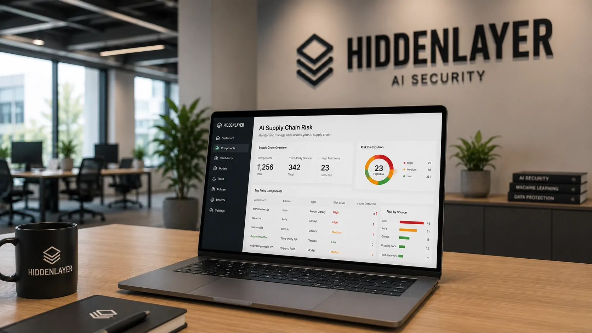
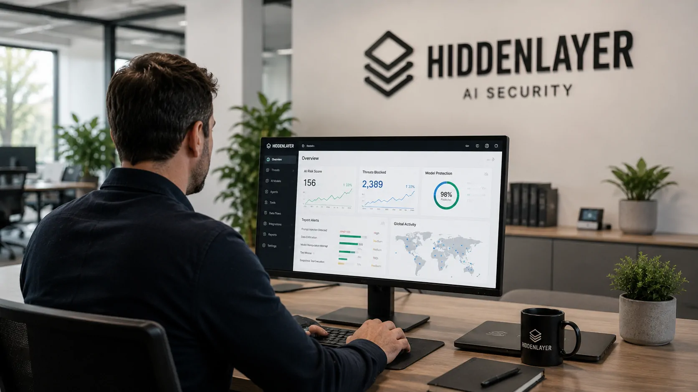
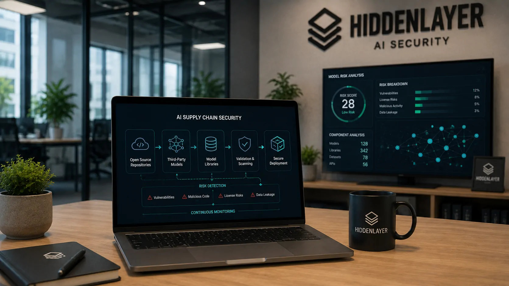

*Chris Sestito ajudou a transformar uma preocupação que ainda parecia distante para muitas empresas em uma oportunidade concreta de mercado. A HiddenLayer levantou US$ 100 milhões em uma rodada Série B enquanto sua receita recorrente anual cresceu mais de dez vezes, sinalizando que a segurança deixou de ser apenas uma barreira para a adoção da IA e passou a fazer parte da própria infraestrutura necessária para colocá-la em produção.*

## A HiddenLayer encontrou um mercado dentro do risco da IA

A **HiddenLayer**, empresa de segurança de inteligência artificial cofundada e liderada por **Chris Sestito**, anunciou uma rodada Série B de **US$ 100 milhões** liderada pela Delta-v Capital. Participaram também Ten Eleven Ventures, Morgan Stanley, M12, fundo de venture da Microsoft, e Booz Allen Ventures.

O movimento acontece em um momento em que empresas estão deixando de testar IA apenas em projetos experimentais e passando a incorporá-la em produtos, desenvolvimento de software e operações críticas. Quanto maior essa presença, maior também o custo potencial de uma falha de segurança.

A trajetória da **HiddenLayer** chama atenção porque a empresa não precisou abandonar sua proposta original para acompanhar essa mudança. Em vez disso, ampliou o escopo da proteção para acompanhar a evolução dos próprios sistemas de IA.

### De modelos para agentes autônomos

A companhia começou concentrada na proteção de modelos contra ataques adversariais, mas passou a atuar também sobre aplicações generativas, agentes e fluxos de trabalho automatizados.

Essa mudança é importante porque um agente de IA não apenas produz uma resposta. Dependendo da arquitetura, ele pode acessar ferramentas, consultar dados, executar código e realizar uma sequência de ações sem intervenção humana a cada etapa.

É justamente essa autonomia que cria uma nova camada de risco para as empresas.

## Chris Sestito viu a ameaça virar demanda empresarial

*O crescimento da HiddenLayer acompanha a transformação da segurança de IA em uma necessidade operacional para empresas que colocam modelos e agentes em produção.*

O crescimento da **HiddenLayer** ajuda a explicar por que investidores estão colocando capital em segurança específica para IA. Segundo a empresa, sua receita recorrente anual cresceu mais de **10 vezes** no último ano e mais de 50 novos clientes foram adicionados à plataforma.

O CEO **Chris Sestito** afirmou que a empresa passou a atender organizações de setores como serviços financeiros, seguros, governo, tecnologia, farmacêutico, aviação e defesa.

O número mais relevante, porém, não é apenas o tamanho da rodada. É a combinação entre crescimento de receita, novos clientes e expansão do problema que a empresa pretende resolver.

### O dinheiro acompanha uma mudança de prioridade

A rodada será utilizada para aprofundar a plataforma empresarial, com destaque para recursos de **Agentic Runtime Security**, além da expansão de uma solução destinada a proteger agentes de programação durante sua execução.

Isso coloca a segurança em tempo de execução no centro da estratégia.

Em sistemas tradicionais, grande parte dos controles de segurança procura identificar ameaças em dispositivos, redes, aplicações ou identidades. No universo da IA, surge uma pergunta adicional: o que exatamente o modelo ou agente está fazendo enquanto opera?

### A receita recorrente mostra a disposição de pagar

O crescimento do ARR, sigla para receita recorrente anual, é especialmente relevante porque indica que o problema deixou de ser tratado apenas como uma preocupação experimental.

De acordo com dados divulgados pela empresa e informações reportadas sobre a rodada, o ARR chegou à casa das dezenas de milhões de dólares, embora a companhia não tenha divulgado o valor exato.

Mais de 90% do crescimento teria vindo de novos clientes conquistados no último ano. Isso sugere que a expansão não depende apenas de vender mais para a mesma base, mas de uma demanda empresarial que está se formando rapidamente.

## O novo alvo são os agentes que podem agir sozinhos

A transformação mais importante no mercado de segurança de IA está na passagem de sistemas que apenas respondem para sistemas capazes de executar tarefas.

Um agente pode receber uma instrução, consultar informações, chamar ferramentas, modificar arquivos e avançar por várias etapas para atingir um objetivo. Se um invasor conseguir manipular esse processo, o problema deixa de ser apenas uma resposta incorreta.

Pode se transformar em uma ação não autorizada.

### Injeção de prompt e uso indevido de ferramentas

Entre os riscos que a **HiddenLayer** passou a abordar estão a injeção de prompt, a manipulação de agentes e o uso malicioso de ferramentas conectadas aos sistemas de IA.

Essas ameaças são particularmente relevantes para empresas porque os agentes podem receber permissões que anteriormente ficavam restritas a funcionários ou aplicações tradicionais.

A questão, portanto, não é simplesmente impedir que um modelo produza conteúdo inadequado. É controlar o que um sistema automatizado consegue fazer quando recebe instruções maliciosas ou é comprometido.

### A segurança precisa acompanhar a execução

Essa lógica explica a aposta da **HiddenLayer** em proteção durante o funcionamento dos agentes. A empresa pretende oferecer visibilidade sobre o comportamento dos sistemas e identificar ações suspeitas enquanto elas acontecem.

O movimento ocorre paralelamente a uma preocupação mais ampla das grandes empresas de tecnologia. A própria Microsoft já alertou para a necessidade de novas estruturas de governança à medida que agentes passam a operar dentro das empresas, tema que o **[debate sobre governança de agentes de IA nas empresas](https://noticiatech.com.br/inteligencia-artificial/microsoft-governanca-agentes-ia-empresas/)** ajuda a contextualizar.

## A segurança de IA começa antes de o modelo entrar em produção

*Modelos, dependências e componentes externos ampliam a superfície de ataque antes mesmo de uma aplicação de IA começar a operar.*

Outro ponto estratégico da **HiddenLayer** está na cadeia de suprimentos da IA. Modelos e componentes utilizados por empresas podem vir de repositórios públicos ou de terceiros, criando riscos que não existiam da mesma forma em aplicações tradicionais.

A empresa afirma analisar dezenas de frameworks de arquivos de IA para identificar modelos adulterados ou componentes que não correspondam ao que aparentam ser.

Isso é particularmente importante no ecossistema de modelos de código aberto e pesos abertos, no qual organizações podem incorporar componentes externos aos próprios sistemas.

### O problema não termina no treinamento

Uma organização pode avaliar um modelo antes de colocá-lo em funcionamento e ainda assim enfrentar riscos durante sua utilização.

Um agente pode receber novos dados, interagir com ferramentas diferentes ou operar dentro de um fluxo de trabalho que não existia no momento da avaliação inicial.

Por isso, a estratégia da **HiddenLayer** combina descoberta, simulação de ataques, segurança da cadeia de suprimentos e proteção em tempo de execução.

Essa abordagem aproxima a segurança de IA de uma disciplina contínua, e não de uma auditoria realizada apenas antes do lançamento.

## O capital também revela onde investidores enxergam oportunidade

A rodada de US$ 100 milhões acontece em um mercado que começa a atrair concorrência de empresas de segurança tradicionais e novas startups especializadas.

Segundo estimativa citada pela TechCrunch com base em dados do Gartner, empresas devem gastar **US$ 2,83 bilhões em 2026** com produtos destinados à segurança de ferramentas de IA, um crescimento de 83% em relação ao ano anterior. A previsão é de quase US$ 4,78 bilhões em 2027.

Esse cenário ajuda a explicar a disposição dos investidores em financiar empresas que ocupam uma posição específica dentro da infraestrutura de IA.

### A disputa não será apenas entre startups

O próprio **Chris Sestito** reconhece que algumas funcionalidades de segurança de IA podem acabar incorporadas às plataformas de grandes empresas de tecnologia.

Microsoft, OpenAI e AWS possuem recursos de infraestrutura capazes de absorver determinadas funções de descoberta, identidade, políticas e governança.

A oportunidade da **HiddenLayer** está em aprofundar uma camada mais especializada: entender o comportamento de modelos e agentes e identificar ameaças específicas da inteligência artificial.

O desafio será transformar essa especialização em uma posição duradoura antes que os grandes fornecedores consolidem essas capacidades em suas próprias plataformas.

## Chris Sestito aposta que a segurança acompanhará a expansão da IA

*Para empresas que delegam tarefas a agentes de IA, controlar o comportamento desses sistemas passa a ser parte da infraestrutura necessária para escalar a tecnologia.*

A estratégia da **HiddenLayer** mostra uma mudança importante no mercado. No início da corrida da IA generativa, segurança poderia ser tratada como uma condição adicional para colocar modelos em produção.

Com agentes ganhando autonomia, ela começa a se tornar parte da própria arquitetura operacional.

O caso de **Chris Sestito** também mostra como uma ameaça tecnológica pode se transformar em um mercado quando o risco passa a ser percebido como concreto pelos compradores corporativos.

A **HiddenLayer** ainda precisa provar que conseguirá manter essa vantagem diante da entrada de grandes empresas de cibersegurança e dos próprios fornecedores de infraestrutura de IA. Mas a combinação de **US$ 100 milhões em novo capital**, crescimento de receita recorrente superior a dez vezes e expansão para agentes indica que a segurança de IA deixou de ser uma discussão exclusivamente técnica.

Ela começa a ocupar um espaço próprio no orçamento das empresas que querem transformar agentes e modelos em sistemas de produção.

---