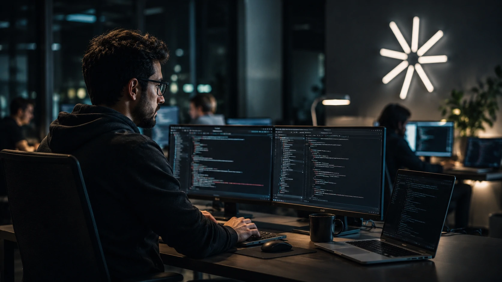
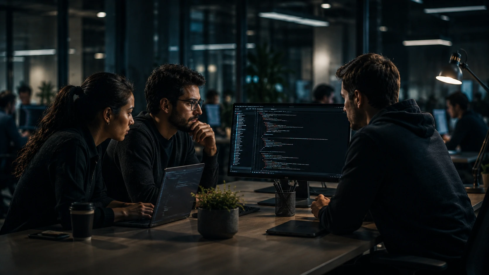

*Durante anos, a corrida da inteligência artificial foi medida por chatbots, benchmarks e capacidade de geração de texto. Em 2026, a disputa começa a migrar para uma camada muito mais estratégica: quem conseguir transformar IA em trabalho operacional real dentro das empresas poderá controlar uma parte significativa da próxima geração da economia digital.*

## Claude Code mostra que agentes de IA estão deixando de ser assistentes para se tornarem operadores de software

A nova fase do **Claude Code** sinaliza uma mudança estrutural no mercado de inteligência artificial corporativa.

Em vez de apenas sugerir código ou responder perguntas, os modelos mais recentes da **Anthropic** começam a executar tarefas longas, validar resultados, coordenar múltiplos agentes e operar fluxos completos de desenvolvimento.

A atualização do **Claude Opus 4.8** reforça exatamente essa direção.

Segundo a empresa, o modelo foi projetado para lidar com trabalhos complexos de engenharia, coordenação de agentes paralelos e processos que exigem execução prolongada.

### O mercado está migrando da assistência para a execução

A diferença parece pequena, mas possui enorme impacto econômico.

A geração anterior de IA ajudava profissionais.

A nova geração começa a executar partes relevantes do trabalho.

Isso altera produtividade, estrutura de equipes e até mesmo a forma como empresas contratam talentos técnicos.

### O software se torna um ambiente operado por agentes

O desenvolvimento de software sempre exigiu coordenação humana intensa.

Agora surgem sistemas capazes de:

- revisar código;
- identificar vulnerabilidades;
- documentar aplicações;
- testar funcionalidades;
- validar resultados;
- corrigir erros automaticamente.

A consequência é que o software deixa de ser apenas desenvolvido por pessoas e passa a ser parcialmente operado por ecossistemas de agentes.

## A estratégia da Anthropic avança sobre um território que OpenAI e Google também disputam

A disputa atual não é mais apenas sobre modelos mais inteligentes.

A competição agora envolve quem conseguirá controlar os fluxos de trabalho das empresas.

A **Anthropic** vem ampliando sua presença exatamente nesse território.

A empresa lançou novas capacidades multiagentes, workflows dinâmicos e recursos voltados para operações corporativas de larga escala.

### O desenvolvimento virou o principal campo de batalha da IA

Programadores se tornaram um dos primeiros grupos profissionais impactados diretamente pelos agentes.

Não porque serão substituídos.

Mas porque passam a trabalhar em conjunto com sistemas capazes de executar tarefas que antes consumiam horas ou dias.

Estudos recentes mostram crescimento significativo na produtividade e expansão tecnológica de desenvolvedores que utilizam agentes avançados de código.

### A disputa deixou de ser chatbot versus chatbot

Enquanto usuários comuns ainda observam a evolução dos assistentes conversacionais, empresas estão olhando para outra métrica.

O foco agora é:

- autonomia;
- confiabilidade;
- execução;
- integração operacional.

Esse movimento aproxima IA de sistemas ERP, CRMs e infraestrutura corporativa.

A tendência já aparece em movimentos anteriores discutidos pelo Notícia Tech, como [A era dos agentes de IA já começou: como Microsoft, OpenAI e Google estão transformando empresas em sistemas autônomos](https://noticiatech.com.br/inteligencia-artificial/a-era-dos-agentes-de-ia-j%C3%A1-come%C3%A7ou-como-microsoft-openai-e-google-est%C3%A3o-transformando-empresas-em-sistemas-aut%C3%B4nomos/) e [AI Operating Systems: por que empresas começam a substituir softwares isolados por ecossistemas autônomos de IA](https://noticiatech.com.br/negocios/ai-operating-systems-por-que-empresas-come%C3%A7am-a-substituir-softwares-isolados-por-ecossistemas-aut%C3%B4nomos-de-ia/).

## A confiabilidade dos agentes começa a se tornar mais importante que inteligência bruta

Empresas não precisam apenas de modelos inteligentes.

Precisam de modelos previsíveis.

Por isso a **Anthropic** passou a destacar fortemente métricas relacionadas à honestidade, transparência e validação de respostas.

A empresa afirma que o Opus 4.8 apresenta melhorias significativas na identificação de incertezas e na redução de respostas incorretas apresentadas com excesso de confiança.

### O próximo problema das empresas não será capacidade

O desafio começa a migrar para governança.

À medida que agentes assumem tarefas mais críticas, empresas precisam responder perguntas como:

- quem valida decisões?
- quem audita resultados?
- quem responde por falhas?
- como controlar autonomia excessiva?

Essas discussões se conectam diretamente ao crescimento da governança de IA.

O movimento também conversa com tendências observadas em [AI Compliance Officers: por que empresas começam a criar agentes de IA especializados em auditoria e governança corporativa](https://noticiatech.com.br/negocios/ai-compliance-officers-por-que-empresas-come%C3%A7am-a-criar-agentes-de-ia-especializados-em-auditoria-e-governan%C3%A7a-corporativa/) e [Shadow AI: empresas descobrem que uso invisível de inteligência artificial já virou risco operacional em 2026](https://noticiatech.com.br/negocios/shadow-ai-empresas-descobrem-que-uso-invis%C3%ADvel-de-intelig%C3%AAncia-artificial-j%C3%A1-virou-risco-operacional-em-2026/).

### A confiança pode se tornar o principal diferencial competitivo

Durante os primeiros anos da IA generativa, o mercado premiava velocidade.

Agora começa a premiar confiabilidade.

Empresas que operam setores financeiros, jurídicos, industriais e de infraestrutura precisam de agentes capazes de justificar decisões e reduzir riscos.

Nesse cenário, modelos que demonstram transparência operacional podem ganhar vantagem competitiva.

## O crescimento da Anthropic mostra que investidores acreditam na era dos agentes corporativos

A valorização recente da **Anthropic** reforça que o mercado financeiro enxerga potencial econômico nessa transição.

A empresa alcançou uma das maiores avaliações já registradas no setor de inteligência artificial após forte crescimento de clientes corporativos e demanda por soluções avançadas de automação.

O dado mais relevante não é apenas o valor de mercado.

É o motivo pelo qual investidores estão apostando bilhões.

### O foco está na camada operacional das empresas

O capital está migrando para plataformas capazes de:

- executar trabalho;
- integrar sistemas;
- operar processos;
- coordenar agentes;
- transformar conhecimento corporativo em produção.

Essa é exatamente a camada onde a próxima disputa bilionária da inteligência artificial começa a acontecer.

### O software pode deixar de ser apenas uma ferramenta

A visão que começa a emergir é mais profunda.

Softwares deixam de ser apenas produtos utilizados por pessoas.

Passam a funcionar como ambientes habitados por agentes digitais especializados.

Nesse cenário, empresas não compram apenas tecnologia.

Compram capacidade operacional automatizada.

A evolução recente do Claude Code sugere que essa transformação está avançando mais rápido do que grande parte do mercado previa. E se os próximos ciclos confirmarem essa trajetória, a próxima grande guerra da inteligência artificial talvez não aconteça nas interfaces que os usuários enxergam diariamente, mas dentro dos bastidores que movimentam o software, os processos e a infraestrutura das empresas.

---