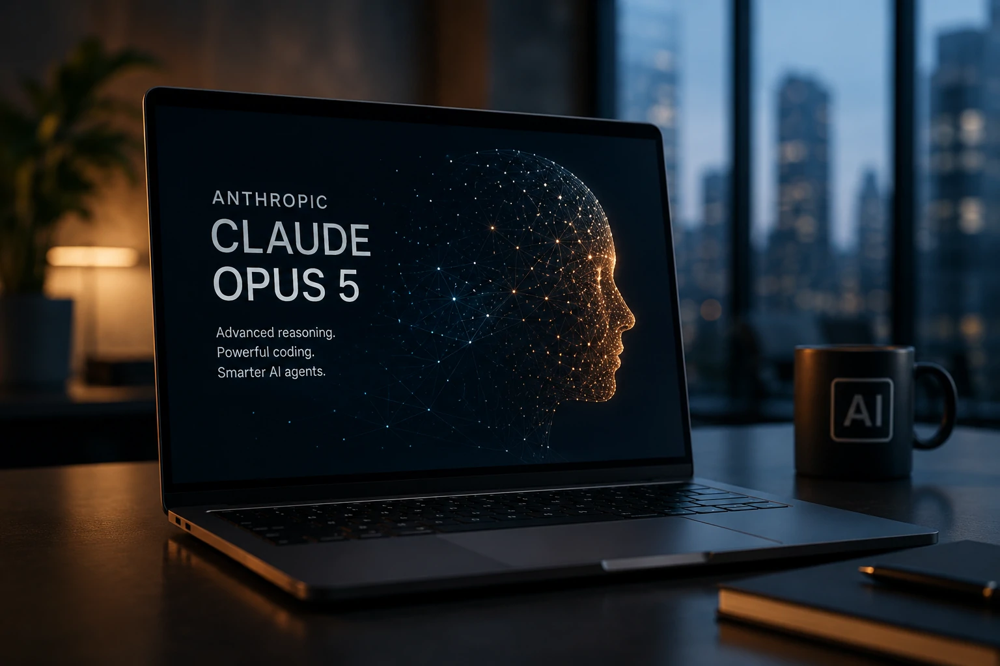
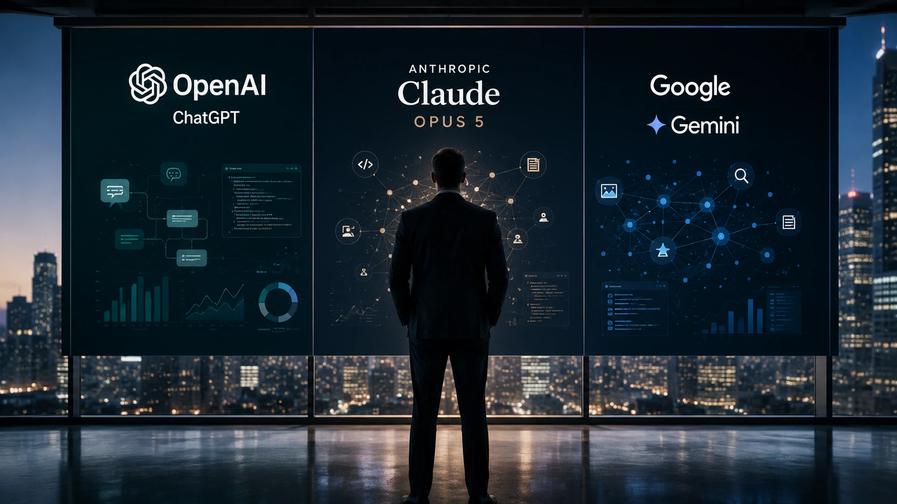
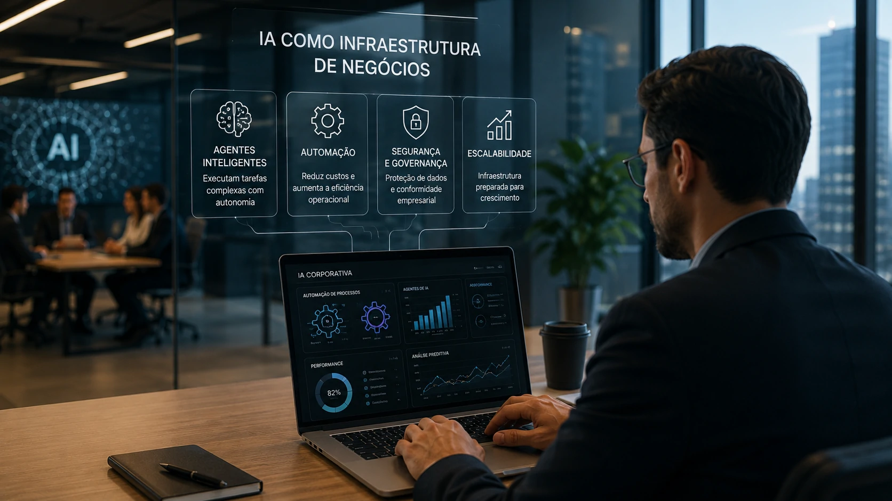

*Durante meses, a disputa pela liderança da inteligência artificial ficou concentrada entre **OpenAI** e **Google**. Agora, a chegada do **Claude Opus 5** mostra que a **Anthropic** pretende assumir um papel ainda mais relevante nessa corrida. Mais do que um novo modelo, o lançamento representa um movimento estratégico que pode alterar a forma como empresas escolhem suas plataformas de IA nos próximos anos.*

## O Claude Opus 5 representa um novo estágio na disputa entre as gigantes da IA

*O Claude Opus 5 reforça a estratégia da Anthropic para conquistar espaço no mercado corporativo de inteligência artificial.*

O lançamento do **Claude Opus 5** chega em um momento de forte competição entre **Anthropic**, **OpenAI** e **Google**.

A empresa aposta em melhorias de desempenho para programação, raciocínio complexo e execução de tarefas por **agentes de IA**, áreas que vêm recebendo investimentos bilionários de todo o setor.

Mais do que anunciar um modelo mais potente, a estratégia da **Anthropic** busca convencer empresas de que sua plataforma pode se tornar a principal infraestrutura para aplicações corporativas de inteligência artificial.

### A corrida deixou de ser apenas sobre chatbots

Nos últimos dois anos, a disputa evoluiu rapidamente.

Hoje, o foco está em criar plataformas capazes de executar tarefas completas, automatizar processos e atuar como colaboradores digitais.

### Empresas querem produtividade

O mercado corporativo procura modelos que reduzam custos, automatizem operações e acelerem o desenvolvimento de software.

Essa mudança explica por que praticamente todos os grandes laboratórios passaram a investir em agentes inteligentes.

Nesse cenário, vale acompanhar também a evolução do **ChatGPT Work**, que inaugurou uma nova etapa dos agentes corporativos.

[Por que o ChatGPT Work marca o início da era dos agentes de IA para produtividade corporativa](https://noticiatech.com.br/inteligencia-artificial/chatgpt-work-era-agentes-ia-produtividade-corporativa/)

## O avanço do Claude Opus 5 mostra que a competição agora acontece entre ecossistemas completos

*OpenAI, Anthropic e Google deixaram de competir apenas por modelos de linguagem e passaram a disputar todo o ecossistema de IA empresarial.*

A disputa entre **Claude**, **ChatGPT** e **Gemini** deixou de ser apenas uma comparação de qualidade das respostas.

Hoje, cada empresa tenta construir uma plataforma completa capaz de integrar **agentes inteligentes**, programação, automação, busca, produtividade e tomada de decisão.

Isso explica por que novos lançamentos chegam em intervalos cada vez menores e com foco em aplicações corporativas. 

### A IA está se tornando infraestrutura

Assim como aconteceu com a computação em nuvem há alguns anos, os modelos de IA caminham para se tornar infraestrutura de negócios.

As empresas não procuram apenas um chatbot melhor, mas uma tecnologia capaz de automatizar processos inteiros.

Esse movimento também ajuda a explicar a expansão dos **AI Agents** e da **AI Orchestration**, temas que vêm ganhando espaço dentro do mercado corporativo.

Para entender esse cenário, vale conhecer como funciona a orquestração entre múltiplos agentes de IA.

[O que é AI Orchestration e por que ela será essencial para empresas que usam múltiplos agentes de IA](https://noticiatech.com.br/automacao/ai-orchestration-empresas-multiplos-agentes-ia/)

### Custo passa a ser um diferencial competitivo

Outro ponto importante é o preço.

A **Anthropic** afirma que o **Claude Opus 5** entrega desempenho próximo de seus modelos mais avançados por aproximadamente metade do custo, tornando a tecnologia mais acessível para empresas que precisam escalar aplicações de IA. 

## O impacto para empresas vai muito além da comparação entre ChatGPT e Claude

*Organizações passam a avaliar plataformas completas de inteligência artificial, e não apenas modelos individuais.*

Para empresas, a principal consequência dessa nova disputa é o aumento das opções disponíveis.

Quanto maior a concorrência entre **Anthropic**, **OpenAI** e **Google**, maior tende a ser a velocidade de inovação.

### A decisão não depende apenas do modelo

Empresas começam a avaliar fatores como:

- integração com sistemas internos;
- segurança;
- governança;
- custo operacional;
- velocidade de desenvolvimento;
- capacidade dos agentes autônomos.

Isso significa que a escolha entre **Claude**, **ChatGPT** ou **Gemini** dependerá cada vez menos de testes simples e mais da estratégia tecnológica de longo prazo.

### A corrida pela liderança está apenas começando

O lançamento do **Claude Opus 5** demonstra que o mercado entrou em uma fase diferente.

Em vez de grandes anúncios anuais, a tendência passa a ser uma sequência de melhorias incrementais, redução de custos e evolução contínua dos agentes inteligentes. 

Para empresas, isso representa uma oportunidade de acelerar projetos de transformação digital. Para o mercado, significa que a disputa entre **Anthropic**, **OpenAI** e **Google** tende a se intensificar nos próximos meses, tornando a inteligência artificial um dos principais fatores de competitividade dos negócios digitais.

---