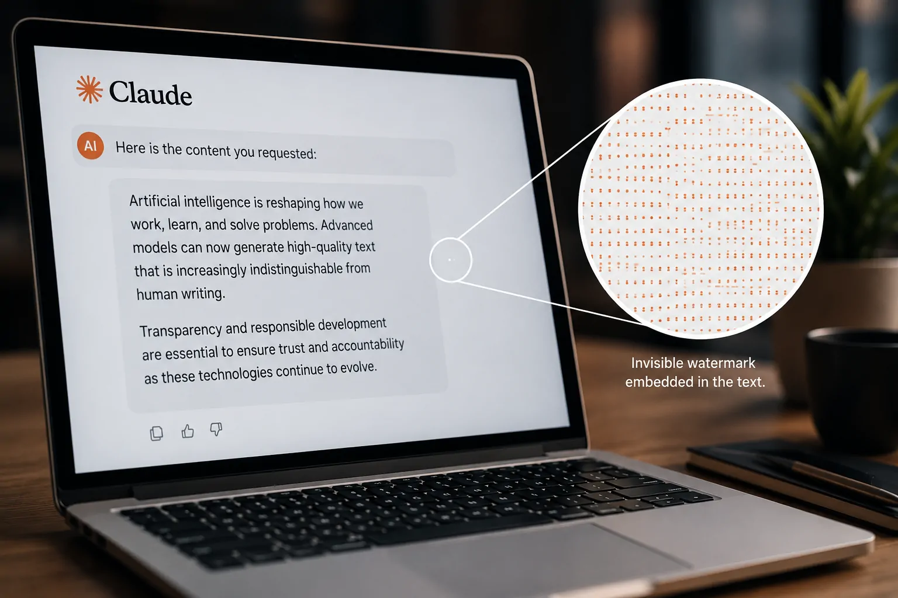
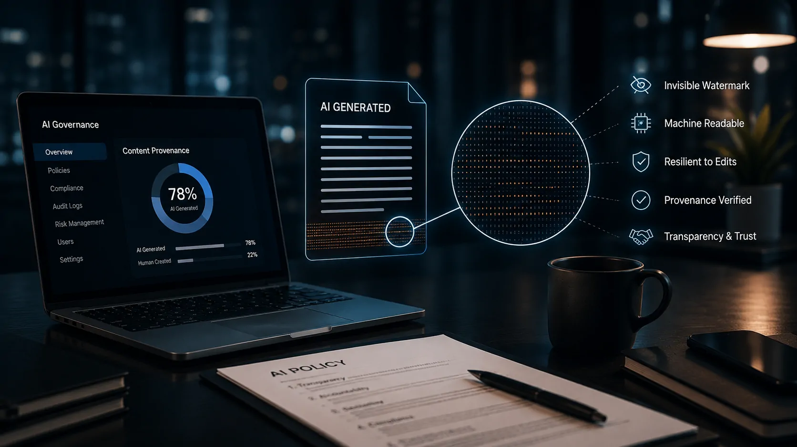

*O texto produzido por uma inteligência artificial sempre pareceu difícil de distinguir de um conteúdo escrito por uma pessoa. Agora, a **Anthropic** está tentando mudar essa relação de forma silenciosa: o **Claude** começou a incorporar uma marca que o usuário não consegue enxergar, mas que pode ser identificada por máquinas.*

*O movimento acontece justamente quando governos e empresas de tecnologia aumentam a pressão por transparência na **inteligência artificial**. A questão deixou de ser apenas descobrir se um texto parece ter sido escrito por uma IA e passou a envolver a possibilidade de identificar sua procedência de maneira técnica.*

## O que a Anthropic mudou no Claude

A **Anthropic** começou a incorporar uma marca d'água invisível aos textos produzidos por modelos compatíveis do **Claude**, seu sistema de inteligência artificial generativa. O sinal é inserido diretamente no texto durante o processo de geração e foi projetado para não alterar o significado, a leitura ou a aparência da resposta.

Isso é diferente de uma etiqueta tradicional. O leitor não verá uma mensagem dizendo que aquele conteúdo foi criado por IA. A marca funciona como um sinal estatístico que pode ser procurado posteriormente por mecanismos preparados para reconhecê-lo.

A mudança alcança diferentes formas de uso do **Claude**, incluindo produtos destinados a consumidores e ambientes corporativos. A estratégia também acompanha a adoção de mecanismos de procedência digital em outros formatos de conteúdo, nos quais arquivos podem carregar informações assinadas sobre sua origem.

### Por que a marca fica escondida

A escolha por uma marca invisível resolve um problema importante: uma identificação visual poderia ser facilmente removida simplesmente apagando uma etiqueta.

Ao inserir o sinal no próprio processo de geração, a **Anthropic** tenta fazer com que ele acompanhe o conteúdo mesmo quando o texto é copiado para outro documento. A empresa afirma que a marca pode sobreviver a operações comuns de manipulação, embora existam limitações quando o conteúdo sofre alterações mais profundas.

Essa diferença é importante porque **marca d'água**, **detecção de IA** e **metadados** não são a mesma coisa. Uma marca d'água é um sinal criado deliberadamente pelo sistema gerador. Já um detector tenta estimar se um texto foi produzido por IA analisando características estatísticas. Metadados, por outro lado, são informações associadas ao arquivo que registram sua procedência.

### A mudança não significa que todo texto do Claude será identificado para sempre

Existe uma limitação importante nessa estratégia. A presença de um sinal pode ajudar a indicar que determinado conteúdo foi produzido pelo **Claude**, mas isso não transforma a tecnologia em uma prova universal de autoria.

Reescritas profundas, traduções e outras transformações podem reduzir ou eliminar a capacidade de detectar a marca. Da mesma forma, a ausência de um sinal não significa necessariamente que nenhum sistema de IA tenha participado da criação daquele conteúdo.

Essa ressalva será importante para empresas que pretendem usar a tecnologia em processos de auditoria ou controle interno. A marca é uma camada de procedência, não um mecanismo infalível para determinar quem escreveu um texto.

## Por que o Claude começou a fazer isso agora

*A marca d'água do Claude é incorporada ao texto de forma imperceptível para o leitor, mas pode ser identificada por mecanismos preparados para detectar o sinal.*

A principal razão está na mudança regulatória europeia. O **AI Act da União Europeia** criou novas exigências de transparência para conteúdos gerados ou manipulados por inteligência artificial, aumentando a pressão para que empresas desenvolvam mecanismos capazes de indicar a origem desses materiais.

A nova regra faz parte de uma transformação maior na forma como a indústria encara a procedência de conteúdo. Durante anos, o debate esteve concentrado na capacidade dos modelos de gerar textos, imagens, áudio e vídeos cada vez mais convincentes. Agora, a discussão começa a se deslocar para uma pergunta diferente: **como saber de onde veio aquilo que estamos vendo?**

A **Anthropic** decidiu responder a essa pressão incorporando a marca diretamente ao processo de geração. Segundo a cobertura publicada nesta quarta-feira, 12 de agosto, os modelos lançados na União Europeia a partir de 2 de agosto de 2026 já entram nesse movimento, enquanto modelos anteriores passam por uma transição.

### O papel do AI Act nessa mudança

O **AI Act** é o conjunto de regras criado pela União Europeia para estabelecer obrigações sobre sistemas de inteligência artificial. Entre seus objetivos está aumentar a transparência sobre o uso de IA e criar responsabilidades proporcionais aos riscos de cada tecnologia.

Para o leitor que nunca ouviu falar do regulamento, o ponto central nesta notícia é simples: **a Europa quer que pessoas e organizações tenham mais condições de saber quando determinado conteúdo foi produzido ou manipulado por inteligência artificial**.

O movimento da Anthropic pode ser entendido dentro desse contexto. A empresa não está apenas adicionando uma nova função ao **Claude**; está adaptando a infraestrutura do modelo a uma realidade em que procedência e transparência passam a fazer parte do próprio produto.

O Notícia Tech já analisou como o **AI Act** está alterando a estratégia de empresas como **OpenAI** e **Anthropic**, e essa nova decisão mostra como a regulamentação começa a sair do campo jurídico para chegar diretamente ao funcionamento das ferramentas de IA: **[OpenAI e Anthropic enfrentam novas regras da União Europeia](https://noticiatech.com.br/inteligencia-artificial/openai-anthropic-uniao-europeia-ai-act-muda-mercado-ia/)**.

### Por que outras empresas estão seguindo o mesmo caminho

A iniciativa da **Anthropic** não surgiu isoladamente. O **Google** já utiliza o **SynthID** para inserir marcas digitais em conteúdos gerados por seus sistemas de IA, inclusive textos produzidos pelo **Gemini**. A tecnologia foi desenvolvida para que o sinal seja imperceptível para pessoas, mas detectável por sistemas preparados para verificá-lo.

A **OpenAI** também vem defendendo uma arquitetura de procedência baseada em diferentes sinais, incluindo **Content Credentials**, padrões como **C2PA** e tecnologias de marcação digital. A empresa afirma que nenhum método isolado é suficiente para determinar a origem de todo conteúdo.

Isso indica que a indústria pode estar caminhando para um cenário no qual **conteúdo gerado por IA deixa de ser completamente anônimo do ponto de vista técnico**.

## O que uma marca invisível muda para quem usa Claude

A mudança mais importante é que o conteúdo produzido pelo **Claude** pode passar a carregar uma característica que não é percebida pelo usuário, mas pode ser relevante para sistemas de verificação e políticas corporativas.

Para profissionais que utilizam IA diariamente, isso pode mudar principalmente a relação entre **produção e procedência**. Um texto criado com o Claude pode circular por e-mails, documentos, relatórios, páginas de sites ou sistemas internos sem apresentar qualquer indicação visual de que passou por uma IA.

Ao mesmo tempo, organizações podem começar a incorporar a procedência como parte de suas políticas de **governança de IA**. Em vez de perguntar apenas qual ferramenta os funcionários estão usando, empresas poderão precisar considerar como os conteúdos gerados por essas ferramentas são identificados, armazenados e auditados.

### Empresas ganham transparência, mas também novas responsabilidades

Para uma empresa, a marca pode ser útil em situações nas quais existe uma necessidade legítima de distinguir conteúdo produzido por máquinas de material criado sem participação de IA.

Isso pode envolver documentação interna, comunicação, atendimento ao cliente, marketing, desenvolvimento de software e processos de revisão. A capacidade de identificar a origem pode facilitar auditorias e ajudar equipes de governança a mapear como a inteligência artificial está sendo utilizada.

Mas existe um limite importante: **detectar a participação do Claude não significa determinar automaticamente a qualidade, a veracidade ou a responsabilidade sobre o conteúdo**.

Um relatório pode ter sido produzido com IA e ainda assim ter sido revisado por especialistas. Da mesma forma, um texto sem marca não deve ser tratado automaticamente como produzido exclusivamente por uma pessoa. A procedência é apenas uma parte da avaliação.

### O mercado começa a tratar procedência como parte da infraestrutura de IA

Essa mudança é maior do que o próprio **Claude**. O que está acontecendo é a transformação da procedência em uma camada da infraestrutura de inteligência artificial.

Assim como APIs permitem que diferentes sistemas conversem entre si e mecanismos de autenticação controlam acesso, marcas d'água e credenciais de procedência podem começar a registrar **de onde determinado conteúdo veio**.

Essa evolução também reforça a importância da **segurança de IA** nas empresas. O Notícia Tech já mostrou por que segurança deixou de ser uma preocupação exclusivamente técnica e passou a fazer parte da estratégia de adoção corporativa de inteligência artificial: **[por que a segurança de IA se tornou prioridade para as empresas](https://noticiatech.com.br/inteligencia-artificial/o-que-e-seguranca-ia-prioridade-empresas/)**.

A consequência mais relevante pode aparecer nos próximos meses, quando empresas, plataformas e reguladores começarem a decidir **o que fazer com essa informação de procedência**. A tecnologia para marcar conteúdo está avançando; o próximo debate será sobre como essa marca será interpretada, quem terá acesso a ela e até onde ela poderá ser usada para tomar decisões sobre pessoas e organizações.

## O que muda para empresas e profissionais que usam IA

A mudança do Claude pode ter um efeito especialmente relevante dentro das empresas. Hoje, muitas organizações já utilizam inteligência artificial para produzir relatórios, resumir documentos, responder clientes, criar campanhas, analisar informações e apoiar equipes de desenvolvimento.

Até agora, o controle sobre esse uso dependia principalmente de políticas internas e registros das próprias plataformas. Uma marca invisível cria uma possibilidade adicional: identificar posteriormente que determinado conteúdo foi produzido por um sistema do Claude.

Isso pode ajudar empresas a criar processos mais claros de **governança de IA**, conjunto de políticas e controles usados para definir como a inteligência artificial pode ser adotada dentro de uma organização.

Na prática, uma empresa pode começar a separar conteúdos produzidos integralmente por profissionais daqueles que tiveram participação de sistemas de IA. Isso não significa que um texto marcado deva ser automaticamente considerado menos confiável. A informação sobre sua procedência serve para que a organização saiba como aquele material foi produzido e decida quais etapas de revisão são necessárias.

### Conteúdo gerado por IA pode ganhar uma espécie de procedência digital

O conceito de procedência é importante porque a discussão sobre inteligência artificial está mudando.

No passado, a principal preocupação era saber **se uma máquina conseguia produzir um conteúdo convincente**. Agora, com modelos capazes de gerar textos praticamente indistinguíveis de materiais humanos, surge uma segunda questão: **como identificar a origem desse conteúdo depois que ele deixa a plataforma?**

A marca d'água do Claude tenta responder justamente a esse problema.

Imagine uma empresa que utiliza o Claude para criar uma primeira versão de centenas de descrições de produtos. Os textos podem ser revisados por funcionários antes de serem publicados. Se posteriormente surgir uma dúvida sobre a origem de determinado material, uma tecnologia de detecção poderá fornecer uma indicação de que aquele conteúdo passou pelo Claude.

Isso não substitui auditoria humana, mas adiciona uma nova camada de informação ao processo.

### A mudança também afeta profissionais que trabalham com conteúdo

Para jornalistas, redatores, profissionais de marketing e equipes de comunicação, a novidade pode aumentar a importância da transparência sobre o uso de IA.

Um profissional pode utilizar o Claude para organizar informações, criar uma primeira versão ou revisar um texto e depois realizar alterações substanciais. Nesse cenário, a existência de uma marca não responde sozinha à pergunta sobre autoria.

Por isso, o mercado deverá discutir cada vez mais **o que significa autoria quando humanos e sistemas de IA trabalham juntos**.

A questão não será simplesmente "foi escrito por uma pessoa ou por uma máquina?". Em muitos ambientes profissionais, será necessário entender quanto da produção veio da IA, quanto veio do ser humano e quais processos de revisão foram aplicados antes da publicação.

## A marca invisível não resolve o problema da detecção de IA

É importante não interpretar a novidade como se a Anthropic tivesse criado uma maneira definitiva de descobrir qualquer texto produzido por inteligência artificial.

A tecnologia tem um objetivo mais específico.

Uma marca d'água funciona melhor quando o conteúdo mantém características suficientes para que o sinal possa ser reconhecido. Se uma pessoa simplesmente copia e cola o texto, a marca pode continuar presente. Porém, transformações mais profundas podem dificultar sua identificação.

Uma pessoa pode, por exemplo, reescrever completamente um conteúdo, alterar sua estrutura ou traduzi-lo para outro idioma. Dependendo da transformação realizada, o sinal original pode ser enfraquecido.

Isso cria uma diferença fundamental entre **procedência** e **detecção universal de IA**.

Procedência tenta responder:

> "Este conteúdo carrega um sinal associado a determinada origem?"

Detecção tenta responder:

> "Este conteúdo parece ter sido produzido por uma inteligência artificial?"

São problemas diferentes.

### Por que isso importa para quem publica conteúdo

Essa distinção será particularmente importante para sites, empresas de comunicação e plataformas digitais.

Um sistema que encontra uma marca do Claude pode ter uma indicação adicional sobre a origem de um texto. Mas não deveria concluir automaticamente que o conteúdo é falso, de baixa qualidade ou produzido sem supervisão humana.

Da mesma forma, um texto que não apresenta a marca não deve ser considerado automaticamente humano.

Esse cuidado será essencial para evitar falsos positivos e decisões equivocadas baseadas apenas em ferramentas automáticas.

A própria evolução dessas tecnologias indica que o mercado deverá combinar **marcas d'água, metadados, credenciais de conteúdo e revisão humana**, em vez de depender de um único método.

## O que essa mudança revela sobre o futuro da inteligência artificial

*A identificação da origem de conteúdos gerados por IA pode se tornar uma camada permanente da infraestrutura das plataformas.*

Isso significa que, no futuro, o conteúdo produzido por uma IA poderá carregar mais informações sobre sua origem desde o momento em que é criado.

Textos poderão ter marcas invisíveis. Imagens poderão possuir credenciais de procedência. Vídeos poderão carregar informações sobre sua criação e edição. Documentos corporativos poderão registrar quais sistemas participaram de sua produção.

Esse cenário muda a própria relação entre inteligência artificial e confiança digital.

### A disputa pode migrar da geração para a confiança

Durante a primeira fase da corrida pela inteligência artificial generativa, as empresas competiram principalmente pela qualidade dos modelos.

Quem produzia o melhor texto?  
Quem gerava a imagem mais realista?  
Quem conseguia programar melhor?  
Quem tinha o modelo mais rápido?

Agora surge uma nova frente de competição: **quem consegue oferecer mais controle e transparência sobre o conteúdo produzido?**

Para empresas, essa questão pode ser tão importante quanto a qualidade da resposta.

Uma organização que utiliza IA em larga escala precisa saber não apenas se o modelo funciona, mas também como controlar seus resultados, acompanhar seu uso e demonstrar conformidade com regras internas e externas.

É nesse ponto que **governança de IA** deixa de ser apenas uma discussão jurídica ou administrativa e passa a fazer parte da própria arquitetura dos produtos.

## O mercado pode entrar em uma nova era de rastreabilidade da IA

A iniciativa da Anthropic pode parecer uma mudança pequena para quem simplesmente conversa com o Claude. Porém, seu significado para o mercado é maior.

Se outras empresas adotarem mecanismos semelhantes, conteúdos produzidos por diferentes modelos poderão começar a carregar sinais específicos de procedência.

Isso poderia criar uma espécie de camada de rastreabilidade para a inteligência artificial generativa.

Uma empresa poderia saber que determinado documento passou pelo Claude. Outra plataforma poderia identificar conteúdo produzido por uma ferramenta diferente. Sistemas de publicação poderiam utilizar essas informações para aplicar políticas internas automaticamente.

Ainda existem obstáculos técnicos e regulatórios. Não há garantia de que uma marca permanecerá identificável depois de qualquer transformação feita no conteúdo. Também será necessário definir quem pode consultar essas informações e para quais finalidades.

Mas a direção é clara: **a indústria está começando a tratar a origem do conteúdo como uma informação que merece ser preservada.**

### O impacto pode ser maior na adoção corporativa

Para o mercado empresarial, essa mudança pode ajudar a reduzir uma das preocupações que acompanham a adoção de IA: a falta de visibilidade sobre como os conteúdos foram produzidos.

Isso pode ser especialmente relevante em setores regulados, departamentos jurídicos, comunicação corporativa, educação, atendimento e produção de documentação.

Em vez de simplesmente proibir o uso de IA por medo de perder controle, empresas poderão criar mecanismos para permitir seu uso dentro de regras específicas.

A marca d'água não resolve todos os problemas de governança, mas pode fazer parte desse ecossistema.

E quanto mais sistemas de IA forem incorporados aos processos corporativos, mais importante será saber **onde a IA participou, qual modelo foi utilizado e quais controles foram aplicados depois da geração**.

## O que esperar nos próximos meses

*A combinação de marcas d'água, metadados e credenciais pode transformar a procedência em uma camada importante da infraestrutura de IA.*

A decisão da Anthropic provavelmente não será o fim dessa discussão. Pelo contrário, pode acelerar uma tendência que já está avançando entre as grandes empresas de tecnologia.

O próximo passo deve ser a integração de diferentes mecanismos de procedência. Marcas d'água podem trabalhar ao lado de metadados, credenciais digitais e padrões abertos para fornecer informações mais completas sobre a origem de um conteúdo.

Isso também pode aumentar a pressão sobre empresas que ainda não possuem mecanismos semelhantes.

Com o avanço das regras de transparência na Europa e a expansão do uso corporativo de IA, a capacidade de identificar a participação de sistemas generativos pode deixar de ser uma funcionalidade opcional e passar a fazer parte da infraestrutura básica dessas plataformas.

Para usuários comuns, a mudança será praticamente invisível. Para empresas, porém, ela pode representar uma alteração importante na maneira de administrar conteúdos produzidos por inteligência artificial.

O ponto central é que a IA está deixando de ser apenas uma ferramenta que **gera conteúdo**. Ela começa também a carregar informações sobre **como esse conteúdo surgiu**.

E isso pode mudar a relação entre inteligência artificial, transparência e confiança digital nos próximos anos.

### Conclusão

A marca invisível do Claude não significa que a Anthropic encontrou uma forma perfeita de identificar todo conteúdo produzido por inteligência artificial. O avanço é mais específico, mas também mais estratégico.

A empresa está tentando incorporar a **procedência** ao próprio conteúdo gerado pelo modelo, em um momento em que regulamentação, governança e confiança passam a pesar cada vez mais nas decisões de adoção de IA.

Para usuários, a alteração será quase imperceptível. Para empresas, pode representar uma nova ferramenta para governar o uso de IA. E para o mercado, sinaliza uma possível mudança de paradigma: **a próxima disputa da inteligência artificial não será apenas sobre quem gera o melhor conteúdo, mas também sobre quem consegue provar de onde esse conteúdo veio.**

Nos próximos meses, a tendência será observar se outras plataformas seguirão o mesmo caminho e se marcas d'água e mecanismos de procedência passarão de recursos experimentais para componentes comuns dos sistemas de inteligência artificial generativa.

---