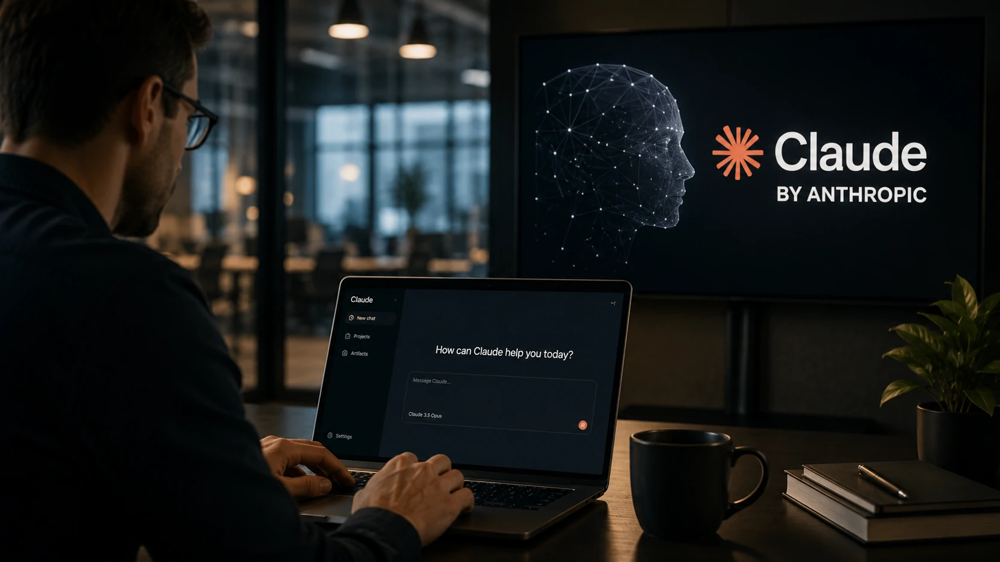
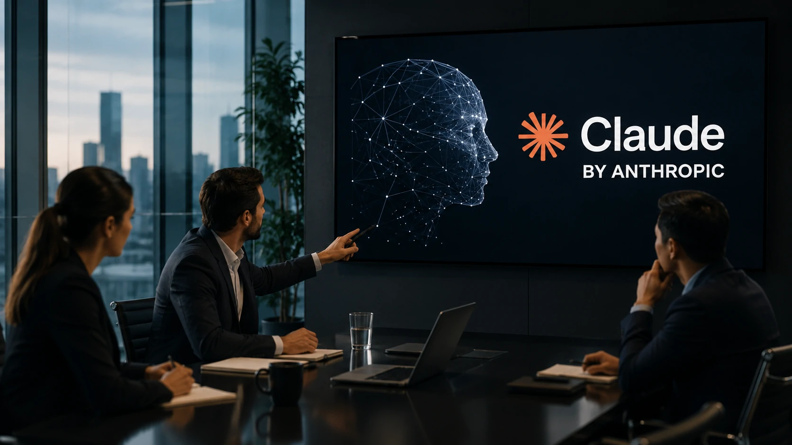
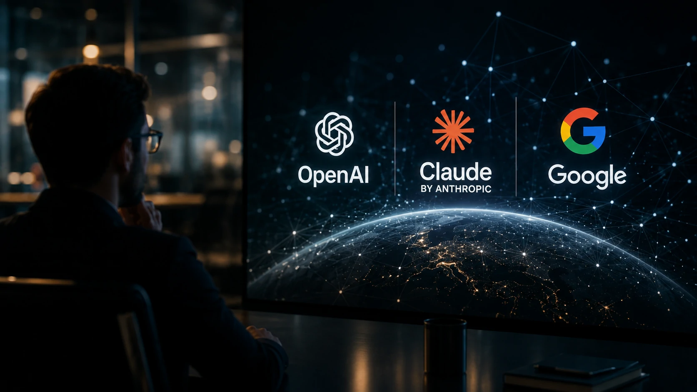

*O mercado de inteligência artificial vive uma das disputas mais intensas da história da tecnologia. A cada atualização, **OpenAI**, **Anthropic** e **Google** elevam o nível da competição, tornando cada lançamento um movimento estratégico capaz de influenciar empresas, desenvolvedores e investidores.*

## A atualização do Claude mostra que a disputa pela IA está acelerando

Empresas de inteligência artificial deixaram de competir apenas pela qualidade dos modelos. A nova fase da corrida envolve produtividade, integração com sistemas corporativos e capacidade de transformar modelos de linguagem em plataformas completas de trabalho.

*O novo lançamento reforça a estratégia da Anthropic de ampliar a presença do Claude no mercado corporativo.*

A nova atualização do **Claude** reforça exatamente essa estratégia. A **Anthropic** busca reduzir a distância para o **ChatGPT**, oferecendo recursos voltados para profissionais que utilizam IA diariamente em desenvolvimento de software, análise de documentos e automação de tarefas.

Mais do que adicionar funcionalidades, a empresa procura consolidar o Claude como uma alternativa para organizações que priorizam segurança, contexto longo e confiabilidade nas respostas.

Esse movimento acontece poucos dias após novos anúncios da **OpenAI**, demonstrando que o ritmo de inovação continua acelerando em todo o setor.

### A corrida deixou de ser apenas tecnológica

Hoje a disputa envolve todo o ecossistema de IA.

Além da qualidade do modelo, entram na equação fatores como integração com ferramentas corporativas, APIs, agentes inteligentes, produtividade e custos operacionais.

### Empresas passam a escolher plataformas, não apenas modelos

Cada atualização influencia decisões de CIOs, gestores de tecnologia e equipes de inovação.

Na prática, muitas organizações passam a avaliar qual plataforma oferece o melhor conjunto de recursos para acelerar processos internos.

[Para entender como os agentes inteligentes estão transformando esse cenário, veja também.](https://noticiatech.com.br/inteligencia-artificial/chatgpt-work-era-agentes-ia-produtividade-corporativa/)

## O verdadeiro objetivo da Anthropic vai além de competir com o ChatGPT

A estratégia da **Anthropic** é ampliar sua presença no mercado corporativo e consolidar o Claude como uma plataforma para aplicações críticas de inteligência artificial.

Nos últimos meses, a empresa acelerou investimentos em transparência, desenvolvimento seguro e ferramentas voltadas para organizações que utilizam IA em larga escala.

Essa abordagem diferencia o Claude de concorrentes que concentram parte da estratégia no mercado de consumo.

Ao fortalecer recursos corporativos, a Anthropic aumenta sua competitividade justamente no segmento que movimenta os maiores contratos de inteligência artificial.

### O mercado empresarial tornou-se prioridade

Grandes organizações procuram soluções capazes de integrar IA aos seus sistemas internos sem comprometer segurança, governança e conformidade.

Esse perfil favorece empresas que conseguem entregar desempenho aliado à confiabilidade.

### A competição beneficia quem utiliza IA

A rivalidade entre **Anthropic**, **OpenAI** e **Google** acelera a inovação.

Novos recursos chegam mais rapidamente ao mercado, enquanto empresas passam a contar com alternativas cada vez mais completas para implementar inteligência artificial em suas operações.

[Outro movimento que ajuda a compreender essa evolução é o crescimento da orquestração de agentes inteligentes nas empresas, veja também.](https://noticiatech.com.br/automacao/ai-orchestration-empresas-multiplos-agentes-ia/)

## O impacto da atualização do Claude para empresas

Empresas devem acompanhar essa evolução porque a inteligência artificial está deixando de ser apenas uma ferramenta de apoio para assumir funções cada vez mais estratégicas dentro das operações.

*As novas capacidades do Claude reforçam a disputa pelo mercado corporativo de inteligência artificial.*

A atualização do **Claude** amplia as possibilidades para análise de documentos, automação de fluxos de trabalho, desenvolvimento de software e suporte à tomada de decisão.

Na prática, isso significa que empresas terão mais opções para escolher a plataforma que melhor atende às suas necessidades, estimulando inovação e reduzindo a dependência de um único fornecedor.

Além disso, a competição tende a acelerar o lançamento de novos recursos em todo o mercado, beneficiando usuários finais e organizações.

### A disputa agora envolve ecossistemas completos

Não basta possuir um modelo poderoso.

As empresas buscam plataformas capazes de integrar agentes inteligentes, automações, APIs, bancos de dados e sistemas internos, formando um ambiente completo de produtividade.

### O mercado caminha para múltiplos fornecedores

Especialistas acreditam que dificilmente haverá um único vencedor na corrida da inteligência artificial.

Assim como ocorreu com a computação em nuvem, diferentes empresas deverão ocupar posições de destaque conforme suas especialidades.

[Quem deseja compreender como a IA está sendo integrada aos processos empresariais também pode ler em Process automation](https://noticiatech.com.br/automacao/ai-process-automation-substitui-automacao-tradicional-empresas/)

## A nova fase da disputa entre Claude, ChatGPT e Gemini

A atualização do **Claude** confirma que a corrida da inteligência artificial entrou em uma nova etapa, na qual velocidade de inovação, segurança e aplicações corporativas passam a ter tanto peso quanto a qualidade dos modelos.

*OpenAI, Anthropic e Google intensificam a competição para conquistar empresas e profissionais.*

Em vez de competir apenas por desempenho em benchmarks, as empresas disputam quem entrega maior valor para organizações que utilizam IA diariamente.

Essa mudança favorece usuários, que passam a contar com soluções mais completas, atualizações frequentes e maior liberdade de escolha.

### O futuro será definido pela capacidade de execução

Os próximos meses devem ser marcados por novos anúncios envolvendo **Anthropic**, **OpenAI**, **Google**, **Microsoft** e outras empresas que disputam o mercado de inteligência artificial.

A velocidade de evolução indica que agentes inteligentes, automação avançada e integração entre sistemas serão os principais diferenciais competitivos.

### O que acompanhar daqui para frente

Mais do que comparar qual chatbot responde melhor, empresas precisarão avaliar fatores como custo, integração, segurança, governança e capacidade de automatizar processos completos.

Esse novo cenário deve transformar a inteligência artificial em uma camada estratégica da infraestrutura digital das organizações.

[Para entender como a disputa também envolve privacidade e confiança dos usuários, confira.](https://noticiatech.com.br/inteligencia-artificial/privacidade-chatgpt-claude-gemini-conversas-ia/)

A atualização do **Claude** representa mais um capítulo da rápida evolução da inteligência artificial. Independentemente de qual plataforma liderará o mercado, a tendência é clara: a competição entre **Anthropic**, **OpenAI** e **Google** continuará acelerando a inovação, oferecendo recursos cada vez mais sofisticados para empresas, desenvolvedores e profissionais que dependem da IA para aumentar produtividade e criar novas oportunidades de negócio.

---