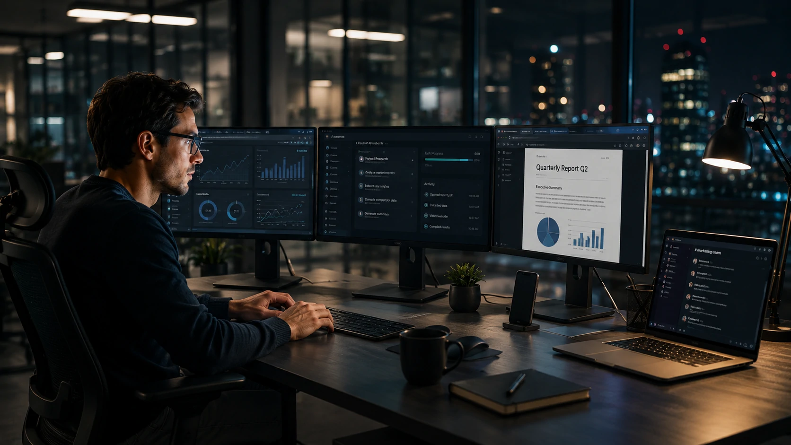
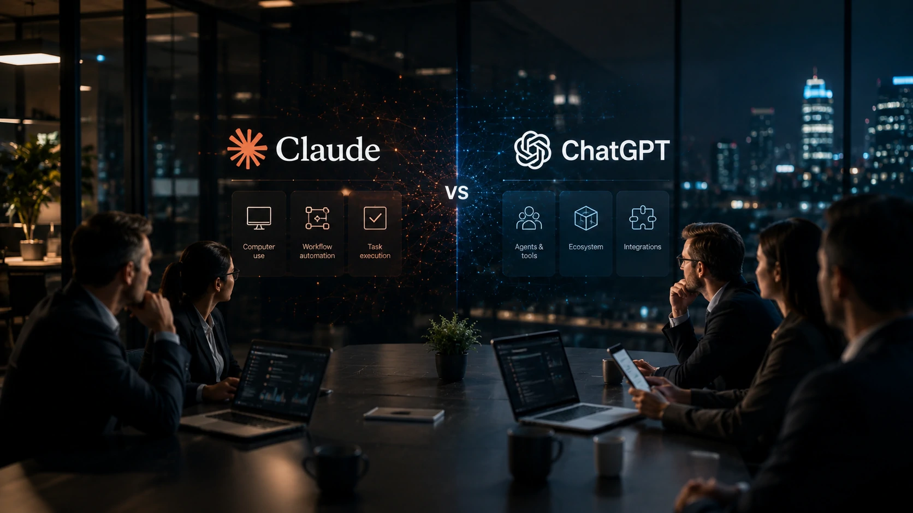
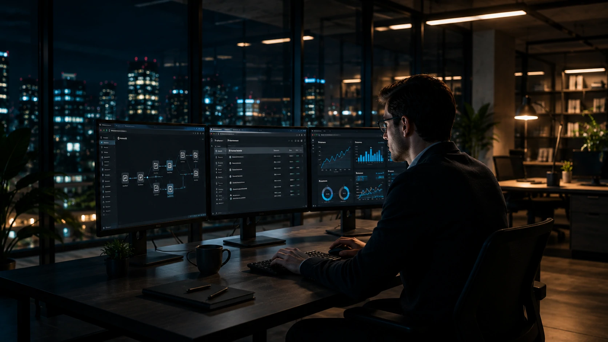

*Durante os últimos dois anos, a disputa entre as principais empresas de inteligência artificial concentrou-se na qualidade dos modelos de linguagem. Agora, a competição entra em uma nova fase: fazer com que a IA deixe de apenas responder perguntas e passe a executar tarefas reais dentro do computador. A estratégia da **Anthropic** coloca o **Claude** no centro dessa transformação e aumenta a pressão sobre o **ChatGPT** na corrida pelo mercado corporativo.*

A capacidade do **Claude** de operar computadores representa uma mudança importante no posicionamento da **Anthropic**. Em vez de atuar apenas como um assistente conversacional, a plataforma passa a executar tarefas utilizando interfaces gráficas, navegadores e aplicativos, aproximando-se do conceito de agentes inteligentes capazes de realizar atividades completas com mínima intervenção humana.

Para empresas, essa evolução reduz barreiras entre inteligência artificial e sistemas já utilizados no dia a dia. Processos que antes exigiam integrações específicas ou desenvolvimento personalizado podem passar a ser executados pela própria IA utilizando os softwares existentes.

## Claude deixa de apenas responder perguntas para executar tarefas

O novo recurso transforma o **Claude** em uma plataforma capaz de interagir diretamente com computadores, ampliando significativamente seu potencial para ambientes corporativos.

*O Claude amplia sua atuação ao interagir diretamente com interfaces gráficas e aplicativos utilizados pelas empresas.*

Enquanto modelos tradicionais permanecem focados na geração de texto, a estratégia da **Anthropic** aproxima a inteligência artificial da automação operacional. A IA passa a interpretar elementos visuais da tela, navegar entre aplicações e executar fluxos de trabalho semelhantes aos realizados por um profissional.

### Uma evolução além dos chatbots

Essa mudança representa um avanço importante na evolução dos chamados **AI Agents**. O foco deixa de ser apenas responder perguntas para assumir parte da execução das atividades.

Na prática, isso permite automatizar tarefas como preenchimento de sistemas, consultas em plataformas web, navegação entre diferentes aplicações e acompanhamento de processos internos.

### Empresas podem acelerar automações sem reconstruir seus sistemas

Um dos maiores benefícios para o mercado corporativo está na possibilidade de utilizar softwares já existentes.

Ao invés de desenvolver integrações específicas para cada plataforma, agentes inteligentes podem operar diretamente sobre interfaces já utilizadas pelos colaboradores, reduzindo tempo de implantação e custos de desenvolvimento.

Esse movimento complementa tendências discutidas em outros conteúdos do **Notícia Tech**, como o guia sobre [Arquitetura de IA Empresarial](https://noticiatech.com.br/inteligencia-artificial/arquitetura-ia-empresarial-mcp-rag-apis-agentes-workflows-copilotos/) e a análise sobre [AI Orchestration para empresas](https://noticiatech.com.br/automacao/ai-orchestration-empresas-multiplos-agentes-ia/).

## A disputa entre Claude e ChatGPT entra em uma nova fase

A chegada desse recurso aumenta a concorrência entre **Anthropic** e **OpenAI**, mas o diferencial agora não está apenas na qualidade das respostas.

*A competição entre Claude e ChatGPT avança para a execução prática de tarefas dentro dos ambientes corporativos.*

A nova disputa envolve produtividade, automação e capacidade operacional. Empresas passam a avaliar qual plataforma consegue executar mais atividades com segurança, confiabilidade e menor necessidade de intervenção humana.

### O mercado migra para agentes capazes de agir

Nos últimos meses, praticamente todas as grandes empresas de IA passaram a investir em agentes inteligentes.

**OpenAI**, **Google**, **Microsoft** e **Anthropic** caminham para um cenário onde a vantagem competitiva não será apenas produzir respostas melhores, mas executar processos completos de negócios.

Essa tendência também reforça movimentos observados em tecnologias como **MCP**, **RAG**, fluxos multiagentes e arquiteturas corporativas baseadas em inteligência artificial.

### O impacto pode ser maior do que parece

Caso esse modelo de operação seja amplamente adotado, empresas poderão automatizar processos sem substituir imediatamente seus sistemas atuais.

Isso reduz custos de transformação digital, acelera projetos de IA e amplia o retorno sobre investimentos em automação, fatores que explicam por que a corrida entre **Claude**, **ChatGPT**, **Gemini** e outras plataformas tende a se intensificar nos próximos meses.

Além disso, o movimento reforça a tendência apresentada na análise do **Notícia Tech** sobre como o [ChatGPT Work está mudando os softwares corporativos](https://noticiatech.com.br/inteligencia-artificial/chatgpt-work-empresas-abandonam-softwares-tradicionais/), mostrando que o mercado caminha para plataformas cada vez mais autônomas.

## O avanço dos agentes de IA pode redefinir a transformação digital

A evolução do **Claude** mostra que a próxima etapa da inteligência artificial será medida pela capacidade de executar tarefas completas, e não apenas produzir respostas inteligentes.

*A nova geração de agentes inteligentes aproxima a inteligência artificial da execução prática dos processos de negócios.*

Empresas que adotarem esse tipo de tecnologia poderão reduzir atividades repetitivas, aumentar produtividade e acelerar iniciativas de transformação digital sem necessariamente substituir toda a infraestrutura existente.

Ao permitir que um agente opere sistemas já utilizados pelos colaboradores, a **Anthropic** amplia as possibilidades de adoção corporativa e reduz uma das maiores barreiras da automação tradicional: a necessidade de integrações complexas.

### Segurança continuará sendo fator decisivo

Quanto maior a autonomia dos agentes, maior também será a preocupação com governança.

Organizações precisarão definir permissões, monitoramento, auditoria e limites operacionais para impedir que uma IA execute ações inadequadas ou acesse informações sensíveis.

Esse cenário reforça a importância de arquiteturas robustas e boas práticas de segurança, tema aprofundado pelo **Notícia Tech** em [O que é segurança em IA e por que ela será prioridade para empresas](https://noticiatech.com.br/inteligencia-artificial/o-que-e-seguranca-ia-prioridade-empresas/).

### A corrida pela IA empresarial está apenas começando

A disputa entre **Anthropic**, **OpenAI**, **Google**, **Microsoft** e outras empresas deixa claro que o mercado caminha rapidamente para plataformas capazes de executar fluxos completos de trabalho.

Nos próximos anos, a vantagem competitiva provavelmente não estará apenas na qualidade dos modelos de linguagem, mas na capacidade de integrar diferentes sistemas, compreender contextos empresariais e realizar atividades de forma segura, auditável e escalável.

Nesse cenário, agentes inteligentes deixam de ser uma tendência experimental para se tornarem parte da estratégia de transformação digital das organizações.

## O que empresas devem observar antes de adotar agentes capazes de operar computadores

Empresas interessadas nessa nova geração de **IA** devem avaliar mais do que desempenho técnico. Questões relacionadas à segurança, governança, conformidade regulatória e integração com processos existentes serão determinantes para o sucesso dos projetos.

### Critérios para avaliar plataformas de IA

Antes de implantar agentes capazes de utilizar computadores, vale considerar alguns fatores:

- capacidade de auditoria das ações executadas;
- controle de permissões e acessos;
- compatibilidade com softwares corporativos;
- facilidade de integração com fluxos existentes;
- proteção de dados sensíveis;
- custo operacional e escalabilidade.

A combinação desses elementos tende a pesar mais na decisão das empresas do que apenas a velocidade ou a qualidade das respostas produzidas pela IA.

### O mercado entra em uma nova fase competitiva

O lançamento desse recurso reforça que a corrida da inteligência artificial corporativa evolui rapidamente.

Se antes a competição era baseada em quem possuía o modelo de linguagem mais avançado, agora o foco passa a ser qual plataforma consegue executar processos reais com maior confiabilidade.

Para gestores e líderes de tecnologia, acompanhar essa evolução será cada vez mais importante. As empresas que entenderem cedo o potencial dos agentes inteligentes estarão mais preparadas para reduzir custos operacionais, aumentar produtividade e criar novas vantagens competitivas em um mercado onde a **Inteligência Artificial** passa a assumir um papel cada vez mais ativo na execução do trabalho.

---