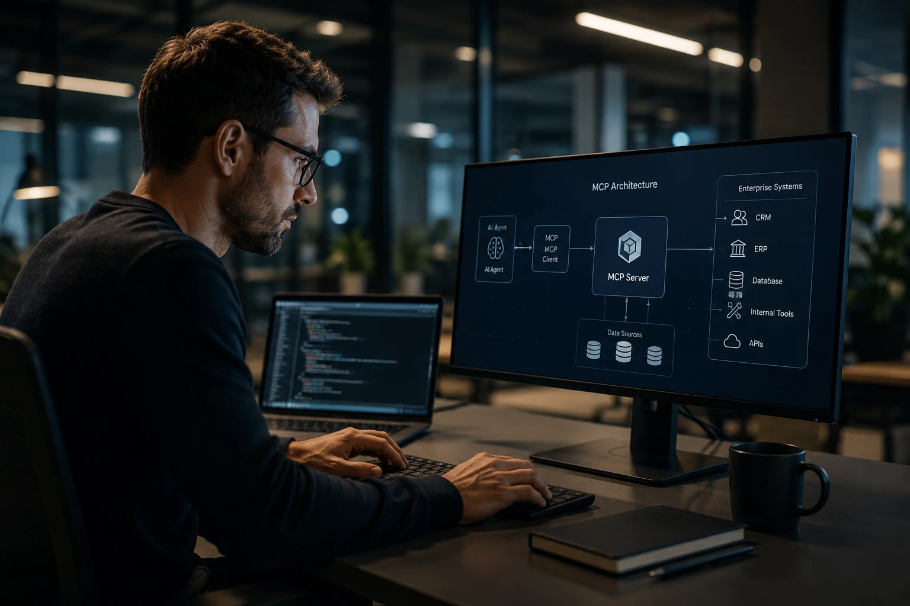
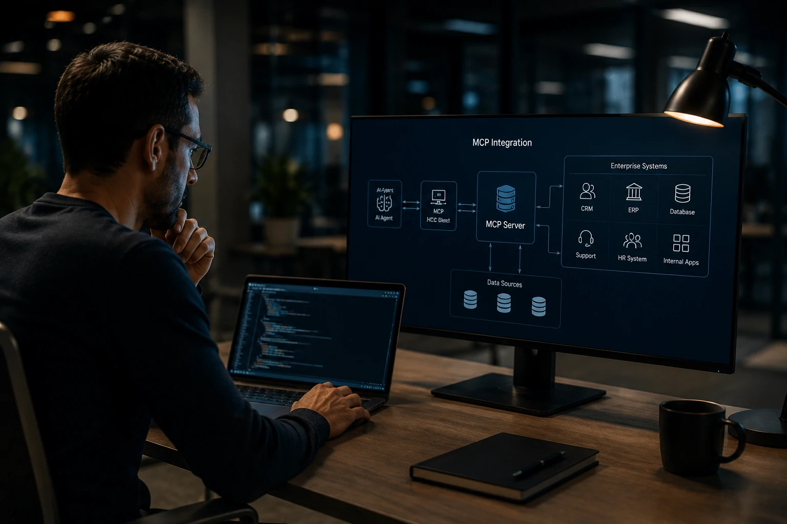
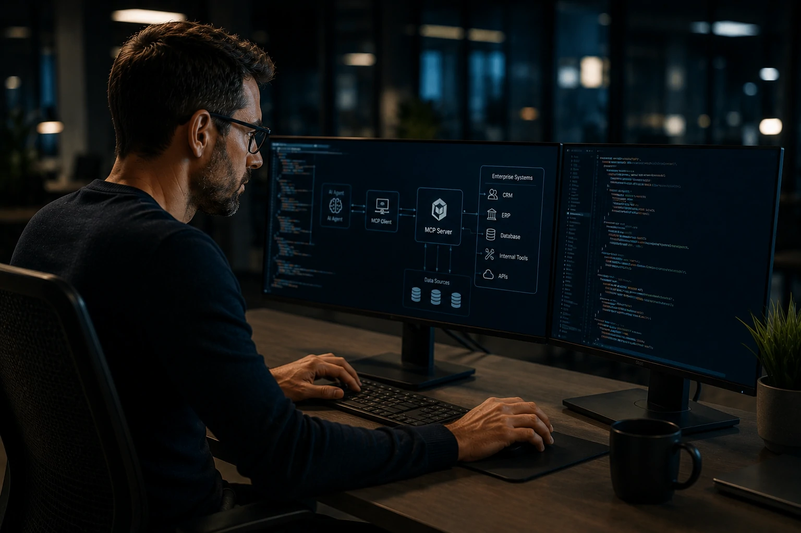

*À medida que os agentes de IA evoluem de simples assistentes para sistemas capazes de executar tarefas complexas, surge um desafio crítico: conectar inteligência artificial ao ambiente real das empresas. É justamente nesse contexto que o MCP vem ganhando relevância como uma das principais camadas de integração da nova geração de automação corporativa.*

## Como implementar MCP em empresas

Implementar **MCP (Model Context Protocol)** significa criar uma estrutura capaz de conectar agentes de IA aos sistemas que armazenam informações e executam processos de negócio.

*Arquitetura MCP conectando agentes de IA a múltiplos sistemas empresariais.*

Enquanto modelos de linguagem possuem capacidade de raciocínio, eles não possuem acesso nativo aos dados internos das organizações.

O papel do **MCP** é servir como uma ponte entre a inteligência do modelo e os sistemas corporativos.

Empresas que estudam **Agentic AI**, automação avançada e assistentes empresariais estão adotando essa arquitetura para reduzir a fragmentação tecnológica.

Para compreender os fundamentos do protocolo, vale consultar o guia publicado pelo Notícia Tech sobre [Como funciona o MCP](https://noticiatech.com.br/inteligencia-artificial/como-funciona-mcp-guia-completo-agentes-ia/).

### Quais componentes formam uma arquitetura MCP

Uma implementação corporativa normalmente inclui:

- Agente de IA;
- Cliente MCP;
- Servidores MCP;
- APIs corporativas;
- Bancos de dados;
- Sistemas empresariais.

Essa estrutura permite que o agente consulte informações, execute ações e interaja com ferramentas externas de maneira padronizada.

### O que muda em relação às integrações tradicionais

Historicamente, cada integração exigia desenvolvimento específico.

Com **MCP**, a lógica de acesso torna-se reutilizável.

Isso reduz custos de manutenção e acelera a criação de novos agentes inteligentes.

## Quais sistemas podem ser conectados ao MCP

O MCP foi projetado para funcionar como uma camada universal de acesso a dados e serviços.

*O protocolo permite conectar múltiplas plataformas em um único ecossistema de agentes.*

Na prática, quase qualquer sistema corporativo pode participar do ecossistema.

Entre os casos mais comuns estão:

- **Salesforce**
- **HubSpot**
- **SAP**
- **Oracle**
- Bancos de dados SQL
- Sistemas internos
- Ferramentas de atendimento
- Plataformas de RH

O objetivo é permitir que o agente acesse informações distribuídas sem precisar conhecer a complexidade técnica de cada ambiente.

### MCP e CRM

Uma das aplicações mais promissoras está na integração com plataformas de vendas.

Empresas já utilizam agentes para consultar clientes, atualizar oportunidades e gerar relatórios automaticamente.

O tema complementa diretamente o conteúdo do Notícia Tech sobre [CRM com IA](https://noticiatech.com.br/ferramentas/o-que-e-crm-com-ia-gestao-vendas/).

### MCP e sistemas legados

Outro benefício importante é a conexão com sistemas antigos.

Muitas organizações possuem aplicações críticas que não podem ser substituídas rapidamente.

O MCP permite modernizar processos sem exigir uma transformação completa da infraestrutura.

## Casos de uso de MCP para agentes de IA

O MCP está se tornando uma peça central da arquitetura de agentes corporativos.

*Agentes conectados via MCP podem acessar dados e executar processos em tempo real.*

O principal ganho é transformar modelos de linguagem em sistemas capazes de agir.

### Atendimento corporativo inteligente

Um agente pode:

- consultar histórico de clientes;
- verificar contratos;
- abrir chamados;
- atualizar registros.

Tudo dentro de uma única conversa.

### Operações e produtividade

Equipes podem utilizar agentes para:

- gerar relatórios;
- consultar indicadores;
- monitorar processos;
- buscar informações em múltiplos sistemas.

Isso reduz o tempo gasto com tarefas repetitivas.

### AI Operations e governança

O MCP também fortalece iniciativas de governança.

Ao centralizar acessos e integrações, as empresas conseguem controlar melhor permissões, auditorias e rastreamento de atividades.

Esse movimento está diretamente relacionado ao conceito de [AI Operations](https://noticiatech.com.br/inteligencia-artificial/ai-operations-governanca-agentes-ia-empresas/).

## Os desafios da implementação de MCP nas empresas

Embora o potencial seja elevado, a adoção exige planejamento.

A principal dificuldade não está no protocolo em si.

O desafio normalmente está na organização dos dados corporativos.

Empresas que possuem informações dispersas em múltiplos sistemas enfrentam uma etapa prévia de preparação.

### Segurança e controle de acesso

Cada conexão criada por um agente representa um novo ponto de acesso.

Por isso, políticas de autenticação, autorização e auditoria devem ser tratadas como prioridade.

A governança passa a ser tão importante quanto a tecnologia.

### Qualidade dos dados

Um agente só produz resultados confiáveis quando os dados utilizados também são confiáveis.

Informações inconsistentes podem gerar decisões incorretas e comprometer processos críticos.

### Escalabilidade futura

Organizações que começam pequenos projetos de IA frequentemente descobrem novas oportunidades de automação.

Uma arquitetura baseada em **MCP** permite escalar esses projetos sem reconstruir integrações a cada nova iniciativa.

Por esse motivo, o protocolo vem sendo visto por especialistas como uma das bases da próxima geração de sistemas corporativos orientados por agentes. À medida que empresas avançam em **Agentic AI**, automação inteligente e transformação digital, a capacidade de conectar modelos de IA ao ambiente operacional poderá se tornar um diferencial competitivo tão importante quanto o próprio modelo utilizado.

---