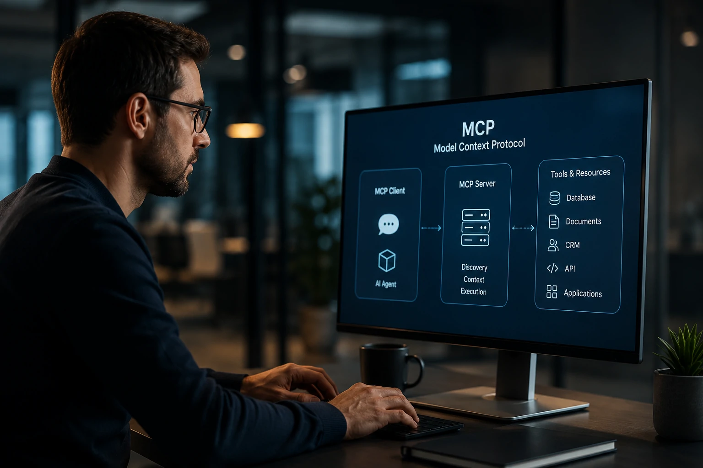

*À medida que agentes de IA deixam de ser apenas interfaces conversacionais e passam a executar tarefas reais dentro das empresas, surge uma nova necessidade: conectar modelos a sistemas corporativos de forma segura, padronizada e escalável. Nesse cenário, o MCP desponta como uma das tecnologias mais importantes para a próxima fase da inteligência artificial empresarial.*

## Como funciona o MCP na prática

O **MCP (Model Context Protocol)** funciona como uma camada de comunicação padronizada entre modelos de IA e ferramentas externas.

Em vez de criar integrações específicas para cada aplicação, o protocolo estabelece uma linguagem comum que permite aos agentes descobrir recursos, acessar informações e executar ações em diferentes sistemas.

Essa abordagem reduz a complexidade técnica e cria uma arquitetura mais escalável para ambientes corporativos.

*O MCP cria uma ponte padronizada entre agentes de IA e sistemas corporativos.*

### Qual problema o MCP resolve?

Antes do **MCP**, cada integração exigia desenvolvimento personalizado.

Uma empresa que desejasse conectar um agente ao **Salesforce**, ao **Google Drive**, ao **Microsoft 365** e ao banco de dados interno precisava criar múltiplas integrações separadas.

O protocolo reduz esse problema ao estabelecer um padrão único de comunicação.

### Por que isso é importante para agentes?

Agentes dependem de contexto e acesso a ferramentas.

Sem integração, o modelo responde apenas com base em seu conhecimento interno.

Com o **MCP**, o agente pode consultar documentos, buscar informações atualizadas, acessar sistemas corporativos e executar tarefas operacionais.

## Quais são os componentes da arquitetura MCP

A arquitetura do **MCP** é baseada em três elementos principais: cliente, servidor e ferramentas.

Cada componente possui uma função específica dentro do ecossistema.

Essa separação facilita governança, manutenção e escalabilidade.

*Clientes, servidores e ferramentas formam a estrutura central do Model Context Protocol.*

### Cliente MCP

O cliente representa o sistema que utiliza o modelo de IA.

Pode ser um chatbot corporativo, um assistente interno ou um agente autônomo.

Ele envia solicitações e recebe respostas dos servidores compatíveis com o protocolo.

### Servidor MCP

O servidor atua como intermediário entre a IA e as ferramentas.

Ele expõe recursos que podem ser utilizados pelos agentes.

Esses recursos podem incluir bancos de dados, APIs, documentos, CRMs, ERPs e plataformas SaaS.

### Ferramentas e recursos

As ferramentas representam os sistemas efetivamente utilizados.

Entre os exemplos mais comuns estão:

- CRMs;
- ERPs;
- plataformas de suporte;
- bases documentais;
- sistemas financeiros;
- bancos de dados corporativos.

## Por que o MCP está se tornando estratégico para empresas

O **MCP** está se tornando estratégico porque reduz uma das maiores barreiras para adoção de agentes corporativos: a integração.

Empresas não querem apenas conversar com IA.

Elas querem que a IA execute processos reais.

*O valor dos agentes aumenta quando eles conseguem interagir com dados e processos reais da empresa.*

### Redução de custos de integração

Projetos corporativos frequentemente gastam mais tempo integrando sistemas do que treinando modelos.

Ao padronizar conexões, o **MCP** reduz esforço técnico e acelera implementação.

Isso pode diminuir custos de desenvolvimento e manutenção ao longo do tempo.

### Escalabilidade operacional

Quando novas ferramentas são adicionadas ao ambiente corporativo, o protocolo facilita sua disponibilização para diferentes agentes.

Isso cria um efeito de plataforma.

Em vez de múltiplas integrações independentes, a empresa passa a operar sobre uma arquitetura padronizada.

### Governança e segurança

A governança se torna mais simples quando o acesso passa por uma camada centralizada.

Permissões, auditorias e controles podem ser aplicados de maneira consistente.

Esse aspecto é especialmente relevante para setores regulados.

## Qual a relação entre MCP, RAG e agentes de IA

O **MCP** não substitui o **RAG** nem os agentes.

Na prática, essas tecnologias tendem a trabalhar juntas.

Cada uma resolve um problema diferente dentro da arquitetura de IA corporativa.

Para compreender melhor a camada de recuperação de conhecimento, vale consultar o artigo [O que é RAG? Guia completo para agentes de IA em empresas](https://noticiatech.com.br/inteligencia-artificial/o-que-e-rag-guia-completo-agentes-ia-empresas/).

### MCP e RAG

O **RAG** permite que modelos consultem informações externas antes de responder.

Já o **MCP** cria uma forma padronizada para acessar essas fontes e ferramentas.

Enquanto o RAG melhora conhecimento contextual, o MCP amplia conectividade operacional.

### MCP e AI Operations

À medida que agentes ganham acesso a sistemas corporativos, cresce também a necessidade de governança.

Por isso, conceitos como [AI Operations: governança para agentes de IA em empresas](https://noticiatech.com.br/inteligencia-artificial/ai-operations-governanca-agentes-ia-empresas/) tornam-se complementares ao protocolo.

### MCP e o futuro dos agentes

O futuro dos agentes corporativos depende da capacidade de interagir com o ambiente digital.

Agentes isolados possuem utilidade limitada.

Agentes conectados conseguem executar fluxos completos, gerar análises, atualizar sistemas e apoiar decisões operacionais.

## O que muda para empresas nos próximos anos

O **MCP** representa uma mudança estrutural na forma como sistemas de IA serão conectados ao ambiente corporativo.

Assim como APIs se tornaram fundamentais para a transformação digital da última década, protocolos voltados para agentes tendem a ocupar posição semelhante na próxima fase da inteligência artificial.

Empresas que constroem capacidades de integração hoje estarão mais preparadas para escalar agentes, automatizar processos e transformar conhecimento corporativo em vantagem competitiva.

Mais do que uma tecnologia específica, o MCP simboliza uma nova camada da infraestrutura digital. Em um cenário onde agentes passam a atuar como interfaces operacionais para negócios, a capacidade de conectar modelos, dados e sistemas pode se tornar um dos principais diferenciais estratégicos da próxima geração de empresas orientadas por IA.

---