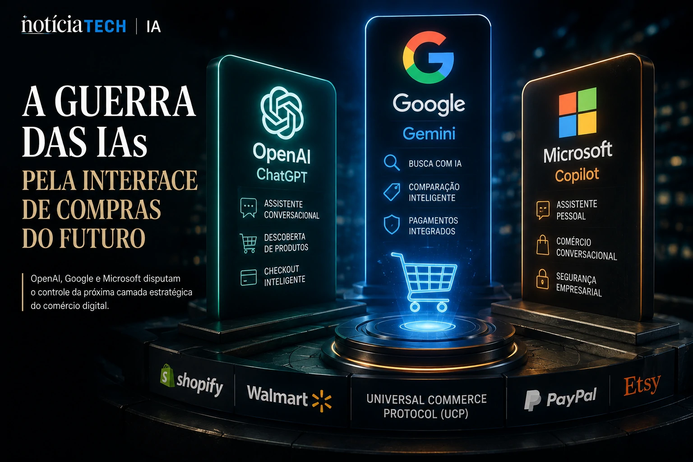

*A internet está entrando oficialmente em uma nova era. O modelo baseado em pesquisas manuais, múltiplas abas abertas e jornadas fragmentadas começa a dar espaço para experiências comandadas por agentes de inteligência artificial capazes de entender intenção, comparar produtos e concluir compras em segundos.*

*Nos bastidores, gigantes como **OpenAI**, **Google**, **Shopify**, **Microsoft**, **Walmart** e **PayPal** disputam o controle da próxima camada estratégica da economia digital: a interface inteligente que decidirá como consumidores descobrem, escolhem e compram produtos online.*

*Mais do que uma evolução do e-commerce, o chamado “comércio agentic” inaugura um novo modelo de distribuição digital baseado em IA generativa, automação contextual e personalização em escala.*

## O nascimento do comércio agentic muda a lógica do e-commerce

O avanço acelerado da IA generativa começou a transformar silenciosamente toda a estrutura do comércio eletrônico global.

Durante mais de duas décadas, a internet comercial funcionou baseada em:

- buscadores;
- anúncios patrocinados;
- marketplaces;
- SEO tradicional;
- navegação manual.

Agora, esse modelo começa a ser substituído por experiências conversacionais orientadas por agentes de IA.

A mudança ganhou força após iniciativas recentes da **OpenAI**, que passou a expandir funcionalidades de descoberta de produtos diretamente dentro do **ChatGPT**, permitindo experiências de compra baseadas em linguagem natural.

Em vez de pesquisar manualmente, usuários começam simplesmente a descrever intenções.

Exemplos:

- “quero um notebook gamer até R$ 7 mil”;
- “compare os melhores smartphones para fotografia”;
- “encontre um tênis premium para corrida”.

A IA assume então múltiplas funções simultaneamente:

- pesquisadora;
- comparadora;
- recomendadora;
- consultora de compra;
- intermediadora de checkout.

Esse movimento representa uma transformação estrutural na própria lógica da web.

A navegação deixa de ser baseada em links e passa a ser baseada em intenção.

Segundo especialistas do setor, esse novo paradigma cria uma “internet orientada por agentes”, onde modelos de IA passam a intermediar grande parte da experiência digital.

O impacto disso pode redefinir completamente:

- SEO;
- mídia paga;
- marketplaces;
- descoberta de produtos;
- tráfego orgânico;
- retenção de usuários.

Esse avanço conversa diretamente com outras transformações recentes da economia digital já analisadas pelo **Notícia Tech**:

[LinkedIn deixa de ser rede de currículos e vira plataforma de distribuição B2B impulsionada por IA](https://noticiatech.com.br/negocios/linkedin-deixa-de-ser-rede-de-curr%C3%ADculos-e-vira-plataforma-de-distribui%C3%A7%C3%A3o-b2b-impulsionada-por-ia/)
## OpenAI, Google e Microsoft iniciam a guerra pela interface de compras da IA

A corrida atual não é apenas pela liderança da IA generativa.

O verdadeiro objetivo estratégico é controlar a interface de decisão do consumidor.

Quem dominar essa camada passa a influenciar:

- descoberta de produtos;
- comportamento de compra;
- monetização digital;
- retenção de usuários;
- distribuição comercial.

A **OpenAI** acelerou esse movimento ao integrar experiências comerciais diretamente ao **ChatGPT**, aproximando a IA de um verdadeiro assistente universal de consumo.

Enquanto isso, a **Microsoft** expandiu o conceito de checkout conversacional via **Copilot**, integrando fluxos de pagamento simplificados dentro do ecossistema da empresa.

Já o **Google** iniciou movimentos agressivos para transformar o **Gemini** e o Search AI Mode em plataformas completas de comércio assistido por IA.

A disputa se intensificou ainda mais após o anúncio do chamado **Universal Commerce Protocol (UCP)**, iniciativa apoiada por empresas como:

- **Google**;
- **Shopify**;
- **Walmart**;
- **Target**;
- **Etsy**.

O objetivo do protocolo é criar um padrão aberto para comunicação entre agentes de IA e plataformas de comércio eletrônico.

Na prática, isso significa permitir que sistemas inteligentes consigam:

- consultar estoque;
- comparar preços;
- validar disponibilidade;
- processar pagamentos;
- concluir compras automaticamente.

O movimento inaugura uma nova camada de infraestrutura da internet.

Em vez de usuários navegando manualmente em dezenas de sites, agentes de IA poderão executar jornadas completas em poucos segundos.

Essa transformação pode impactar diretamente modelos tradicionais de aquisição de tráfego.

Empresas que hoje dependem fortemente de SEO clássico e anúncios pagos podem enfrentar um cenário onde a IA se torna o principal intermediador entre marcas e consumidores.

O impacto potencial lembra a transformação causada pelos smartphones no início da década de 2010.

## O impacto no SEO, publicidade digital e marketplaces pode ser gigantesco

O avanço do comércio agentic começa a gerar preocupação em setores inteiros da economia digital.

A principal razão é simples: se agentes de IA passarem a intermediar a maior parte das decisões de compra, o modelo tradicional de tráfego da internet pode mudar drasticamente.

Hoje, empresas disputam atenção através de:

- anúncios;
- SEO;
- redes sociais;
- marketplaces;
- influenciadores;
- campanhas patrocinadas.

Mas em um cenário dominado por IA conversacional, a decisão pode passar a acontecer antes mesmo do usuário acessar um site.

Isso cria uma nova dinâmica de mercado.

Em vez de otimizar apenas páginas para buscadores, empresas precisarão otimizar informações para agentes de IA.

Especialistas já começam a discutir conceitos como:

### GEO (Generative Engine Optimization)

Estratégia focada em otimizar conteúdos para mecanismos generativos e agentes de IA.

### AI Commerce Optimization

Estratégias voltadas para tornar catálogos, produtos e descrições compreensíveis para modelos de inteligência artificial.

### Agent Visibility

A nova disputa por visibilidade dentro de sistemas conversacionais.

Esse movimento pode criar uma profunda redistribuição de poder dentro do ecossistema digital.

Empresas que controlarem interfaces de IA passam a controlar:

- descoberta;
- recomendação;
- intenção;
- monetização;
- retenção.

Ao mesmo tempo, plataformas tradicionais podem enfrentar riscos relevantes.

Entre os principais impactos esperados estão:

- redução de tráfego orgânico tradicional;
- menor dependência de marketplaces;
- diminuição de cliques em anúncios;
- crescimento do comércio conversacional;
- aumento da automação de compras recorrentes.

O cenário também acelera a corrida por infraestrutura de IA corporativa.

Empresas passam a perceber que agentes inteligentes deixarão de ser apenas chatbots e passarão a atuar como operadores completos de tarefas digitais.

Essa tendência conversa diretamente com a evolução recente dos chamados “AI Agents”, tema que vem dominando o mercado de tecnologia global em 2026.

O mais importante é que essa transformação ainda está apenas começando.

A próxima geração da internet pode não ser baseada em aplicativos ou buscadores tradicionais, mas sim em agentes inteligentes capazes de executar praticamente qualquer tarefa digital de maneira autônoma.

E no centro dessa nova economia, a disputa deixa de ser apenas por audiência — e passa a ser pelo controle da própria tomada de decisão do usuário.

---
