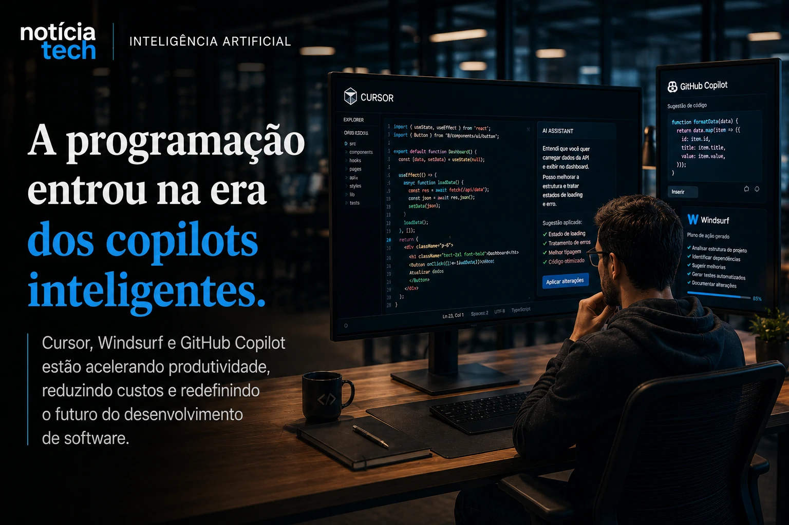
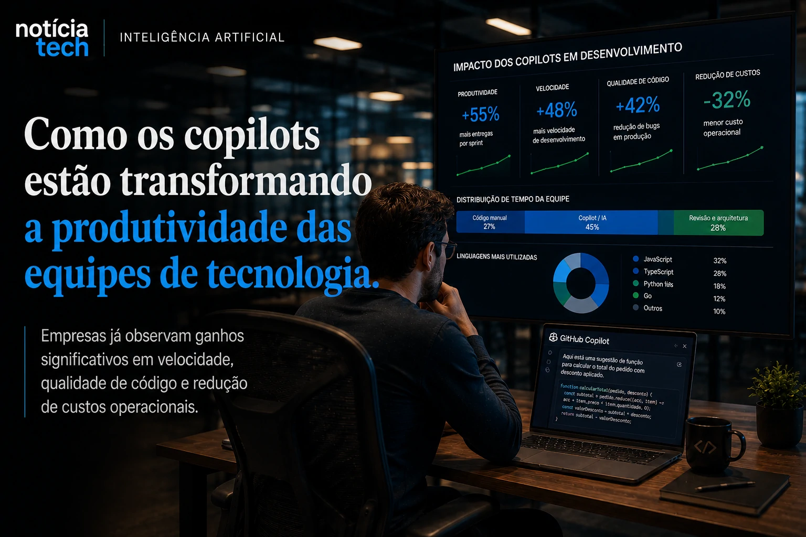

*Durante décadas, desenvolvimento de software foi um processo altamente dependente de trabalho manual especializado. Agora, plataformas baseadas em inteligência artificial começam a alterar essa dinâmica em uma velocidade que poucas transformações tecnológicas conseguiram produzir na indústria de tecnologia. Ferramentas como **Cursor**, **Windsurf** e **GitHub Copilot** estão acelerando produtividade, automatizando tarefas complexas e inaugurando uma nova fase da engenharia de software orientada por agentes inteligentes.*

## A programação entrou oficialmente na era dos copilots inteligentes

A inteligência artificial já vinha impactando:
- marketing;
- automação;
- atendimento;
- análise de dados;
- produtividade corporativa.

Agora, o desenvolvimento de software começa a entrar no centro dessa transformação.

### Ferramentas de IA estão mudando o fluxo operacional da engenharia de software

Plataformas como **Cursor**, **GitHub Copilot** e **Windsurf** deixaram de funcionar apenas como autocomplete avançado.

Os novos sistemas conseguem:
- interpretar contexto;
- analisar múltiplos arquivos;
- sugerir arquiteturas;
- gerar componentes completos;
- identificar falhas;
- automatizar refatorações;
- criar fluxos inteiros a partir de linguagem natural.

Na prática, parte do trabalho operacional do desenvolvimento começa a migrar para agentes inteligentes.

Esse movimento se conecta diretamente ao avanço da IA corporativa que o Notícia Tech já analisou anteriormente:

[Empresas dobram investimentos em IA corporativa e Brasil acelera adoção de agentes inteligentes](https://noticiatech.com.br/inteligencia-artificial/empresas-dobram-investimentos-em-ia-corporativa-e-brasil-acelera-ado%C3%A7%C3%A3o-de-agentes-inteligentes/)

Agora, a própria criação de software passa a ser impactada pela lógica da automação inteligente.

### O VS Code virou o centro da nova disputa da IA

Grande parte dessas plataformas opera sobre o ecossistema do **VS Code**.

Isso transforma o editor da Microsoft em uma espécie de camada operacional da nova economia da IA.

Em vez de apenas escrever código manualmente, desenvolvedores começam a coordenar:
- agentes;
- copilots;
- automações;
- validações inteligentes;
- sistemas capazes de interpretar intenção.

Esse cenário já começou a ganhar força dentro da própria OpenAI.

O Notícia Tech analisou recentemente como o avanço do **Codex** e dos agentes programadores pode transformar o VS Code em uma das plataformas mais estratégicas da indústria de tecnologia:

[OpenAI começa a reduzir dependência da Microsoft e mercado de IA entra em nova guerra bilionária](https://noticiatech.com.br/inteligencia-artificial/openai-come%C3%A7a-a-reduzir-depend%C3%AAncia-da-microsoft-e-mercado-de-ia-entra-em-nova-guerra-bilion%C3%A1ria/)

### A produtividade começa a crescer em velocidade inédita

A promessa dessas plataformas é simples:
- menos tempo operacional;
- menos tarefas repetitivas;
- ciclos menores de desenvolvimento;
- maior velocidade de entrega.

Isso cria um impacto econômico direto.

Empresas conseguem acelerar:
- prototipagem;
- validação;
- lançamento de produtos;
- manutenção de sistemas;
- integração de funcionalidades.

Ao mesmo tempo, pequenas equipes passam a competir com estruturas muito maiores.

## A lógica econômica do desenvolvimento começa a mudar

O impacto da IA no desenvolvimento vai muito além da produtividade individual.

A mudança começa a atingir a própria estrutura econômica das empresas de tecnologia.

### Startups menores podem ganhar vantagem competitiva

Historicamente, criar software exigia:
- grandes equipes;
- ciclos longos;
- alto custo operacional;
- contratação especializada;
- grande volume de horas técnicas.

Com IA assistindo desenvolvimento, parte dessa barreira começa a diminuir.

Hoje, equipes menores conseguem:
- lançar MVPs mais rápido;
- testar produtos em menos tempo;
- automatizar tarefas técnicas;
- reduzir esforço operacional;
- acelerar crescimento.

Isso pode alterar profundamente a dinâmica competitiva do mercado.

### O custo marginal de criar software começa a cair

A automação da engenharia de software reduz parte do custo operacional associado ao desenvolvimento tradicional.

Na prática:
- menos tarefas precisam ser feitas manualmente;
- parte da documentação pode ser automatizada;
- testes podem ser acelerados;
- integrações ficam mais rápidas;
- manutenção se torna mais eficiente.

Esse movimento se conecta diretamente ao avanço da industrialização da IA analisado pelo Notícia Tech:

[2026 virou o ano da industrialização da IA no Brasil](https://noticiatech.com.br/inteligencia-artificial/2026-virou-o-ano-da-industrializa%C3%A7%C3%A3o-da-ia-no-brasil/)

A diferença é que agora a própria produção de software começa a entrar em escala automatizada.

### O papel do desenvolvedor começa a mudar

A IA não elimina desenvolvedores.

Mas ela começa a transformar profundamente suas funções.

O trabalho operacional repetitivo tende a diminuir.

Enquanto isso, cresce a importância de:
- arquitetura;
- visão sistêmica;
- validação;
- criatividade;
- coordenação de agentes inteligentes.

O desenvolvedor passa gradualmente a atuar menos como digitador de código e mais como operador estratégico de sistemas inteligentes.

## O futuro do software pode ser construído por equipes muito menores

A transformação provocada pelos copilots de IA ainda está no começo.

Mas o impacto potencial já começa a preocupar e entusiasmar empresas do setor de tecnologia.

### A IA pode acelerar a próxima explosão de software da internet

Se o custo operacional do desenvolvimento continuar caindo, o mercado pode assistir uma explosão na criação de novos produtos digitais.

Isso acontece porque:
- mais pessoas conseguem construir software;
- pequenas equipes ficam mais eficientes;
- validação de ideias se torna mais barata;
- automação reduz barreiras técnicas.

Na prática, criar software pode se tornar muito mais acessível nos próximos anos.

### Empresas entram em uma nova corrida por produtividade extrema

O mercado de tecnologia sempre disputou:
- infraestrutura;
- distribuição;
- dados;
- usuários.

Agora, a nova disputa começa a envolver produtividade operacional.

Quem conseguir desenvolver software mais rápido poderá:
- lançar produtos antes;
- iterar com maior velocidade;
- reduzir custos;
- responder mais rápido ao mercado.

Isso transforma plataformas como **Cursor**, **Windsurf** e **GitHub Copilot** em peças cada vez mais estratégicas dentro da economia digital.

### O desenvolvimento de software pode entrar em uma nova era industrial

A ascensão dos copilots inteligentes talvez represente uma das maiores mudanças da história da engenharia de software.

O setor começa a migrar de um modelo puramente manual para uma estrutura híbrida entre:
- humanos;
- agentes inteligentes;
- automação operacional;
- coordenação por IA.

Nos próximos anos, empresas capazes de integrar IA diretamente ao fluxo de desenvolvimento poderão operar com uma velocidade competitiva muito superior à geração anterior de software.

A corrida da inteligência artificial deixa de acontecer apenas nos modelos fundacionais e passa a atingir diretamente o ambiente onde os softwares do futuro serão criados.