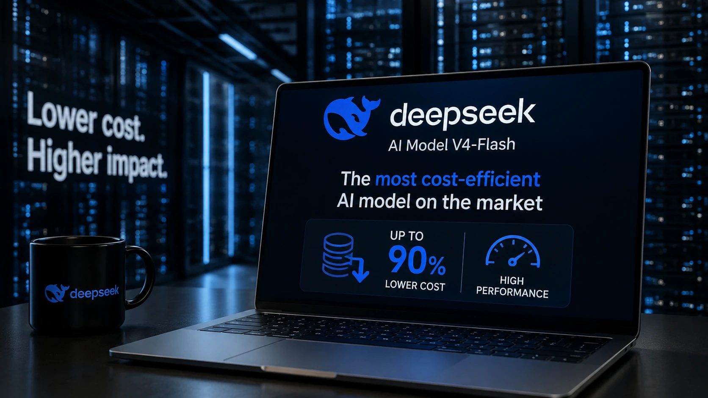
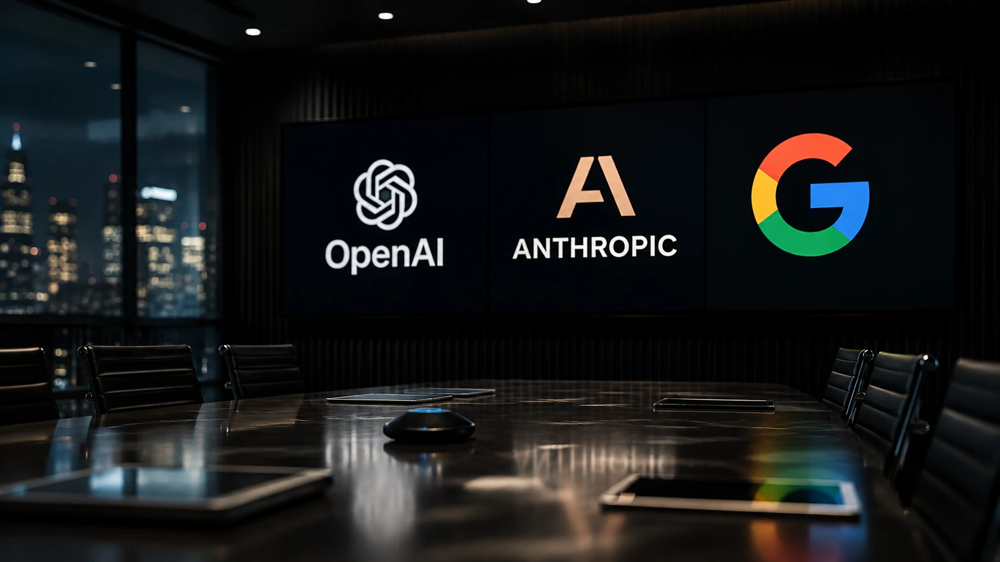
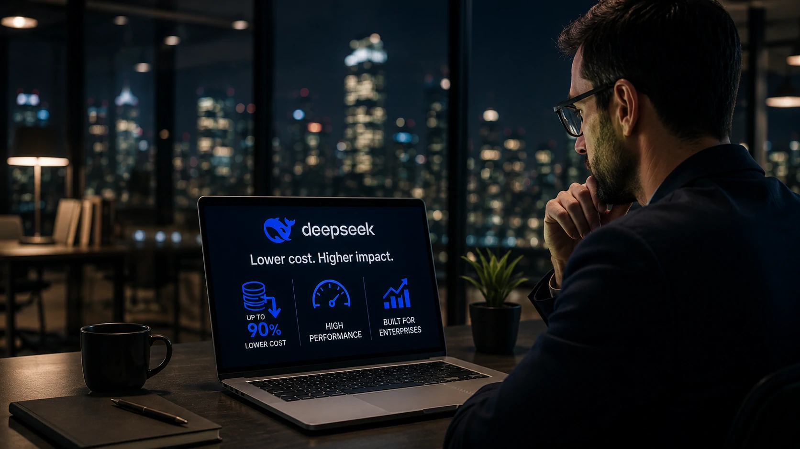

*A corrida global pela inteligência artificial entrou em uma nova fase. Depois de meses marcados por avanços em desempenho, a disputa passa a girar também em torno do custo operacional. A estratégia anunciada pela **DeepSeek** indica que o preço pode se tornar um dos principais fatores de decisão para empresas que pretendem expandir o uso de IA generativa.*

## DeepSeek muda o foco da disputa ao apostar em IA de baixo custo

*Modelo da DeepSeek amplia a competição entre os principais desenvolvedores de inteligência artificial.*

A **DeepSeek** apresentou um novo modelo de inteligência artificial que, segundo análises recentes do mercado, oferece o menor custo entre os principais grandes modelos comerciais disponíveis atualmente.

Mais do que uma atualização tecnológica, o anúncio representa uma mudança estratégica na forma como empresas poderão avaliar fornecedores de IA. Até então, grande parte da competição estava concentrada em capacidade de raciocínio, programação e geração de conteúdo.

Agora, o custo por utilização passa a ocupar posição central nas decisões corporativas.

### O preço passa a ser uma vantagem competitiva

Durante os últimos dois anos, empresas como **OpenAI**, **Anthropic** e **Google** concentraram seus lançamentos em melhorar desempenho e ampliar recursos.

A estratégia da **DeepSeek** aponta para outro caminho: entregar desempenho competitivo com um custo significativamente inferior, permitindo reduzir despesas em aplicações executadas em larga escala.

### Empresas começam a olhar além da qualidade

Projetos corporativos processam milhões de requisições diariamente.

Nesses cenários, pequenas diferenças no preço por milhão de tokens podem representar milhões de dólares economizados ao longo do ano.

Esse fator pode acelerar a adoção de novos fornecedores de IA mesmo quando a diferença de desempenho entre modelos é relativamente pequena.

## O impacto pode alcançar OpenAI, Anthropic e Google

*O mercado de IA passa a disputar não apenas qualidade, mas também eficiência financeira.*

A redução agressiva dos custos pode alterar a dinâmica competitiva entre os principais laboratórios de inteligência artificial.

Nos últimos meses, o mercado observou uma sequência de movimentos envolvendo **OpenAI**, **Anthropic**, **Google**, **Meta** e **Mistral AI**, todos buscando ampliar participação no segmento corporativo.

Esse novo cenário adiciona uma variável que tende a ganhar ainda mais importância: eficiência econômica.

### Pressão sobre modelos premium

Modelos considerados líderes em desempenho costumam exigir investimentos maiores por parte das empresas.

Caso alternativas de menor custo consigam manter qualidade suficiente para aplicações reais, organizações poderão revisar seus critérios de contratação.

Esse movimento pode pressionar fornecedores tradicionais a ajustar preços ou acelerar novos lançamentos.

### A competição deixa de ser apenas tecnológica

A disputa entre laboratórios de IA passa a envolver estratégias semelhantes às observadas anteriormente no mercado de computação em nuvem.

Além da inovação, fatores como escalabilidade, consumo de recursos e custo operacional tornam-se elementos decisivos para conquistar clientes corporativos.

Essa tendência também reforça um movimento já observado recentemente no mercado, com empresas buscando arquiteturas mais eficientes para IA empresarial, como mostrado em nosso guia sobre [arquitetura de IA empresarial](https://noticiatech.com.br/inteligencia-artificial/arquitetura-ia-empresarial-mcp-rag-apis-agentes-workflows-copilotos/) e na análise sobre a ofensiva da [Mistral AI contra a OpenAI](https://noticiatech.com.br/inteligencia-artificial/mistral-ai-ofensiva-openai-estrategia-empresas/).

## Empresas podem reduzir custos sem abrir mão da IA

*A concorrência entre os grandes laboratórios pode beneficiar empresas que buscam ampliar projetos de IA com menor investimento.*

A chegada de modelos mais acessíveis pode acelerar a adoção da **Inteligência Artificial** em organizações que até então consideravam o custo uma barreira.

Empresas de médio porte, startups e equipes de desenvolvimento passam a ter mais alternativas para criar assistentes virtuais, automatizar processos e desenvolver aplicações baseadas em **LLMs** sem depender exclusivamente dos modelos mais caros do mercado.

Essa mudança tende a aumentar ainda mais a competição entre fornecedores globais.

### O mercado entra em uma nova fase

Nos primeiros anos da IA generativa, a prioridade era provar que os modelos eram capazes de executar tarefas complexas.

Agora, a discussão começa a mudar.

Empresas passam a perguntar qual modelo entrega o melhor equilíbrio entre qualidade, velocidade, custo e facilidade de integração.

Essa transformação lembra o que aconteceu no mercado de computação em nuvem, quando a competição deixou de ser apenas tecnológica para incluir eficiência operacional e otimização financeira.

### A pressão pode acelerar novos lançamentos

Quanto maior a concorrência, maior tende a ser o ritmo de inovação.

Caso a estratégia da **DeepSeek** ganhe tração entre empresas, concorrentes como **OpenAI**, **Anthropic**, **Google** e **Meta** poderão responder com reduções de preços, novos modelos ou melhorias de desempenho para preservar participação no mercado.

Esse cenário favorece principalmente organizações que utilizam IA em larga escala, pois amplia o poder de negociação e reduz o custo total dos projetos.

## O que esperar da disputa entre os grandes laboratórios de IA

A tendência é que a competição deixe de ser definida apenas pelo modelo "mais inteligente" e passe a considerar eficiência financeira, infraestrutura e retorno sobre investimento.

Nos próximos meses, o mercado deverá acompanhar não apenas novos lançamentos, mas também possíveis ajustes de preços, programas corporativos e novas estratégias comerciais dos principais desenvolvedores de IA.

### A corrida pela IA corporativa fica mais equilibrada

Empresas que antes concentravam investimentos em poucos fornecedores poderão diversificar suas estratégias tecnológicas.

Isso reduz riscos, aumenta a concorrência e estimula um ambiente mais favorável para inovação.

Ao mesmo tempo, fornecedores precisarão demonstrar não apenas desempenho técnico, mas também sustentabilidade econômica para manter clientes corporativos.

### O preço pode ser o novo diferencial competitivo

Se a estratégia da **DeepSeek** se confirmar na prática, o mercado poderá entrar em uma fase semelhante à observada na computação em nuvem, em que eficiência operacional pesa tanto quanto inovação.

Para gestores e empresas, isso significa mais opções, maior poder de escolha e uma tendência de redução gradual dos custos de implementação de soluções baseadas em **Inteligência Artificial**.

Nos próximos meses, acompanhar como **OpenAI**, **Anthropic**, **Google** e outros concorrentes responderão a esse movimento será essencial para entender quem liderará a próxima etapa da transformação da IA corporativa.

## Referências relacionadas

Se você acompanha a evolução da IA para empresas, estes conteúdos complementam a leitura:

- [OpenAI entra na corrida do hardware e aposta na próxima geração de dispositivos com IA](https://noticiatech.com.br/inteligencia-artificial/openai-guerra-hardware-dispositivos-chatgpt/)
- [OpenAI e Anthropic enfrentam novas regras da União Europeia e mercado de IA muda novamente](https://noticiatech.com.br/inteligencia-artificial/openai-anthropic-uniao-europeia-ai-act-muda-mercado-ia/)
- [Qual IA é melhor para empresas em 2026? ChatGPT, Claude, Gemini, Grok e Mistral comparados](https://noticiatech.com.br/inteligencia-artificial/melhor-ia-empresas-2026-chatgpt-claude-gemini-grok-mistral/)

---