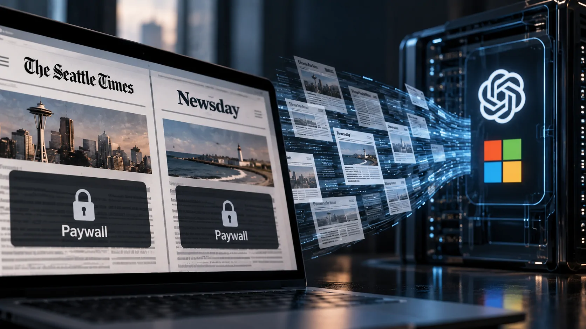
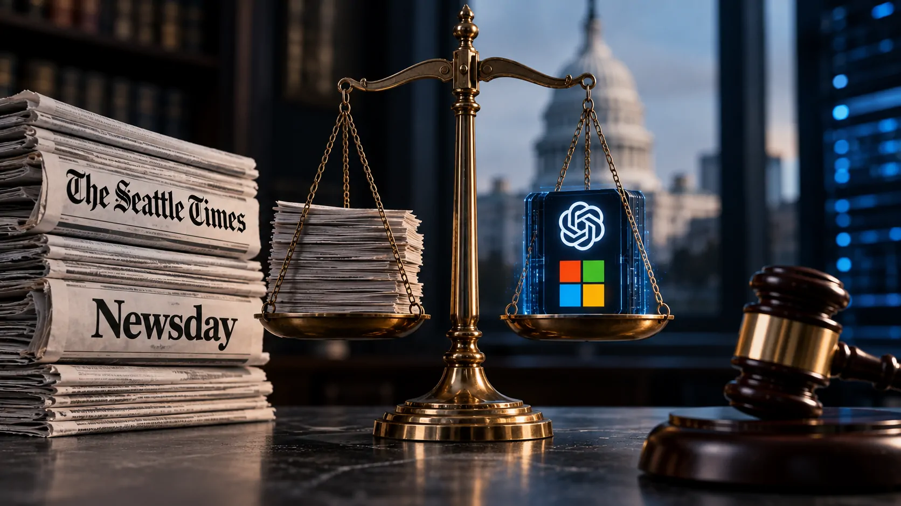

*O processo movido pelo Seattle Times e pelo Newsday contra a OpenAI e a Microsoft coloca uma questão cada vez mais relevante para a economia digital: até onde empresas de inteligência artificial podem utilizar conteúdo jornalístico para desenvolver seus produtos sem autorização ou compensação aos seus produtores?*

## Dois jornais americanos levam a disputa sobre IA aos tribunais

O **Seattle Times** e o **Newsday**, dois jornais dos Estados Unidos, entraram com uma ação contra a **OpenAI** e a **Microsoft**, acusando as empresas de violação de direitos autorais pelo uso de conteúdo jornalístico no desenvolvimento de sistemas de inteligência artificial.

O processo foi apresentado em tribunal federal de Manhattan e afirma que as empresas teriam coletado conteúdo dos sites dos jornais, incluindo materiais protegidos por paywall, e utilizado os artigos em conjuntos de dados relacionados ao treinamento e à operação de produtos de IA.

A acusação coloca no centro da disputa uma questão que ultrapassa os dois veículos: **se o conteúdo produzido por empresas jornalísticas pode ser utilizado para construir produtos de IA que posteriormente concorrem pela mesma atenção do público**.

### O que os jornais alegam

Segundo a ação, os sistemas teriam sido capazes de reproduzir ou parafrasear conteúdos dos jornais, em alguns casos com elevado grau de proximidade em relação ao material original.

Os veículos afirmam que esse tipo de comportamento pode reduzir o incentivo econômico para acessar diretamente seus sites, assinar seus serviços ou consumir suas reportagens na fonte.

O processo pede compensação financeira e medidas relacionadas às cópias de conteúdo e aos modelos ou conjuntos de dados que, segundo os autores, teriam incorporado material protegido.

## O conteúdo atrás do paywall é um dos pontos centrais

*O processo questiona o uso de conteúdo jornalístico, inclusive material protegido por paywall, no desenvolvimento de sistemas de IA.*

Um dos elementos mais sensíveis da ação é a alegação de que o conteúdo utilizado não estaria limitado a informações livremente disponíveis na internet. Os jornais afirmam que materiais protegidos por **paywall** também teriam sido coletados.

Isso torna a discussão econômica mais complexa. Um paywall não existe apenas para impedir acesso: ele faz parte do modelo de negócios que transforma produção jornalística em receita por meio de assinaturas.

### Quando a IA responde em vez do site

O problema apontado pelos jornais não está apenas na cópia durante o treinamento. Existe também uma disputa sobre o que acontece depois que o modelo é colocado em funcionamento.

Se um usuário consegue obter de um chatbot uma resposta que reproduz ou resume de maneira suficiente uma reportagem, parte do valor que antes dependia da visita ao site pode ser capturada pela interface de IA.

É justamente essa mudança que torna o caso relevante para publishers. **O conteúdo continua sendo produzido por um veículo, mas a relação com o leitor pode passar a acontecer dentro de outra plataforma.**

### A disputa envolve treinamento e operação

De acordo com as alegações apresentadas no processo, os artigos teriam sido incorporados a conjuntos de dados utilizados para treinar e operar produtos como **ChatGPT**, **Microsoft Copilot** e recursos de IA do **Bing**.

A questão jurídica, porém, não está resolvida pelo simples fato de o conteúdo ter sido encontrado na internet. O ponto central será determinar quais usos são permitidos pela legislação americana de direitos autorais e quais ultrapassam os limites dessa proteção.

## OpenAI e Microsoft enfrentam uma questão maior que este processo

O caso chega em um momento particularmente delicado para a **OpenAI** e a **Microsoft**. As empresas já enfrentam outras disputas relacionadas ao uso de obras protegidas no treinamento de sistemas de IA.

O processo do **New York Times**, iniciado em 2023, tornou-se um dos principais confrontos jurídicos sobre essa questão. Agora, a nova ação adiciona mais dois veículos de imprensa à disputa e amplia a pressão sobre o modelo de desenvolvimento dos sistemas generativos.

### A posição das empresas

A **Microsoft** afirmou ter sido surpreendida pela ação e indicou disposição para dialogar sobre o conflito.

A posição defendida pelas empresas de tecnologia em disputas desse tipo envolve a tese de que o treinamento de modelos de IA pode constituir um uso transformativo de informações disponíveis publicamente e, portanto, estar protegido pelo conceito de **fair use**, previsto na legislação americana.

Isso não significa que a questão esteja resolvida. **Fair use é uma análise jurídica dependente das circunstâncias de cada caso**, e os tribunais ainda precisam estabelecer limites mais claros para o treinamento de modelos generativos.

### Uma disputa que já chegou ao debate político

A discussão ganhou ainda mais peso nesta semana depois que o governo dos Estados Unidos apresentou argumentos favoráveis à posição da **OpenAI** em sua disputa judicial com o **New York Times**.

O governo argumentou que restringir determinadas formas de treinamento poderia prejudicar inovação e competitividade americana em inteligência artificial.

Ao mesmo tempo, publishers defendem que permitir o uso indiscriminado de conteúdo protegido pode transferir valor econômico da indústria criativa para as empresas de tecnologia sem garantir uma compensação proporcional aos produtores.

## O que o processo pode mudar para empresas de IA e publishers

*O conflito coloca dois interesses econômicos em choque: a necessidade de dados para desenvolver IA e a proteção do conteúdo que gera receita para seus produtores.*

O resultado do processo ainda está longe de ser conhecido, mas a disputa já evidencia um problema estratégico para a indústria.

Empresas de IA precisam de grandes volumes de informação para desenvolver modelos cada vez mais capazes. Publishers, por outro lado, dependem da exclusividade, da audiência e da capacidade de transformar conteúdo original em receita.

### O licenciamento ganha força como alternativa

Uma das possíveis respostas para esse conflito é o **licenciamento de conteúdo**.

A própria indústria já possui acordos entre empresas de IA e organizações de mídia. A questão é se esse modelo será suficiente para criar uma relação econômica sustentável entre as duas partes ou se os tribunais estabelecerão regras diferentes para conteúdos utilizados no treinamento.

Para empresas que dependem de informação proprietária, a definição desses limites pode afetar custos, disponibilidade de dados e estratégias de desenvolvimento de produtos.

### O precedente interessa a muito mais gente

O impacto potencial não está restrito a grandes jornais americanos.

Blogs, sites especializados, publishers independentes e outros produtores digitais também precisam considerar como seu conteúdo será utilizado por sistemas capazes de coletar, sintetizar e responder perguntas com base em informações disponíveis na internet.

O próprio debate internacional já mostra como a questão do **treinamento de IA com conteúdo protegido por direitos autorais** deixou de ser apenas uma discussão entre empresas de tecnologia e grandes veículos de imprensa. O tema passou a envolver governos, reguladores, criadores e empresas que dependem de conteúdo para gerar receita.

## A batalha pelo conteúdo pode mudar a economia da internet

A disputa entre **Seattle Times**, **Newsday**, **OpenAI** e **Microsoft** acontece em um momento em que mecanismos de IA começam a ocupar uma posição cada vez mais importante na descoberta de informações.

O usuário que antes pesquisava uma pergunta, acessava vários sites e comparava respostas pode cada vez mais receber uma síntese diretamente em uma interface de IA.

Isso cria uma mudança econômica importante: **a produção do conteúdo pode continuar acontecendo fora da plataforma de IA, enquanto a interação e parte do valor gerado por esse conteúdo acontecem dentro dela**.

### O risco para quem produz informação

Para um publisher, menos visitas pode significar menos publicidade, menos assinaturas e menor capacidade de financiar novas reportagens.

Esse é um dos motivos pelos quais a discussão sobre direitos autorais não pode ser analisada apenas como uma disputa técnica sobre datasets. Ela também envolve **quem financia a produção da informação que alimenta os sistemas de inteligência artificial**.

O debate se conecta a outras discussões recentes sobre o uso de conteúdo protegido no treinamento de modelos. O **Notícia Tech** já analisou como governos e empresas vêm discutindo os limites desse uso no cenário internacional em **[uma análise sobre o treinamento de IA com conteúdo protegido por direitos autorais](https://noticiatech.com.br/inteligencia-artificial/eua-g20-treinamento-ia-conteudo-protegido-direitos-autorais/)**.

## O próximo capítulo será decidido nos tribunais e no mercado

*O conflito entre publishers e empresas de IA pode ajudar a definir como conteúdo e inteligência artificial serão remunerados na próxima fase da internet.*

O processo do **Seattle Times** e do **Newsday** não permite concluir, sozinho, qual será o futuro dos direitos autorais na inteligência artificial. Mas ele mostra que a relação entre produtores de conteúdo e desenvolvedores de modelos está entrando em uma fase mais litigiosa.

Para as empresas de IA, a questão é como continuar desenvolvendo modelos competitivos diante de possíveis restrições ao acesso a determinados conteúdos. Para publishers, o desafio é evitar que seus investimentos em informação sejam transformados em matéria-prima para produtos que possam reduzir o valor econômico da própria fonte.

### O que acompanhar daqui para frente

Os próximos movimentos judiciais serão importantes para determinar como os tribunais americanos interpretam o uso de conteúdo protegido no treinamento e funcionamento de sistemas generativos.

Também será importante observar se mais veículos escolherão o caminho dos processos ou se a indústria avançará em direção a **acordos de licenciamento**, com regras mais claras sobre acesso, treinamento, atribuição e remuneração.

O ponto central desta disputa é maior que **OpenAI** ou **Microsoft**: se a inteligência artificial está se tornando uma nova camada de acesso à informação, **a economia dessa informação também terá de encontrar uma nova forma de distribuir valor entre quem produz o conteúdo e quem constrói a tecnologia que o utiliza**.

---