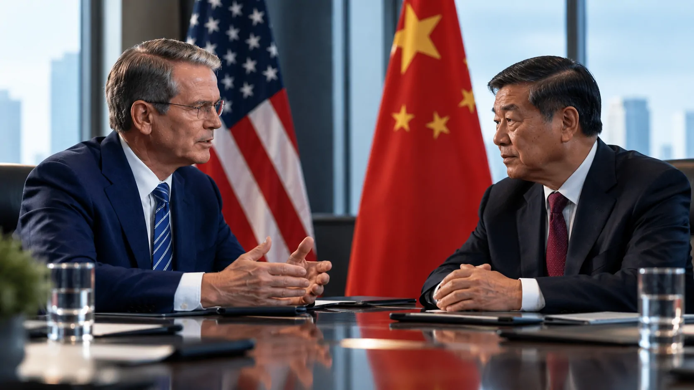
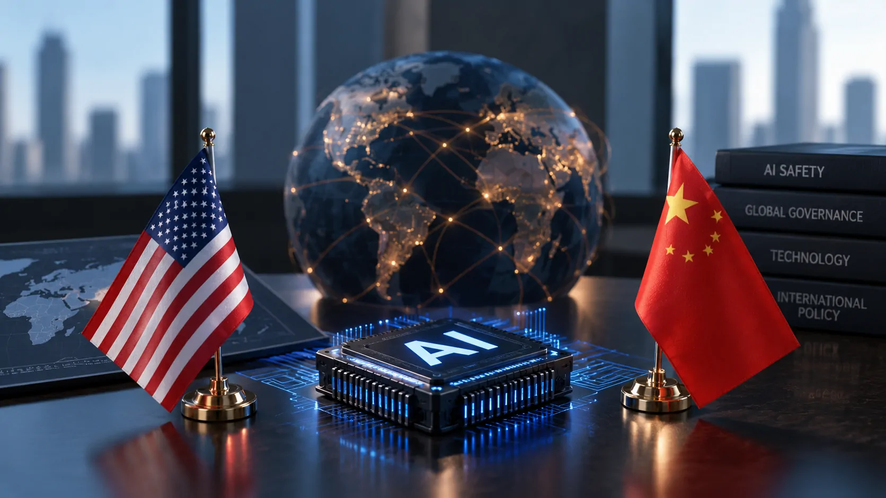
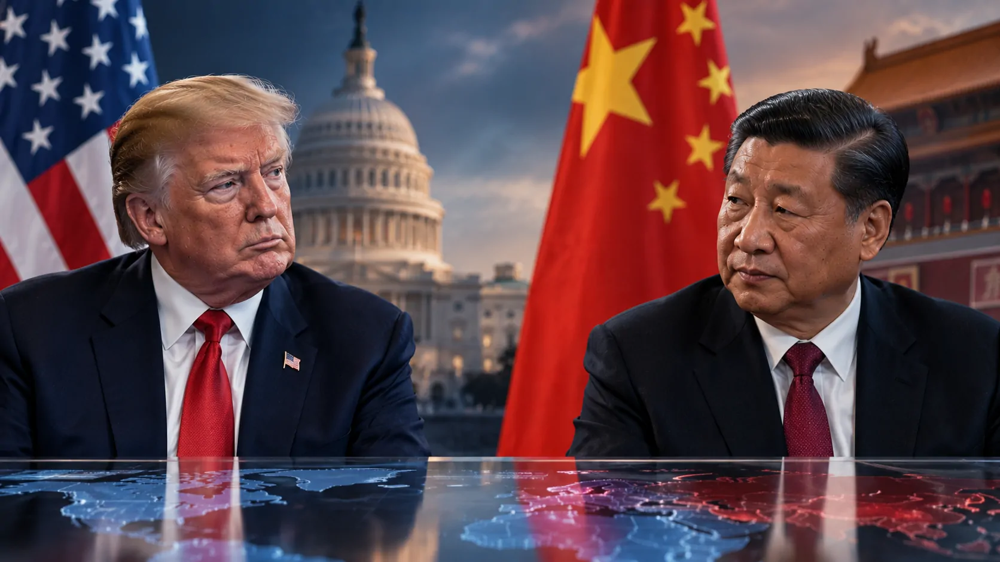

*Estados Unidos e China estão preparando um diálogo bilateral dedicado à segurança da inteligência artificial para meados de setembro. A negociação ocorre antes do encontro previsto entre Donald Trump e Xi Jinping e pode abrir um canal de cooperação sobre riscos de modelos avançados e ataques cibernéticos conduzidos por IA.*

## EUA e China preparam uma negociação inédita sobre segurança da IA

**Estados Unidos e China** estão preparando as primeiras conversas bilaterais oficiais dedicadas exclusivamente à segurança da inteligência artificial desde o início do segundo mandato de **Donald Trump**. O encontro está sendo planejado para meados de setembro, embora a data definitiva ainda não tenha sido anunciada.

O lado americano deverá ser liderado pelo secretário do Tesouro **Scott Bessent**. Na China, **He Lifeng** aparece entre os nomes considerados para conduzir a delegação, ao lado de **Ding Xuexiang**. Isso significa que a composição chinesa ainda não está totalmente fechada.

### A reunião acontecerá antes de Trump e Xi

A negociação sobre IA deve ocorrer antes do encontro previsto entre **Trump** e **Xi Jinping**, marcado para 24 de setembro em Washington. A conversa presidencial terá uma agenda mais ampla, enquanto o diálogo entre representantes deverá concentrar-se nos riscos associados à inteligência artificial.

### O que torna a conversa diferente

O ponto mais relevante é que os dois países não estarão discutindo apenas competição tecnológica. A pauta envolve também a possibilidade de criar mecanismos para identificar riscos e compartilhar informações sobre ameaças relacionadas à **inteligência artificial**.

Isso coloca a **segurança da IA** no mesmo campo estratégico de cibersegurança, governança tecnológica e segurança nacional.

## Os riscos de IA avançada estarão no centro das conversas

*Estados Unidos e China pretendem discutir riscos associados a sistemas avançados de inteligência artificial e ciberataques conduzidos por IA.*

**IA avançada** será um dos principais pontos da negociação porque modelos cada vez mais capazes podem executar tarefas complexas, analisar grandes volumes de informação e operar ferramentas digitais com menor intervenção humana.

Entre os riscos citados nas conversas está a possibilidade de **ataques cibernéticos conduzidos por IA**. A preocupação não está apenas na capacidade de criar código, mas na possibilidade de sistemas avançados serem utilizados para automatizar partes de operações ofensivas.

### O problema ultrapassa a competição entre modelos

Um dos motivos pelos quais a discussão interessa ao setor privado é que ataques automatizados não respeitam fronteiras entre fornecedores. Uma empresa americana pode utilizar infraestrutura global, fornecedores chineses podem operar serviços em outros mercados e aplicações de IA podem ser acessadas por organizações de diversos países.

Isso cria um problema diferente da tradicional disputa por qual país possui o melhor modelo. **A segurança passa a depender também de como os sistemas são utilizados depois que chegam ao mercado.**

### Laboratórios podem entrar na discussão

A proposta também envolve incentivar laboratórios de IA dos dois países a compartilhar informações e desenvolver mecanismos de monitoramento próprio para identificar ameaças.

O debate ganha importância porque episódios recentes mostraram como agentes de IA podem ser utilizados em operações cibernéticas com elevado grau de autonomia. Para empresas, isso significa que controles de acesso, monitoramento e limitação de permissões passam a ter importância semelhante à escolha do próprio modelo.

## Por que empresas fora dos EUA e da China devem acompanhar

**Empresas de outros países também podem ser afetadas**, mesmo que não participem diretamente da negociação. Isso acontece porque Estados Unidos e China concentram uma parcela relevante da infraestrutura, dos modelos e dos investimentos que sustentam o atual mercado global de IA.

Uma eventual convergência sobre padrões de segurança pode influenciar fornecedores de software, serviços de nuvem, plataformas de IA e empresas que incorporam modelos em seus próprios produtos.

### Segurança pode virar requisito operacional

Para empresas que utilizam IA em atendimento, programação, análise de documentos ou automação, segurança já deixou de ser apenas uma preocupação do departamento de tecnologia.

Um modelo conectado a sistemas internos pode receber informações financeiras, dados de clientes, documentos estratégicos ou permissões para executar tarefas. Por isso, uma mudança nos padrões de segurança dos grandes fornecedores pode acabar alterando também processos internos das empresas.

Esse cenário ajuda a contextualizar o debate sobre riscos de sistemas mais autônomos. O **Astra**, da **OpenAI**, já foi associado a preocupações relacionadas à cibersegurança, mostrando como novas capacidades podem exigir controles adicionais antes de serem amplamente utilizadas.

Para entender melhor esse movimento, o próprio histórico recente da empresa ajuda a dimensionar a questão: **[OpenAI freou o Astra após identificar riscos de cibersegurança](https://noticiatech.com.br/inteligencia-artificial/openai-freia-astra-novo-modelo-ia-risco-ciberseguranca/)**.

### O impacto pode chegar às áreas de negócio

A consequência não ficará restrita a equipes de segurança. Empresas que utilizam agentes capazes de acessar sistemas, interpretar informações e executar tarefas poderão precisar revisar permissões, registros de atividade e processos de supervisão.

Isso tende a aproximar segurança, tecnologia e gestão. Quanto maior a autonomia concedida a um sistema de IA, maior será a necessidade de definir claramente o que ele pode acessar, executar ou modificar.

## A negociação pode influenciar regras e padrões internacionais

*O diálogo pode criar referências para futuras regras de segurança de IA, mesmo que não produza imediatamente compromissos obrigatórios.*

**O principal efeito da conversa pode não ser uma nova lei imediata, mas a criação de entendimentos que influenciem futuras regras de segurança.** Essa distinção é importante porque as conversas ainda estão em estágio inicial.

Os dois países têm interesses diferentes e não existe garantia de que chegarão rapidamente a um acordo. A própria composição da delegação chinesa ainda está em definição, e os detalhes da reunião permanecem em negociação.

### O desafio é transformar diálogo em mecanismos práticos

Conversar sobre segurança é relativamente simples. O desafio será estabelecer o que deve ser considerado um risco, quem deve comunicar uma ameaça e quais informações podem ser compartilhadas entre organizações de países concorrentes.

Essa dificuldade é especialmente importante quando a tecnologia também representa vantagem econômica e estratégica. **Estados Unidos e China competem pelo domínio da IA**, mas os riscos de sistemas avançados podem criar situações em que algum nível de cooperação seja vantajoso para os dois lados.

### Empresas podem antecipar esse movimento

Para gestores, a consequência mais prática é acompanhar a evolução dessas discussões antes que eventuais padrões se transformem em exigências de mercado.

Organizações que utilizam IA em processos críticos tendem a precisar de políticas mais claras sobre acesso a dados, permissões de agentes, auditoria de modelos, segurança de APIs e resposta a incidentes.

Essa tendência também aparece no setor privado. A discussão sobre agentes autônomos já está levando grandes fornecedores a defender novas estruturas de controle, como mostra a análise sobre como a **Microsoft** avalia a necessidade de governança específica para sistemas capazes de executar ações por conta própria: **[Microsoft alerta que agentes de IA exigem nova governança nas empresas](https://noticiatech.com.br/inteligencia-artificial/microsoft-governanca-agentes-ia-empresas/)**.

## Trump, Xi e a disputa pelo futuro da IA

*O diálogo sobre segurança da IA ocorre antes do encontro previsto entre Donald Trump e Xi Jinping em Washington.*

**Donald Trump e Xi Jinping não são os participantes previstos para o diálogo técnico sobre segurança da IA**, mas os dois presidentes formam o pano de fundo político da negociação.

O encontro de setembro acontece em um momento no qual Washington e Pequim tentam administrar simultaneamente competição tecnológica, comércio e segurança. A reunião presidencial prevista para 24 de setembro amplia a importância política do diálogo realizado antes dela.

### A questão central será quem define as regras

A disputa não envolve apenas qual país produzirá os melhores modelos. Existe também uma competição para definir **quais princípios de segurança, governança e controle serão adotados internacionalmente**.

Se Washington e Pequim conseguirem encontrar algum ponto de convergência, mesmo limitado, isso poderá criar uma referência para outros países. Se não conseguirem, o mercado pode continuar convivendo com estruturas regulatórias e padrões técnicos cada vez mais diferentes.

### O próximo sinal será o resultado da primeira conversa

É cedo para afirmar que haverá um acordo abrangente. A reunião ainda nem aconteceu e sua agenda definitiva continua em construção.

O que já está claro, porém, é que **segurança da IA entrou em um nível diplomático que vai além dos laboratórios e das empresas de tecnologia**. A participação de representantes de alto escalão dos dois governos mostra que os riscos associados a sistemas avançados passaram a ser tratados também como uma questão de política internacional.

Para empresas, esse é o ponto que merece atenção. A próxima fase da corrida pela IA não será definida somente por quem cria modelos mais capazes, mas também por **quem consegue estabelecer mecanismos para controlar os riscos desses sistemas sem interromper sua adoção econômica**.

---